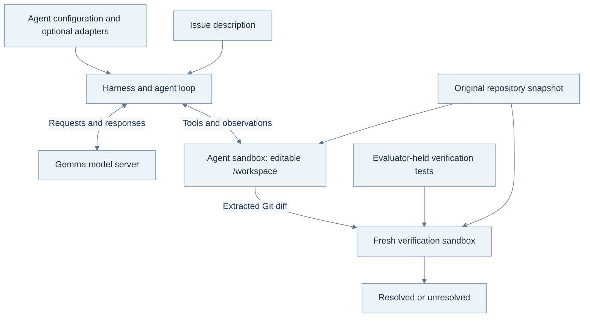

<style>
article .content table:not(.rouge-table) th,
article .content table:not(.rouge-table) td {
  white-space: normal;
  overflow-wrap: anywhere;
}
article .content .mermaid,
article .content .mermaid * {
  font-family: Arial, sans-serif !important;
}
article h1,
article .content h2,
article .content h3 {
  word-break: keep-all;
  overflow-wrap: break-word;
  text-wrap: balance;
}
article .content p,
article .content li {
  word-break: keep-all;
  overflow-wrap: break-word;
}
@media (max-width: 600px) {
  article .content .table-wrapper { overflow-x: auto; }
  article .content table:not(.rouge-table) { min-width: 600px; }
  article .content table:not(.rouge-table) th,
  article .content table:not(.rouge-table) td { min-width: 110px; }
}
</style>

[Read in English]({{ site.baseurl }}/posts/Gemma-4-Developer-Agent-From-Issue-to-Verified-Patch/)

## 들어가며: 우리가 만들 에이전트

[Google — Gemma 4 Developer Agent Competition][competition]에서는 가중치가 공개된 open-weight 언어 모델을 하나 지정하고, 그 모델로 소프트웨어 문제를 해결하는 시스템을 만들도록 요구한다. **처음 보는 문제도 제한 시간 안에 끝까지 고칠 수 있을까?** 우리가 설계할 부분은 에이전트가 일하는 방식이다. Kaggle은 제출된 에이전트에 참가자가 보지 못한 문제를 맡기고, 에이전트가 수정한 코드를 검사한다. 점수는 이 평가에서 해결한 문제의 비율이다.

이 글은 소프트웨어의 기본 개념에서 출발해 첫 실험을 준비하는 과정을 다룬다. 간단한 Python 코드를 읽을 수 있으면 따라올 수 있도록 썼다. 에이전트 프레임워크나 모델 학습 경험은 없어도 된다. 무엇을 제출하고, 실행 중에는 어떤 일이 일어나며, 무엇이 점수로 인정되는지 차례로 살펴보려 한다. 그 관계를 이해해야 다음에 무엇을 실험할지도 정할 수 있다. 아래 설정은 아직 성능을 측정하지 않은 실습 예제로, 프로젝트에서 실제 개발 중인 후보와는 별개다. 대회 세부 사항은 **2026년 9월 25일**에 확인했다.

**함께 참고할 자료.** 궁금한 내용에 따라 아래 자료를 찾아보면 된다. 본문을 읽기 전에 모두 읽을 필요는 없다.

- **대회에서 해야 할 일:** [Kaggle 개요와 평가 방식][competition], [데이터와 harness 안내][data], [규칙][rules]. 과제의 내용과 제출 조건을 확인할 때 기준이 되는 자료다.
- **open-weight 모델을 쓰는 이유:** Google의 [Gemma 4 발표 기사][gemma-launch]. Google이 지향하는 큰 방향을 설명한다. 실제 대회에서는 이 제품군 중 특정 모델과 실행 환경을 지정한다.
- **평가 대상이 함수에서 저장소로 넓어진 배경:** [SWE-bench 논문][swebench-paper]과 [GitHub][swebench-code]. 함수 하나를 작성하는 문제와 기존 프로젝트를 고치는 문제가 어떻게 다른지 볼 수 있다.
- **작은 코딩 에이전트의 구현:** [mini-SWE-agent 문서][mini-docs]와 [GitHub][mini-code]. 큰 프레임워크를 살펴보기 전에 모델이 도구를 호출하고 결과를 받는 과정을 따라가 볼 만하다.
- **이 글에서 사용할 설정 형식:** 대회의 [공식 평가 패키지][wheelhouse]와 [ADK Agent Config 문서][adk]. 일반적인 ADK 예제보다 대회에서 허용하는 설정 형식을 우선한다.

### 우리가 제출하는 것과 에이전트가 만드는 것

**저장소(repository)**에는 소프트웨어를 이루는 파일과 그동안의 변경 이력이 들어 있다. 구현 코드뿐 아니라 테스트, 설정, 문서도 함께 관리한다. **이슈(issue)**는 고쳐야 할 오류나 추가할 기능처럼 프로그램에서 바꾸려는 동작을 설명한다. **패치(patch)**는 어떤 파일의 어느 부분을 바꿨는지 기록한 것이다. 다른 사람도 같은 저장소에 그 수정을 적용할 수 있다. 이 글에서 **diff**는 Git이 변경 내용을 텍스트로 나타낸 것을 뜻한다.

우리가 제출하는 것은 설정과 지침, 필요한 경우 학습한 adapter를 묶은 **에이전트 패키지**다. 이 패키지로 실행한 에이전트는 이슈와 저장소를 받아 **패치**를 만든다. 평가기는 원래 저장소를 새로 준비해 패치를 적용하고, 검사를 실행해 **해결 여부**를 판정한다. 패키지가 정상적으로 로드되더라도 그 에이전트가 만든 패치는 모두 실패할 수 있다. 수정한 코드가 그럴듯해 보여도 검증을 통과하리라는 보장은 없다. 패키지 실행, 패치 생성, 검증 통과는 따로 확인해야 한다.


*그림 1. 문제 하나를 푸는 동안 에이전트는 저장소를 읽고, 고치고, 검사하는 과정을 반복한다. 공개 개발 데이터로 실험하는 우리는 실패 기록을 읽고 에이전트 설계를 바꾸는 과정을 반복한다. Kaggle은 제출된 설계를 숨겨진 문제에 적용하며, 그 문제의 정답을 에이전트 입력에 넣어 주지 않는다. 번호가 붙은 세 칸은 각 주체가 맡은 일을 구분한 것으로, 성능 측정값이 아니다.*

### 모델이 같아도 달라질 수 있는 것

언어 모델은 현재 입력에 들어 있는 내용을 바탕으로 다음 응답을 만든다. 저장소의 모든 파일이 처음부터 입력에 들어 있는 것은 아니다. **에이전트(agent)**는 이 모델에 지침과 도구, 반복 실행 절차를 더한 시스템이다. 모델이 파일을 읽어 달라고 요청하면 도구가 내용을 반환하고, 모델은 그 결과를 읽고 다음에 할 일을 정한다. 코드 수정도 같은 방식으로 이루어진다. **도구(tool)**가 파일 읽기나 명령 실행을 실제로 수행하고, 주최 측의 **harness**가 모델과 도구를 연결한다. 작업 환경을 준비하고 실행 제한을 적용하는 것도 harness의 역할이다.

따라서 모델을 추가로 학습시키지 않아도 바꿔 볼 것이 많다. 원인에 대한 가설을 세우도록 지시할 수도 있고, 관련 코드를 찾기 쉬운 도구를 제공할 수도 있다. 명령이 실패했을 때 다음 시도를 어떻게 바꿀지, 검사할 시간을 남기려면 실행을 얼마나 허용할지도 설계 대상이다. 나중에는 학습한 adapter로 모델의 응답 방식을 바꿀 수도 있다. 어느 방법이든 같은 평가 조건에서 더 많은 문제를 끝까지 고치는 데 도움이 되어야 한다.

나는 먼저 문제 하나를 골라 패치 생성부터 검증까지 실행해 보려 한다. 어떤 입력을 받았고 무엇을 실행했는지, 어떤 파일을 바꿨고 어떤 판정을 받았는지, 시간은 얼마나 걸렸는지 기록한다. 이 기록을 읽으면서 올바른 패치를 만드는 데 자주 걸림돌이 되는 실패를 찾는다. 그다음 에이전트의 한 부분을 바꾸고, 이전 버전과 새 버전으로 같은 문제를 풀어 비교한다. 개발에 쓰지 않고 남겨 둔 문제에서도 개선이 유지되는지, 전체 실행이 대회의 제한 시간 안에 끝나는지도 확인해야 한다. 이 과정을 거치지 않으면 점수가 올라도 무엇 덕분인지 설명하거나 같은 결과를 다시 얻기 어렵다.

본문에서는 작은 버그 하나를 먼저 살펴본다. 이어서 대회의 취지와 평가 방식, 점수가 계산되는 과정을 설명한 뒤, 에이전트 설계에 참고할 연구로 넘어간다. 후반부에서는 이 설명을 실제 파일과 명령, 비교 실험으로 이어 간다. 긴 코드는 접어 두었으므로 직접 구현할 때 펼쳐 읽어도 된다.

## 1. 한 줄을 고치기까지

월요일 아침, 두 문장짜리 버그 보고서를 읽는다고 해 보자. 사용자가 제한값을 0으로 설정했는데 애플리케이션은 항목 열 개를 반환했다. 한 줄만 고치면 될 수도 있지만, 아직 어느 줄인지 모른다. 에이전트는 보고서와 저장소를 받아 원인을 찾아야 한다. 이 글에서 계속 사용할 가상의 이슈는 다음과 같다.

> 제한값을 0으로 설정하면 기본 제한값으로 되돌아간다. 값을 생략했을 때는 기본값을 써야 하지만, 명시적으로 입력한 0은 그대로 유지되어야 한다.

관련 코드에 다음과 같은 함수가 있다고 하자.

```python
def normalize_limit(value, default=10):
    return value or default
```

Python은 여기서 `None`과 `0`을 모두 거짓으로 판단한다. 다음과 같이 바꾸면 문제를 해결할 수 있을 것으로 보인다.

```diff
 def normalize_limit(value, default=10):
-    return value or default
+    return default if value is None else value
```

이 diff에서 `-`가 붙은 줄은 삭제하고 `+`가 붙은 줄은 추가한다. 바뀌지 않은 함수 선언도 함께 표시되어 있어 어느 함수를 수정하는지 알 수 있다. 테스트 코드는 실제로 입력을 넣고, 실행 결과가 기대한 값과 같은지 확인한다.

수정 전후의 코드가 처음부터 프롬프트에 들어 있었다면 간단한 Python 문제였을 것이다. 하지만 실제 저장소에서는 에이전트가 이 코드부터 찾아야 한다. 프로젝트가 다음처럼 구성되어 있다고 해 보자.

```text
example_service/
├── api/routes.py          # Receives the request
├── settings.py            # Supplies configured defaults
├── query/options.py       # Converts request options
├── query/limits.py        # Normalizes the limit
└── tests/test_options.py  # Exercises the public behavior
```

에이전트가 `limit`을 검색했더니 수십 개의 결과가 나왔다고 하자. 처음 눈에 들어온 `routes.py`에 0을 처리하는 예외를 넣을 수도 있다. 그러면 웹 endpoint는 고쳐져도 명령줄 entry point에는 오류가 남을 수 있다. 두 경로가 결국 `limits.py`를 함께 호출하기 때문이다. 반대로 공용 함수를 너무 넓게 수정하면 보고서에 언급되지 않은 빈 문자열의 처리까지 바뀔 수 있다.

이럴 때는 입력한 값이 코드를 거치며 어떻게 달라지는지 따라가 보는 편이 낫다. 0은 어디로 들어와 어느 함수를 거치는가. 정확히 어디에서 10으로 바뀌는가. 값을 생략한 경우와 직접 입력한 경우를 구분해야 하는 곳은 어디인가. 이렇게 질문을 정하면 코드를 무작정 더 읽는 대신, 의심한 원인이 맞는지 확인하기 위해 검색할 수 있다.

이 이슈에서 기대하는 동작을 표로 정리해 보자.

| Input to the helper | Current result | Required result under this invented issue |
|---|---:|---:|
| `None` | 10 | 10: the default applies. |
| `0` | 10 | 0: the explicit value must survive. |
| `5` | 5 | 5: ordinary values must keep working. |

세 입력은 각각 다른 것을 확인한다. 0은 버그를 재현하고, `None`은 수정 후에도 기본값이 적용되는지 확인한다. 5는 평범한 요청이 여전히 잘 처리되는지 확인한다. 다른 입력 타입도 허용하는 저장소라면 그때의 동작은 별도로 살펴야 한다. 이 세 예만 보고 다른 입력이 어떻게 처리되어야 하는지까지 에이전트가 정해서는 안 된다.

테스트가 무엇을 확인하는지도 중요하다. `normalize_limit(5)`는 수정 전후에 모두 통과한다. 기존 동작이 유지된다는 점은 확인할 수 있지만, 0을 잘못 처리하던 버그를 고쳤는지는 알 수 없다. 반면 0을 입력하는 테스트는 이전 코드에서 실패하고 수정한 코드에서 통과해야 한다. **regression test**는 이렇게 앞으로도 유지되어야 할 동작을 기록해 두고, 나중의 코드 변경으로 그 동작이 깨지지 않았는지 확인하는 테스트다.

마지막에는 diff를 읽어야 한다. 고치려던 함수가 실제로 바뀌었는지, 편집 명령이 실패해서 원래 코드가 남아 있지는 않은지, 임시 스크립트까지 들어가지는 않았는지 확인한다. “수정 완료”라는 메시지만으로는 알 수 없는 것들이다. 다음 환경으로 넘어가는 것은 그 메시지가 아니라 패치다.

지금까지 나온 다섯 구성 요소의 역할을 정리하면 다음과 같다.

| Term | Its role in this competition |
|---|---|
| **Model** | Gemma generates the next reasoning step, tool call, or response. |
| **Agent** | The model together with instructions, tools, state, and a procedure for continuing the work. |
| **Tool** | An operation such as reading a file, running a command, or submitting the current changes. |
| **Harness** | The organizer's software that loads the agent, prepares tasks, enforces limits, and evaluates patches. |
| **Patch** | A Git diff describing changes relative to the prepared repository baseline. |

모델이 다음에 할 일을 제안하면 에이전트의 실행 루프가 허용된 도구를 호출하고, 그 실행 결과를 모델에 돌려준다. harness는 작업 환경과 실행 시간을 관리하고 패치의 검증 결과를 판정한다. 이들이 정보를 주고받는 방식을 바꾸는 것만으로도 최종 결과가 달라질 수 있다.

**trajectory**는 실행 중에 오간 메시지와 도구 호출, 그 결과를 순서대로 기록한 것이다. 검색 한 번, 파일 읽기 두 번, 실패한 재현 시도, 코드 수정, 통과한 테스트가 담길 수 있다. 실패한 trajectory를 읽으면 어느 순간부터 에이전트가 생각한 상황과 저장소의 실제 상태가 달라졌는지 찾아볼 수 있다.

이 대회가 머신러닝과 소프트웨어 엔지니어링 양쪽에서 흥미로운 이유도 여기에 있다. 제한된 정보로 버그를 찾고 고치는 과정을 얼마나 꾸준히 끝까지 해내는지 평가하기 때문이다.

모델이 파일을 읽는 과정을 짧게 적으면 다음과 같다. 이해를 돕기 위해 **만든 예시**로, 실제 실행에서 얻은 trajectory나 정확한 통신 형식은 아니다.

```text
Input to the agent: the zero-limit issue and the current repository context.
Model requests: read_file(filepath="query/options.py", start_line=1, end_line=40).
Harness: reads that file in the sandbox and returns its text.
Tool observation includes: return normalize_limit(raw_limit)
Model requests: read_file(filepath="query/limits.py", start_line=1, end_line=40).
Tool observation includes: return value or default
Next useful action: check that this expression reproduces the zero case.
Agent runs a permitted focused check: normalize_limit(0) returns 10.
Agent requests a precise edit replacing the faulty return expression.
Tool reports success; a subsequent file read confirms the saved replacement.
Agent checks the zero, omitted-value and ordinary-value cases.
Agent requests submit_patch(); the harness extracts the code changes.
Separate verifier: applies that patch to a fresh copy and checks the task.
Illustrative outcome: resolved, if those independent verification checks pass.
```

모델이 디스크를 직접 읽는 것은 아니다. 모델은 정해진 형식으로 요청을 출력하고, harness가 이를 해석한다. 도구가 반환한 결과는 다음 요청의 입력에 포함된다. 명령이 실패했다는 오류 메시지도 다음 판단에 써야 할 정보다. 이를 무시하면 실행 결과를 보고 다음 시도를 바꾸는 과정이 끊긴다.

## 2. Google이 open-weight 개발 에이전트를 만들려는 이유

언어 모델은 학습으로 얻은 숫자들, 즉 parameter를 저장하고 있다. 보통 **가중치(weights)**라고 부르는 값이다. **추론(inference)**은 이 가중치와 현재 입력으로 응답을 만들거나 다음에 할 일을 정하는 과정이다. 모델은 텍스트를 토큰 단위로 처리하고 출력한다. 단어의 일부, 문장부호, 코드 식별자의 일부가 토큰이 될 수 있다.

파일을 하나 더 읽으면 다음 판단에 쓸 **context**가 달라진다. 저장소 내용이 현재 입력에 추가되는 것이지, 그 자체로 가중치가 바뀌는 것은 아니다. **학습(training)**은 예제나 학습 신호를 이용해 모델의 parameter를 바꾸는 과정이다. 에이전트는 도구를 여러 번 호출하며 문제를 조사할 수 있고, 그때마다 모델을 다시 학습할 필요는 없다.

이 차이를 알면 개선 방법도 나누어 볼 수 있다. 프롬프트나 도구를 바꿔서 같은 모델이 더 유용한 정보를 보게 할 수 있다. 학습으로 여러 상황에서 다른 선택을 하도록 가르칠 수도 있다. 지금 무엇 때문에 실패하는지 알아야 어느 쪽을 시도할지 정할 수 있다. 뒤에서 다룰 **LoRA adapter**는 학습한 가중치 변화량을 작은 형태로 저장한 것이다. 저장소 파일이나 문제별 정답 패치를 대신 담는 파일이 아니다.

open-weight 모델은 학습된 parameter가 공개되어 있어 직접 실행하거나 추가로 학습시킬 수 있다. 호스팅된 서비스에 요청만 보내는 방식 외에도, 모델을 어디서 어떻게 실행할지 선택할 수 있다는 뜻이다. Google은 2026년 4월 2일 [Gemma 4 발표][gemma-launch]에서 추론, 함수 호출, 구조화된 출력 등 에이전트에 필요한 기능을 갖춘 Apache 2.0 모델 제품군을 소개했다. 여러 크기의 모델이 있지만 대회에서는 특정 31B 버전 하나를 지정한다.

**31B**는 parameter의 대략적인 규모를 나타낸다. 모델이 읽을 수 있는 파일 수나 실행할 수 있는 단계 수를 뜻하지는 않는다. **instruction tuning**은 모델이 지시에 맞춰 응답하도록 학습시키는 과정이다. **post-training**은 기본 모델의 초기 학습 이후에 추가로 하는 학습을 말한다. 올바른 도구 호출이나 유용한 디버깅 절차를 익히는 것도 목표가 될 수 있다. instruction tuning은 post-training의 한 형태다. 모두 모델을 준비하는 방법이지, 그 자체로 저장소를 잘 고친다는 보장은 아니다.

### 2.1 모델을 직접 실행하려는 이유

왜 코드를 다루는 곳에서 모델도 직접 실행하려 할까. 소스 파일을 어느 장비에서 처리하는지 통제해야 할 수 있다. 필요할 때 같은 버전의 모델을 다시 실행하고 싶거나, 네트워크가 불안정한 곳에서 작업해야 하거나, 특정 업무에 맞게 시스템을 바꾸고 싶을 수도 있다. 로컬 에이전트를 원하는 이유들이다. 다만 직접 실행한다고 개인정보 보호나 저렴한 비용, 빠른 속도가 자동으로 보장되지는 않는다. 어떤 도구와 로그를 쓰느냐에 따라 데이터가 이동하는 경로가 달라지고, 실행 속도는 하드웨어와 작업량의 영향을 받는다.

Google의 [AI Edge 글][gemma-edge]에는 작은 Gemma 모델을 기기에서 실행하는 사례가 나온다. Google이 추구하는 방향을 보여 주지만, 그 글의 E2B/E4B 사례가 이 대회의 31B 시스템을 측정한 결과는 아니다. [일반 모델 카드][gemma-card]와 대회 조건도 구분해야 한다. 모델 카드는 31B 모델의 context를 256K로 설명하지만 Kaggle에서는 32,768토큰을 사용한다. 모델 제품군 소개로 기술의 가능성을 살펴보되, 실제 평가 환경은 대회 명세에서 확인해야 한다.

운영진은 코드를 탐색하고 수정안을 만드는 공개 에이전트를 발전시키려 한다. 아키텍처를 설계하고 변경을 검토하는 일은 사람이 계속 맡는다. 대회는 fine-tuning과 강화학습을 장려하지만 **제출 형식에서 adapter는 선택 사항**이다. 따라서 추가 학습 없이 시작해도 된다. 먼저 지정된 모델이 어느 정도까지 해내는지 알아야 나중에 좋아진 결과가 학습 덕분인지 판단할 수 있다. [대회 개요와 모델 규칙][competition]

기본 모델이 같으면 비교할 대상이 분명해진다. 모델에 보여 주는 정보, 일을 진행하는 순서, 규칙 안에서 적용할 수 있는 추가 학습을 바꿔 보고, 같은 실행 자원과 제한 시간으로 더 많은 이슈를 해결하는지 확인할 수 있다. 물론 팀마다 학습에 쓸 수 있는 자원은 다르다. 모델을 하나로 정했다고 실험 여건까지 같아지는 것은 아니다. 실제 제출해서 평가받는 시스템의 조건이 더 명확해지는 것이다.

### 2.2 패치 점수로 알 수 있는 것

에이전트가 더 많은 테스트를 통과했다고 해서 모든 개발자의 작업을 더 빠르게 만든다고 말할 수는 없다. 서로 다른 것을 측정하기 때문이다. 벤치마크는 정해진 문제를 자동으로 채점한다. 실제 개발자는 요구사항을 해석하고, 변경 내용을 검토하고, 다른 사람과 의견을 맞추고, 이후 소프트웨어를 유지하는 데도 시간을 쓴다.

METR의 [2025년 7월 연구][metr-2025]는 이 차이를 생각해 볼 사례다. 숙련된 오픈소스 개발자 16명과 작업 246개를 대상으로 한 무작위 실험에서, 연구에 사용한 2025년 초 AI 도구를 쓸 수 있을 때 작업 완료 시간이 19% 늘었다. 특정 개발자 집단이 그 시기의 도구로 특정 방식의 작업을 했을 때 나온 결과다. 이 수치가 앞으로도 모든 AI 지원의 효과를 설명하는 것은 아니다.

같은 연구팀이 낸 [2026년 2월 후속 설명][metr-2026]도 함께 봐야 한다. 새 실험에서는 AI 사용을 금지하는 조건에 개발자나 작업이 포함되지 않는 등 선택 편향이 생겼다고 밝혔다. 저자들도 새 추정치를 당시 생산성 효과를 신뢰할 만하게 보여 주는 값으로 보지 않았다. 어느 연구든 제목만 보고 보편적인 결론을 내리면, 누구를 대상으로 무엇을 측정했는지 놓치게 된다.

이 대회의 점수로 확인할 수 있는 범위는 분명하다. 이슈 하나가 해결됐다는 것은 제출한 시스템이 평가 기준을 통과하는 패치를 만들었다는 뜻이다. 그 비율을 높이면 더 믿고 쓸 수 있는 코딩 도우미에 가까워질 수 있다. 다만 실제 개발 업무에 어떤 영향을 주는지 알려면 별도로 확인해야 한다.

## 3. 이슈 하나를 받아 검증하기까지

공개 개발 과제에는 저장소와 `base_commit`이 지정되어 있다. 이 커밋은 기준 수정안으로 제공된 reference patch가 적용되기 직전의 저장소 버전이다. `problem_statement`에는 해결해야 할 이슈가 적혀 있다. 선택 항목인 `hints_text`에는 이슈를 이해하는 데 도움이 되는 추가 설명이 들어갈 수 있다.

에이전트는 `/workspace`에 준비된 저장소에서 작업한다. 코드를 살펴보고 diff를 만드는 데 필요한 Git 상태는 남아 있지만, 이후 정답 수정이 들어간 커밋은 제거되어 있다. 공개 개발 기록에는 reference patch인 `patch`와 검증에 쓰는 `test_patch`도 들어 있다. 학습과 로컬 검증에 쓰라고 제공한 자료다. **holdout을 평가할 때 에이전트에게 정답으로 건네는 자료가 아니다.** 비공개 평가에서도 에이전트는 reference patch와 검증 테스트를 볼 수 없다. [데이터셋 명세][data]

문서에 따르면 패치를 만드는 환경과 그 패치를 검증하는 환경은 따로 준비한다.



*그림 2. 패치를 만드는 환경과 검증하는 환경. harness는 Gemma의 요청을 받아 수정 가능한 저장소 sandbox의 도구와 연결한다. 생성한 Git diff는 새로 준비한 기준 저장소에 적용하고, 평가기만 가진 테스트로 확인한다. 모델 서버와 저장소 sandbox의 자원 제한은 서로 다르다. 실제 성능을 측정한 그림이 아니라 실행 구조를 설명하는 그림이다.*

패치를 만드는 동안 에이전트는 코드를 읽고, 원인을 추정하고, 수정한 뒤 필요한 부분을 검사한다. 그 결과를 보고 다음에 할 일을 정하며 이 과정을 반복한다. 이후 새 환경의 verifier가 추출된 패치를 확인한다. 에이전트가 실행해 둔 프로세스나 임시 환경 없이도 패치만으로 같은 결과를 낼 수 있어야 한다.

에이전트가 작업하는 첫 번째 환경에서 `submit_patch()`를 호출하면 현재 변경 내용을 수집한다. 공개된 도구 구현은 Git이 아직 추적하지 않는 파일도 diff에 포함할 수 있도록 처리한 뒤, 준비된 기준 커밋과 비교해 바이너리 변경까지 담을 수 있는 diff를 먼저 추출한다.

```bash
git add -N .
git diff --binary _swegemma_baseline
```

이 이름으로 지정한 기준 커밋이 없으면 `git diff --binary HEAD`로 다시 시도한다. 첫 번째 명령은 커밋을 만들지 않는다. 새 파일도 diff에 나타나게 할 뿐이다. 그래서 저장소에 남겨 둔 임시 재현 스크립트가 의도치 않게 제출 패치에 들어갈 수 있다. [공개 패치 추출 소스][wheelhouse]

두 번째 환경에서는 harness가 새로 준비한 기준 저장소에 패치를 적용한다. 에이전트가 바꿨을 수 있는 보호 대상 테스트와 실행 설정 파일을 원래대로 복원하고, 평가기의 `test_patch`를 적용한 뒤 지정된 테스트를 실행한다. 공개된 검증 코드는 test patch에서 pytest 실행 대상을 찾는다. 데이터 설명에는 reference patch를 선별할 때 전체 테스트를 확인한다는 내용도 있지만, 자료를 선별하는 절차와 개별 과제를 채점하는 절차는 다르다. 공개 verifier는 테스트 결과가 비어 있지 않고 유효한 형식인지도 확인한다. 프로세스가 오류 없이 끝났다는 사실만으로 통과 처리하지는 않는다. [harness 안내][data] · [공개 검증 소스][wheelhouse]

여기서 에이전트가 작업 중 실행하는 검사와 점수를 매기는 검사를 구분해야 한다. **저장소의 기존 테스트**에는 프로젝트에서 이미 확인하던 동작이 담겨 있다. 에이전트는 테스트 코드를 읽을 수 있고, 해당 문제의 실행 규칙이 허용하면 직접 실행할 수도 있다. 의심한 원인이 맞는지 확인하는 **작은 검사**를 새로 만들 수도 있다. 앞의 예라면 명시적으로 입력한 0이 그대로 반환되는지 확인하는 assertion이다. 이런 검사를 통해 어떤 수정이 필요한지 판단한다.

반면 **평가기의 검증 테스트**는 최종 패치가 채점 기준을 통과하는지 확인한다. harness가 별도의 새 환경에서 실행한다. 비공개 문제를 푸는 에이전트가 패치 후보를 고를 때마다 이 판정을 미리 받아 볼 수는 없다. 우리는 공개 개발 데이터 중 개발에 쓰기로 한 문제의 참고 자료를 공부할 수 있다. 하지만 평가용으로 남겨 둔 문제의 성능을 측정할 때는 그 자료를 에이전트 입력에 넣지 않는다. 에이전트가 실행한 검사에 통과했더라도, 실제 점수는 나중의 평가기 검증 결과로 정해진다.

이 때문에 두 가지를 지켜야 한다. 첫째, 테스트의 기대값을 고치는 것으로 구현 수정을 대신할 수 없다. 검증에 쓰는 테스트 파일은 채점 전에 복원된다. 둘째, 추출한 패치만 적용해도 성공을 재현할 수 있어야 한다. 메모리 안에서만 바꾼 값이나 작업 중 따로 설치한 패키지, 기록하지 않은 환경 설정에 의존한다면 다른 환경에서 그대로 쓸 수 있는 수정이라고 보기 어렵다.

## 4. 패치가 점수가 되는 조건

평가할 과제가 $N$개라고 하자. 제출한 패치가 verifier 기준으로 과제 $i$를 해결하면 $r_i=1$, 해결하지 못하면 $r_i=0$으로 둔다. 점수는 해결한 과제의 비율이다.

$$
\mathrm{Score}=\frac{1}{N}\sum_{i=1}^{N}r_i.
$$

과제의 검증 실행이 성공해야 해결한 것으로 인정한다. 설명이 설득력 있거나, 중간에 유용한 사실을 찾았거나, 지정된 테스트 대부분을 통과했다는 이유로 리더보드 점수를 따로 주지는 않는다. 위 비율에 100을 곱하면 백분율이 된다. [평가 정의][competition]

예를 들어 **가상의** 평가 집합에 과제가 60개 있고 그중 9개를 해결했다면 점수는 $9/60=0.15$다. 한 문제를 더 해결하면 약 0.0167 오른다. 운영진은 약 120개의 비공개 과제를 Public과 Private에 절반씩 나눈다고 설명한다. 여기의 60개는 계산을 위한 예이며, 최종 평가 집합의 크기가 60개로 확정됐다는 뜻은 아니다.

이 채점 방식에서는 도구를 제대로 실행하고 작업을 마무리하는 능력도 점수에 직접 영향을 준다. 버그 위치는 맞게 찾았는데 편집 요청의 형식이 잘못되어 파일을 바꾸지 못했다고 하자. 편집 절차만 개선해도 모델의 코드 이해력을 바꾸지 않고 그 문제를 해결할 수 있다. 반대로 한 문제를 지나치게 오래 조사하면 뒤의 문제에 쓸 시간이 줄어든다.

로컬 실행 결과를 읽을 때는 다음 세 가지를 구분하면 도움이 된다.

| Observation | What it establishes |
|---|---|
| The agent session ended | The control loop stopped. |
| A nonempty patch was extracted | There are changes that can be sent to verification. |
| Verification passed | This task earned a resolved result under this evaluation. |

목표는 마지막 행, 즉 검증 통과다. 앞의 두 행은 실행이 어디까지 진행됐는지 알려 준다. 에이전트가 시간 초과로 끝났어도 로컬 harness가 남은 패치를 회수해 검증할 수 있다. 따라서 실행이 어떻게 끝났는지와 문제를 해결했는지는 따로 기록해야 한다.

Public 리더보드에는 비공개 평가 데이터의 대략 절반을 쓰고, 나머지 절반으로 최종 순위를 정한다. Public 점수가 좋아진다는 이유로 계속 골라 온 변경이 최종 평가에서는 도움이 되지 않을 수 있다. 나는 먼저 공개 개발 과제에서 무엇이 왜 좋아졌는지 확인하려 한다. 그다음 횟수가 제한된 리더보드 제출로 다른 문제에서도 같은 개선이 나타나는지 살펴볼 생각이다.

### 4.1 단계별 성공률과 전체 성공률

코드 탐색, 편집, 검사 중 한 단계에서 막히면 다른 단계를 잘했어도 문제를 해결하지 못할 수 있다. 최종 점수는 이 과정을 끝까지 마치는 능력에 달려 있다. 아래는 이를 확률로 계산한 예다. 첫 실행을 따라가는 데 꼭 필요한 내용은 아니므로 나중에 읽어도 된다.

<details markdown="1">
<summary>더 살펴보기: 각 단계의 성공률이 높아도 전체 성공률은 낮아질 수 있다</summary>

가상의 에이전트가 네 단계를 거친다고 하자. 관련 코드를 찾고, 알맞은 수정안을 정하고, 그 수정을 파일에 정확히 적용한 뒤, 새 환경에서 검증을 통과하는 패치를 낸다. $A_j$는 단계 $j$의 성공이고, $S$는 네 단계 모두의 성공이다. 전체 과정에 성공할 확률은 다음과 같이 쓸 수 있다.

$$
\begin{aligned}
\Pr(S)={}&\Pr(A_1)\,\Pr(A_2\mid A_1)\\
&\times\Pr(A_3\mid A_1\cap A_2)\\
&\times\Pr(A_4\mid A_1\cap A_2\cap A_3).
\end{aligned}
$$

세로줄은 ‘앞의 조건이 성립했을 때’를 뜻한다. 각 항은 **이전 단계까지 성공한 시도 가운데** 다음 단계도 성공할 확률이다. 확률의 연쇄 법칙이므로 단계별 실패가 서로 독립이라고 가정하지 않는다. 여기서는 실패가 어디에서 생기는지 설명하려고 과정을 네 단계로 나눴다. Kaggle이 단계마다 별도 점수를 준다는 뜻은 아니다.

각 단계의 조건부 성공률을 예시로 0.8이라고 두면 $0.8^4=0.4096$, 약 41%가 된다. 100번 시도할 때 약 80번은 첫 단계를, 64번은 두 번째 단계를, 51번은 세 번째 단계를, 41번은 네 단계 모두를 마친다. Gemma를 측정한 수치가 아니라 설명을 위해 정한 숫자다.

모델이 문제를 잘 이해하는 것처럼 보여도 최종 점수가 낮을 수 있는 이유다. 이해한 내용을 패치로 만들고 검증받기까지 여러 곳에서 실패할 수 있다. 그래서 trace가 필요하다. 점수만 봐서는 코드 탐색, 편집 요청의 형식, 테스트, 종료 판단 중 무엇을 고쳐야 할지 알기 어렵다.

</details>

평가에서 확인하는 것은 코드의 **동작**이다. 제출 패치가 reference patch와 바이트 단위로 같을 필요는 없다. 다르게 구현했어도 verifier의 조건을 만족하면 통과할 수 있다. 다만 자동 테스트가 확인하는 범위에는 한계가 있다. 테스트가 실행해 보는 동작은 검사할 수 있지만, 유지보수자가 중요하게 여기는 모든 특성까지 확인하지는 못한다. 테스트에 없는 동작은 망가뜨려도 된다고 받아들이지 말고, 이슈에서 요구한 내용을 충실히 고쳐야 한다.

여러 번 시도한 결과도 구분해서 봐야 한다. 로컬에서 패치 열 개를 만든 뒤 reference test를 돌려 통과한 패치를 고르면, 실제 대회 에이전트에게는 없는 정보로 답을 선택한 셈이다. 문제 하나에서 여러 대안을 시도하는 것은 도움이 될 수 있다. 다만 제한 시간 안에 끝나야 하고, 최종 선택도 에이전트가 볼 수 있는 정보만으로 해야 한다. 그래서 논문에서 여러 샘플을 생성해 얻은 성능을 이 에이전트의 예상 해결률로 그대로 가져올 수는 없다.

## 5. 함수 하나를 만들던 모델이 저장소를 고치기까지

지금까지 에이전트가 해야 할 일과 성공을 판단하는 기준을 살펴봤다. 다음 연구들은 그 과정의 서로 다른 부분을 다룬다. 생성한 코드가 맞는지, 도구를 실행한 결과를 다음 판단에 어떻게 쓸지, 저장소에서 필요한 코드를 어떻게 찾을지, 모델이 컴퓨터를 어떻게 다룰지에 관한 연구다. 논문 이름을 외우기보다 우리 설계에서 무엇을 물어볼 수 있는지 생각하며 읽으면 된다. 연구마다 모델과 데이터, 사용한 자원이 다르므로 대표 점수를 이 대회의 성능 순위처럼 비교할 수는 없다.

### 5.1 코드는 실행해서 확인한다

Chen과 동료들은 *Evaluating Large Language Models Trained on Code* (2021)에서 코드로 학습한 Codex 모델과 HumanEval을 소개했다. HumanEval은 모델에 Python 함수가 해야 할 일을 알려 주고, 생성한 코드를 테스트로 확인한다. 핵심은 **functional correctness**, 즉 코드가 요구한 동작을 실제로 수행하는지다. 코드 모양이 달라도 같은 정답을 계산할 수 있고, 그럴듯해 보이는 코드도 실행하면 실패할 수 있다. [논문][humaneval-paper] · [HumanEval GitHub][humaneval-code]

이 논문은 답을 여러 번 sampling하는 경우도 다룬다. 여러 후보 중 하나가 맞는 것과 첫 번째 답부터 맞는 것은 서로 다른 결과다. 앞서 살펴본 재시도와 후보 선택에서도 이 차이가 중요하다. 그래도 함수 완성 문제에서는 답이 들어갈 위치를 대략 알려 준다. 첫머리의 버그 보고서는 그렇지 않았다. 수정할 함수를 찾는 일부터 필요했다.

### 5.2 실행 결과를 보고 다음 시도를 바꾼다

*ReAct: Synergizing Reasoning and Acting in Language Models*는 2022년에 preprint로 공개됐고 ICLR 2023에서 발표됐다. 핵심은 모델이 판단하고, 도구를 실행하고, 그 결과를 보고 다시 판단하는 과정을 이어 가는 것이다. 원 논문의 실험이 이 대회와 같은 저장소 수정 문제는 아니지만, 이 반복 구조는 코딩 에이전트의 작동 방식을 이해하는 데 도움이 된다. [논문][react-paper] · [저자들의 예시][react-project]

앞의 제한값 예에서 요청 처리 코드를 읽었더니 0이 parsing을 거친 뒤에도 그대로라고 하자. 그렇다면 그다음 처리 과정을 살펴봐야 한다. 계속 parser를 고치고 있다면 방금 확인한 결과를 무시하는 셈이다. 반복 실행이 유용한 이유는 새로 확인한 내용에 맞춰 계획을 바꿀 수 있기 때문이다. 명령 사이마다 긴 설명을 쓰는 것 자체가 중요한 것은 아니다.

### 5.3 기존 프로젝트에서 문제를 찾아 고친다

*SWE-bench: Can Language Models Resolve Real-World GitHub Issues?*는 2023년 preprint로 공개됐고 ICLR 2024에서 발표됐다. 이슈와 당시의 저장소 상태, 사람이 수정한 내용을 묶어 과제를 만들고, 모델이 만든 수정안을 실행해 평가한다. 모델은 이미 존재하는 소프트웨어를 이해하고 고쳐야 한다. 관련 코드를 찾는 일뿐 아니라, 수정할 부분 주변의 기존 동작을 유지하는 일도 과제에 포함된다. [논문][swebench-paper] · [벤치마크 GitHub][swebench-code]

Gemma 대회에 이슈 설명과 저장소 스냅샷, 검증 자료가 함께 들어 있는 이유도 같다. 어느 버전의 코드를 고칠지 모르면 이슈 설명만으로는 부족하고, 확인할 방법이 없으면 패치를 만들어도 맞게 고쳤는지 알 수 없다. 대회도 SWE-bench와 비슷한 통과·실패 평가 방식을 명시한다. 다만 실제 과제와 검증 절차는 Kaggle 자체 명세를 따른다. 다른 SWE-bench 버전의 점수나 테스트 규칙을 가져오면 이 대회와 다른 조건을 평가하게 된다.

### 5.4 모델이 쓰기 쉬운 도구를 설계한다

*SWE-agent: Agent-Computer Interfaces Enable Automated Software Engineering* (2024)은 모델이 컴퓨터와 상호작용하는 인터페이스를 연구한다. 검색 결과를 어떻게 요약할지, 파일을 어느 범위까지 보여 줄지, 수정 결과와 이전 작업 기록을 어떻게 전달할지가 성공 여부에 영향을 준다. 원인을 잘 찾았어도 편집 요청의 형식이 틀리면 수정할 수 없다. 필요한 검색 결과가 너무 긴 출력에 묻혀도 다음 작업으로 이어 가기 어렵다. [논문][sweagent-paper] · [프로젝트 GitHub][sweagent-code]

우리도 바로 실험해 볼 수 있는 질문들이다. 파일 전체를 보여 주는 편이 나을까, 필요한 부분만 보여 주는 편이 나을까. 특정 문자열을 찾아 조금씩 고치게 할까, 큰 모듈을 통째로 다시 쓰게 할까. 명령이 실패했을 때는 어떤 정보를 돌려줘야 할까. 이 논문이 Gemma에 가장 좋은 설정을 정해 주는 것은 아니다. 이런 인터페이스 선택을 왜 실험해야 하는지 보여 준다.

### 5.5 명령을 고르는 모델과 실행하는 환경을 구분한다

2024년에 처음 공개되고 ICLR 2025에 채택된 OpenHands 논문은 에이전트와 runtime뿐 아니라 요청한 작업과 실행 결과, skill, 위임까지 함께 다루는 플랫폼을 설명한다. 여기서 눈여겨볼 점은 어떤 명령을 실행할지 정하는 일과 그 명령을 실제로 실행하는 일이 나뉘어 있다는 것이다. [논문][openhands-paper] · [프로젝트 GitHub][openhands-code]

Gemma 대회는 OpenHands 대신 별도의 harness를 쓴다. 그래도 이 구분은 실패 원인을 찾을 때 유용하다. 모델이 적절한 테스트를 골랐는데 실행 환경에서 필요한 패키지를 불러오지 못할 수 있다. 반대로 도구는 모두 정상 실행됐지만 엉뚱한 동작을 고쳤을 수도 있다. 두 경우에 해야 할 수정은 다르다. OpenHands가 제공하는 다양한 브라우저·개발 기능을 이 대회의 오프라인 sandbox에서도 그대로 쓸 수 있는 것은 아니다.

### 5.6 에이전트는 얼마나 복잡해야 할까

2025년에 공개된 mini-SWE-agent는 제어 루프를 작게 만들고 내부 동작을 쉽게 읽을 수 있도록 설계한 프로젝트다. 문서에서도 단순하게 요청과 결과를 주고받는 방식, 읽기 쉬운 trajectory를 강조한다. 프레임워크가 복잡해서 모델이 무엇을 입력받고 무엇을 실행했는지 따라가기 어렵다면 살펴볼 만한 구현이다. [문서][mini-docs] · [GitHub][mini-code]

*Agentless: Demystifying LLM-based Software Engineering Agents* (2024)도 함께 읽을 만하다. 모델이 매번 다음에 할 일을 자유롭게 정하게 하기보다, 수정 위치를 찾고 코드를 고친 뒤 검증하는 순서를 미리 정해 두는 방법을 살펴본다. 두 프로젝트의 설계는 다르지만 비교해서 읽으면 공통된 질문이 생긴다. 어떤 결정은 모델에게 맡겨야 하고, 어떤 결정은 단순한 절차로도 안정적으로 처리할 수 있을까. [Agentless 논문][agentless-paper] · [GitHub][agentless-code]

이 프로젝트들을 그대로 Kaggle에 제출할 수 있는 것은 아니다. 대신 에이전트를 어떻게 설계할 수 있는지 살펴보는 데 도움이 된다. baseline이 단순해도 이후 변경을 비교하는 기준으로는 충분한 의미가 있다. 에이전트 수를 늘리거나 메모리, 검색, 학습을 더하려면 그 변경으로 실제 더 많은 과제를 해결하는지 확인해야 한다.

## 6. 공개 개발 데이터는 어떻게 활용할까

여기서 **public**은 서로 다른 두 대상을 가리킨다. 공개 개발 데이터는 내려받아 내용을 직접 살펴볼 수 있는 자료다. **Public 리더보드**에서는 점수가 공개된다. 그렇다고 채점에 쓰인 이슈나 정답까지 개발용 예제로 제공되는 것은 아니다.

| Name | What the participant can see | What it is for |
|---|---|---|
| Public development data | Released issues, repository snapshots and reference material. | Build and debug the agent; reserve local evaluation tasks before tuning. |
| Public leaderboard split | A score from part of the hidden evaluation; not its task answers. | Limited feedback during the competition. |
| Private leaderboard split | Hidden evaluation used for final ranking. | Judge the submitted design on the final scoring split. |

공개 개발 데이터도 용도에 따라 나누어 써야 한다. 일부는 가중치 학습에, 일부는 프롬프트나 설정을 고르는 데 쓰고, 나머지는 나중에 평가할 **holdout**으로 남겨 둘 수 있다. 가중치를 학습하지 않더라도, 예제의 결과를 보고 프롬프트를 반복해서 고르는 과정은 개발에 해당한다. 어떤 설계가 잘 작동하는지 그 예제에서 배우기 때문이다. holdout을 따로 두는 이유는 설계를 고를 때 보지 않은 예제에서도 같은 방법이 통하는지 확인하기 위해서다. holdout 결과를 계속 보면서 설계를 고치면 그 데이터 역시 설계를 고르는 데 쓰이므로, 독립적인 평가 자료로서의 의미가 약해진다.

공개된 수정 129개를 외우는 대신, 이 자료로 프로젝트를 파악하고 오류 위치를 찾아 코드를 고친 뒤 결과를 확인하는 절차를 만들어야 한다. 숨겨진 평가에서는 같은 절차로 다른 문제도 풀 수 있어야 한다. 따라서 연습 문제가 어느 저장소에서 왔고, 저장소별로 몇 개씩 있는지도 살펴봐야 한다.

데이터 페이지에는 **공개 개발 과제 129개**와 파일 782개가 있으며, 전체 크기는 약 22.42 GB로 표시되어 있다. 과제는 FastAPI, Rich, Requests, HTTPX 저장소에서 가져왔다. 각 과제에는 특정 버전으로 고정된 저장소 스냅샷이 있고, 코드를 탐색할 때 쓸 수 있는 코드 그래프와 노드 embedding도 제공된다. [데이터 페이지][data]

다운로드한 `tasks.jsonl`을 읽어 보면 과제 분포는 다음과 같다.

| Repository | What the project does | Tasks | Share |
|---|---|---:|---:|
| `fastapi/fastapi` | [A framework for building web APIs][fastapi-docs]. | 67 | 51.9% |
| `Textualize/rich` | [Formats text, tables, and other output in a terminal][rich-code]. | 48 | 37.2% |
| `psf/requests` | [An HTTP client for making web requests from Python][requests-docs]. | 13 | 10.1% |
| `encode/httpx` | [An HTTP client supporting synchronous and asynchronous use][httpx-docs]. | 1 | 0.8% |
| **Total** | | **129** | **100.0%** |

FastAPI와 Rich가 129개 중 115개, 약 89%를 차지한다. 저장소가 네 개라고 해서 네 프로젝트를 고르게 검증할 수 있는 것은 아니다. 이 프로젝트들을 직접 써 보지 않았더라도 이 분포가 평가에 미칠 영향은 알 수 있다. 두 큰 집단에 잘 맞는 방법이 전체 평균을 좌우할 수 있고, 나머지 작은 집단에서도 잘 작동하는지에 대해서는 충분한 근거를 얻기 어렵다.


*그림 3. 공개 개발 과제의 구성. FastAPI와 Rich가 전체 129개 중 115개(89.1%)를 차지한다. 숨겨진 저장소도 같은 비율로 구성되어 있다는 뜻은 아니다. 출처: 2026년 9월 25일 확인한 공개 과제 목록. [데이터셋][data]*

일반적인 Kaggle 대회에 익숙하다면 데이터 형식부터 다르게 느껴질 것이다. 여기서 한 행은 직접 실행해 평가해야 하는 작업 한 건이다. 입력 특성과 목표값만 있으면 되는 것이 아니다. 해당 시점의 프로그램과 의존성을 복원하고, 수정이 성공했는지 가려낼 테스트까지 준비해야 한다. 과제가 129개뿐인데도 데이터 크기가 수십 GB에 이르는 이유다.

### 6.1 실제 개발 이슈: 두 매개변수의 순서

뒤의 실행 예제에서 사용할 공개 기록 `fastapi_11194`는 파일과 폼 필드를 함께 받는 endpoint의 문제를 다룬다. 웹 **endpoint**는 특정 종류의 요청을 처리하는 함수다. 예를 들어 폼 필드로 이름을 받고, 파일 필드로 문서를 업로드받을 수 있다.

과제 설명에 따르면 `Form` 매개변수를 `File` 매개변수보다 먼저 선언하면 응답 코드 422의 검증 오류가 발생한다. 파일을 먼저 선언하면 오류가 나지 않는다. 여러 파일을 받는 경우도 확인해야 하며, 매개변수 순서와 관계없이 동작해야 한다고 명시되어 있다. [공개 pull request][fastapi-example]에서도 같은 내용을 확인할 수 있다. 여기까지는 실제 과제 설명이고, 이어지는 조사 과정은 내가 제안하는 접근이다. 모델이 실제로 수행한 작업을 재현한 기록은 아니다.

기대하는 동작은 간단하다. 유효한 업로드라면 입력을 선언한 순서만 바꿨다고 성공 여부가 달라져서는 안 된다. 구현에서는 그 순서가 어느 단계에 영향을 주는지 나누어 살펴봐야 한다. 요청 본문을 정의하는 단계인지, 각 필드를 추출하는 단계인지, 추출한 값을 검증하는 단계인지 확인하는 것이다. 첫 번째 매개변수를 처리할 때 둔 가정이 뒤의 매개변수에도 잘못 적용되는 것은 아닌지 살펴볼 수 있다.

나라면 기존 파일·폼 테스트와, endpoint에 선언된 매개변수를 실제 요청 처리로 연결하는 코드를 먼저 살펴보겠다. 입력은 그대로 두고 매개변수 순서만 바꾸면 작은 재현 예제를 만들 수 있다. 어느 계층을 고칠지는 반환된 검증 오류의 세부 내용을 읽은 뒤 정한다. reference patch에서 수정 위치를 먼저 찾는 것이 아니라, 드러난 증상으로부터 조사할 곳을 좁혀 가는 방식이다.

이 과제는 이 글의 개발용 예제로 사용한다. 따라서 나중에 해결하더라도 한 번도 보지 않은 holdout에서 얻은 성과로 계산해서는 안 된다. 평가할 때는 데이터셋에 포함된 저장소 스냅샷에서 출발해야 한다. 현재 upstream 소스에는 그 스냅샷 이후의 변경이 이미 많이 들어가 있을 수 있다.

### 6.2 과제 묶음에 들어 있는 것들

| Resource | What to use it for |
|---|---|
| `tasks.jsonl` | Issue descriptions, repository identities, base commits, reference fixes, and verification patches. |
| `snapshots/<instance_id>.tgz` | Recreate the exact code the agent is supposed to repair. |
| `graphs/` | Look up relationships among indexed code symbols. |
| `embeddings/` | Retrieve symbols similar to an existing indexed symbol. |
| `wheels/` | Install historical repository dependencies without network access inside the sandbox. |
| `docker/` and `sandbox/` | Prepare the repository execution environment. |
| `sample_submission/` | Inspect the organizer's configuration conventions. |
| `HARNESS_README.md` | Understand the intended execution and submission contract. |

`.jsonl`은 한 줄에 JSON 객체 하나를 담는 파일 형식이다. 개발 기록에는 용도가 다른 정보가 함께 들어 있다. 처음부터 용도를 구분해 두면 평가할 때 혼동을 줄일 수 있다.

| Information | Examples | Role |
|---|---|---|
| Task input and identity | `instance_id`, `repo`, `base_commit`, `problem_statement`, `hints_text` | Identify and present the issue. |
| Reference solution | `patch` | Study or train on solutions within the chosen training partition. |
| Verification material | `test_patch` | Check whether a generated solution resolves the task. |
| Contextual metadata | `created_at` | Analyze chronology and construct development splits. |

reference patch는 학습과 오류 분석에 활용할 수 있다. 다만 holdout으로 평가하려면 패치나 trajectory를 보고 에이전트를 조정하기 전에 데이터를 나누고, 정답 자료는 평가기에서만 사용해야 한다. schema에는 힌트를 넣을 수 있지만, 내려받은 공개 기록의 `hints_text`는 모두 비어 있다. 따라서 baseline 에이전트는 추가 댓글 없이 이슈 설명과 저장소만으로 동작해야 한다.

개발 과제와 숨겨진 과제의 출처도 다르다. 개발 과제는 공개 프로젝트 네 개에서 가져왔지만, 숨겨진 과제는 **비공개 저장소**에서 선별했다. 익숙한 프로젝트의 디렉터리 구조를 당연한 전제로 삼기보다는, 여러 저장소에 적용할 수 있는 탐색과 디버깅 방법을 익히는 편이 다른 저장소에서도 통할 가능성이 높다.

여기서 **일반화(generalization)**는 환경이 달라져도 같은 방법이 계속 도움이 된다는 뜻이다. “공용 함수를 고치기 전에 호출 경로를 따라 입력이 어떻게 전달되는지 확인한다”는 절차는 다른 프로젝트에서도 쓸 수 있다. 반면 “이런 문제의 답은 항상 이 파일에 있다”는 판단은 공개 저장소에 익숙해서 가능한 것일 수 있다. 벤치마크 점수가 올랐을 때도, 앞의 절차를 익힌 결과라는 근거가 있어야 개선을 더 설득력 있게 설명할 수 있다.

### 6.3 코드 그래프로 탐색 범위 좁히기

추상 구문 트리인 AST는 프로그램의 문법 구조를 나타낸다. 코드 그래프에는 함수와 클래스 사이의 관계도 담긴다. 이를 이용하면 모든 소스 파일을 읽지 않고도 의심되는 함수에서 그 함수를 호출하는 코드로 따라갈 수 있다.

그래프 도구는 `get_code_neighbors`, `get_code_subgraph`, `search_similar_code` 세 가지다. 마지막 도구는 이름만 보고 사용 방식을 오해하기 쉽다. 제공된 구현은 검색어를 embedding 파일에 있는 **기존 symbol key 또는 그 끝부분**과 맞춰 찾는다. 임의의 영어 이슈 설명을 새 신경망 embedding 모델에 넣어 검색하는 방식은 아니다. `HTTPConnection` 같은 심볼을 출발점으로 삼아, 이미 인덱싱된 함수·클래스 등에서 비슷한 항목을 찾는다.

앞의 제한값 예제에서는 그래프를 통해 `parse_options`와 `normalize_limit`의 연결을 확인하고, 같은 함수를 호출하는 다른 코드도 찾을 수 있다. 공용 코드를 고쳤을 때 어디까지 영향을 줄지 살펴보는 데 도움이 된다. **embedding**은 인덱싱된 코드 항목을 숫자 벡터로 나타낸 것이다. 유사도 검색은 이 벡터들을 비교해 서로 가까운 항목을 찾는다. 다만 비슷한 코드라고 해서 버그의 원인인 것은 아니다. 다음에 어디를 살펴볼지 정하는 데 쓸 수 있는 단서다.

그래프가 실제 실행 관계를 모두 담고 있는 것은 아니다. Python에서는 실행 중에 함수를 선택하거나 속성을 만들고, wrapper를 거쳐 실행할 대상을 정할 수 있다. 정적으로 만든 그래프에는 이런 중요한 관계가 빠질 수 있다. 그래프를 탐색에 활용하더라도 소스를 읽고 필요한 부분을 실행해 확인해야 한다.

개발 데이터에는 확인이 필요한 문제도 보고되어 있다. 이 글을 작성하면서 살펴본 대회 파일 목록에는 `graphs/`에 0바이트 항목 129개, `embeddings/`에도 129개가 있었다. 한 [참가자의 조사][graph-discussion]에서는 과제 이름과 커밋 이름으로 된 hard link를 처리하는 방식 때문에 빈 복사본이 생겼다고 설명하며, async 함수가 누락된 문제도 보고한다. 이 글에서 실시간 파일 목록과 대조해 확인한 것은 0바이트 크기다. Async 함수의 누락 범위를 측정한 내용은 해당 참가자의 조사 결과로 구분한다. 운영진은 보고를 확인하고 조사 중이다.

이를 고려하면 처음부터 갖춰야 할 동작이 분명해진다. **그래프 조회가 실패하거나 예상한 심볼이 없어도 에이전트는 탐색을 계속할 수 있어야 한다.** 파일을 직접 열어 보거나 텍스트 검색, Python 자체 AST parser를 사용하는 방법이 여전히 필요하다. 데이터 문제를 조사할 때는 내려받은 원본을 보존하고, 로컬에서 복구한 자료를 따로 둔다. 비교 실험마다 어느 데이터를 사용했는지 확인할 수 있어야 하기 때문이다.

## 7. 제약 조건도 알고리즘의 일부다

현재 [대회 모델 규정][competition]에서 허용하는 모델은 다음 하나다.

```text
gemma-4-31b-it-qat-w4a16-ct
```

모델을 쓰는 모든 에이전트와 하위 에이전트는 이 모델을 사용해야 한다. harness의 모델 레지스트리에 다른 별칭이 등록되어 있더라도 대회에서 허용된다는 뜻은 아니다. 지정 모델은 4비트 가중치와 16비트 activation을 사용한다. Kaggle 평가에서는 주최 측이 기본 모델을 제공한다.

긴 체크포인트 이름에는 모델의 형식이 담겨 있다. `it`는 instruction tuning, `qat`는 quantization-aware training을 뜻한다. `w4a16`은 가중치 4비트·activation 16비트 형식이고, `ct`는 compressed-tensors 패키징을 가리킨다. **양자화**는 일부 수치를 낮은 정밀도로 저장해 필요한 자원을 줄이는 방법이다. 수치를 표현하는 방식을 바꾼 것이므로, 다른 소형 모델을 써도 된다는 뜻은 아니다. adapter를 불러오거나 실험을 재현할 때도 정확히 같은 체크포인트인지 확인해야 한다. [허용 모델 파일][model]

| Constraint | Consequence for the first implementation |
|---|---|
| Four L4 GPUs, 96 GB aggregate VRAM | The hosted runtime is a specific GPU environment; local timing on other hardware needs separate interpretation. |
| 32,768-token context | Instructions, observations, reasoning, and output must share the available context. Read selectively. |
| Total unpacked submission below 3 GiB | Package configurations and optional adapters; do not include a full base-model download. |
| Offline task sandbox | Depend on the supplied environment and wheels, not a network install during a task. |
| Docker sandbox: 4 GiB RAM and 2 vCPUs | Broad test runs and large analysis processes can exhaust resources independently of model inference. |
| Restricted declarative agent configuration | Use registered tools and sandboxed skills instead of an arbitrary host-side Python entrypoint. |
| Twelve hours for all patch generation | Budget across tasks, including sandbox setup; verification time is excluded from this stated limit. |

이 사양은 [harness 안내서][data]에 나와 있다. 읽을 때는 로컬 라이브러리의 기본값과 Kaggle 채점기의 설정을 구분해야 한다. Kaggle 채점기는 라이브러리를 별도로 연동하므로, 로컬 기본값이 그대로 적용되지 않는 부분이 있다.

GPU 메모리와 저장소 sandbox의 RAM은 별개다. 모델 서버는 GPU에서 추론하고, 에이전트가 패키지를 불러오거나 pytest를 실행하는 명령은 저장소 환경에서 돌아간다. 테스트 프로세스에는 sandbox의 RAM 제한인 4 GiB가 적용된다. 모델 서버의 메모리를 늘려도 이 제한은 달라지지 않는다.

모델을 실행하려면 가중치 외에도 메모리가 필요하다. 응답을 생성하는 동안 현재 시퀀스의 attention 상태를 저장하는 **KV cache**가 대표적이다. PagedAttention 논문은 계속 커지는 이 상태를 블록 단위로 관리해 메모리 낭비를 줄이는 방법을 설명한다. vLLM은 이런 문제를 다루는 모델 서빙 시스템이다. 따라서 가중치가 메모리에 들어간다는 사실만으로 대화 이력을 계속 늘리거나 여러 요청을 동시에 처리할 수 있다고 판단해서는 안 된다. [PagedAttention 논문][pagedattention-paper]

에이전트가 현재 작업에 참고하는 지시문, 이슈 설명, 관련 코드, 도구 실행 결과가 모두 context에 들어간다. 다음 응답을 생성할 공간도 남겨야 한다. 앞서 파일 전체를 읽어 넣었다면 지금은 쓸모없는 내용도 계속 공간을 차지한다. 따라서 지금까지 파악한 호출 경로나 이미 배제한 가설처럼, 다음 판단에 필요한 사실을 중심으로 남겨야 한다.

### 7.1 작업별 제한 시간과 전체 제한 시간

로컬 에이전트 세션의 시간은 작업 환경 준비가 끝난 뒤부터 잰다. 반면 Kaggle의 12시간 제한에는 준비 시간도 포함된다. 작업별 에이전트 timeout을 줄이더라도 전체 실행에서 걸리는 모든 시간을 줄이는 것은 아니다.

[9월 25일에 확인한 주최 측 답변][runtime-discussion]에 따르면 숨겨진 작업은 순차적으로 실행된다. 당시에는 전체 제한 시간을 다 쓰면 제출 오류가 발생했다. 주최 측은 끝내지 못한 작업에 0점을 주는 방식으로 바꿀 계획이라고 밝혔지만, 이 답변만으로 변경이 이미 적용되었다고 볼 수는 없다.

패치를 순차적으로 생성할 때의 시간은 다음과 같이 나누어 계산할 수 있다.

$$
\begin{aligned}
T_{\mathrm{gen}}&=h+\sum_{i=1}^{N}(s_i+a_i)\\
&\leq720\ \text{minutes}.
\end{aligned}
$$

오른쪽은 패치 생성에 허용된 12시간이다. 왼쪽은 그 안에 끝내야 하는 작업들의 시간을 항목별로 나눈 것이다.

| Symbol | Meaning | What to record |
|---|---|---|
| $N$ | Number of tasks in the run. | The fixed task manifest, including failures. |
| $a_i$ | Actual agent-session time for task $i$. | Session start and end; also retain the configured timeout. |
| $s_i$ | Preparation and other counted overhead belonging to task $i$. | Setup and cleanup intervals, with retries where applicable. |
| $h$ | Shared overhead counted by the global timer. | Count it once, outside the task intervals. |
| $T_{\mathrm{gen}}$ | Total counted patch-generation time. | The complete run's timer, checked against the component records. |

합산하는 시간 구간은 서로 겹치지 않아야 한다. 검증 시간은 이 패치 생성 제한 시간에 포함되지 않는다. 검증 시간까지 왼쪽에 더하면, 패치 생성에 걸린 시간보다 넓은 범위를 계산하게 된다.

계획 단계에서 작업 수를 120개로 가정해 보자. 12시간을 고르게 나누면 작업당 **환경 준비를 포함해** $720/120=6$분을 쓸 수 있다. 계획을 위한 평균이며, 공식적인 작업별 허용 시간은 아니다. 에이전트 제한을 3분으로 설정하면 120개 세션에서 쓰는 시간은 최대 360분이다. 계산상 남은 360분은 환경 준비와 전체 제한에 포함되는 나머지 작업에 쓸 수 있다. 다만 실제 기동·재시도·정리 시간과 작업 수, timeout이 적용되는 방식까지 확인해야 전체 실행을 12시간 안에 끝낼 수 있는지 판단할 수 있다.


*그림 4. 에이전트 실행과 환경 준비를 모두 패치 생성 제한 시간 안에 끝내야 한다. 각 막대는 작업 120개를 순차 실행하며 에이전트가 매번 허용 시간을 모두 쓴다고 가정한 것이다. 작업당 3분이면 환경 준비와 그 밖에 제한 시간에 포함되는 작업에 360분이 남고, 6분이면 남는 시간이 없다. 검증 시간은 제외했다. 실제 측정 결과가 아니라 계획을 세우기 위한 계산이다.*

<details markdown="1">
<summary>더 살펴보기: 시간 배분을 수식으로 표현하기</summary>

시간 배분의 목표는 주어진 시간 안에 더 많은 문제를 푸는 것이다. 각 작업에 시간을 더 들일 때 해결 가능성이 얼마나 높아지는지 안다면, 어디에 시간을 더 쓸지 정할 수 있다. $p_i(t_i)$를 작업 $i$에 $t_i$만큼 시간을 썼을 때 해결할 확률, $s_i$를 그 작업의 환경 준비 등에 드는 시간이라고 하면 다음과 같이 쓸 수 있다.

$$
\begin{gathered}
\max_{t_1,\ldots,t_N}\quad \sum_i p_i(t_i)\\
\text{subject to}\\
h+\sum_i(s_i+t_i)\leq720\ \text{minutes}.
\end{gathered}
$$

여기서 $t_i$는 에이전트에 배정하려는 시간이고, 앞의 $a_i$는 실제로 측정한 시간이다. 같은 이슈라도 에이전트와 실행 환경이 달라지면 해결 확률 곡선도 달라진다. 처음에는 이 곡선을 모르므로 적당한 제한값을 정해 baseline부터 측정한다. 실행 기록에서 추가 시도가 얼마나 도움이 되었는지 확인한 뒤에야, 언제 더 시도하고 언제 멈출지 세부 기준을 정할 수 있다.

</details>

쉽게 말해, 1분을 더 쓰면 새로운 단서를 얻거나 유효한 수정을 할 가능성이 있는지 판단하는 문제다. 그럴듯한 수정을 끝내고 관련 동작을 확인하는 테스트 하나만 남은 경우와, 이미 실패한 검색을 되풀이하는 경우는 다르다. 에이전트는 실행 중에 얻을 수 있는 정보만으로 이 차이를 판단해야 한다. 실제 실행에서는 볼 수 없는 참조 답안을 보고 어떤 작업을 “쉽다”고 분류해서는 안 된다.

### 7.2 도구 출력도 필요한 만큼만 받기

안내서에 따르면 명령 출력은 기본적으로 5,000자에서 잘리고, `read_file`에는 150줄과 10,000자 제한이 있다. 저장소 전체를 출력해도 그 내용이 전부 context에 들어가지는 않는다. 시간은 쓰면서 일부가 잘린 결과만 받게 된다.

검색 범위를 먼저 좁히고 필요한 부분을 읽은 뒤, 정보가 부족할 때 다음 부분을 요청하는 편이 좋다. 내부 요약에는 파일 위치, 현재 가설, 지금까지 고친 내용, 이미 수행한 검사를 남긴다. 자동 context 압축은 긴 세션을 이어 가는 데 도움이 될 수 있다. 다만 디버깅 과정에서 무엇을 기록해 두어야 했는지까지 대신 판단해 주지는 못한다.

## 8. 모델을 실행하기 전에 이슈 하나부터 이해하기

당장 가중치를 내려받고 학습부터 시작하고 싶을 수 있다. 하지만 그 전에 적은 비용으로 확인할 수 있는 것들이 있다. 이를 건너뛰면 정작 문제를 이해하기도 전에 GPU 로그부터 들여다보게 된다. 나는 먼저 개발자의 입장에서 이슈를 이해하고, 평가기가 결함이 남은 코드와 제대로 고친 코드를 구별하는지 확인하려 한다.

### 8.1 답안을 보기 전에 연습할 이슈부터 정한다

먼저 직접 살펴볼 작업 몇 개를 고른다. 에이전트를 설계하고 연습하는 데 쓸 개발용 예제다. 답안을 읽었거나 그 문제에 맞춰 프롬프트를 여러 번 고쳤다면, 나중에 성공하더라도 이미 익숙한 문제를 푼 결과로 봐야 한다. 독립적으로 평가할 문제는 별도의 **holdout**으로 남겨 둔다. 후보를 평가할 준비가 될 때까지 그 이슈들의 답안과 결과를 설계에 쓰지 않고 보관하는 것이다.

연습할 이슈는 식별자와 공개된 설명을 보고 고른다. baseline을 실행한 뒤 성공한 작업만 골라서는 안 된다. 필요한 스냅샷과 의존성이 제공되는지도 확인한다. 이번 배포에는 HTTPX 작업이 하나뿐이므로 저장소마다 세 개씩 뽑아 균형을 맞출 수는 없다. 실제 작업 목록을 보고 계획을 세우고, 연습 집합에 어느 저장소가 포함되는지 기록한다.

연습할 이슈 하나를 정했다면 reference patch를 열기 전에 설명부터 읽는다. 지금은 어떻게 동작하는지, 어떻게 동작해야 하는지, 둘을 구별하려면 무엇을 확인해야 하는지를 자기 말로 간단히 적어 본다. 이 세 가지가 불분명하면 모델도 같은 부분에서 혼란을 겪을 수 있다. 단순히 예외 발생을 보고하는 이슈도 있지만, 새로운 동작을 요청하는 이슈도 있다. 모든 이슈를 테스트 실행 중에 난 오류로 가정하지 말고, 설명에서 의도한 API 변경을 파악해야 한다.

그다음 저장소의 최상위 구조, 의존성 메타데이터, 관련 테스트의 작성 방식을 살펴본다. stack trace가 있으면 해당 코드를 따라가고, API 이름이 있으면 검색어로 쓸 수 있다. 원하는 출력 형식을 글로 설명한 이슈라면 렌더링 경로부터 찾아야 할 수도 있다. 관련 구현을 찾아간 과정을 기록해 두자. 짧게라도 직접 조사해 보면 프롬프트를 고치기 전부터 모델에 어떤 정보가 필요한지 알 수 있다.

### 8.2 수정 전 코드와 reference patch로 평가 환경 확인하기

평가 환경이 제대로 동작하는지 확인하려면 실패할 것으로 예상하는 검사와 성공할 것으로 예상하는 검사가 모두 필요하다. 선택한 개발 이슈의 수정 전 저장소를 negative control, 제공된 reference patch를 적용한 저장소를 positive control로 삼을 수 있다. 둘 다 공식 작업 검증 절차로 확인하되, 정답 자료는 채점하는 쪽에서만 사용한다.

| Control | Intended observation | What an unexpected result would make me inspect |
|---|---|---|
| Unchanged repository, with the issue's verification tests | The issue is not resolved. | Whether the tests exercise the reported behavior and whether the correct snapshot was loaded. |
| Reference patch on a fresh copy, with the same verification tests | The issue is resolved. | Dependency versions, patch application, test selection, and environment reconstruction. |
| Agent patch on another fresh copy | An independently determined pass or fail. | The actual changed code and the verifier output. |

표에는 각 대조군에서 기대하는 결과를 적었다. 실제 결과는 공개 작업과 로컬 환경에 따라 달라질 수 있다. reference patch를 적용했는데도 실패하면 기록을 남기고 원인부터 조사해야 한다. 원인을 확인한 뒤에야 그 작업의 결과로 모델 성능을 평가할 수 있다. 반대로 수정 전 저장소가 통과한다면, 나중에 에이전트가 통과하더라도 실제로 결함을 고친 것인지 다시 살펴야 한다. 대조군을 실행한다고 평가 자체의 문제가 해결되지는 않지만, 어디부터 조사할지는 알 수 있다.

직접 조사한 뒤 연습 이슈의 reference patch를 열어, 수정한 위치와 범위가 자신의 가설과 어떻게 다른지 비교한다. 눈에 띄는 호출부가 아니라 여러 곳에서 쓰는 공통 코드를 고쳐야 했음을 알게 될 수도 있다. 에이전트에는 다른 문제에도 적용할 수 있는 이런 조사 방법을 가르친다. 답안에 나온 파일명을 그대로 프롬프트에 넣으면 답의 위치를 미리 알려 준 채 연습하는 셈이다.

### 8.3 사용할 장비에 맞춰 세 단계로 준비하기

준비 작업은 사용할 수 있는 장비에 따라 다음 세 단계로 나눌 수 있다.

1. **일반 CPU 컴퓨터에서:** 규칙과 작업 메타데이터를 읽고, 평가용 데이터를 어떻게 나눌지 정한다. 에이전트 설정을 작성하고 제출 압축 파일의 구조도 확인한다.
2. **Docker와 데이터가 준비된 환경에서:** 저장소 스냅샷과 테스트 환경을 복원할 수 있는지 확인한다. 저장소의 테스트 프로세스는 모델 추론과 별개로 실행된다.
3. **호환되는 GPU 호스트에서:** 지정 모델을 서빙하고 에이전트의 전체 작업 흐름을 실행한다.

이 순서로 준비하면 비용이 드는 모델 실행을 시작하고 나서야 스냅샷이 없거나 의존성을 설치할 수 없다는 사실을 발견하는 일을 줄일 수 있다. GPU 네 대를 쓸 환경이 아직 없더라도, 입문자가 먼저 해 볼 수 있는 준비 작업은 충분하다.

첫 GPU 실행에서는 도구 호출이 되는지, harness가 패치를 추출할 수 있는지, 각 단계에 얼마나 걸리는지부터 확인한다. 이슈 하나로 시작하고, 실행 기록을 모두 읽어 볼 수 있도록 미리 골라 둔 개발 이슈 두세 개로 늘린다. 전체 과정이 동작하면 약 8~12개 이슈에서 소요 시간과 실패 양상을 살펴본 뒤 더 넓은 범위로 성능을 비교할 수 있다. 이 숫자는 미리 정한 데이터 분할과 사용할 수 있는 연산 자원을 전제로 한 계획이다. 통계적으로 신뢰할 만한 평가에 충분한 규모라는 뜻은 아니다.

여기까지 준비했다면 답안을 외우지 않고도 작업 하나를 설명할 수 있어야 한다. 어떤 작업으로 실험하는지 알고, 평가 결과를 믿을 수 있는 조건도 구별할 수 있어야 한다. 학습을 시작하기 전에는 검토하지 않은 모델 출력을 쌓아 두는 것보다 이런 이해를 갖추는 편이 더 유용하다.

## 9. 동작을 확인하기 쉬운 baseline 만들기

첫 에이전트에는 다음 순서로 작업하도록 지시한다. 실제로 이 순서를 따랐는지는 실행 기록에서 확인한다.

1. 이슈가 요구하는 동작을 구체적으로 정리한다.
2. 관련 구현과 기존 테스트를 찾는다.
3. 가능하다면 관련 동작만 확인하는 검사로 실패를 재현한다.
4. 확인한 근거를 바탕으로 필요한 부분만 수정한다.
5. 바뀐 동작과 그 영향으로 문제가 생길 수 있는 주변 동작을 테스트한다.
6. diff를 검토하고 임시 파일을 정리한 뒤 패치를 제출한다.

Google의 Agent Development Kit, 즉 **ADK**는 에이전트를 구성하는 기본 요소를 제공한다. 대회에서 허용된 설정을 컴파일하는 도구도 ADK를 사용한다. `LlmAgent`는 모델을 사용하는 에이전트 유형으로, `LlmAgent` 하나만으로도 위 과정을 구현할 수 있다. 하나로 시작하면 코드 탐색, 추론, 편집, 테스트, 종료 판단 중 어디에서 실패했는지 추적하기 쉽다. 여러 에이전트를 쓰는 구성은 이 baseline과 비교해 추가 작업이 실제로 도움이 되는지 확인할 수 있을 때 도입한다.

아래 초기 패키지에는 adapter를 선언하지 않는다. 공식 예제는 여러 LoRA에 요청을 나누어 보내는 방식을 보여 주기 위해 예제 adapter 이름을 지정한다. 해당 가중치 없이 설정만 복사하면 adapter 없는 baseline이 되지 않으므로 주의해야 한다.

파일을 만들기 전에 각 파일이 그림 속 어느 설정에 해당하는지 짚어 보자. **YAML**은 설정의 이름과 값, 계층 구조를 적는 텍스트 형식이다. 이 대회에서는 harness가 YAML을 읽어 허용된 에이전트와 도구를 구성한다. 프롬프트 파일에는 모델에게 줄 지침을 적는다. 이 파일들이 호스트에서 독립적으로 실행되는 Python 프로그램인 것은 아니다.

| Design choice | Where the example expresses it | What to look for in the run |
|---|---|---|
| Ask for evidence before editing. | `agent/prompts/system.md` | Does the trace connect the proposed change to a reproduced or inspected behavior? |
| Give the agent ways to inspect and change files. | The registered tools in `agent/agent.yaml` | Do tool calls succeed, and does the agent use their returned observations? |
| Bound the work spent on each issue. | `agent/eval_config.yaml` for hosted evaluation; explicit flags for the local CLI. | Actual tool counts and elapsed time, not just the written settings. |
| Adapt behavior through learning, if later justified. | An optional adapter declaration and its weight files. | A held-out comparison with and without that adapter under the same runtime. |

**baseline**은 이후에 바꾼 에이전트가 더 나은지 판단할 때 비교할 버전이다. 처음에는 동작을 이해할 수 있고 같은 조건에서 다시 실행할 수 있어야 한다. 두 번째 에이전트와 그래프 도구, adapter를 한꺼번에 추가하면 결과가 달라져도 무엇이 도움이 되었는지 알기 어렵다. 아래의 작은 패키지에서 출발하면 변경 사항을 하나씩 나누어 실험할 수 있다.

### 9.1 CPU 컴퓨터에서 파일 만들기

이 단계에는 텍스트 편집기와 Python 3만 있으면 된다. 모델 가중치는 불러오지 않는다. 먼저 새 프로젝트 디렉터리를 만든다.

```bash
mkdir -p gemma4-start/agent/prompts gemma4-start/data gemma4-start/results
cd gemma4-start
```

이후의 상대 경로는 모두 이 프로젝트 디렉터리를 기준으로 한다. 최종 디렉터리 구조는 다음과 같다.

```text
gemma4-start/
├── agent/
│   ├── agent.yaml
│   ├── eval_config.yaml
│   └── prompts/
│       └── system.md
├── build_submission.py
├── data/                 # Development data; keep outside the agent archive
└── results/              # Local evaluation results; keep outside the archive
```

다음을 `agent/agent.yaml`로 저장한다.

```yaml
name: repository_fixer
model: gemma-4-31b-it-qat-w4a16-ct
instruction: !include prompts/system.md
tools:
  - run_command
  - read_file
  - edit_file
  - write_file
  - get_status
  - submit_patch
generate_content_config:
  temperature: 0.2
  max_output_tokens: 8192
  thinking_config:
    include_thoughts: false
```

YAML은 들여쓰기로 구조를 나타낸다. `instruction`은 `!include`가 적힌 설정 파일을 기준으로 텍스트 파일을 찾아 읽는다. 여기에 지정한 여섯 도구는 작업 공간을 다루고 작업의 진행과 종료를 관리하는 기본 도구다. 그래프 도구는 기본 실행이 동작하는지 확인한 뒤, 추가했을 때의 효과를 따로 비교할 수 있다.

| Tool | What the baseline uses it for |
|---|---|
| `run_command` | Run shell commands, searches, and focused tests in the sandbox. |
| `read_file` | Read a selected line range from a workspace file. |
| `edit_file` | Replace a matching string in an existing, nonempty file. |
| `write_file` | Create or overwrite a file inside the workspace. |
| `get_status` | Inspect consumed and remaining task budgets and patch status. |
| `submit_patch` | Capture the diff and mark the task ready for verification. |

이 sampling 설정은 **baseline을 시작할 때 써 볼 예시 값**이다. `temperature`는 출력의 무작위성을 조절한다. 일반적으로 낮게 설정할수록 모델이 높은 확률을 부여한 출력을 더 자주 선택하는 경향이 있다. 출력 제한은 모델의 응답 한 번마다 적용된다. 작업 전체에서 생성할 수 있는 출력량을 정하는 값은 아니다.

이 버전의 추론 설정에는 주의할 점이 있다. 확인한 `adk-submission 0.2.11` 브리지는 `include_thoughts: false`를 채팅 템플릿의 `enable_thinking: false`로 전달한다. 생각한 내용을 화면에서만 감추는 설정이 아니라, 해당 요청의 별도 thinking 모드를 끄는 설정이다. 생성 모드를 바꾸는 것이지, 근거를 따져 판단하는 모델의 능력 전체가 사라진다는 뜻은 아니다. 숫자로 지정하는 `thinking_budget`은 schema에서 허용한다. 하지만 이 브리지와 확인한 `google-adk 1.36.1`의 completion parameter 전달 경로에서는 이 값을 넘기지 않는다. 따라서 실제로 적용되는 추론 토큰 상한으로 해석해서는 안 된다. [배포된 생성 브리지와 ADK 소스][wheelhouse]

이 실습에서는 thinking 모드를 끈 에이전트를 대조군으로 사용한다. 이후 `include_thoughts: true`로 켠 경우와 해결한 이슈 수, 출력 잘림, 실행 시간을 비교할 수 있다. 서버에 실제로 전달된 요청도 함께 확인해야 한다. YAML 검증을 통과했다고 해서 서버가 어떤 설정을 받았는지까지 알 수는 없다. 어느 모드가 유리한지는 비교 결과를 보고 판단한다.

`agent/prompts/system.md`를 저장한다.

```text
You are repairing a Python repository for the issue in the user message.

Work from the repository at /workspace and the supplied issue description.
Inspect the relevant implementation and nearby tests before editing.
State a short, concrete hypothesis about the cause, then check it with code
inspection or a focused reproduction.

Make a small implementation change that addresses the requested behavior.
Preserve unrelated behavior and follow the repository's existing conventions.
Use short, incremental edit requests. Read the result of each tool call and
respond to errors before building further changes on it.

Dependencies are prepared by the harness. Work offline. Follow the task's
execution rules. Run focused checks and relevant existing tests when permitted
and time allows. If pytest or unittest is disabled, use targeted inline Python
assertions instead. Use run_command to create and run scratch scripts in /tmp;
workspace file tools operate inside /workspace.
Do not change test expectations to make the issue appear resolved, and do not
alter harness-generated pytest.ini or conftest.py.

Check get_status during the task. Reserve time to review git diff, remove any
temporary files from the repository, and verify the final change. Do not commit
your edits. Call submit_patch when the patch is ready; treat it as the final
tool action. Keep your final message brief and factual.
```

이 프롬프트는 에이전트가 할 일과 판단에 필요한 정보를 구체적으로 지정한다. 모든 이슈가 단순하다고 가정하거나, 수정할 줄 수를 임의로 제한하거나, 남은 시간에 끝내기 어려운 테스트를 요구하지 않는다. 평소의 테스트 방식보다 해당 작업의 실행 규칙이 우선이다. 배포된 로컬 설정은 sandbox에서 테스트를 기본으로 허용한다. 다만 생성되는 작업 프롬프트는 pytest와 unittest를 금지하고 inline assertion을 요구하는 환경도 지원한다. 검사를 선택하기 전에 작업 프롬프트부터 읽어야 한다. 변경을 커밋하지 말라는 지시는 diff를 직접 검토하기 쉽도록 하기 위한 것이다. 최종 패치를 추출할 때는 harness가 준비한 기준 상태를 사용한다.

### 9.2 Kaggle 평가의 작업별 제한을 명시하기

`agent/eval_config.yaml`을 저장한다.

```yaml
evaluation:
  timeout_seconds: 300
  max_tool_calls: 40
  max_time_minutes: 3
  max_turns: 80
```

**`evaluation:`으로 감싸는 구조는 공식 예제 파일을 따른 것이다.** 네 필드는 차례로 명령 제한 시간, 도구 호출 수, 에이전트 세션 시간(분), 모델 턴 수를 제한한다. 여기의 숫자는 첫 실행에 제안하는 값이다. 공개 예제에는 가볍게 실행해 보는 smoke test용으로 더 작은 제한값이 들어 있다.

배포된 로컬 검증기는 마지막 pytest 실행에도 같은 명령 제한 시간을 적용한다. 여기서는 최종 검사가 짧은 60초 제한 때문에 중단되지 않도록 300초로 설정한다. 이 값과 3분짜리 에이전트 세션 제한은 별개다. 에이전트가 실행하는 명령은 세션에 남은 시간의 제한도 받지만, 새 환경에서 하는 검증은 세션이 끝난 뒤 시작된다. 선택한 작업에 300초가 충분한지는 수정 전 저장소와 reference patch를 적용한 저장소에서 예상한 결과가 나오는지 보고 판단한다. 검증기가 시간을 초과한 경우는 모델의 추론 실패와 구분해 기록해야 한다. [배포된 평가기와 검증 소스][wheelhouse]

[주최 측 설명][runtime-discussion]에 따르면 Kaggle 채점기는 이 네 필드를 읽으며, 생략된 제한값은 무제한으로 취급한다. 배포된 로컬 CLI는 다르다. 시간 제한의 기본값이 60분으로 명시되어 있고, `eval` 명령은 이 YAML 파일을 읽지 않는다. **로컬에서 실행할 때는 각 제한값에 해당하는 CLI 옵션을 직접 전달해야 한다.**

### 9.3 필요한 파일을 ZIP 루트에 넣기

에이전트는 압축 파일로 제출한다. 평가기가 같은 에이전트를 구성할 수 있도록 설정과 관련 파일을 정해진 경로에 담아야 한다. 아래 예제는 압축 파일의 해시도 출력한다. 이를 기록해 두면 Kaggle에 어떤 파일을 보냈는지 정확히 식별할 수 있다.

<details markdown="1">
<summary>따라 하기: 파일 세 개로 제출 압축 파일을 만들고 확인하기</summary>

표준 라이브러리만 사용하는 다음 짧은 스크립트를 프로젝트 디렉터리에 `build_submission.py`로 저장한다.

```python
from pathlib import Path
import hashlib
import stat
import zipfile

root = Path("agent")
expected = {
    "agent.yaml",
    "eval_config.yaml",
    "prompts/system.md",
}
paths = list(root.rglob("*"))
if any(p.is_symlink() for p in paths):
    raise SystemExit("Remove symlinks from the agent package.")
files = {p.relative_to(root).as_posix(): p for p in paths if p.is_file()}
if set(files) != expected:
    raise SystemExit(f"Unexpected package contents: {sorted(files)}")
if sum(p.stat().st_size for p in files.values()) >= 3 * 1024**3:
    raise SystemExit("The unpacked package must be below 3 GiB.")

archive = Path("submission.zip")
with zipfile.ZipFile(archive, "w", compression=zipfile.ZIP_DEFLATED) as z:
    for name in sorted(files):
        info = zipfile.ZipInfo(name, date_time=(2026, 9, 25, 0, 0, 0))
        info.create_system = 3
        info.external_attr = (stat.S_IFREG | 0o644) << 16
        info.compress_type = zipfile.ZIP_DEFLATED
        z.writestr(info, files[name].read_bytes())

with zipfile.ZipFile(archive) as z:
    if z.testzip() is not None or set(z.namelist()) != expected:
        raise SystemExit("Archive verification failed.")

print("Archive:", archive)
print("Files:", ", ".join(sorted(expected)))
print("SHA256:", hashlib.sha256(archive.read_bytes()).hexdigest())
```

`gemma4-start/`에서 실행한다.

```bash
python3 build_submission.py
python3 -m zipfile -l submission.zip
```

압축 파일 목록에는 `agent/agent.yaml`이 아니라 루트의 `agent.yaml`이 보여야 한다. 타임스탬프를 고정했으므로 같은 빌드 환경에서 변경하지 않은 파일들을 다시 묶으면 같은 결과를 안정적으로 얻을 수 있다. 실험마다 출력된 SHA-256 해시를 기록해 두면 나중에 어떤 압축 파일로 채점받았는지 확인할 수 있다.

이 스크립트는 최소 예제에 필요한 세 파일만 허용하도록 만들었다. skill이나 adapter를 추가할 때는 허용 목록에도 해당 파일을 넣어야 한다. 이 설정을 harness가 컴파일하고 실행할 수 있는지는 따로 확인해야 한다. 압축 파일의 구조를 확인한 것만으로 실제 동작까지 검증한 것은 아니다.

</details>

## 10. 로컬 평가에 필요한 환경 준비하기

준비할 것은 개발용 데이터, 모델 서버, 그리고 모델 서버와 통신하는 harness다. `swegemma` 패키지를 설치하는 것만으로 데이터나 모델 서버까지 준비되지는 않는다.

앞의 패키지 만들기는 CPU 노트북에서도 할 수 있다. 다른 장비에서 이어서 작업한다면 프로젝트 디렉터리를 복사한 뒤 다음 단계로 넘어간다. 아래 추론 절차는 CUDA 소프트웨어와 Docker가 정상 동작하는 **Linux NVIDIA GPU 장비**를 대상으로 한다. 문서에 나온 Kaggle 환경에서는 GPU 네 대에 모델을 나누어 올리며 텐서 병렬도는 4다. 로컬 장비의 구성이 다르면 해당 환경에서 모델을 서빙할 수 있는지, 메모리가 얼마나 필요한지 별도로 확인해야 한다. 아래 명령은 해당 버전의 배포 소스와 대조했지만, 이 글을 위해 실제 GPU 평가를 실행하지는 않았다.

명령을 실행하기 전에 각 작업이 어디서 돌아가는지 짚어 보자. 여기서 “로컬 평가”는 우리가 평가 환경을 직접 실행한다는 뜻이다. 반드시 노트북에서 실행한다는 뜻은 아니며, Linux GPU 서버를 사용할 수도 있다. CPU 컴퓨터에서 패키지 파일을 작성했다고 31B 모델까지 메모리에 올라가는 것은 아니다. 여러 구성 요소가 같은 호스트에서 실행되더라도 맡은 역할은 다르다.

| Running component | What it does | What should become observable |
|---|---|---|
| Model server on the GPU host | Loads Gemma and answers model requests. | The expected model name and a successful request/response. |
| Local evaluator process | Loads the agent package, prepares tasks and coordinates tool calls. | A recorded issue attempt with its full trace and patch. |
| Repository sandbox | Holds the task's code and executes permitted commands. | File changes, command output and resource/time errors. |
| Fresh verification sandbox | Reconstructs the task and checks the extracted patch. | Verification logs and a resolved/unresolved outcome. |

아래에서는 각 단계가 제대로 준비되었는지 차례로 확인한다. 먼저 어떤 파일이 들어 있는지 확인한 패키지를 만들고, 문제 데이터와 실행 환경을 준비한다. 수정 전 저장소와 reference patch를 적용한 저장소를 각각 검증한 뒤 모델 서버를 시작하고 에이전트의 실행 기록을 얻는다. reference patch 검사 스크립트는 모델에게 문제를 풀게 하지 않고도 평가 환경을 확인하는 방법이다. 이후 GPU 실행에서는 에이전트가 그 환경을 제대로 사용할 수 있는지 살펴본다. 모델 가중치, 내려받은 문제, 대조군 검사 스크립트, 결과 로그는 개발용 자료이므로 제출할 에이전트 폴더 밖에 둔다.

### 10.1 데이터를 받고 버전 기록 남기기

접근이 제한된 대회 파일을 받으려면 먼저 Kaggle에서 대회에 참가하고 규칙에 동의해야 한다. [공식 Kaggle CLI][kaggle-cli]의 최신 인증 안내에 따라 CLI를 설정한다. 인증 정보는 프로젝트와 제출 파일 밖에 보관한다.

먼저 작업 목록과 안내서를 내려받는다.

```bash
mkdir -p data
kaggle competitions download gemma-4-developer-agent \
  -f tasks.jsonl -p data
kaggle competitions download gemma-4-developer-agent \
  -f HARNESS_README.md -p data
```

ZIP 파일로 받았다면 `data/`에 압축을 풀고 진행한다. 로컬에서 전체 평가를 실행하려면 저장소 스냅샷, wheel 패키지, sandbox 파일도 필요하다. 전체 다운로드 크기는 약 22.42 GB이며, 압축을 풀고 컨테이너를 빌드할 공간도 추가로 확보해야 한다. 전체 로컬 환경을 준비할 때는 다음 명령을 사용한다.

```bash
mkdir -p downloads
kaggle competitions download gemma-4-developer-agent -p downloads
python3 -m zipfile -e downloads/gemma-4-developer-agent.zip data
```

내려받은 압축 파일은 원본으로 보관한다. 그래프 파일 문제를 조사한다면 별도의 작업용 복사본을 사용한다.

압축을 푼 뒤에는 아래와 같은 작업 디렉터리 구조를 사용한다.

```text
data/
├── tasks.jsonl
├── snapshots/
├── graphs/
├── embeddings/
├── wheels/
├── docker/
└── sandbox/
```

README의 일부 경로에는 앞에 `published/`가 붙어 있다. 실제로는 `tasks.jsonl`이 들어 있는 디렉터리를 사용하면 된다. 이 글의 예제에서는 그 디렉터리를 `data/`로 정했다.

참조 답안은 출력하지 않고, 어떤 작업들이 있는지만 확인한다.

```python
import json
from collections import Counter
from pathlib import Path

tasks = [json.loads(line) for line in Path("data/tasks.jsonl").read_text().splitlines()
         if line.strip()]
print("Tasks:", len(tasks))
print("Repositories:", dict(Counter(t["repo"] for t in tasks)))
first = tasks[0]
print("Example identity:", first["instance_id"], first["repo"], first["base_commit"])
```

패키지 버전과 다운로드 날짜도 기록한다. 프롬프트가 같더라도 harness나 의존 패키지 조합이 바뀌면 결과가 달라질 수 있다.

### 10.2 배포된 평가 패키지 설치하기

이 글을 위해 확인한 [공식 wheelhouse][wheelhouse]의 주요 패키지 버전은 다음과 같다.

| Package | Version |
|---|---:|
| `swegemma` | 0.2.7 |
| `adk-submission` | 0.2.11 |
| `adk-eval-core` | 0.1.0 |
| `google-adk` | 1.36.1 |
| `vllm` | 0.19.1 |

배포된 harness는 Python 3.12 이상에서 실행해야 한다. harness를 실행하는 호스트의 Python 환경과, Python 3.13을 쓰는 저장소 sandbox는 별개다.

호스트에서 사용할 패키지 wheelhouse를 내려받아 압축을 푼다. 확인한 버전의 크기는 약 880.83 MB다.

```bash
mkdir -p wheelhouse
kaggle datasets download metric/gemma-4-developer-agent-wheelhouse \
  -p wheelhouse --unzip
```

GPU 호스트에 새 환경을 만들고, 그 장비와 호환되는 의존 패키지를 함께 설치한다. 일부 wheel은 특정 Python ABI와 Linux 아키텍처에서만 동작한다. 내려받은 wheel을 전부 설치하지 말고, 아래처럼 필요한 주최 측 패키지를 지정해 설치 도구가 호환되는 의존 패키지를 선택하도록 한다.

```bash
python3.12 -m venv .venv
source .venv/bin/activate
python -m pip install --upgrade pip
python -m pip install --find-links wheelhouse \
  swegemma==0.2.7 adk-submission==0.2.11 adk-eval-core==0.1.0 \
  google-adk==1.36.1 vllm==0.19.1
swegemma eval --help
```

`--find-links`는 내려받은 wheel도 설치 후보로 사용하게 하는 옵션이며, 패키지 인덱스를 차단하지는 않는다. 따라서 호스트를 처음 설정할 때는 인터넷 연결이 필요할 수 있다. 평가 중에 사용하는 오프라인 저장소 환경과는 별개다. `python -m pip freeze`로 실제 설치된 버전을 확인하고 실행 기록과 함께 보관한다.

모델을 불러오기 전에 배포 패키지의 API로 디렉터리 구조와 루트 설정을 검사한다. 다음 내용을 `check_agent.py`로 저장한 뒤 `python check_agent.py`를 실행한다.

```python
from pathlib import Path
from adk_submission import validate_directory
from adk_submission.schema import SandboxedAgentConfig
from adk_submission.yaml_loader import load_yaml
from swegemma.config import build_submission_limits
from swegemma.models import validate_single_declared_model

root = Path("agent").resolve()
limits, _ = build_submission_limits()
layout = validate_directory(root, limits)
SandboxedAgentConfig.model_validate(
    load_yaml(layout.config_path, layout.root_dir, limits=limits)
)
assert validate_single_declared_model(root) == "gemma-4-31b-it-qat-w4a16-ct"
print("Directory and root schema checks passed.")
```

이 API 예제는 배포 소스를 확인해 작성했다. 실행에는 호스트 의존 패키지가 필요하지만 모델을 호출하지는 않는다. schema 오류가 있으면 추론을 시작하기 전에 수정한다. 레지스트리 컴파일과 실제 도구 실행까지 동작하는지는 이후 평가기를 실행하면서 확인한다.

### 10.3 저장소 sandbox를 만들고 두 대조군 검증하기

저장소 sandbox는 별도로 준비한다. `Dockerfile.public`은 빌드 context에 `imp.py`, `telnetlib.py`, `wheels/`가 있다고 가정한다. 앞에서 정리한 데이터 구조에 맞춰 필요한 파일을 빌드 context에 배치한다.

```bash
mkdir -p sandbox-build/wheels
cp data/docker/Dockerfile.public sandbox-build/Dockerfile
cp data/docker/imp.py data/docker/telnetlib.py sandbox-build/
cp -R data/wheels/. sandbox-build/wheels/
docker build -t swebench-sandbox:latest sandbox-build
```

이미지를 빌드할 때는 네트워크로 필요한 패키지를 준비한다. 이후 평가용 Docker 작업을 실행할 때는 네트워크를 차단한다. 따라서 에이전트는 이슈를 푸는 도중 외부에서 임의의 패키지를 받아 설치할 수 없다. 이미지를 만드는 단계와 문제를 푸는 단계의 네트워크 조건을 구분해야 한다.

호스트 의존 패키지와 데이터, Docker 이미지가 준비되면 모델 서버를 켜지 않고도 검증기를 실행해 볼 수 있다. 아래 두 예제는 같은 연습 작업에 같은 명령 제한 시간을 적용한다. `swegemma 0.2.7` 소스와 대조했지만 이 글을 위해 직접 실행하지는 않았다. 앞서 설명한 두 대조군으로 평가 환경을 확인하는 절차이며, 어느 쪽도 에이전트의 성능을 보여 주는 결과는 아니다.

<details markdown="1">
<summary>따라 하기: 모델 추론 없이 수정 전 저장소와 reference patch 검증하기</summary>

수정 전 저장소를 검사할 때는 `--skip-agent-patch`로 모델 실행을 건너뛴다. 그러면 검증 단계에 빈 에이전트 패치를 전달한다.

```bash
swegemma eval \
  --tasks data/tasks.jsonl \
  --snapshots-dir data/snapshots \
  --submission-dir agent \
  --results-dir results/control-unchanged-001 \
  --sandbox docker \
  --image swebench-sandbox:latest \
  --task-id fastapi_11194 \
  --skip-agent-patch \
  --timeout-seconds 300 \
  --concurrency 1 \
  --display quiet
```

CLI에는 여전히 제출 디렉터리를 인자로 넘겨야 하고 모델 레지스트리도 구성되지만, 이 경로에서 모델 추론을 요청하지는 않는다. 보고된 결함이 남아 있으므로 작업을 해결하지 못했다는 결과를 기대한다.

reference patch를 검사하려면 다음 내용을 `check_reference.py`로 저장한다. 저장할 위치는 `agent/` 안이 아니라 **그 옆**이다. 이 스크립트는 배포된 검증기를 직접 호출하며, 정답 자료는 평가하는 쪽에서만 사용한다.

```python
import asyncio
import json
import time
from pathlib import Path

from adk_submission import ModelRegistry
from swegemma.config import EvalConfig
from swegemma.deduplication import resolve_task_snapshot_paths
from swegemma.harness.verification import verify_task
from swegemma.models import load_tasks
from swegemma.results import append_task_result
from swegemma.sandbox import ContainerConfig, ContainerManager

task_id = "fastapi_11194"
cfg = EvalConfig(
    tasks_path=Path("data/tasks.jsonl"),
    snapshots_dir=Path("data/snapshots"),
    submission_dir=Path("agent"),  # Required field; no agent is run.
    results_dir=Path("results/control-reference-001"),
    models=ModelRegistry(),       # Empty: no inference is needed.
    timeout_seconds=300,
)
task = next(t for t in load_tasks(cfg.tasks_path)
            if t.instance_id == task_id)
assert task.patch.strip() and task.test_patch.strip()

snapshot, base_snapshot, snapshot_patch = resolve_task_snapshot_paths(
    cfg.snapshots_dir, task.instance_id, task.repo
)
assert snapshot.is_file()

sandbox = ContainerManager(ContainerConfig(
    image=cfg.image,
    timeout_seconds=cfg.harness.command_timeout_seconds,
))
try:
    result = asyncio.run(verify_task(
        sandbox, cfg, task, snapshot,
        base_snapshot_path=base_snapshot,
        patch_path=snapshot_patch,
        agent_patch=task.patch,
        start_time=time.perf_counter(),
    ))
    append_task_result(result, cfg.results_dir, running_results=[result])
    print(json.dumps({
        "control": "reference",
        "instance_id": result.instance_id,
        "resolved": result.resolved,
        "test_exit_code": result.test_exit_code,
        "error": result.error,
    }, indent=2))
finally:
    sandbox.close()
```

```bash
python check_reference.py
```

reference patch를 적용한 대조군에서는 `resolved: true`를 기대한다. 어느 대조군이든 예상과 다른 결과가 나오면 테스트 로그부터 확인한다. 명령 제한 시간 300초는 첫 실행을 위한 설정이며, 이 시간 제한 때문에 실패할 수도 있다. 값을 바꾼다면 두 대조군을 모두 같은 새 조건으로 다시 실행한다. 에이전트의 `max_time_minutes`는 검증기 프로세스 전체의 시간을 제한하는 설정이 아니다.

이 예제는 버전을 고정한 패키지의 내부 검증 API를 사용한다. harness를 업데이트하면 함수 시그니처부터 다시 확인해야 한다. 여기서 확인하는 것은 로컬 환경을 복원하고 검증기를 실행하는 과정이며, Kaggle 채점기 전체는 아니다. reference patch와 이 스크립트를 제출할 에이전트나 평가 프롬프트에 넣어서는 안 된다.

</details>

### 10.4 모델 서버 시작하기

에이전트는 모델 서버의 API로 메시지를 보내고, 생성된 텍스트나 도구 호출 요청을 받는다. [vLLM 프로젝트][vllm-code]의 OpenAI 호환 인터페이스는 요청 형식이 호환된다는 뜻이다. 어느 회사의 모델을 어디서 실행하는지는 별도로 정한다. 아래 구성에서는 GPU 호스트의 endpoint가 Gemma를 서빙한다. 서버가 도구 호출을 반환하면 harness가 저장소 sandbox에서 실행하고, 그 결과를 다음 모델 호출에 전달한다.

배포된 CLI는 모델 endpoint에 연결한다. 모델 서버를 시작하거나 기본 모델을 내려받는 기능은 하지 않는다. [공식 모델 페이지][model]에서 허용된 모델을 고르고, 필요한 접근 조건을 충족한 뒤 **Download** 버튼으로 파일을 받는다. `models/` 같은 디렉터리에 압축을 풀고, `config.json`과 모델 가중치가 함께 있는 디렉터리를 찾는다. 이 경로를 아래 명령에 넣으면 된다. 확인 당시 페이지에는 Version 2와 `model.safetensors`를 포함한 23.3 GB의 파일이 표시되어 있었다. 내려받은 모델 버전을 기록하고, 이름이 비슷한 다른 모델로 바꾸지 않는다.

다음은 호환되는 GPU 4대가 있는 호스트에서 사용할 서빙 명령의 기본형이다. 문서에 나온 모델 이름과 파서, 텐서 병렬도, context 길이에 맞췄다.

```bash
# Replace this with the directory containing the permitted model's config and weights.
GEMMA_MODEL_DIR=/absolute/path/to/gemma-4-31b-it-qat-w4a16-ct

vllm serve "$GEMMA_MODEL_DIR" \
  --host 127.0.0.1 --port 8000 \
  --served-model-name gemma-4-31b-it-qat-w4a16-ct \
  --tensor-parallel-size 4 \
  --max-model-len 32768 \
  --gpu-memory-utilization 0.90 \
  --enable-auto-tool-choice \
  --tool-call-parser gemma4 \
  --reasoning-parser gemma4
```

별도 터미널에서 실행한 뒤 서버가 완전히 시작될 때까지 기다린다. 이어서 두 번째 터미널을 열고 GPU 호스트의 같은 프로젝트 디렉터리로 이동해 환경을 활성화한다.

```bash
cd /absolute/path/to/gemma4-start
source .venv/bin/activate
curl --fail http://127.0.0.1:8000/v1/models
```

`cd`에는 앞에서 만든 프로젝트 디렉터리의 경로를 넣는다. 응답에는 `agent.yaml`에 적은 것과 같은 `gemma-4-31b-it-qat-w4a16-ct`가 있어야 한다. 가중치를 아직 불러오는 중이라면 에이전트를 실행할 준비가 끝난 것이 아니다. 나중에 LoRA를 추가할 때는 서빙할 adapter도 별도로 등록해야 한다. 위 명령은 adapter 없는 baseline을 위한 것이다.

### 10.5 제한값을 명시해서 작업 하나 실행하기

두 번째 터미널에서는 프로젝트 디렉터리로 이동하고 호스트 환경이 활성화되어 있는지 확인한다. 연결할 로컬 endpoint도 명시한다. 레지스트리는 `MODEL_PROXY_URL`을 우선 사용하며 `.env` 파일도 읽는다. 원하는 주소를 환경 변수로 지정하면 기존에 저장된 설정 때문에 의도와 다른 모델 서버에 연결되는 일을 막을 수 있다.

```bash
export MODEL_PROXY_URL=http://127.0.0.1:8000/v1
export MODEL_PROXY_API_KEY=EMPTY

swegemma eval \
  --tasks data/tasks.jsonl \
  --snapshots-dir data/snapshots \
  --submission-dir agent \
  --results-dir results/baseline-smoke-001 \
  --sandbox docker \
  --task-id fastapi_11194 \
  --timeout-seconds 300 \
  --max-tool-calls 40 \
  --max-time-minutes 3 \
  --max-turns 80 \
  --concurrency 1 \
  --display single
```

`fastapi_11194`는 공개 데이터 문서의 예제 작업이다. 내려받은 작업 파일에 이 항목이 있는지 확인하고, 다른 작업을 사용한다면 직접 확인한 목록의 `instance_id`로 바꾼다. 로컬 CLI에도 Kaggle용 YAML과 같은 제한값을 다시 적었다. 두 설정이 서로 다른 상태로 실행되는 것을 놓치지 않기 위해서다.

첫 실행에서는 적은 수의 문제로 전체 과정이 연결되는지 확인한다. 에이전트를 불러올 수 있는지, 지정 모델이 실행 가능한 도구 호출을 반환하는지, 저장소 환경이 초기화되는지, 패치를 추출하고 검증 결과를 얻을 수 있는지 차례로 살핀다. 모든 단계가 실행되고 어떤 실패가 있었는지 기록에서 확인할 수 있다면, 문제를 해결하지 못했더라도 smoke test의 목적에는 도움이 된다.

<details markdown="1">
<summary>버전 확인: 로컬 평가기와 Kaggle 채점기의 차이</summary>

안내서에 적힌 기능과 공개 wheel에 들어 있는 기능은 완전히 같지 않다. 특히 확인한 `swegemma 0.2.7` wheel에는 README가 설명하는 Kaggle용 `swegemma.metric` 모듈이 없다. 로컬 CLI는 개발용 평가기이며, Kaggle 채점 연동 전체를 그대로 구현한 것은 아니다. 두 환경의 동작 차이를 조사할 때는 각 버전에서 어디까지 제공하는지 기록해 둔다.

</details>

## 11. 에이전트를 바꾸기 전에 결과부터 읽기

harness는 지정한 결과 폴더에 채점 결과, 패치, 검증 로그, 실행 기록을 남긴다. 안내서에는 `summary.json`, `task_results.jsonl`, `patches/`, `test_outputs/`, `traces/`가 소개되어 있다. 설치한 버전에서 어떤 파일이 만들어졌는지 먼저 확인하자. 그다음 문제 하나를 골라, 최종 결과를 보고 패치와 실행 기록을 거슬러 읽으면 된다.

나는 첫 실행 결과를 보면 아래 순서로 확인하려 한다.

1. **시작:** 사용하려던 모델과 저장소 환경이 제대로 시작되었는가?
2. **탐색:** 에이전트는 어떤 코드를 읽었고, 왜 그곳을 찾아갔는가?
3. **수정:** 만들어진 패치는 이슈에서 요구한 내용을 고쳤는가?
4. **검증:** 패치가 적용되었는가? 어떤 테스트가 통과했고 어떤 테스트가 실패했는가?
5. **실행 비용:** 환경 준비와 에이전트 실행에 각각 얼마나 걸렸고, 도구는 얼마나 사용했는가?

이렇게 읽으면 환경이 잘못되어 생긴 실패를 모델 탓으로 돌리는 일을 줄일 수 있다. 반대로 프로그램이 오류 없이 끝났더라도, 실제로 패치가 맞는지는 검증 결과를 따로 확인해야 한다.

| Failure seen in the run | First thing to inspect |
|---|---|
| Connection refused or unknown model | Whether the server is ready, the endpoint is correct, and the served model name matches. |
| Repository setup failed | Snapshot path, offline wheels, image build context, and dependency logs. |
| Repeated tool errors | Tool arguments and whether the agent adapts after an error. |
| No patch | Whether edits reached disk, patch extraction succeeded, or the session ended prematurely. |
| Patch does not apply | The actual diff and the baseline used for generation. |
| Tests fail after a valid patch | The implementation hypothesis, missed cases, and regressions. |
| Task consumes its entire budget | Search scope, repeated reasoning, oversized outputs, and test duration. |

로컬 평가에서는 문제 ID, 저장소, 해결 여부, 오류 종류를 문제별로 기록한다. 확인 가능한 환경 준비 시간과 에이전트 실행 시간, 토큰·도구 사용량도 함께 남긴다. 패치와 검증 로그가 저장된 경로까지 연결해 두면 나중에 결과를 다시 확인하기 쉽다. 실패한 실행도 기록을 보관한다. 다음에 무엇을 바꿔야 할지는 대개 그 기록에서 드러난다.

지정한 모델이 요청을 처리하고, 문제의 실행 환경이 준비되고, 패치 추출과 검증까지 끝났는지 확인한다. 결과와 소요 시간도 남겼다면 smoke test를 마치고 두 에이전트를 비교할 준비가 된 것이다. 이때 해결한 문제 수는 0이어도 된다. 전체 과정을 실제로 실행할 수 있는지가 이 단계의 확인 사항이다. 중간에 실행되지 않은 단계가 있다면, 프롬프트를 바꿔 성능을 비교하기 전에 그 연결부터 고쳐야 한다.

### 11.1 어디서 잘못되었는지 실행 기록으로 좁혀 가기

앞에서 설명한, 0을 기본값으로 잘못 바꾸던 가상의 이슈를 다시 보자. 에이전트가 `limit`을 검색해 `routes.py`를 읽고, 그 파일에 0을 처리하는 예외 코드를 넣었다고 하자. 값 5로만 테스트한 뒤 제출했는데 최종 검증은 실패했다. 기록을 보면 두 가지를 짚을 수 있다. 값이 공통 함수로 넘어가는 경로를 따라가지 않았고, 실행한 테스트로는 문제의 버그를 확인할 수 없었다. “모델이 Python을 못한다”라고 정리하는 것보다, 이렇게 어떤 코드와 테스트를 놓쳤는지 적는 편이 다음 실험에 도움이 된다.

다음 버전에는 호출부를 고치기 전에 문제가 생기는 입력을 확인하고 공통 구현까지 읽어 보라고 지시할 수 있다. 다른 이슈에서도 실제로 그렇게 하는지는 다시 평가해야 한다. 이 지시 덕분에 새로 푼 문제와, 코드를 더 읽느라 시간이 부족해 놓친 문제를 함께 비교한다.

이번에는 에이전트가 `normalize_limit`도 찾고 수정 방향도 맞게 잡았다고 하자. 그런데 파일에 없는 문자열을 바꾸라는 요청을 보내 편집 도구가 실패한다. 에이전트는 이를 무시한 채 이전 코드를 실행하고 빈 diff를 제출한다. 이 경우에는 관련 분야의 지식을 더 학습해도 도움이 적을 수 있다. 편집 요청을 작게 나누고 도구가 실패했을 때 다음 작업을 바꾸도록 하면, 저장되지도 않은 코드를 고쳤다고 여기며 진행하는 일이 줄어드는지 확인해 볼 수 있다.

코드를 찾고 고치는 과정은 타당했지만, 전체 테스트를 돌리다가 시간이 끝나는 경우도 있다. 이때 살펴볼 것은 테스트의 선택과 시간 배분이다. 같은 “미해결”이라도 앞의 세 사례는 실패한 지점이 다르다. 첫 평가를 정리할 때는 총 해결 건수와 함께, 각 유형을 보여 주는 실행 사례도 남기는 것이 좋다.

## 12. baseline과 무엇을 비교할까

문제 하나를 처음부터 끝까지 평가할 수 있게 되었다면, 이제 비교에 쓸 문제 목록을 고정한다. baseline과 설정을 바꾼 새 버전이 같은 문제를 같은 환경과 제한 아래에서 풀게 한다. 문제가 $M$개일 때 두 버전의 해결률 차이는 다음과 같다.

$$
\Delta=\frac{1}{M}\sum_{i=1}^{M}
\left(r_i^{\mathrm{candidate}}-r_i^{\mathrm{baseline}}\right).
$$

전체 해결률만 보지 말고 문제별 결과도 남겨야 한다. 새 버전이 두 문제를 더 풀었지만 baseline이 풀던 다른 두 문제를 놓쳤다면 점수는 같아도 내용은 달라졌다. 실행 시간도 함께 비교한다. 로컬 해결률이 높아졌더라도 Kaggle에서 전체 문제를 푸는 데 제한 시간을 넘기면 제출에 쓸 수 없다.

12개 문제에서 다음과 같은 결과가 나왔다고 가정해 보자. 아래 숫자는 설명을 위한 **가상의 결과**다.

| Outcome on the same issue | Issues | Effect on the comparison |
|---|---:|---|
| Both agents resolve it | 2 | No change. |
| Only the baseline resolves it | 2 | Two regressions, $L=2$. |
| Only the candidate resolves it | 3 | Three gains, $G=3$. |
| Neither resolves it | 5 | No change. |

새 버전만 푼 문제 수를 $G$, baseline만 푼 문제 수를 $L$이라고 하자. 둘 다 풀었거나 둘 다 못 푼 문제에서는 두 버전의 차이가 0이므로, 해결률 차이는 아래처럼 계산할 수 있다.

$$
\Delta=\frac{G-L}{M}=\frac{3-2}{12}
\approx0.0833.
$$

baseline은 네 문제, 새 버전은 다섯 문제를 풀었다. 해결률은 각각 33.3%와 41.7%이며, 반올림하기 전 값으로 계산하면 약 **8.33%p(퍼센트포인트)** 차이다. 하지만 “한 문제 더 풀었다”라는 말만으로는 부족하다. 새로 푼 세 문제와 오히려 놓친 두 문제, 모두 다섯 문제의 결과가 바뀌었기 때문이다. 이 다섯 문제의 실행 기록을 읽어야 한다.

예를 들어 테스트를 더 철저히 하라는 지시 덕분에 세 문제를 풀었지만, 나머지 두 문제에서는 테스트에 시간을 쓰다가 끝났을 수 있다. 그렇다면 다음에는 언제 어떤 테스트를 실행할지 더 잘 고르는 방법을 고민해 볼 수 있다. 새 프롬프트가 모든 문제에서 더 낫다고 결론 내릴 상황은 아니다. 여기의 12개 결과는 설명을 위해 만든 것이므로, 이후 실행이나 비공개 평가에서의 성능을 뒷받침하지 않는다. 실제 비교에서는 같은 평가 문제 목록(manifest)을 쓰고 실패한 시도까지 모두 집계해야 한다. 실패한 문제를 빼면 해결률의 분모가 달라진다.


*그림 5. 한 문제를 더 풀었지만, 결과가 바뀐 문제는 다섯 개다. 각 칸은 같은 문제를 두 에이전트가 풀었을 때의 결과를 나타낸다. 파란 칸은 새 버전만 성공한 세 문제, 갈색 계열의 칸은 baseline만 성공한 두 문제다. 숫자는 모두 같은 문제끼리 비교하는 방법을 설명하기 위한 가상의 예시다.*

처음에는 준비한 평가 집합으로 답을 얻을 수 있는 질문부터 고른다.

| Comparison | The question it tests |
|---|---|
| Base prompt vs. a more explicit reproduction step | Does reproducing the issue improve the final fix enough to justify its time? |
| Workspace tools vs. workspace plus graph tools | Does indexed navigation find useful code sooner, including on incomplete graphs? |
| Thinking disabled vs. enabled, with the request verified | Does explicit reasoning recover tasks after accounting for output truncation and runtime? |
| One agent vs. a read-only analyzer | Does delegated investigation improve localization after accounting for extra inference? |
| No adapter vs. a trained LoRA | Does the learned behavior improve held-out resolution under the same runtime budget? |

처음에는 적은 수의 문제로 설정과 실행에 문제가 없는지 확인하고, 그다음 더 넓은 고정 평가 집합에서 두 버전을 비교한다. 최종 로컬 holdout은 프롬프트를 고르거나 학습할 때 쓰지 않고 남겨 둔다. sampling에 따라 결과가 달라져 판단이 바뀔 수 있다면 반복 실행도 필요하다. 한 번 성공했다는 이유만으로 전반적인 성능이 좋아졌다고 결론 내릴 수는 없다.

**Ablation**은 구성 요소 하나만 빼거나 바꿔서, 그것이 얼마나 도움이 되었는지 확인하는 실험이다. 프롬프트, 기본 모델, 문제 목록, 실행 제한을 고정하고 그래프 도구만 켜면 그래프의 효과를 비교할 수 있다. 네 조건을 한꺼번에 바꾸면 점수가 올라도 무엇이 도움이 되었는지 알기 어렵다. 실행 제한 자체를 바꾸는 실험이라면 그 차이를 명시하고, 해결률과 실행 시간의 trade-off를 함께 보고해야 한다.

### 12.1 편집 실패를 보고 다음 실험을 정하는 과정

앞 절의 편집 실패 사례를 다시 보자. 모델은 `normalize_limit`을 찾았지만, 바꾸려는 문자열이 실제 파일과 달랐다. 도구는 실패를 알렸는데 에이전트는 수정이 끝난 것처럼 다음 작업을 진행했다. 가상의 실행 기록에서 확인한 것은 여기까지다. 곧바로 “코딩 지식이 부족하다”라고 판단하기보다, 편집 실패 뒤에 해야 할 일을 분명히 알려 주면 어떨지 실험해 볼 수 있다. 저장되지 않은 코드를 전제로 다음 작업을 진행하는 일이 줄어들 수 있다는 가설이다.

예를 들어 `agent/prompts/system.md`에 다음 지시를 추가한 버전을 만들어 비교한다고 하자.

> 편집 도구가 실패를 알리면 수정하려던 줄을 다시 읽는다. 현재 파일에 맞춰 더 작은 범위를 올바르게 수정하고, 변경이 저장되었는지 확인한 뒤 테스트한다.

기본 모델, 도구, 문제 목록, 실행 환경, sampling 설정, 시간 제한은 그대로 두고 이 지시만 추가한다. 지시를 따랐는지는 실행 기록으로 확인해야 한다. 프롬프트에 한 문장을 넣었다고 편집 실패가 자동으로 해결되지는 않는다. 여기서는 실험 방법을 제안하는 것이며, 이 글에서는 이 변경을 실제로 평가하지 않았다.

먼저 편집이 실패한 뒤 파일을 다시 읽었는지, 의도한 수정이 결국 저장되었는지 확인한다. 그다음에는 완성된 패치로 문제를 해결했는지와 얼마나 걸렸는지를 본다. 편집 도구의 오류를 잘 처리하게 되어도 버그 자체를 잘못 이해할 수 있기 때문이다. 파일을 다시 읽었다는 기록만으로 점수가 좋아졌다고 볼 수는 없다. 오류 처리 과정과 최종 해결 결과를 함께 남겨야 한다.

이 변경으로 **앞서 든 가상의 12개 문제 결과**가 나왔다고 하자. 새로 푼 문제는 세 개이고, 오히려 놓친 문제는 두 개다. 성공한 세 문제에서는 편집 오류를 바로잡았지만, 실패한 두 문제에서는 파일을 계속 다시 읽다가 시간이 끝났다면 어떨까. 지시가 도움이 되는 경우는 찾았지만, 항상 유리한 방법은 아닌 셈이다. 다음에는 재시도 횟수를 제한한 버전을 비교해 볼 수 있다.

반대로 새로 성공한 기록에 예상했던 오류 처리 과정이 없다면, 그 지시 덕분에 성공했다고 보기 전에 다른 이유를 찾아봐야 한다. 두 버전의 환경 준비 조건이 달랐다면 우선 같은 조건으로 다시 비교해야 한다. 같은 점수 변화라도 실행 기록에 무엇이 남았는지에 따라 다음 실험은 달라진다.

개발용 문제에서 가능성이 보였다면, 이제 이 방법을 설계할 때 쓰지 않은 문제에서도 확인한다. 개발용 결과만으로 비공개 평가 성능까지 알 수는 없다. 이 실험의 질문은 결국 다음과 같다. **편집 실패 뒤의 재시도 방법을 바꾸면, 추가로 드는 시간까지 감안해도 검증을 통과하는 패치가 더 많아질까?** 그래프 도구, 추가 에이전트, 학습한 adapter를 비교할 때도 같은 순서로 접근할 수 있다.

### 12.2 같은 코드를 공유하는 문제는 묶어서 나누기

이슈가 달라도 같은 저장소 스냅샷을 사용할 수 있다. 내려받은 문제 파일에는 `(repo, base_commit)` 조합이 127개 있다. `rich_3882`와 `rich_3894`는 같은 그룹이고, `requests_6589`와 `requests_6629`도 같은 그룹이다. 행을 무작위로 나누면 밀접하게 연결된 코드가 개발용과 평가용에 동시에 들어갈 수 있다. 이런 문제는 같은 쪽에 묶어 두고, 내용이 가까운 이슈도 서로 독립적인 평가 사례로 봐도 되는지 먼저 살펴야 한다.

저장소 전체를 holdout으로 남겨 두면 몇몇 프로젝트에서 만든 방법이 다른 프로젝트에도 통하는지 볼 수 있다. 비공개 평가에 쓰이는 저장소는 공개 개발 데이터와 다르므로 확인할 만한 질문이다. 다만 이번 공개 데이터에는 HTTPX 문제가 하나뿐이다. 그 한 문제를 푼 결과는 개별 사례로는 유용해도, HTTPX 전반의 성능을 안정적으로 추정하기에는 부족하다. 네 저장소의 백분율을 같은 비중으로 평균 내기보다는, 각 해결률 옆에 평가한 문제 수도 함께 적어야 한다.

전체 문제를 합친 해결률과 저장소별 해결률을 함께 보자. 전자는 지금 고른 문제 목록에서 얼마나 풀었는지를, 후자는 성능 개선이 한 저장소에 몰려 있는지를 보여 준다. 이렇게 나누어 살펴도 공개 데이터와 비공개 평가 대상이 다르다는 한계는 남는다.

## 13. 무엇을 바꾸면 좋아질까

baseline을 돌려 보면 바꿔 볼 만한 부분이 여럿 눈에 들어온다. 무엇을 추가할 수 있는지보다, 무엇을 바꿨을 때 실제로 문제를 더 풀거나 해결 시간을 줄일 수 있는지를 생각해야 한다.

**관련 코드 찾기.** 이슈에 나온 용어와 API 이름, 관련 테스트, 제공된 stack trace에서 검색을 시작한다. 인덱스에 있는 symbol을 찾았으면 그래프를 따라가 보고, 없으면 소스 검색을 이어 간다. 검색 방법이 얼마나 정교한지보다, 필요한 코드에 더 잘 도달하고 올바른 수정으로 이어지는지가 중요하다.

**도구 사용.** 모듈 전체를 다시 쓰기보다 필요한 부분을 짧게 고치면 출력이 중간에 잘릴 가능성을 줄일 수 있다. 명령이 실패했다면 그 결과에 맞춰 다음 작업을 바꿔야 한다. 편집 후에는 파일이나 diff를 다시 읽는다. 실제로 저장된 코드가 무엇인지 확인해야 이후 작업도 그 코드에 맞춰 진행할 수 있다.

**테스트와 종료.** 지금 생각한 원인이 맞는지 다른 가능성과 구분해 줄 테스트를 실행한다. 코드를 바꾸지 않은 채 이미 통과한 테스트만 반복해도 얻는 것은 적다. 구현과 관련 동작을 확인했다면 정리할 시간을 남겨 두고 `submit_patch()`를 명시적으로 호출한다. harness가 마지막 패치를 회수하는 기능도 있지만, 에이전트가 완료를 선언하면 어디서 작업을 마쳤는지 기록을 읽기 쉽다.

### 13.1 반복해서 쓸 작업 순서를 skill로 만들기

도구가 파일 읽기나 명령 실행 같은 작업을 제공한다면, **skill**은 어떤 일을 언제, 어떤 순서로 할지 설명하는 지침이다. 참고 자료와 보조 스크립트를 함께 넣을 수도 있다. 예를 들어 저장소 탐색 skill에는 패키지 메타데이터를 읽고, 외부에서 호출하는 entry point를 찾고, 호출 경로를 정리하는 순서를 담을 수 있다. symbol 목록을 간단히 뽑아 주는 보조 스크립트도 붙일 수 있다.

이 대회에서는 skill 하나를 폴더 하나로 묶는다. 그 안의 `SKILL.md`에는 `name: repo_navigation` 같은 YAML front matter를 적고, 에이전트 설정에는 skill 폴더를 지정한다. 참고 자료는 skill 인터페이스로 읽으며, 허용된 스크립트는 `run_skill_script`로 해당 문제의 sandbox 안에서 실행한다. 일반 명령과 같은 작업 공간에서 실행되며, 그 문제에 배정된 시간과 자원을 함께 사용한다. harness를 돌리는 호스트에서 Python을 자유롭게 실행할 수 있게 해주는 기능은 아니다. [Skill 규격][data]

제출 규격에는 보조 스크립트의 허용 확장자로 `.py`가 나와 있다. 대회 개요가 shell 실행을 언급하더라도, ZIP에 넣을 수 있는 확장자 목록에는 `.sh`가 없다. 첫 skill은 지원되는 Python 스크립트로 만들고 패키지가 규격에 맞는지 확인하는 편이 좋다. 실행 중에 발견한 문제를 해결하는 데 필요한 작업 순서가 있을 때 skill을 추가하고, 모델이 실제로 호출해서 쓰는지도 확인한다.

### 13.2 두 번째 에이전트에는 구체적인 역할이 필요하다

대회 설정에서는 에이전트를 순차·병렬·반복으로 실행할 수 있고, 다른 에이전트를 도구처럼 호출하는 `AgentTool`도 지원한다. 처음에는 두 번째 에이전트에 읽기 전용 조사를 맡겨 볼 만하다. 관련 파일과 호출 경로를 찾아서, 실제로 코드를 고치는 에이전트에게 핵심 내용을 짧게 전달하는 역할이다.

주최 측의 `sample_submission`에는 `skip_summarization: true`로 설정한 `AgentTool` 예제가 있다. 이 구성을 쓰면 조사 중의 상세 기록을 주 에이전트의 대화 이력 밖에 둘 수 있다. 다만 모델 호출이 늘고, 두 번째 에이전트 역시 문제를 잘못 이해할 수 있다. 조사에 필요한 도구만 주고 대회에서 지정한 같은 모델을 쓰게 한 뒤, 에이전트 하나로 실행한 결과와 비교하자. 에이전트 수를 더 늘릴지는 그 비교를 보고 정하면 된다.

`ParallelAgent`로 한 문제 안의 작업을 병렬로 실행하는 것과, 벤치마크의 여러 문제를 동시에 푸는 것은 다르다. 비공개 문제들을 순차 평가한다는 주최 측 설명은 그대로 적용된다.

### 13.3 LoRA로 무엇을 학습시킬까

LoRA는 low-rank adaptation의 약자로, 모델에서 선택한 가중치 행렬에 더할 변화량을 작게 표현해 학습하는 방법이다. 행이 $d_{\mathrm{out}}$개, 열이 $d_{\mathrm{in}}$개인 가중치 행렬 $W$를 생각해 보자. 기존 가중치는 고정해 두고, 각 원소를 얼마나 바꿀지 전부 따로 학습하는 대신 한쪽 차원이 작은 두 행렬을 학습한다.

$$
\begin{aligned}
W'&=W+\gamma BA,\\
B&\in\mathbb{R}^{d_{\mathrm{out}}\times r},\qquad
A\in\mathbb{R}^{r\times d_{\mathrm{in}}}.
\end{aligned}
$$

두 행렬을 곱할 때 맞물리는 차원 $r$이 **rank 설정값**이다. 곱한 결과는 $W$와 크기가 같고, rank는 최대 $r$이다. 여기에 계수 $\gamma$를 곱해 변화량의 크기를 조절한다. 일반적인 LoRA에서는 흔히 $\gamma=\alpha/r$을 쓴다. 이 방식으로 adapter를 학습할 때는 원래 가중치 $W$는 그대로 두고 $A$와 $B$만 학습한다. [LoRA 원 논문][lora-paper]

학습할 parameter가 얼마나 줄어드는지는 행렬의 원소 수를 세면 알 수 있다.

$$
\begin{aligned}
N_{\mathrm{full}}&=d_{\mathrm{out}}d_{\mathrm{in}},\\
N_{\mathrm{LoRA}}&=r(d_{\mathrm{out}}+d_{\mathrm{in}}),\\
\frac{N_{\mathrm{LoRA}}}{N_{\mathrm{full}}}
&=r\left(\frac{1}{d_{\mathrm{out}}}+\frac{1}{d_{\mathrm{in}}}\right).
\end{aligned}
$$

**설명을 위한 예시**로 $4096\times4096$ 행렬에 $r=16$을 적용하면 다음과 같다.

| What is learned | Shape or calculation | Trainable parameters |
|---|---|---:|
| A full update to the matrix | $4096\times4096$ | 16,777,216 |
| LoRA matrix $A$ | $16\times4096$ | 65,536 |
| LoRA matrix $B$ | $4096\times16$ | 65,536 |
| Both LoRA matrices | $16(4096+4096)$ | **131,072**, about **0.78%** of a full update. |

위 계산은 가상의 행렬 하나에 필요한 parameter 수를 비교한 것이다. Gemma adapter의 파일 크기나 GPU 메모리 사용량을 추정한 값은 아니다. 실제 필요한 자원은 어느 layer에 적용하는지, 어떤 정밀도로 저장하는지, 메타데이터와 activation, optimizer state 등에 따라 달라진다. adapter 파일에는 기본 모델 전체 대신 학습한 변화량을 저장한다. 이 대회에서는 adapter를 써도 되고 쓰지 않아도 된다. 여러 에이전트가 지정된 기본 모델을 공유하면서 각각 다른 adapter를 쓸 수도 있다.

문서에 따르면 서버에는 LoRA를 최대 8개까지 동시에 올릴 수 있고, rank는 최대 128까지 허용된다. 모든 adapter를 포함한 제출물 전체의 압축 해제 크기는 3 GiB 미만이어야 한다. adapter 폴더에는 `adapter_config.json`과 `adapter_model.safetensors`가 들어가며, 에이전트 설정의 `adapter` 필드로 사용할 폴더를 지정한다. [adapter 규격][data]

무엇을 학습시킬지는 실제 실패 기록을 보고 정해야 한다. **Supervised fine-tuning(SFT)**으로는 코드를 조사하고, 도구를 호출하고, 수정한 뒤 검증하는 좋은 예를 가르칠 수 있다. 강화학습(reinforcement learning, RL)에서는 실제 실행 결과를 보상로 쓸 수 있지만, 그만큼 실행 기록인 trajectory를 만들고 검증하는 비용이 든다. 짧게 끝난 실행에 무조건 높은 보상를 주면 버그를 고치기 전에 멈추는 쪽으로 학습할 수 있다. 최종 성공 여부만 보더라도, 검증 환경이 제대로 동작하는지 살피지 않으면 잘못된 검증 결과를 학습에 사용할 수 있다.

LoRA, SFT, RL은 셋 중 하나만 골라야 하는 관계가 아니다. **LoRA는 parameter의 변화량을 어떻게 표현하고 학습할지**를 정하는 방법이다. **SFT와 RL은 무엇을 보고 배울지**에 관한 방법이다. 따라서 LoRA adapter를 SFT로 학습하는 식으로 함께 사용할 수 있다. [LoRA 원 논문][lora-paper]

SFT에서는 모델이 마주한 상황과 그때 해야 할 일을 짝지어 학습시킬 수 있다. 코딩 에이전트라면 이슈 설명과 지금까지 읽은 코드, 도구 출력 등이 그 상황에 해당한다. 예를 들어 명령이 “file not found”를 반환했을 때, 성공한 것처럼 넘어가지 않고 폴더를 확인하는 과정을 보여 주는 것이다. “항상 작업을 검증하라”는 문장만 되풀이하게 하기보다, 실제로 어느 시점에 무엇을 확인해야 하는지 가르칠 수 있다.

그래서 어떤 실행 기록을 학습에 넣을지가 중요하다. 모든 예제가 정답 파일을 이미 찾은 상태에서 시작한다면 파일을 찾는 방법은 배우기 어렵다. 도구 오류 없이 성공한 예제만 보여 주면 오류가 났을 때 다시 시도하는 방법을 배울 기회가 적다. 길고 반복적인 실행 기록이 대부분이면 모델도 시간이 많이 드는 방식을 따라 할 수 있다. 수천 개의 예제를 모으기 전에, 반복되는 실패 중 무엇부터 줄이고 싶은지 정해야 한다.

관련 연구로 *Training Software Engineering Agents and Verifiers with SWE-Gym*(2024년 preprint, ICML 2025)을 읽어볼 만하다. 실행 가능한 저장소 문제를 마련하고, 에이전트가 그 환경에서 작업한 trajectory로 코딩 에이전트와 verifier를 학습한다. 에이전트를 학습시키려면 명령과 편집의 결과를 확인할 수 있어야 하고, 완성한 패치가 맞는지도 검사할 수 있어야 한다는 점을 구체적으로 보여 주는 연구다. trajectory를 모으기 전에 [논문][swegym-paper]과 [GitHub 저장소][swegym-code]를 살펴보면 도움이 된다. 다만 사용한 모델과 문제 분포가 다르므로, 그 연구의 성능 향상을 Gemma 대회에서도 그대로 기대할 수는 없다. 공개 데이터도 평가 문제와 겹치는지, 이용 조건은 맞는지 확인한 뒤 학습에 사용해야 한다.

강화학습에서는 보상이 늦게 주어진다는 어려움도 있다. 검색하고 파일을 읽고 코드를 여러 번 고친 뒤에야 최종 성공·실패를 알 수 있다. 그 과정에서 어떤 선택이 성공에 도움이 되었고, 어떤 작업은 시간만 썼을까? 이렇게 각 선택의 기여를 가려내는 문제를 **credit-assignment problem**이라고 한다. 중간 평가 기준을 잘못 잡으면 엉뚱한 쪽으로 학습할 수도 있다. 빨리 끝내는 데 보상을 주면 일찍 포기할 수 있고, 테스트 프로세스가 정상 종료하기만 하면 보상을 주는 경우에는 유용한 테스트를 하나도 실행하지 않고도 이득을 얻을 수 있다.

작은 학습 실험이라도 평가기가 믿을 만하게 동작해야 하며, 줄이려는 실패를 구체적으로 정해야 한다. 예를 들어 검증된 오류 복구 사례를 조금 학습한 뒤, 개발에 쓰지 않은 이슈에서 잘못된 편집 요청을 반복하는 일이 줄었는지 볼 수 있다. 최종 판단에는 패치의 해결률과 실행 시간이 필요하다. **training loss**는 학습 목표에 얼마나 잘 맞췄는지를 나타내는 값이므로, 새 이슈를 해결하는 능력은 별도로 평가해야 한다.

reference patch에는 무엇을 바꿨는지가 남아 있다. 그 파일만으로는 답을 찾아가기까지 어떤 코드를 읽고 어떤 도구를 썼는지 알 수 없다. 학습에 쓸 trajectory가 필요하다면 그 과정을 만들고 최종 패치까지 검증할 방법이 있어야 한다. 모은 예제가 무엇을 가르치는지 살펴볼 수 있도록 성공한 시도와 실패한 시도를 함께 보관한다.

나라면 baseline이 어떤 문제를 어떻게 실패하는지 먼저 확인한 뒤 adapter의 rank, 학습 데이터, 최적화 방법을 정하겠다. adapter 형식이 맞고 학습이 끝까지 실행되었다는 사실만으로 성능이 좋아졌다고 볼 수는 없다. 개발에 쓰지 않은 문제를 실제로 더 많이 해결하는지 확인해야 한다.

### 13.4 외부 teacher를 써도 되는지는 아직 확인 중이다

[대회 규칙][rules]은 접근성 등 정해진 조건을 충족하는 외부 데이터를 허용한다. 다만 별도의 [논의][distillation-discussion]에서는 proprietary API 모델로 패치와 trajectory를 만들어 distillation에 써도 되는지 묻고 있다. 그 API의 이용약관과 수상자의 공개 의무가 충돌하지 않는지도 질문에 포함되어 있다. 이 글을 위해 확인한 주최 측 답변은 아직 답을 준비 중이라는 내용이었다.

외부 teacher로 학습 데이터를 만들 계획이라면, 먼저 주최 측 답변을 확인해야 한다. 사용할 데이터와 API 업체의 조건을 검토하고, 나중에 무엇을 공개할 수 있는지 정한 뒤 데이터 제작에 투자하는 편이 좋다. 그 답을 기다리는 동안에도 adapter 없는 에이전트를 만들고 평가하는 일은 계속할 수 있다.

## 14. 앞으로 대회는 어떻게 전개될까

이 글을 쓰는 시점에는 대회가 막 시작되었다. 어떤 구성이 우승할지 예측하기보다는, 앞으로 어떤 실험 결과가 나올 수 있을지 세 갈래로 생각해 보고 싶다. 모델이 고정되어 있고, 문제는 실제 실행으로 평가되며, 개발용 데이터와 총 실행 시간이 제한되어 있다는 조건에서 출발한 예상이다. 다른 팀의 진행 상황을 전하는 내용은 아니다.

### 14.1 모델보다 도구 사용과 작업 순서가 문제인 경우

먼저 모델이 필요한 내용을 알아낼 수는 있는데, 관련 코드를 놓치거나 편집을 잘못 실행하거나 쓸모없는 검색에 시간을 쓰느라 실패하는 경우다. 이런 문제가 많다면 도구와 작업 순서만 다듬어도 가중치를 바꾸지 않고 더 많은 이슈를 풀 수 있다. 구성이 단순하더라도 필요한 코드와 도구 출력을 잘 전달하고 검증까지 빠르게 이어 가는 에이전트가 유리할 수 있다.

이 예상이 맞는지는 같은 문제를 푼 두 버전의 기록을 비교해 확인한다. 같은 모델이 필요한 코드에 더 자주 도달했는지, 예전에는 중단했던 수정을 끝냈는지 보는 것이다. 단순히 빨라진 것보다 여러 종류의 문제를 새로 해결했다는 결과가 더 설득력 있다. 두 버전 모두 빨라졌지만 같은 요구사항을 여전히 오해한다면, 남은 문제는 작업 순서만으로 해결하기 어려울 수 있다.

그래서 adapter 없는 baseline도 계속 개선하며 남겨 두려고 한다. 학습한 모델은 처음 만든 프롬프트만 이기면 되는 것이 아니라, 실제 비교에서 가장 잘 나온 작업 방식보다 나아야 한다. 인터페이스와 단순한 에이전트에 관한 연구를 보면 이런 접근을 시도할 이유는 충분하다. 다만 Gemma가 어디까지 좋아질지는 직접 측정해야 한다.

### 14.2 도구는 잘 쓰는데 특정 문제를 계속 틀리는 경우

반대로 필요한 코드도 잘 찾고 도구도 제대로 쓰는데, 특정한 판단을 계속 틀릴 수 있다. 비동기 코드의 실행 순서를 잘못 이해하거나, API contract를 지키지 못하거나, 어떤 수정이 실패한 뒤 다음 방법을 찾지 못하는 경우다. 같은 지시를 다른 말로 반복하는 것만으로는 더 좋아지지 않는 시점이 올 수 있다.

이때는 반복해서 틀리는 부분을 학습 예제로 가르쳐 볼 만하다. 실제 제출할 형식과 실행 환경에서 새 이슈를 풀게 해, 배운 내용이 적용되는지 확인한다. training loss가 낮아지고 설명이 매끄러워졌거나 adapter가 잘 로드되었다는 것만으로는 부족하다. 정답 위치와 reference patch를 알려 주지 않아도 개선이 유지되어야 한다.

어려운 부분의 분석만 맡는 에이전트를 따로 두는 방법도 시험해 볼 수 있다. 그 부분에 필요한 context만 모아 주면 도움이 될 수 있지만, 같은 오해를 반복하며 모델 호출만 늘릴 수도 있다. 추가로 쓴 시간과 추론 자원까지 감안해 이득이 있는지 봐야 한다. 에이전트를 늘려도 대회가 허용하는 전체 시간은 늘어나지 않는다.

### 14.3 로컬에서는 좋아졌지만, 낯선 문제로 옮겨가면 잘 통하지 않는다

프롬프트를 다듬거나 학습해서 로컬 점수는 실제로 올랐는데, 익숙한 저장소와 이슈에서만 잘하는 경우도 생각할 수 있다. 비공개 문제에서는 코드 작성 방식이 달라, 지금까지 통하던 요령이 먹히지 않을 수 있다. 문제 수가 적은 Public 평가의 점수 변화를 보고 선택한 방법이 최종 Private 평가에서는 통하지 않을 수도 있다.

새로 푼 문제가 개발 데이터에서 비중이 큰 저장소에 몰려 있거나, 저장소 holdout에서는 오히려 성능이 떨어진다면 주의해서 봐야 한다. 여러 번 다룬 문제와 조정을 시작하기 전에 따로 남겨 둔 문제 사이의 차이가 큰지도 확인한다. 어떤 검사도 비공개 평가를 그대로 대신하지는 못한다. 그래도 이런 결과가 나왔다면 구조를 더 복잡하게 만들기보다, 더 다양한 문제에서 먼저 확인하는 편이 낫다.

최종 제출 버전은 측정한 해결률, 낯선 문제에서의 결과, 전체 실행 시간을 함께 보고 고른다. 개별 문제를 더 많이 풀어도 총 실행이 12시간을 넘으면 쓸 수 없다. 반대로 빨리 끝나더라도 성공 가능성이 있는 수정을 계속 중도에 멈춘다면, 끝까지 진행했을 때 풀 수 있었던 문제를 놓치고 있을 수 있다.

### 14.4 주최 측 답변과 데이터 변경도 계속 확인하기

초반에는 실행 시간에 대한 주최 측 설명, 그래프 문제의 조사 결과, 외부 모델을 이용한 distillation 허용 여부를 계속 확인할 필요가 있다. 시간 초과 처리가 바뀌면 미완료 문제의 점수도 달라질 수 있다. 데이터가 갱신되면 어떤 그래프 비교를 할 수 있는지도 달라진다. teacher 모델 관련 답변에 따라 계획했던 trajectory를 학습에 쓸 수 있게 되거나 제외해야 할 수도 있다. [실행 시간 논의][runtime-discussion] · [그래프 관련 논의][graph-discussion] · [distillation 관련 논의][distillation-discussion]

그때마다 처음부터 다시 시작하지 않으려면, 비교에 쓴 에이전트 버전과 문제 목록, 실행 환경을 남겨 두어야 한다. 기존 비교 결과를 보존한 채 새 공지에서 달라진 조건만 확인해 보면 된다. 나는 첫날부터 복잡한 구조를 정하기보다, 앞의 세 경우 중 지금의 실패를 무엇으로 설명할 수 있는지 알아가는 일이 더 중요하다고 본다.

## 15. 제출한 ZIP과 점수를 함께 보관하기

로컬 검증을 마치면 제출하기로 정한 실험의 에이전트 폴더에서 `submission.zip`을 다시 만든다. 해시와 설정, 어떤 모델과 adapter를 썼는지 확인할 수 있는 정보, 패키지 버전, 평가 문제 목록, 측정 결과를 함께 보관한다. ZIP을 만드는 노트북도 유용하지만, 마지막에는 실제로 올릴 ZIP을 열어 어떤 파일이 들어 있는지 확인해야 한다.

9월 25일에 확인한 제출 창에는 **File Upload**, **Notebook**, **MCP** 탭이 있었다.
파일을 직접 올리는 경로는 다음과 같다.

1. 대회 페이지에서 **Submit Prediction**을 선택한다.
2. **File Upload**, 이어서 **Browse Files**를 선택한다.
3. **`submission.zip`**이라는 이름의 압축 파일을 고른다.
4. 에이전트 버전을 식별할 수 있는 설명을 적고 제출 절차를 마친다.

ZIP에 넣을 것은 에이전트 패키지다. Kaggle 평가 시스템은 이를 비공개 문제에서 실행해 패치를 만들고 평가한다. 공개 개발 문제의 수정 내용을 표로 제출하는 방식이 아니다. 이 글의 독립 실행 예제는 아직 업로드하거나 채점받지 않았다. 여기서 제출 창을 확인한 일은 프로젝트에서 별도로 진행한 다른 제출 작업과 구분해야 한다.

제출하면 Kaggle 평가가 시작되며 제출 기회를 한 번 사용한다. 결과가 나올 때까지 기다린 뒤, 오류가 있다면 메시지를 확인한다. 점수는 어떤 ZIP을 제출해서 받은 것인지 알 수 있도록 함께 기록한다. 현재 규칙은 팀당 **하루 최대 한 번** 제출을 허용하고, **최종 제출물은 최대 두 개**까지 고를 수 있게 한다. [제출 횟수 제한][rules]

Kaggle에서 실행하면 로컬에서는 드러나지 않았던 호환성 문제나 평가 문제의 차이가 보일 수 있다. 그 결과를 보고 무엇을 확인해야 할지 정한 다음 로컬에서 조사한다. 작은 Public 점수 변화를 좇으며 여러 설정을 한꺼번에 바꾸면, 결국 무엇이 도움이 되었는지 알기 어렵다.

## 16. 일정, Paper Track, 그리고 첫 번째 목표

본 대회는 2026년 9월 23일에 시작했다. 공개된 마감 시각은 아래 날짜의 23:59 UTC다.
한국은 UTC보다 9시간 빠르다.

| Milestone | UTC | Korea Standard Time |
|---|---|---|
| Optional paper submission | November 12, 2026, 23:59 | November 13, 2026, 08:59 |
| Main entry and team merger | November 25, 2026, 23:59 | November 26, 2026, 08:59 |
| Main final submission | December 2, 2026, 23:59 | December 3, 2026, 08:59 |

[본 대회][competition]의 상금은 총 USD 65,000이며 상위 세 팀에 각각 USD 37,000,
USD 18,000, USD 10,000이 수여된다. 팀은 최대 다섯 명으로 구성할 수 있다. [별도 Paper Track][paper]의
상금은 USD 35,000이고, 최대 3,000단어 분량의 연구 글을 받는다. 심사 기준에는 독창성, 연구의
질, 주제 적합성, 검증 가능성, 명료성이 포함된다. 본 대회의 예측 부문에 참가하지 않아도
Paper Track에는 참여할 수 있다. 일정은 주최 측이 변경할 수 있다.

수상자는 결과를 재현할 수 있는 코드와 문서를 제공하고, 규칙에 명시된 오픈소스 라이선스 조건도 지켜야 한다. 학습 데이터의 출처, 의존 패키지, 실행 환경, 평가하면서 내린 결정을 처음부터 기록해 두면 나중에 연구 글을 쓰거나 코드를 공개하기가 훨씬 수월하다. [공식 규칙][rules]

Paper Track에서는 순위와 별개로 연구 결과를 남길 수 있다. 기존 symbol에서 시작하는 그래프가 언제 코드 탐색에 도움이 되는지, 도구 출력을 어떻게 요약해야 디버깅에 필요한 정보가 남는지, 테스트에 쓸 시간과 수정에 쓸 시간을 어떻게 나눌지 따져 볼 수 있다. 주최 측은 tuning, 코드 이해, 문제와 벤치마크, 그래프 추론도 연구 주제로 제안한다. 질문이 분명하고 다른 사람이 재현할 수 있는 결과라면, 최고 점수가 아니어도 보고할 가치가 있다.

논문 마감은 최종 제출 마감보다 빠르다. 연구 글을 내려면 질문의 범위를 좁히고, 결과를 분석할 시간을 남겨 두고 실험해야 한다. 평가를 제대로 실행할 수 있는지도 불확실한 상태에서 범용 해법을 내세우기보다, 비교 실험 하나라도 실패와 한계까지 설명하는 편이 낫다.

### 16.1 첫 주에는 어디까지 해 볼까

아래는 작업을 진행할 순서다. GPU를 계속 쓸 수 있다고 가정한 날짜별 일정은 아니다. 지금 확인하려던 질문에 답을 얻었을 때 다음 단계로 넘어간다. 하루가 지났다는 이유만으로 다음 실행을 시작할 필요는 없다.

| Work session | Question to answer | Concrete result to keep |
|---|---|---|
| Understand the contract and inventory | What does the agent receive, what must it produce, and which files are usable? | A task inventory, recorded source versions, and explicit information boundaries. |
| Explore selected development issues | What observations locate the behavior that needs changing? | Short manual investigation notes, with the tasks marked as used for development. |
| Check the environment and controls | Does the verifier distinguish an unchanged repository from its reference repair? | Patch-application and test logs for the selected controls. |
| Run the minimal agent | Can the fixed model complete the tool/edit/patch/verification path? | Full traces, patches, resolved outcomes, and setup-inclusive times. |
| Read every failure in the small panel | Is the bottleneck localization, understanding, editing, testing, or time? | A failure classification supported by specific trace events. |
| Change one thing | Does a targeted intervention recover more issues than it loses? | A paired comparison with gains, regressions, and measured runtime. |

규모가 큰 작업을 시작하기 전에 실제로 쓸 하드웨어에서 소규모로 먼저 실행해 시간을 재 본다. 얼마까지 지출할지, 어떤 오류가 나면 중단할지, 중간에 멈춰도 끝난 문제의 결과를 어떻게 남길지 미리 정한다. 설정 문제로 첫 작업도 시작하지 못한다면 적은 수의 문제로 원인부터 고쳐야 한다. 같은 실패를 전체 문제에서 반복해도 모델의 추론 능력을 평가할 수는 없다.

이 글을 따라 해 본다면 첫 목표는 실행 과정과 결과를 확인할 수 있는 baseline을 만드는 것이다. 에이전트 패키지를 작은 고정 문제 목록에서 끝까지 실행하고, 각 패치와 테스트 로그, 실행 시간을 남긴다. 그다음 한 가지를 바꿔, 그 변경을 설계할 때 쓰지 않은 문제에서도 더 잘 푸는지 확인한다.

첫 실험에서는 이렇게 물으면 된다. **이 환경에서 지정 모델은 어디서 문제를 놓치는가? 무엇을 바꾸면 같은 제한 시간 안에 그 문제를 더 풀 수 있을까?** 다음 실험은 그 답을 찾는 데서 시작한다.

## 더 읽을 자료와 출처 안내

**그림에 관하여.** 표지는 제공받은 공식 대회 헤더를 이미지 생성 도구로 편집해 배경과 구성을 단순하게 정리했다. 그림 1은 프로젝트의 역할 분담과 두 가지 반복 과정을, 그림 2는 실행 환경이 나뉘는 지점을 보여 준다. 그림 3은 공개 문제의 구성을 요약한다. 그림 4와 5는 각각 계획과 설명을 위한 예시이며, 실제 측정 결과와 구분해 표시했다. 차트는 명시된 문제 수와 계산값으로 그렸다. 이미지 생성으로 만든 설명용 그림은 아니다.

baseline을 실행하기 전에 모든 논문을 읽을 필요는 없다. 지금 궁금한 것에 맞춰 다음 자료를 고르면 된다. 논문을 처음 펼쳤다면 대표 성능 수치보다 어떤 문제를 풀었고, 시스템은 어떻게 구성했으며, 어떤 조건에서 평가했는지부터 보자. GitHub에서는 에이전트의 실행 루프와 실제 도구 호출·응답 예제 하나부터 읽어보는 것이 좋다. 기능 목록보다 동작 방식을 이해하기 쉬운 경우가 많다.

| Your next question | Suggested primary reading | What to look for |
|---|---|---|
| How did code evaluation become repository evaluation? | [HumanEval/Codex paper][humaneval-paper] (2021), then [SWE-bench][swebench-paper] (2023/ICLR 2024). | What the system receives, what it must generate, and what execution actually checks. |
| What makes a model into an agent? | [ReAct][react-paper] (2022/ICLR 2023), then [mini-SWE-agent's code][mini-code] (project released 2025). | The next-action loop and how an observation changes subsequent input. |
| Does a more complicated agent necessarily work better? | [SWE-agent][sweagent-paper] and [Agentless][agentless-paper] (2024). | Which interface or workflow components were changed in a comparison. |
| How are model decisions connected to a runtime? | [OpenHands][openhands-paper] (2024/ICLR 2025) and its [repository][openhands-code]. | Boundaries among actions, observations, state, and execution. |
| What would adapter training require? | [LoRA][lora-paper] (2021), followed by [SWE-Gym][swegym-paper] (2024/ICML 2025) and its [code][swegym-code]. | Parameter updates versus training signals, and why executable training episodes matter. |
| What does "local Gemma" mean in practice? | Google's [launch article][gemma-launch], [model card][gemma-card], and [AI Edge article][gemma-edge] (2026). | The particular model size, format, hardware, and demonstrated workload. |
| Why does serving need more memory than the weights? | [PagedAttention][pagedattention-paper] (2023) and [vLLM][vllm-code]. | Persistent model weights versus sequence-dependent attention state. |
| How does benchmark success relate to developer productivity? | METR's [2025 study][metr-2025] together with its [2026 update][metr-2026]. | Who was studied, how time was measured, and which conclusions the design supports. |

위 자료는 배경을 이해하기 위한 것이다. 실제 구현과 참가 자격, 제출 조건을 확인할 때는 아래 대회 자료를 기준으로 삼는다.

- [대회 개요, 평가 방식, 모델 규정, 일정][competition].
- [개발용 데이터, starter 파일, `HARNESS_README.md`][data].
- [제출, 팀 구성, 외부 자원, 수상자 의무에 관한 대회 규칙][rules].
- [대회에서 지정한 공식 Gemma 4 모델][model].
- [공식 평가용 wheelhouse][wheelhouse]. 이 글에서는 `swegemma 0.2.7`, `adk-submission 0.2.11`, `adk-eval-core 0.1.0`의 소스를 확인했다.
- [문제의 순차 실행, evaluation 필드, 전체 시간 제한에 관한 주최 측 설명][runtime-discussion].
- [그래프와 embedding 문제 보고 및 주최 측 확인 답변][graph-discussion].
- [외부 모델을 이용한 distillation 질문과 답변 대기 상태][distillation-discussion].
- [로컬 평가용 wheelhouse에 관한 주최 측 공지][harness-discussion].
- [Google ADK Agent Config 문서][adk]. 대회는 제한된 compiler를 사용하므로, 일반 ADK 예제를 제출하려면 대회에서 지원하는 구성인지 확인해야 한다.
- [공식 Kaggle CLI 문서][kaggle-cli].
- [Gemma 4 Developer Agent Paper Track][paper].

[competition]: https://www.kaggle.com/competitions/gemma-4-developer-agent
[data]: https://www.kaggle.com/competitions/gemma-4-developer-agent/data
[rules]: https://www.kaggle.com/competitions/gemma-4-developer-agent/rules
[model]: https://www.kaggle.com/models/google/gemma-4/other/gemma-4-31b-it-qat-w4a16-ct
[wheelhouse]: https://www.kaggle.com/datasets/metric/gemma-4-developer-agent-wheelhouse/data
[runtime-discussion]: https://www.kaggle.com/competitions/gemma-4-developer-agent/discussion/743063
[graph-discussion]: https://www.kaggle.com/competitions/gemma-4-developer-agent/discussion/742911
[distillation-discussion]: https://www.kaggle.com/competitions/gemma-4-developer-agent/discussion/742807
[harness-discussion]: https://www.kaggle.com/competitions/gemma-4-developer-agent/discussion/742882
[adk]: https://adk.dev/agents/config/
[kaggle-cli]: https://github.com/Kaggle/kaggle-cli
[paper]: https://www.kaggle.com/competitions/gemma-4-developer-agent-paper
[humaneval-paper]: https://arxiv.org/abs/2107.03374
[humaneval-code]: https://github.com/openai/human-eval
[react-paper]: https://arxiv.org/abs/2210.03629
[react-project]: https://react-lm.github.io/
[swebench-paper]: https://arxiv.org/abs/2310.06770
[swebench-code]: https://github.com/SWE-bench/SWE-bench
[sweagent-paper]: https://arxiv.org/abs/2405.15793
[sweagent-code]: https://github.com/SWE-agent/SWE-agent
[openhands-paper]: https://arxiv.org/abs/2407.16741
[openhands-code]: https://github.com/All-Hands-AI/OpenHands
[mini-docs]: https://mini-swe-agent.com/latest/
[mini-code]: https://github.com/SWE-agent/mini-swe-agent
[agentless-paper]: https://arxiv.org/abs/2407.01489
[agentless-code]: https://github.com/OpenAutoCoder/Agentless
[gemma-launch]: https://blog.google/innovation-and-ai/technology/developers-tools/gemma-4/
[gemma-card]: https://ai.google.dev/gemma/docs/core/model_card_4
[gemma-edge]: https://developers.googleblog.com/bring-state-of-the-art-agentic-skills-to-the-edge-with-gemma-4/
[lora-paper]: https://arxiv.org/abs/2106.09685
[pagedattention-paper]: https://arxiv.org/abs/2309.06180
[vllm-code]: https://github.com/vllm-project/vllm
[swegym-paper]: https://arxiv.org/abs/2412.21139
[swegym-code]: https://github.com/SWE-Gym/SWE-Gym
[metr-2025]: https://metr.org/blog/2025-07-10-early-2025-ai-experienced-os-dev-study/
[metr-2026]: https://metr.org/blog/2026-02-24-uplift-update/
[fastapi-docs]: https://fastapi.tiangolo.com/
[rich-code]: https://github.com/Textualize/rich
[requests-docs]: https://requests.readthedocs.io/en/latest/
[httpx-docs]: https://www.python-httpx.org/
[fastapi-example]: https://github.com/fastapi/fastapi/pull/11194
