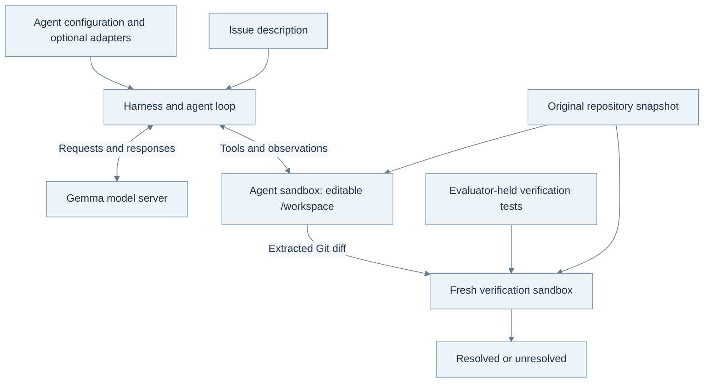

<style>
article .content table:not(.rouge-table) th,
article .content table:not(.rouge-table) td {
  white-space: normal;
  overflow-wrap: anywhere;
}
article .content .mermaid,
article .content .mermaid * {
  font-family: Arial, sans-serif !important;
}
article h1,
article .content h2,
article .content h3 {
  word-break: keep-all;
  overflow-wrap: break-word;
  text-wrap: balance;
}
article .content p,
article .content li {
  word-break: keep-all;
  overflow-wrap: break-word;
}
@media (max-width: 600px) {
  article .content .table-wrapper { overflow-x: auto; }
  article .content table:not(.rouge-table) { min-width: 600px; }
  article .content table:not(.rouge-table) th,
  article .content table:not(.rouge-table) td { min-width: 110px; }
}
</style>

[Read in English]({{ site.baseurl }}/posts/Gemma-4-Developer-Agent-From-Issue-to-Verified-Patch/)

## 들어가며: 우리가 만들 에이전트

Kaggle에서는 보통 주어진 데이터로 예측 모델을 만든다. 집의 면적과 위치를 보고 가격을 맞히는 문제가 한 예다. 이번 대회는 조금 다르다. **프로그램에서 발생한 문제를 설명한 글과 소스 코드**를 주고, AI가 직접 원인을 찾아 고치도록 한다. 정답을 예측하는 데서 끝나는 것이 아니라, 실제로 동작하는 수정안을 만들어야 한다.

[Google — Gemma 4 Developer Agent Competition][competition]의 참가자는 모두 지정된 Gemma base model을 사용한다. 우리가 설계할 부분은 이 모델이 일을 해 나가는 방식이다. 어떤 파일부터 읽게 할지, 코드는 어떻게 수정하게 할지, 수정한 뒤에는 무엇을 확인하게 할지를 정한다. 한 번에 해결하지 못했을 때 다시 시도하는 방법도 필요하다. Kaggle은 이렇게 만든 에이전트에 비공개 문제를 맡기고, 에이전트가 고친 코드를 채점한다. **제출할 것은 연습 문제의 답안이 아니라, 처음 보는 문제도 풀 수 있는 에이전트다.**

**먼저 참고할 자료.** 아래 자료를 모두 읽고 시작할 필요는 없다. 대회 조건이 궁금하면 공식 문서를, 에이전트의 작동 방식이 궁금하면 구현 예제를 찾아보면 된다.

- **대회 개요와 조건:** [Kaggle 개요와 평가 방식][competition], [데이터·harness 안내][data], [규칙][rules]. 무엇을 만들고 어떤 조건에서 평가받는지 확인할 때 기준이 되는 문서다.
- **Gemma의 배경:** Google의 [Gemma 4 발표 기사][gemma-launch]. open-weight 모델로 무엇을 하려는지 소개한다. 대회에서는 이 제품군 중 특정 모델과 실행 환경을 사용한다.
- **저장소 단위의 코딩 문제:** [SWE-bench 논문][swebench-paper]과 [GitHub][swebench-code]. 함수 하나를 작성하는 문제에서 기존 프로젝트를 고치는 문제로 평가 범위가 어떻게 넓어졌는지 설명한다.
- **에이전트의 간단한 구현:** [mini-SWE-agent 문서][mini-docs]와 [GitHub][mini-code]. 모델이 도구를 요청하고 실행 결과를 받아 다음 행동을 정하는 과정을 살펴보기 좋다.
- **대회에서 쓰는 설정:** [공식 평가 패키지][wheelhouse]와 [ADK Agent Config 문서][adk]. 일반 ADK 예제를 참고하더라도, 제출할 때는 대회에서 지원하는 설정인지 확인해야 한다.

### 예측값 대신 코드 수정을 만들어 내는 대회

| Question | A typical prediction competition | This developer-agent competition |
|---|---|---|
| What arrives at evaluation time? | Unseen rows, images, or other examples. | An issue description and a repository snapshot. |
| What must the system produce? | A prediction for each example. | Code changes that address each issue. |
| What do we submit here? | Often a prediction file or inference notebook. | An agent package, `submission.zip`, that generates patches when run. |
| What determines success? | A metric comparing predictions with targets. | The fraction of tasks whose patches pass the evaluator's checks. |

AI에게 코드 수정을 부탁한다고 해 보자. 문제가 생긴 함수를 이미 알고 있다면 그 코드와 증상을 함께 보여 주면 된다. 하지만 이번 대회에서는 어떤 파일을 고쳐야 하는지부터 에이전트가 스스로 알아내야 한다. 수정한 뒤에는 오류가 해결됐는지, 원래 잘되던 기능은 그대로 동작하는지도 확인해야 한다.

가령 “limit을 0으로 지정했는데 항목이 열 개 나온다”는 오류 보고를 받았다고 하자. 에이전트는 입력한 0이 어느 코드에서 10으로 바뀌었는지 찾아야 한다. 그 부분을 고치면서도 limit을 생략했을 때 기본값을 쓰는 동작은 유지해야 한다. 1절에서는 이 예를 가지고 코드 탐색부터 검증까지 따라가 본다.

조사를 시작할 때는 필요한 정보가 모두 주어져 있지 않다. 검색해서 파일을 찾고, 파일을 읽다가 의심되는 함수를 발견하고, 테스트를 돌려 보니 처음 생각한 원인이 아니었음을 알게 될 수도 있다. 에이전트는 그때마다 새로 알아낸 내용을 바탕으로 다음에 할 일을 정한다. 모델과 도구를 반복해서 호출하는 이유다.

### 무엇을 제출하고, 무엇을 평가받을까

먼저 앞으로 자주 나올 용어를 정리해 두자. **저장소(repository)**는 소스 코드와 테스트, 설정, 문서, 변경 이력을 모아 둔 곳이다. **이슈(issue)**에는 고치거나 추가해야 할 동작이 적혀 있다. 코드를 고친 뒤 그 변경 내용을 기록한 것이 **패치(patch)**이고, Git에서 이를 텍스트로 보여 주는 형식을 **diff**라고 부른다.

참가자는 설정과 프롬프트, 필요한 경우 학습한 adapter를 묶어 **에이전트 패키지**로 제출한다. Kaggle은 이 패키지를 실행해 문제마다 패치를 만들게 한다. 이후 별도의 평가기가 원래 저장소에 패치를 적용하고 문제가 해결됐는지 검사한다. 따라서 설정 파일을 정상적으로 읽었다거나 diff가 만들어졌다는 것만으로는 점수를 얻지 못한다. 최종 검증까지 통과해야 해결한 문제로 집계된다.


*그림 1. 에이전트는 문제를 푸는 동안 코드를 읽고, 고치고, 검사한다. 참가자는 공개 개발 데이터에서 그 과정을 살펴보고 에이전트를 개선한다. Kaggle은 완성된 에이전트를 비공개 문제에서 평가하며, 정답은 에이전트에 알려 주지 않는다. 그림의 번호는 각 주체가 맡은 일을 구분한 것으로, 성능 수치가 아니다.*

### 같은 모델을 쓰는데 무엇을 개선할 수 있을까

언어 **모델(model)**은 현재 입력에 이어질 응답을 생성한다. 여기에 작업 지침과 **도구(tool)**를 연결하고, 이전 실행 결과를 보며 다음 작업을 이어 가도록 만든 시스템이 **에이전트(agent)**다. 도구는 파일 읽기나 명령 실행처럼 모델의 텍스트 출력만으로는 할 수 없는 일을 수행한다. 주최 측의 **harness**는 모델과 도구를 연결하고, 작업 환경을 준비하며, 실행 한도를 관리하고 최종 패치를 검증한다. 모델이 저장소 내용을 알려면 먼저 도구로 파일을 읽어 와야 한다.

같은 모델을 쓰더라도 어떤 정보를 보여 주고 어떤 순서로 작업하게 하느냐에 따라 결과는 달라질 수 있다. 이슈와 관련된 파일·심볼을 찾는 **localization**이 잘되면 문제와 무관한 코드를 읽느라 시간을 낭비하는 일이 줄어든다. 편집 도구를 제대로 사용하게 하면 맞는 수정안을 생각해 놓고도 파일을 바꾸지 못하는 실패를 줄일 수 있다. 적절한 테스트를 고르면 잘못된 수정 방향을 일찍 알아채고 다시 시도할 시간이 생긴다. 프롬프트, 도구 구성, 역할 분담, 실행 한도는 모두 이런 개선을 위해 바꿔 볼 수 있는 부분이다.

그 효과를 확인하려면 로컬 평가도 제대로 준비해야 한다. 공식 채점 기준은 주최 측이 정하지만, 참가자는 그 동작을 로컬에서 재현하고 실패 원인을 조사할 수 있다. 에이전트가 작업 중에 실행한 테스트와 최종 채점은 구분해야 한다. 작업 중의 테스트는 다음 수정을 판단하기 위한 자료이고, 점수는 나중에 별도로 진행하는 검증으로 정해진다. 에이전트가 비공개 검증 테스트를 미리 돌려 보며 답을 고를 수는 없다.

추가 학습에는 **LoRA adapter**를 사용할 수 있다. 지정된 base model에 학습한 가중치 변화량을 더하는 방식이다. 다만 무엇을 학습시킬지부터 정하기보다는, 현재 에이전트가 어디서 실패하는지 먼저 살펴보려 한다. 에이전트를 더 두거나 검색과 학습을 추가하면 그만큼 자원도 필요하다. 같은 평가 조건과 제한 시간 안에서 더 많은 문제를 해결하는지 비교해야 그 비용을 들일 이유가 생긴다.

### 첫 실험에서 확인할 것

처음부터 높은 점수를 목표로 여러 설정을 바꾸기보다는, 이슈 하나를 끝까지 실행하고 결과를 설명할 수 있는 상태부터 만들어 보자. 확인할 내용은 다음 세 가지다.

1. **평가 환경이 제대로 동작하는가?** 개발 과제 하나에서 수정 전 코드와 reference patch, 즉 제공된 기준 수정안을 적용한 코드를 각각 검사한다. 예상대로 실패와 통과를 구별하지 못한다면 환경부터 조사해야 한다.
2. **에이전트는 어디서 막히는가?** 검색, 파일 읽기, 편집, 테스트, 최종 패치와 소요 시간을 기록한다. 이런 실행 과정을 **trajectory**라고 한다. 코드를 잘못 이해한 경우와 편집 명령이 실패한 경우는 모두 0점일 수 있지만 해결 방법은 다르다.
3. **고친 에이전트가 다른 문제도 더 잘 푸는가?** 실패 원인을 보고 한 가지를 바꾼 뒤 baseline과 같은 조건에서 비교한다. 개선에 사용하지 않은 문제에서도 확인하고, 남은 실패를 보며 추가 학습이나 역할 분담이 필요한지 판단한다.

이 글도 그 순서로 읽을 수 있도록 구성했다. 1–4절에서는 작은 버그 하나를 예로 들어 에이전트의 동작과 채점을 설명한다. 5–8절에서는 관련 연구, 데이터, 실행 제약을 살펴본다. 9–12절은 baseline을 만들고 비교 실험을 준비하는 과정이며, 13절에서는 학습을 포함한 개선 방법을 다룬다.

간단한 Python 코드를 읽을 수 있으면 따라올 수 있도록 필요한 용어를 설명했다. 예제 설정은 **아직 성능을 측정하지 않은 실습용 구성**이며, 프로젝트에서 실험 중인 후보와는 별개다. 대회 세부 사항은 **2026년 9월 25일**에 확인했다. 긴 코드는 접어 두었으니 직접 실행할 때 펼쳐 보면 된다.

## 1. 한 줄을 고치기까지

다음과 같은 버그 보고를 받았다고 해 보자. 사용자가 반환할 항목 수를 0으로 설정했는데, 프로그램은 항목 열 개를 반환한다. 이 글에서는 이 가상의 이슈를 예로 들어 에이전트가 어떤 일을 해야 하는지 살펴본다.

> 제한값을 0으로 지정하면 기본값으로 되돌아간다. 값을 생략했을 때는 기본값을 사용하되, 직접 입력한 0은 그대로 처리해야 한다.

원인이 아래 함수에 있다고 가정해 보자.

```python
def normalize_limit(value, default=10):
    return value or default
```

Python에서 `None`과 `0`은 모두 조건식에서 거짓으로 평가된다. 따라서 위 코드는 사용자가 입력한 0도 기본값으로 바꿔 버린다. 값이 생략됐는지만 확인하도록 다음과 같이 고쳐 볼 수 있다.

```diff
 def normalize_limit(value, default=10):
-    return value or default
+    return default if value is None else value
```

diff에서 `-`는 삭제할 줄, `+`는 추가할 줄을 뜻한다. 변경하지 않은 함수 선언도 함께 보여 주므로 어느 위치를 고친 것인지 알 수 있다. 이 수정이 맞는지는 입력을 넣어 실제 실행 결과와 기대한 값을 비교하는 테스트로 확인한다.

여기까지 보면 간단한 Python 문제다. 하지만 실제로 에이전트가 받는 것은 이 함수가 아니라 이슈 설명과 저장소다. 아래와 같은 프로젝트에서 어느 파일이 문제와 관련 있는지부터 찾아야 한다.

```text
example_service/
├── api/routes.py          # Receives the request
├── settings.py            # Supplies configured defaults
├── query/options.py       # Converts request options
├── query/limits.py        # Normalizes the limit
└── tests/test_options.py  # Exercises the public behavior
```

`limit`을 검색하면 여러 파일이 나올 수 있다. 처음 눈에 띈 `routes.py`에 0을 처리하는 예외를 추가하면 웹 endpoint에서는 문제가 사라질지도 모른다. 하지만 명령줄 entry point에서도 같은 문제가 발생한다면 그쪽은 고쳐지지 않는다. 두 경로가 함께 사용하는 `limits.py`까지 확인해야 하는 이유다. 그렇다고 공통 함수의 동작을 필요 이상으로 바꾸면 이슈에 언급되지 않은 빈 문자열 처리 등이 달라질 수 있다.

조사할 때는 입력값이 코드를 거치며 어떻게 바뀌는지 따라가 보자. 사용자가 넣은 0은 어느 함수로 전달되고, 정확히 어디서 10으로 바뀌는가. 값을 생략한 경우와 0을 입력한 경우를 구분해야 할 곳은 어디인가. 이렇게 확인할 내용을 정해 두면 검색 결과를 무작정 읽는 대신 원인을 좁혀 갈 수 있다.

이번 이슈에서 요구하는 동작은 다음과 같다.

| Input to the helper | Current result | Required result under this invented issue |
|---|---:|---:|
| `None` | 10 | 10: the default applies. |
| `0` | 10 | 0: the explicit value must survive. |
| `5` | 5 | 5: ordinary values must keep working. |

세 입력을 확인하는 이유는 각각 다르다. 0은 보고된 버그를 재현한다. `None`은 수정한 뒤에도 기본값을 사용하는지, 5는 일반적인 입력이 계속 정상 처리되는지 확인한다. 다른 타입의 입력도 허용하는 프로젝트라면 그 동작은 별도로 알아봐야 한다. 이 세 예에 나오지 않았다는 이유로 나머지 입력의 처리 방식을 임의로 정할 수는 없다.

테스트를 통과했다는 사실만으로는 충분하지 않다. 예를 들어 `normalize_limit(5)`는 수정 전에도 통과한다. 기존 동작이 유지됐다는 확인에는 쓸 수 있지만, 0을 잘못 처리하던 문제를 고쳤다는 증거는 되지 못한다. 그 문제를 확인하려면 0을 넣었을 때 수정 전에는 실패하고 수정 후에는 통과해야 한다. 이렇게 확인한 동작을 테스트로 남겨 두면 이후 코드를 바꿀 때 같은 문제가 다시 생기는지도 알 수 있다. 이것이 **regression test**의 역할이다.

작업을 마칠 때는 diff도 직접 확인해야 한다. 의도한 함수가 실제로 바뀌었는지, 편집 명령이 실패해 원래 코드가 남아 있지는 않은지, 임시 파일까지 포함되지는 않았는지 살펴본다. 에이전트가 “수정 완료”라고 응답했어도 평가기로 전달되는 패치가 잘못됐다면 문제를 해결한 것이 아니다.

이 과정에 등장하는 구성 요소를 정리하면 다음과 같다.

| Term | Its role in this competition |
|---|---|
| **Model** | Gemma generates the next reasoning step, tool call, or response. |
| **Agent** | The model together with instructions, tools, state, and a procedure for continuing the work. |
| **Tool** | An operation such as reading a file, running a command, or submitting the current changes. |
| **Harness** | The organizer's software that loads the agent, prepares tasks, enforces limits, and evaluates patches. |
| **Patch** | A Git diff describing changes relative to the prepared repository baseline. |

모델이 도구 사용을 요청하면 에이전트의 실행 루프가 해당 도구를 호출하고 결과를 다시 모델에 전달한다. harness는 작업 환경과 실행 한도를 관리하며, 만들어진 패치를 검증한다. 모델에 필요한 정보를 얼마나 잘 전달하는지, 명령이 실패했을 때 그 결과를 다음 판단에 활용하는지가 전체 성능에도 영향을 준다.

실행 중에 오간 메시지와 도구 호출, 반환된 결과를 순서대로 기록한 것이 **trajectory**다. 검색 한 번, 파일 읽기 두 번, 실패한 재현 시도, 코드 수정, 통과한 테스트 등이 담긴다. 실패한 실행을 조사할 때는 이 기록을 읽으며 모델이 어느 시점부터 실제 코드와 다른 상황을 가정했는지 확인할 수 있다.

이 대회에서는 코드를 이해하는 능력과 그 이해를 실제 수정으로 옮기는 능력이 함께 필요하다. 문제를 조사하고 고쳐 검증받는 전 과정을 얼마나 안정적으로 수행하는지 평가하기 때문이다.

앞의 예에서 모델과 도구가 정보를 주고받는 과정을 짧게 적어 보았다. 이해를 돕기 위해 **만든 예시**이며, 실제 실행 기록이나 정확한 통신 형식은 아니다.

```text
Input to the agent: the zero-limit issue and the current repository context.
Model requests: read_file(filepath="query/options.py", start_line=1, end_line=40).
Harness: reads that file in the sandbox and returns its text.
Tool observation includes: return normalize_limit(raw_limit)
Model requests: read_file(filepath="query/limits.py", start_line=1, end_line=40).
Tool observation includes: return value or default
Next useful action: check that this expression reproduces the zero case.
Agent runs a permitted focused check: normalize_limit(0) returns 10.
Agent requests a precise edit replacing the faulty return expression.
Tool reports success; a subsequent file read confirms the saved replacement.
Agent checks the zero, omitted-value and ordinary-value cases.
Agent requests submit_patch(); the harness extracts the code changes.
Separate verifier: applies that patch to a fresh copy and checks the task.
Illustrative outcome: resolved, if those independent verification checks pass.
```

모델은 파일을 직접 읽는 대신 정해진 형식으로 요청을 보낸다. harness가 요청을 해석해 도구를 실행하면 그 결과가 다음 모델 호출의 입력에 포함된다. 명령이 실패했을 때 받은 오류 메시지도 마찬가지다. 에이전트가 이를 읽고 다음 시도를 바꿔야 하며, 성공한 것처럼 진행하면 이후 판단도 잘못된 전제 위에서 이루어진다.

## 2. Google이 open-weight 개발 에이전트를 만들려는 이유

에이전트를 개선하는 방법을 살펴보기 전에, 실행 중에 정보를 알아내는 것과 모델을 학습시키는 것부터 구분해 두자. 언어 모델이 학습한 내용은 parameter라는 수치에 반영된다. 흔히 **가중치(weights)**라고 부르는 값이다. 이 가중치와 현재 입력으로 응답을 생성하는 과정을 **추론(inference)**이라고 한다. 텍스트는 토큰 단위로 처리한다. 단어의 일부나 문장부호, 코드 식별자의 일부가 하나의 토큰이 될 수 있다.

에이전트가 파일을 읽으면 그 내용이 다음 모델 호출의 입력, 즉 **context**에 추가된다. 모델이 그 정보를 참고할 수 있게 된 것이지 가중치가 바뀐 것은 아니다. 반면 **학습(training)**은 예제나 학습 신호를 이용해 parameter를 바꾸는 과정이다. 에이전트가 도구를 여러 번 호출하며 문제를 조사하더라도, 매번 모델을 다시 학습시키는 것은 아니다.

따라서 프롬프트나 도구를 바꿔서 필요한 정보를 더 잘 찾아 주는 방법도 있고, 추가 학습으로 모델의 판단 자체를 개선하는 방법도 있다. 어느 쪽을 시도할지는 현재의 실패 원인을 보고 정하면 된다. 뒤에서 다룰 **LoRA adapter**에는 추가 학습으로 얻은 가중치 변화량을 작게 저장한다. 저장소 파일이나 문제별 정답 패치를 넣어 두는 파일은 아니다.

open-weight 모델은 학습된 parameter가 공개되어 있어 직접 실행하거나 추가로 학습시킬 수 있다. 호스팅 서비스에 요청을 보내는 데 그치지 않고 실행 환경도 직접 선택할 수 있다. Google은 2026년 4월 2일 [Gemma 4 발표][gemma-launch]에서 추론, 함수 호출, 구조화된 출력 등 에이전트에 필요한 기능을 갖춘 Apache 2.0 모델 제품군을 소개했다. 여러 크기가 있지만 이 대회에서는 특정 31B 버전 하나를 사용한다.

**31B**는 parameter가 대략 얼마나 많은지 나타내는 수치다. 읽을 수 있는 파일 수나 작업 단계 수를 뜻하지 않는다. 모델을 설명할 때 자주 나오는 **instruction tuning**은 지시를 따르도록 학습시키는 과정이다. 기본 모델의 초기 학습 이후에 하는 추가 학습을 통틀어 **post-training**이라고 하며, instruction tuning도 여기에 속한다. 도구를 올바르게 호출하거나 디버깅을 잘하도록 가르칠 수도 있다. 다만 이런 학습을 거쳤다는 사실만으로 저장소 수정도 잘할 것이라고 단정할 수는 없다.

### 2.1 모델을 직접 실행하려는 이유

개발팀이 모델을 직접 실행하면 소스 코드를 처리할 장비를 정할 수 있고, 같은 모델 버전으로 작업을 다시 실행하기도 쉽다. 네트워크가 불안정한 곳에서 사용하거나 특정 업무에 맞게 시스템을 바꾸려는 경우에도 유용할 수 있다. 로컬 에이전트에 관심이 모이는 이유다. 물론 직접 실행한다고 개인정보 보호, 낮은 비용, 빠른 속도가 저절로 따라오지는 않는다. 도구와 로그를 어떻게 구성하느냐에 따라 데이터가 이동하는 경로가 달라지고, 실행 속도는 하드웨어와 작업량에 따라 달라진다.

Google의 [AI Edge 글][gemma-edge]에서는 작은 Gemma 모델을 기기에서 실행한 사례를 볼 수 있다. Google이 어떤 활용을 염두에 두고 있는지 참고할 만하다. 다만 E2B/E4B를 사용한 그 사례를 이 대회의 31B 시스템에 대한 성능 측정으로 읽어서는 안 된다. [일반 모델 카드][gemma-card]도 대회 조건과 함께 확인해야 한다. 모델 카드에는 31B 모델의 context가 256K로 나와 있지만, Kaggle에서 사용하는 한도는 32,768토큰이다. 실제 에이전트를 설계할 때 따라야 할 조건은 대회 명세에 있다.

운영진은 이번 대회를 통해 코드를 탐색하고 수정안을 만드는 공개 에이전트를 발전시키려 한다. 소프트웨어의 아키텍처를 설계하고 변경을 검토하는 일은 사람이 계속 맡는다는 구상이다. fine-tuning과 강화학습을 장려하지만, **제출 형식에서 adapter는 선택 사항**이다. 추가 학습 없이 시작해도 된다. 우선 지정된 모델만으로 어디까지 가능한지 알아야, 나중에 학습을 추가했을 때 얼마나 좋아졌는지 비교할 수 있다. [대회 개요와 모델 규칙][competition]

기본 모델이 정해져 있으므로 모델에 보여 주는 정보, 작업 순서, 규칙에서 허용하는 추가 학습을 바꿔 가며 실험할 수 있다. 같은 평가 자원과 제한 시간 안에서 더 많은 이슈를 해결하는지가 비교 기준이다. 팀마다 학습에 쓸 수 있는 자원까지 같아지는 것은 아니지만, 적어도 제출한 에이전트가 어떤 모델과 환경에서 실행될지는 정해져 있다.

### 2.2 패치 점수로 알 수 있는 것

벤치마크 점수가 높아지면 실제 개발자도 더 빨리 일할 수 있을까. 연관은 있을 수 있지만 같은 질문은 아니다. 벤치마크에서는 정해진 문제를 자동으로 채점한다. 실제 개발 업무에는 요구사항 해석, 변경 내용 검토, 동료와의 협의, 이후의 유지보수도 포함된다.

METR의 [2025년 7월 연구][metr-2025]를 예로 보자. 숙련된 오픈소스 개발자 16명이 수행한 작업 246개를 대상으로 무작위 실험을 했는데, 2025년 초의 AI 도구를 사용할 수 있는 조건에서 작업 완료 시간이 19% 늘었다. 이 결과를 이해하려면 어떤 개발자가, 어떤 시기의 도구로, 어떤 일을 했는지를 함께 봐야 한다. 앞으로 모든 AI 지원 도구를 쓸 때도 같은 결과가 나온다는 뜻은 아니다.

같은 연구팀의 [2026년 2월 후속 설명][metr-2026]에는 새 실험에서 생긴 선택 편향이 나온다. AI 사용을 금지하는 조건에 일부 개발자나 작업이 포함되지 않는 등의 문제가 있었다. 저자들도 새 추정치만으로는 당시 AI 도구의 생산성 효과를 신뢰성 있게 판단하기 어렵다고 설명했다. 어느 연구든 제목이나 대표 수치만으로 결론을 내리기 어려운 이유다.

이 대회에서는 평가 기준을 통과하는 패치를 얼마나 많이 만들었는지 측정한다. 그 비율을 높이는 일은 더 믿고 쓸 수 있는 코딩 도우미를 만드는 데 도움이 될 수 있다. 실제 개발 업무에서 얼마나 유용한지는 별도로 확인할 문제다.

## 3. 이슈 하나를 받아 검증하기까지

공개 개발 과제에는 저장소와 `base_commit`이 지정돼 있다. `base_commit`은 reference patch, 즉 기준 수정안을 적용하기 직전의 버전이다. 해결해야 할 문제는 `problem_statement`에 적혀 있고, 선택 항목인 `hints_text`에는 이해를 돕는 추가 설명이 들어갈 수 있다.

에이전트가 작업할 저장소는 `/workspace`에 준비된다. 코드를 조사하고 diff를 만드는 데 필요한 Git 상태는 남겨 두되, 이후 정답 수정이 들어간 커밋은 제거한다. 공개 개발 데이터에는 학습과 로컬 검증에 쓸 수 있도록 reference patch인 `patch`와 검증용 `test_patch`도 제공한다. 그러나 **holdout의 성능을 측정할 때 이 자료를 에이전트에게 답으로 보여 주어서는 안 된다.** 비공개 평가에서도 에이전트는 reference patch와 검증 테스트를 볼 수 없다. [데이터셋 명세][data]

패치를 만드는 곳과 검증하는 곳도 분리돼 있다. 문서에 나온 구조를 그리면 다음과 같다.



*그림 2. Gemma가 도구 사용을 요청하면 harness가 저장소 sandbox에서 해당 작업을 실행한다. 완성한 Git diff는 새로 준비한 기준 저장소에 적용하고, 평가기가 가진 테스트로 검사한다. 모델 서버와 저장소 sandbox에는 각각 다른 자원 제한이 적용된다. 실제 성능 측정 결과가 아니라 실행 구조를 설명하는 그림이다.*

작업 환경에서는 에이전트가 코드를 읽고, 원인을 추정하고, 수정과 검사를 반복한다. 그다음 별도의 새 환경에서 verifier가 패치를 검사한다. 작업 중 실행해 둔 프로세스나 임시 환경은 가져갈 수 없다. 패치만 적용해도 수정한 동작을 재현할 수 있어야 한다.

공개된 도구 구현에서 `submit_patch()`를 호출하면 현재 변경 내용을 수집한다. 먼저 Git이 아직 추적하지 않는 파일도 diff에 나타나게 처리한 뒤, 준비된 기준 커밋과 비교한다. 바이너리 파일의 변경도 담을 수 있는 명령을 사용한다.

```bash
git add -N .
git diff --binary _swegemma_baseline
```

지정한 이름의 기준 커밋을 찾지 못하면 `git diff --binary HEAD`로 다시 시도한다. 첫 번째 명령은 커밋을 생성하는 명령이 아니다. 새 파일을 diff에 표시하기 위한 것이다. 따라서 저장소 안에 임시 재현 스크립트를 남겨 두면 그 파일도 제출 패치에 포함될 수 있다. [공개 패치 추출 소스][wheelhouse]

검증할 때는 새로 준비한 기준 저장소에 이 패치를 적용한다. 이어 보호 대상 테스트와 실행 설정 파일의 복원을 시도하고, 평가기의 `test_patch`를 적용해 지정된 테스트를 실행한다. 공개된 검증 코드에서는 test patch를 읽어 pytest 실행 대상을 찾는다. 데이터 설명에는 reference patch를 선별할 때 전체 테스트를 확인한다고도 나와 있다. 이는 데이터를 선별하는 절차에 대한 설명이므로, 개별 과제를 채점할 때의 절차와 혼동하지 않아야 한다. verifier는 실제 테스트 결과가 기록됐는지와 결과 형식도 확인한다. 프로세스가 오류 없이 종료됐다는 이유만으로 통과시키지는 않는다. [harness 안내][data] · [공개 검증 소스][wheelhouse]

그렇다면 에이전트는 작업 중 무엇으로 수정안을 확인할 수 있을까. 우선 **저장소의 기존 테스트**를 읽으면 프로젝트가 어떤 동작을 기대하는지 알 수 있다. 해당 문제의 실행 규칙이 허용하면 직접 돌려 볼 수도 있다. 의심한 원인을 확인하는 **작은 검사**를 새로 만들어도 된다. 앞의 예에서는 명시적으로 입력한 0이 그대로 반환되는지 assertion으로 확인할 수 있다. 이런 검사 결과를 참고해 다음 수정을 결정한다.

**평가기의 검증 테스트**는 용도가 다르다. 최종 패치를 채점하기 위해 harness가 별도의 새 환경에서 실행한다. 비공개 문제를 푸는 에이전트가 후보 패치를 만들 때마다 이 판정을 받아 볼 수는 없다. 공개 개발 데이터에서 연습용으로 고른 문제는 제공된 수정안과 검증 자료를 읽으며 공부해도 된다. 다만 평가용으로 남겨 둔 문제에서는 그 자료를 에이전트 입력에 넣지 않는다. 에이전트가 직접 실행한 검사를 통과했더라도 최종 점수는 이후 verifier의 결과로 정해진다.

테스트 파일의 복원에도 주의할 부분이 있다. 확인한 `swegemma 0.2.7`은 복원할 경로들을 `git checkout HEAD -- ...`에 한꺼번에 넘긴다. 이때 기준 커밋에 없는 경로 때문에 명령이 실패해도 검증은 계속된다. Git 2.54로 재현해 보니 checkout이 실패하면서 기존 테스트 파일의 수정이 그대로 남았다. 별도로 실행하는 clean은 목록에 있는 untracked 파일을 지운다. 따라서 “테스트 수정은 모두 제거된다”고 설명할 수는 없다. 어디까지나 확인한 로컬 소스의 동작이며, 비공개 채점기도 똑같이 동작하는지는 알 수 없다.

이 동작과 관계없이 에이전트가 고쳐야 할 것은 실제 구현이다. 테스트의 기대값을 바꾸는 것으로 보고된 버그를 해결했다고 할 수는 없다. 또한 수정 결과는 추출한 패치만으로 재현돼야 한다. 실행 중 메모리에서만 바꾼 값, 따로 설치한 패키지, 기록하지 않은 환경 설정에 의존하면 새 환경에서 같은 결과를 얻지 못할 수 있다.

## 4. 패치가 점수가 되는 조건

평가할 과제가 $N$개이고, 과제 $i$의 패치가 verifier 기준을 통과하면 $r_i=1$, 통과하지 못하면 $r_i=0$이라고 하자. 점수는 전체 과제 중 해결한 과제의 비율로 계산한다.

$$
\mathrm{Score}=\frac{1}{N}\sum_{i=1}^{N}r_i.
$$

설명이 설득력 있거나 조사 과정에서 중요한 단서를 찾았더라도 부분 점수는 없다. 지정된 테스트 대부분을 통과했어도, 그 과제의 검증 조건을 모두 만족하지 못하면 해결한 것으로 집계되지 않는다. 위 비율에 100을 곱하면 백분율로 표시할 수 있다. [평가 정의][competition]

예를 들어 **가상의** 평가 집합에 과제가 60개 있고 그중 9개를 해결했다면 점수는 $9/60=0.15$다. 한 문제를 더 해결하면 약 0.0167 오른다. 운영진은 약 120개의 비공개 과제를 Public과 Private에 절반씩 나눈다고 설명한다. 여기서 사용한 60개는 계산 예시이며 최종 평가 집합의 크기가 정확히 60개로 확정됐다는 뜻은 아니다.

이 방식으로 채점하므로 도구 실행과 작업 마무리도 중요하다. 버그 위치를 정확히 찾았지만 편집 요청의 형식을 틀려 파일을 바꾸지 못했다면, 편집 절차를 고치는 것만으로도 해결률이 오를 수 있다. 모델의 코드 이해력을 높여야만 점수가 오르는 것은 아니다. 전체 실행 시간에도 한도가 있으므로 한 문제를 지나치게 오래 조사하면 나머지 문제에 쓸 시간이 부족해질 수 있다.

로컬 실행 결과에서는 다음 세 가지를 나누어 기록하는 편이 좋다.

| Observation | What it establishes |
|---|---|
| The agent session ended | The control loop stopped. |
| A nonempty patch was extracted | There are changes that can be sent to verification. |
| Verification passed | This task earned a resolved result under this evaluation. |

목표는 마지막 행의 검증 통과다. 앞의 두 항목으로는 실행이 어디까지 진행됐는지 알 수 있다. 에이전트가 시간 초과로 끝나더라도 로컬 harness가 남은 패치를 회수해 검증하는 경우가 있다. 따라서 종료 상태만 보고 성공과 실패를 결정하지 말고 실제 검증 결과를 함께 확인해야 한다.

Public 리더보드에는 비공개 평가 데이터의 대략 절반을 사용하며 나머지 절반으로 최종 순위를 정한다. Public 점수에 맞춰 반복해서 조정한 설정이 Private에서도 유리할지는 알 수 없다. 그래서 이 프로젝트에서는 먼저 공개 개발 과제에서 어떤 변경이 왜 도움이 됐는지 조사하려 한다. 이후 횟수가 제한된 리더보드 제출을 통해 다른 문제에서도 개선이 나타나는지 확인할 계획이다.

### 4.1 단계별 성공률과 전체 성공률

관련 코드를 잘 찾아도 편집에 실패하면 문제를 해결할 수 없다. 편집까지 끝냈더라도 새 환경에서 검증을 통과하지 못하면 마찬가지다. 이처럼 여러 단계를 거쳐야 할 때 전체 성공률이 어떻게 달라지는지 확률로 살펴보자. 첫 실행을 준비하는 데 꼭 필요한 내용은 아니므로 나중에 읽어도 된다.

<details markdown="1">
<summary>더 살펴보기: 각 단계를 꽤 잘해도 전체 성공률은 낮을 수 있다</summary>

가상의 에이전트가 네 단계를 거친다고 하자. 관련 코드를 찾고, 수정안을 정하고, 파일에 정확히 적용한 다음, 새 환경에서 검증을 통과하는 패치를 제출한다. $A_j$를 단계 $j$의 성공, $S$를 네 단계 모두의 성공이라고 하면 다음과 같이 쓸 수 있다.

$$
\begin{aligned}
\Pr(S)={}&\Pr(A_1)\,\Pr(A_2\mid A_1)\\
&\times\Pr(A_3\mid A_1\cap A_2)\\
&\times\Pr(A_4\mid A_1\cap A_2\cap A_3).
\end{aligned}
$$

세로줄은 ‘앞의 조건이 성립했을 때’를 뜻한다. 두 번째 항부터는 **이전 단계까지 성공한 시도 중에서** 다음 단계도 성공할 확률이다. 확률의 연쇄 법칙을 쓴 것이므로 각 단계의 실패가 서로 독립이라는 가정은 필요하지 않다. 여기서 네 단계로 나눈 것은 실패 원인을 설명하기 위해서다. Kaggle이 단계별 점수를 준다는 뜻은 아니다.

각 단계의 조건부 성공률이 0.8이라면 전체 성공률은 $0.8^4=0.4096$, 약 41%다. 100번 시도한다고 생각하면 첫 단계를 마치는 시도는 약 80번, 두 번째까지는 64번, 세 번째까지는 51번, 끝까지 성공하는 시도는 41번이다. 이는 계산을 위한 가정이며 Gemma에서 측정한 결과가 아니다.

모델의 설명을 읽으면 문제를 이해한 것 같은데 최종 점수는 낮게 나올 수 있다. 이해한 내용을 실제 패치로 만들고 검증받는 과정에서도 실패하기 때문이다. 무엇을 개선할지 정하려면 trace를 읽어야 한다. 점수 하나만으로는 코드 탐색, 편집 형식, 테스트 선택, 종료 판단 중 어디에 문제가 있었는지 알 수 없다.

</details>

평가에서는 패치의 모양보다 코드의 **동작**을 확인한다. reference patch와 바이트 단위로 일치할 필요는 없으며, 다른 방식으로 구현했어도 verifier의 조건을 만족하면 통과할 수 있다. 물론 자동 테스트로 모든 것을 확인할 수는 없다. 테스트에서 다루지 않은 동작이나 유지보수자가 중요하게 여기는 특성이 있을 수 있다. 이 한계를 테스트에 없는 동작은 망가뜨려도 된다는 뜻으로 받아들이지 말고, 이슈의 요구사항을 충실히 구현해야 한다.

여러 번 생성한 후보 중 하나를 고르는 실험도 해석에 주의해야 한다. 로컬에서 패치 열 개를 만든 뒤 reference test로 통과한 답을 골랐다면, 대회 에이전트에게 없는 정보를 선택에 사용한 것이다. 한 문제에서 여러 수정 방향을 시도하는 것 자체는 가능하다. 다만 제한 시간 안에 끝내야 하고, 최종 패치도 에이전트가 볼 수 있는 정보만으로 골라야 한다. 논문에서 여러 샘플을 생성해 얻은 성능을 이 에이전트의 예상 해결률로 그대로 사용할 수 없는 이유다.

## 5. 함수 작성에서 저장소 수정으로: 참고할 연구들

지금까지 에이전트가 할 일과 채점 방식을 살펴봤다. 이제 설계에 참고할 연구를 몇 가지 읽어 보자. 생성한 코드의 정답 여부를 확인하는 방법부터, 도구 실행 결과를 활용하고 저장소에서 필요한 코드를 찾는 방법까지 서로 다른 문제를 다룬다. 각 연구를 우리 에이전트의 어느 부분에 적용할 수 있을지 생각하며 읽으면 좋다. 모델과 데이터, 사용 자원이 다르므로 논문의 대표 점수를 이 대회의 예상 성능처럼 비교하지는 않는다.

### 5.1 코드는 실행해서 확인한다

Chen과 동료들의 *Evaluating Large Language Models Trained on Code* (2021)는 코드로 학습한 Codex 모델과 HumanEval을 소개했다. HumanEval에서는 Python 함수가 해야 할 일을 알려 주고, 모델이 작성한 코드를 테스트로 평가한다. 확인하려는 것은 **functional correctness**, 즉 요구한 동작을 실제로 수행하는지다. 서로 다르게 생긴 코드가 같은 답을 계산할 수도 있고, 그럴듯하게 작성한 코드가 실행하면 실패할 수도 있다. [논문][humaneval-paper] · [HumanEval GitHub][humaneval-code]

논문에서는 답을 여러 번 sampling하는 경우도 다룬다. 첫 번째 답이 맞는 것과 여러 후보 중에 맞는 답이 하나 있는 것은 구분해야 한다. 앞 절의 재시도와 후보 선택 문제도 이와 관련된다. 다만 함수 완성 과제에서는 코드를 작성할 위치가 어느 정도 주어져 있다. 이번 대회의 버그 보고를 처리하려면 그보다 앞서 수정할 함수를 찾는 작업부터 해야 한다.

### 5.2 실행 결과를 보고 다음 시도를 바꾼다

*ReAct: Synergizing Reasoning and Acting in Language Models*는 2022년에 preprint로 공개됐고 ICLR 2023에서 발표됐다. 모델이 판단하고 도구를 실행한 뒤, 결과를 보고 다시 판단하는 과정을 반복한다. 원 논문은 이 대회와 같은 저장소 수정 실험은 아니지만, 코딩 에이전트가 어떻게 작업을 이어 가는지 이해하는 데 도움이 된다. [논문][react-paper] · [저자들의 예시][react-project]

앞의 limit 예를 떠올려 보자. 요청 처리 코드를 확인했더니 parsing 이후에도 값이 0으로 유지됐다면, 그다음에 값을 처리하는 코드를 조사해야 한다. 그런데도 계속 parser를 고치고 있다면 방금 확인한 사실을 활용하지 못한 것이다. 반복 실행의 장점은 이런 새 정보에 맞춰 조사 방향을 바꿀 수 있다는 데 있다. 명령 사이마다 긴 설명을 작성하는 것만으로는 같은 효과를 얻을 수 없다.

### 5.3 기존 프로젝트에서 문제를 찾아 고친다

*SWE-bench: Can Language Models Resolve Real-World GitHub Issues?*는 2023년에 preprint로 공개됐고 ICLR 2024에서 발표됐다. 이슈, 해당 시점의 저장소, 사람이 수정한 내용을 묶어 과제를 구성하고 모델의 수정안을 실행해 평가한다. 이미 만들어진 소프트웨어에서 관련 코드를 찾아 고쳐야 하며, 주변의 기존 동작도 유지해야 한다. [논문][swebench-paper] · [벤치마크 GitHub][swebench-code]

Gemma 대회에 이슈 설명, 저장소 스냅샷, 검증 자료가 함께 있는 이유도 이해할 수 있다. 이슈를 읽더라도 어느 버전의 코드를 고칠지 알아야 하고, 패치를 만든 뒤에는 맞게 고쳤는지 검사할 방법이 필요하다. 대회에서는 SWE-bench와 비슷한 통과·실패 평가 방식을 명시하지만, 실제 과제와 검증 절차는 Kaggle 자체 명세를 따른다. 다른 SWE-bench 버전의 점수나 테스트 규칙을 그대로 가져오면 평가 조건이 달라진다.

### 5.4 모델이 쓰기 쉬운 도구를 설계한다

*SWE-agent: Agent-Computer Interfaces Enable Automated Software Engineering* (2024)은 모델이 컴퓨터를 다루는 인터페이스를 연구한다. 검색 결과를 어떻게 요약하는지, 파일 내용을 어디까지 보여 주는지, 수정 결과와 이전 작업 기록을 어떤 형태로 전달하는지가 성공 여부에 영향을 준다. 원인을 정확히 알아도 편집 요청을 잘못 보내면 파일을 고칠 수 없다. 필요한 검색 결과가 긴 출력에 묻혀 있어도 활용하기 어렵다. [논문][sweagent-paper] · [프로젝트 GitHub][sweagent-code]

우리도 같은 질문을 실험해 볼 수 있다. 파일 전체를 보여 주는 것이 나을까, 관련 부분만 보여 주는 것이 나을까. 문자열을 찾아 조금씩 고치게 할까, 큰 모듈을 통째로 다시 쓰게 할까. 명령이 실패했을 때 어떤 정보를 돌려주면 다음 시도에 도움이 될까. 이 논문에서 Gemma의 최적 설정을 알 수 있는 것은 아니지만, 도구의 사용 방식을 실험할 이유는 얻을 수 있다.

### 5.5 명령 선택과 실제 실행을 구분한다

2024년에 처음 공개되고 ICLR 2025에 채택된 OpenHands 논문은 에이전트, runtime, 도구 실행과 결과 처리, skill, 다른 에이전트에 작업을 맡기는 기능을 갖춘 플랫폼을 설명한다. 어떤 명령을 실행할지 결정하는 부분과 그 명령을 실제로 실행하는 부분을 나누어 볼 수 있다. [논문][openhands-paper] · [프로젝트 GitHub][openhands-code]

Gemma 대회는 OpenHands를 사용하지 않지만 이 구분은 실패 원인을 조사할 때 도움이 된다. 모델이 적절한 테스트를 골랐어도 실행 환경에서 패키지를 불러오지 못하면 검사가 진행되지 않는다. 도구는 정상 작동했는데 모델이 엉뚱한 동작을 고쳤을 수도 있다. 전자는 환경을, 후자는 판단 과정을 조사해야 한다. 또한 OpenHands의 다양한 브라우저·개발 기능을 이 대회의 오프라인 sandbox에서 그대로 사용할 수 있다고 가정해서는 안 된다.

### 5.6 에이전트는 얼마나 복잡해야 할까

2025년에 공개된 mini-SWE-agent는 제어 루프를 작게 유지하고 내부 동작을 쉽게 읽을 수 있도록 만든 프로젝트다. 문서에서도 단순한 요청·결과 처리 방식과 읽기 쉬운 trajectory를 강조한다. 큰 프레임워크에서 모델의 입력과 실행 과정을 따라가기 어려웠다면 이 구현을 살펴보면 좋다. [문서][mini-docs] · [GitHub][mini-code]

*Agentless: Demystifying LLM-based Software Engineering Agents* (2024)에서는 다음 행동을 매번 모델이 자유롭게 정하도록 두는 대신, 수정 위치 탐색·코드 수정·검증의 순서를 미리 정하는 방법을 살펴본다. mini-SWE-agent와 설계는 다르지만 함께 읽으면 어떤 판단을 모델에게 맡기고 어떤 작업을 정해진 절차로 처리할지 고민하는 데 도움이 된다. [Agentless 논문][agentless-paper] · [GitHub][agentless-code]

이 프로젝트들을 그대로 Kaggle에 제출할 수 있는 것은 아니다. 설계 아이디어를 얻고 비교 대상을 정하는 데 참고하면 된다. 단순한 baseline이라도 변경의 효과를 확인하는 기준으로 쓸 수 있다. 에이전트 수를 늘리거나 메모리, 검색, 학습을 추가하려면 실제로 더 많은 과제를 해결하는지 비교해 봐야 한다.

## 6. 공개 개발 데이터는 어떻게 활용할까

대회에서 **public**이라는 말은 두 가지 의미로 쓰인다. 공개 개발 데이터는 내려받아 내용을 살펴볼 수 있는 자료다. 반면 **Public 리더보드**에서는 점수가 공개될 뿐, 채점에 사용한 이슈와 정답까지 개발용으로 제공하지는 않는다.

| Name | What the participant can see | What it is for |
|---|---|---|
| Public development data | Released issues, repository snapshots and reference material. | Build and debug the agent; reserve local evaluation tasks before tuning. |
| Public leaderboard split | A score from part of the hidden evaluation; not its task answers. | Limited feedback during the competition. |
| Private leaderboard split | Hidden evaluation used for final ranking. | Judge the submitted design on the final scoring split. |

내려받은 개발 데이터도 전부 같은 용도로 쓰기보다는 나누어 두는 것이 좋다. 일부는 가중치 학습에, 일부는 프롬프트와 설정을 고르는 데 사용하고, 나머지는 나중에 평가할 **holdout**으로 남겨 둘 수 있다. 가중치를 학습하지 않더라도 특정 예제의 결과를 보며 프롬프트를 반복해서 고쳤다면 그 예제를 개발에 사용한 것이다. holdout을 따로 두면 이렇게 설계를 고를 때 참고하지 않은 문제에서도 같은 방법이 통하는지 확인할 수 있다. 다만 holdout 결과까지 계속 보면서 설계를 바꾸면 독립적인 평가 자료로서의 의미는 점점 약해진다.

목표는 공개된 수정 129개를 외우는 것이 아니다. 낯선 프로젝트를 파악하고, 원인을 찾아 코드를 고친 뒤, 결과를 확인하는 방법을 만들어야 한다. 비공개 평가에서는 그 방법으로 다른 문제도 풀어야 하기 때문이다. 이를 염두에 두고 개발 과제가 어느 저장소에서 왔으며 각각 몇 개씩 있는지 살펴보자.

데이터 페이지에는 **공개 개발 과제 129개**, 파일 782개, 전체 크기 약 22.42 GB로 표시돼 있다. 과제는 FastAPI, Rich, Requests, HTTPX에서 가져왔다. 과제마다 특정 버전으로 고정한 저장소 스냅샷이 있으며, 탐색에 사용할 코드 그래프와 노드 embedding도 제공한다. [데이터 페이지][data]

내려받은 `tasks.jsonl`에서 저장소별 과제 수를 세면 다음과 같다.

| Repository | What the project does | Tasks | Share |
|---|---|---:|---:|
| `fastapi/fastapi` | [A framework for building web APIs][fastapi-docs]. | 67 | 51.9% |
| `Textualize/rich` | [Formats text, tables, and other output in a terminal][rich-code]. | 48 | 37.2% |
| `psf/requests` | [An HTTP client for making web requests from Python][requests-docs]. | 13 | 10.1% |
| `encode/httpx` | [An HTTP client supporting synchronous and asynchronous use][httpx-docs]. | 1 | 0.8% |
| **Total** | | **129** | **100.0%** |

FastAPI와 Rich가 129개 중 115개, 약 89%다. 이 두 저장소에서 성능이 좋아지면 전체 평균도 크게 오를 수 있다. 그러나 그 결과만으로 Requests나 HTTPX에서도 잘 작동한다고 판단하기는 어렵다. 특히 HTTPX는 문제가 하나뿐이다. 저장소가 네 개 포함돼 있다는 것과 네 프로젝트에서 고르게 검증했다는 것은 다르다.


*그림 3. FastAPI와 Rich가 공개 개발 과제 129개 중 115개(89.1%)를 차지한다. 비공개 평가에서도 같은 비율을 사용한다는 뜻은 아니다. 출처: 2026년 9월 25일 확인한 공개 과제 목록. [데이터셋][data]*

일반적인 Kaggle 예측 대회와는 데이터 한 행에 담긴 내용부터 다르다. 여기서는 이슈 하나를 풀고 채점하려면 해당 시점의 프로그램과 의존성을 복원하고, 수정 결과를 판별할 테스트까지 준비해야 한다. 입력 특성과 목표값만 저장하는 구조가 아니다. 과제가 129개인데도 전체 자료가 수십 GB인 이유다.

### 6.1 실제 개발 이슈: 두 매개변수의 순서

뒤의 실행 예제에 사용할 `fastapi_11194`를 살펴보자. 파일과 폼 필드를 함께 받는 endpoint에서 발생한 문제다. 웹 **endpoint**는 특정 요청을 처리하는 함수다. 예를 들어 이름은 폼 필드로 입력받고 문서는 파일로 업로드받을 수 있다.

과제 설명에 따르면 `Form` 매개변수를 `File`보다 먼저 선언하면 응답 코드 422의 검증 오류가 발생한다. 파일을 먼저 선언하면 오류가 나지 않는다. 여러 파일을 받는 경우까지 포함해 매개변수 순서에 관계없이 동작해야 한다는 요구사항도 있다. [공개 pull request][fastapi-example]에서도 같은 내용을 확인할 수 있다. 여기까지가 실제 이슈의 내용이다. 아래는 이 문제를 조사한다면 어떻게 접근할지 제안한 것이며, 모델의 실제 실행 기록은 아니다.

유효한 업로드라면 매개변수의 선언 순서만 바꿨다고 성공 여부가 달라져서는 안 된다. 그렇다면 순서가 어느 처리 과정에 영향을 주는지 찾아보면 된다. 요청 본문을 정의할 때인지, 필드를 추출할 때인지, 추출한 값을 검증할 때인지 나누어 조사할 수 있다. 첫 번째 매개변수를 처리하며 정한 값이나 가정이 뒤의 매개변수에도 잘못 적용되는지 살펴볼 만하다.

나라면 파일·폼 관련 기존 테스트와, endpoint의 매개변수 선언을 실제 요청 처리에 연결하는 코드를 먼저 읽어 보겠다. 입력은 그대로 두고 선언 순서만 바꾸면 작은 재현 예제를 만들 수 있다. 반환된 검증 오류의 세부 내용을 확인한 뒤 어느 부분을 더 조사할지 정하면 된다. reference patch에서 정답 위치를 확인하지 않고도 보고된 증상을 따라 원인을 좁혀 갈 수 있는 접근이다.

이 글에서 이미 개발용 예제로 살펴본 문제이므로 나중에 해결하더라도 처음 보는 holdout에서 얻은 성과로 집계해서는 안 된다. 또한 실행할 때는 데이터셋에 포함된 저장소 스냅샷을 사용해야 한다. 현재 upstream 코드에는 당시 이후의 변경이 많이 반영돼 있을 수 있다.

### 6.2 과제 묶음에 들어 있는 것들

| Resource | What to use it for |
|---|---|
| `tasks.jsonl` | Issue descriptions, repository identities, base commits, reference fixes, and verification patches. |
| `snapshots/<instance_id>.tgz` | Recreate the exact code the agent is supposed to repair. |
| `graphs/` | Look up relationships among indexed code symbols. |
| `embeddings/` | Retrieve symbols similar to an existing indexed symbol. |
| `wheels/` | Install historical repository dependencies without network access inside the sandbox. |
| `docker/` and `sandbox/` | Prepare the repository execution environment. |
| `sample_submission/` | Inspect the organizer's configuration conventions. |
| `HARNESS_README.md` | Understand the intended execution and submission contract. |

`.jsonl`은 한 줄마다 JSON 객체 하나를 담는 형식이다. 과제 하나의 데이터에도 용도가 다른 항목이 함께 들어 있으므로 먼저 구분해 두자.

| Information | Examples | Role |
|---|---|---|
| Task input and identity | `instance_id`, `repo`, `base_commit`, `problem_statement`, `hints_text` | Identify and present the issue. |
| Reference solution | `patch` | Study or train on solutions within the chosen training partition. |
| Verification material | `test_patch` | Check whether a generated solution resolves the task. |
| Contextual metadata | `created_at` | Analyze chronology and construct development splits. |

reference patch는 학습과 실패 분석에 활용할 수 있다. holdout으로 쓸 과제는 패치나 trajectory를 보며 에이전트를 조정하기 전에 분리해 둔다. 평가할 때 정답 자료는 평가기에서만 사용한다. schema에는 힌트 항목이 있지만, 내려받은 공개 기록의 `hints_text`는 모두 비어 있다. baseline도 추가 댓글 없이 이슈 설명과 저장소만으로 작업할 수 있어야 한다.

개발 과제는 공개 프로젝트 네 개에서 가져왔지만 비공개 평가 과제는 **비공개 저장소**에서 선별했다. 공개 프로젝트의 디렉터리 구조를 전제로 프롬프트를 작성하면 다른 저장소에서 도움이 되지 않을 수 있다. 낯선 구조에서도 필요한 코드를 찾아낼 수 있어야 한다.

이처럼 환경이 바뀌어도 익힌 방법이 계속 도움이 되는 것을 **일반화(generalization)**라고 한다. “공통 함수를 고치기 전에 호출 경로를 따라 입력이 전달되는 과정을 확인한다”는 방법은 다른 프로젝트에서도 활용할 수 있다. 반면 “이 문제는 늘 이 파일을 고치면 된다”는 판단은 공개 저장소에 익숙해져서 가능한 것일 수 있다. 점수가 올랐다면 두 경우 중 어디에 가까운지도 살펴봐야 한다. 다른 문제에서 기대할 수 있는 성능이 달라지기 때문이다.

### 6.3 코드 그래프로 탐색 범위 좁히기

AST, 즉 추상 구문 트리는 코드의 문법 구조를 나타낸다. 코드 그래프에는 함수와 클래스 사이의 관계도 담는다. 이를 이용하면 소스 전체를 읽지 않고도 의심되는 함수에서 그 함수를 호출하는 코드로 따라갈 수 있다.

제공되는 그래프 도구는 `get_code_neighbors`, `get_code_subgraph`, `search_similar_code`다. 마지막 도구는 이름만 보고 자연어 검색이라고 생각하기 쉽지만, 구현을 보면 검색어를 embedding 파일의 **기존 symbol key 또는 그 끝부분**과 맞춰 찾는다. 이슈 설명을 임의로 입력해 새 신경망 embedding을 만드는 방식이 아니다. `HTTPConnection`처럼 이미 인덱싱된 심볼에서 출발해 비슷한 함수나 클래스를 찾는 도구다.

앞의 limit 예에서는 `parse_options`와 `normalize_limit`의 연결을 확인하고, 같은 함수를 사용하는 다른 호출부도 찾아볼 수 있다. 공통 함수를 고치면 어디에 영향을 주는지 조사할 때 유용하다. **embedding**은 인덱싱된 코드 항목을 숫자 벡터로 표현한 것이고, 유사도 검색에서는 서로 가까운 벡터를 찾는다. 비슷한 코드가 반드시 버그의 원인인 것은 아니지만 다음에 읽어 볼 후보로 삼을 수는 있다.

텍스트 검색으로 인덱스에 있는 함수를 하나 찾았다고 하자. 그 함수의 벡터 $\mathbf{q}$와 다른 심볼의 벡터 $\mathbf{z}_j$가 모두 영벡터가 아니면 cosine similarity를 다음과 같이 계산할 수 있다.

$$
s_j=\frac{\mathbf{q}^{\mathsf T}\mathbf{z}_j}
{\lVert\mathbf{q}\rVert\,\lVert\mathbf{z}_j\rVert}.
$$

값이 클수록 두 벡터의 방향이 비슷하다. 해당 심볼에 버그가 있을 확률을 나타내는 값은 아니다. 또한 이 식은 이미 구한 벡터를 비교하는 식이다. 임의의 이슈 문장으로 검색하려면 기존 벡터와 호환되는 query embedding 방법부터 마련해야 한다.

실제로는 텍스트 검색과 그래프 조회를 함께 써 볼 수 있다. 이슈에 나온 이름을 검색하고 소스를 읽은 뒤, 구체적인 가설이 생기면 유사 심볼이나 그래프 이웃을 확인하는 식이다. 그래프에서 찾지 못하면 텍스트 검색으로 돌아온다. 처음부터 검색 점수에 가중치를 붙여 합칠 필요는 없다. 조회를 한 번 더 했을 때 시간과 context를 더 쓰는 만큼 유용한 코드를 찾는지부터 비교하면 된다.

정적으로 만든 그래프에는 실행 중의 관계가 빠질 수 있다. Python은 실행하면서 함수를 선택하거나 속성을 만들고, wrapper를 거쳐 호출 대상을 정하기도 한다. 그래프만으로 이런 관계를 모두 알 수는 없으므로 소스를 읽고 필요한 부분을 실행해 확인해야 한다.

개발 데이터 자체에도 조사할 부분이 있다. 이 글을 작성하며 확인한 대회 파일 목록에는 `graphs/`의 0바이트 항목이 129개, `embeddings/`에도 129개 있었다. 한 [참가자의 조사][graph-discussion]에서는 과제 이름과 커밋 이름으로 된 hard link를 처리하면서 빈 복사본이 생겼다고 설명한다. async 함수 누락도 보고했다. 이 글에서 파일 목록과 직접 대조한 것은 0바이트 크기다. async 함수의 누락 범위는 그 참가자의 조사 내용이며 여기서 직접 측정하지 않았다. 운영진은 보고를 확인하고 조사 중이라고 밝혔다.

따라서 baseline에는 **그래프 조회가 실패하거나 예상한 심볼을 찾지 못해도 조사를 계속하는 방법**이 필요하다. 파일을 직접 읽거나 텍스트 검색, Python 자체 AST parser를 사용할 수 있다. 데이터 문제를 조사하며 복구한 파일은 내려받은 원본과 분리해 두자. 그래야 비교 실험에서 어떤 자료를 사용했는지 나중에도 확인할 수 있다.

## 7. 실행 제약을 고려해 설계하기

현재 [대회 모델 규정][competition]에서 허용하는 모델은 다음 하나다.

```text
gemma-4-31b-it-qat-w4a16-ct
```

모델을 호출하는 모든 에이전트와 하위 에이전트에 이 모델을 사용해야 한다. harness 레지스트리에 다른 모델 별칭이 등록돼 있더라도 대회에서 허용된다는 뜻은 아니다. 지정 모델은 4비트 가중치와 16비트 activation을 사용하며, Kaggle 평가에서는 주최 측이 base model을 제공한다.

체크포인트 이름의 `it`는 instruction tuning, `qat`는 quantization-aware training이다. `w4a16`은 가중치 4비트·activation 16비트, `ct`는 compressed-tensors 패키징을 뜻한다. **양자화**는 일부 수치를 낮은 정밀도로 표현해 자원 사용량을 줄이는 방법이다. 모델 수치의 표현 방식을 바꾼 것이지 다른 소형 모델을 대신 사용해도 된다는 의미는 아니다. adapter를 불러오거나 실험을 재현할 때도 정확히 같은 체크포인트인지 확인해야 한다. [허용 모델 파일][model]

| Constraint | Consequence for the first implementation |
|---|---|
| Four L4 GPUs, 96 GB aggregate VRAM | The hosted runtime is a specific GPU environment; local timing on other hardware needs separate interpretation. |
| 32,768-token context | Instructions, observations, reasoning, and output must share the available context. Read selectively. |
| Total unpacked submission below 3 GiB | Package configurations and optional adapters; do not include a full base-model download. |
| Offline task sandbox | Depend on the supplied environment and wheels, not a network install during a task. |
| Docker sandbox: 4 GiB RAM and 2 vCPUs | Broad test runs and large analysis processes can exhaust resources independently of model inference. |
| Restricted declarative agent configuration | Use registered tools and sandboxed skills instead of an arbitrary host-side Python entrypoint. |
| Twelve hours for all patch generation | Budget across tasks, including sandbox setup; verification time is excluded from this stated limit. |

사양의 출처는 [harness 안내서][data]다. 로컬 라이브러리의 기본값과 Kaggle 채점기의 설정은 구분해서 읽어야 한다. Kaggle에서는 라이브러리를 별도로 연동하므로 일부 설정이 로컬 기본값과 다르다.

GPU 메모리와 저장소 sandbox의 RAM도 별개다. 모델 추론은 GPU 서버에서 처리하지만, 패키지 import나 pytest 명령은 저장소 환경에서 실행한다. 이 테스트 프로세스에 적용되는 RAM 한도는 4 GiB다. 모델 서버의 메모리가 많아도 저장소 환경의 한도가 늘어나는 것은 아니다.

모델 서버에도 가중치를 저장할 공간만 있으면 되는 것은 아니다. 응답 생성에 사용하는 attention 상태를 보관하는 **KV cache** 등이 추가로 필요하다. PagedAttention 논문은 이렇게 커지는 상태를 블록 단위로 관리해 메모리 낭비를 줄이는 방법을 설명한다. vLLM은 이런 문제를 다루는 모델 서빙 시스템이다. 가중치가 GPU에 들어간다는 이유만으로 대화 이력을 계속 늘리거나 요청을 여러 개 동시에 처리할 수 있다고 판단하면 안 된다. [PagedAttention 논문][pagedattention-paper]

지시문, 이슈 설명, 읽어 온 코드, 도구 실행 결과는 모두 context를 차지한다. 다음 응답을 생성할 공간도 남겨야 한다. 앞에서 파일 전체를 읽었다면 지금 필요하지 않은 내용까지 입력에 남아 있을 수 있다. 다음 판단에 필요한 호출 경로와 이미 배제한 가설 등을 중심으로 기록을 정리해야 한다.

### 7.1 작업별 제한 시간과 전체 제한 시간

로컬 에이전트 세션의 시간은 작업 환경 준비가 끝난 뒤부터 잰다. 반면 Kaggle의 12시간 제한에는 준비 시간도 포함된다. 작업별 timeout을 줄이더라도 환경 준비에 걸리는 시간은 별도로 고려해야 한다.

[9월 25일에 확인한 주최 측 답변][runtime-discussion]에 따르면 비공개 작업은 순차 실행한다. 당시에는 전체 제한 시간을 소진하면 제출 오류가 났다. 주최 측은 끝내지 못한 작업을 0점으로 처리하도록 바꿀 계획이라고 설명했지만, 그 답변만으로 변경이 적용됐다고 판단할 수는 없다.

순차적으로 패치를 생성하는 데 걸리는 시간을 다음과 같이 나눌 수 있다.

$$
\begin{aligned}
T_{\mathrm{gen}}&=h+\sum_{i=1}^{N}(s_i+a_i)\\
&\leq720\ \text{minutes}.
\end{aligned}
$$

오른쪽은 패치 생성에 허용된 12시간이고, 왼쪽은 그 안에 처리해야 할 작업들의 소요 시간이다.

| Symbol | Meaning | What to record |
|---|---|---|
| $N$ | Number of tasks in the run. | The fixed task manifest, including failures. |
| $a_i$ | Actual agent-session time for task $i$. | Session start and end; also retain the configured timeout. |
| $s_i$ | Preparation and other counted overhead belonging to task $i$. | Setup and cleanup intervals, with retries where applicable. |
| $h$ | Shared overhead counted by the global timer. | Count it once, outside the task intervals. |
| $T_{\mathrm{gen}}$ | Total counted patch-generation time. | The complete run's timer, checked against the component records. |

시간을 합산할 때 같은 구간을 중복해서 더하지 않도록 주의한다. 검증 시간은 이 패치 생성 제한에 포함되지 않는다. 검증까지 왼쪽에 더하면 제한이 적용되는 범위와 다른 시간을 계산하게 된다.

운영진이 안내한 약 120개를 기준으로 계획해 보자. 12시간을 120개 작업에 고르게 나누면 **환경 준비를 포함해** 작업당 $720/120=6$분이다. 이는 계획을 위한 평균이지 공식적인 작업별 허용 시간이 아니다. 에이전트 제한을 3분으로 두면 120개 세션에 최대 360분을 사용하고, 계산상 나머지 360분을 환경 준비 등에 쓸 수 있다. 실제로 12시간 안에 끝나는지 알려면 기동·재시도·정리 시간, 최종 작업 수, timeout 적용 방식까지 확인해야 한다.


*그림 4. 작업 120개를 순차 실행하며 에이전트가 매번 허용 시간을 모두 쓴다고 가정했다. 작업당 3분이면 환경 준비 등 나머지 과정에 360분을 쓸 수 있고, 6분이면 남는 시간이 없다. 검증 시간은 제외했다. 측정 결과가 아니라 실행 계획을 위한 계산 예시다.*

<details markdown="1">
<summary>더 살펴보기: 시간 배분을 수식으로 표현하기</summary>

시간을 더 들였을 때 해결 가능성이 얼마나 높아지는지 알 수 있다면, 어느 작업에 시간을 더 줄지 판단할 수 있다. $p_i(t_i)$를 작업 $i$에 $t_i$만큼 시간을 쓸 때 해결할 확률, $s_i$를 그 작업의 환경 준비 등에 드는 시간이라고 하자. 제한 시간 안에서 기대 해결 수를 최대화하는 문제로 쓰면 다음과 같다.

$$
\begin{gathered}
\max_{t_1,\ldots,t_N}\quad \sum_i p_i(t_i)\\
\text{subject to}\\
h+\sum_i(s_i+t_i)\leq720\ \text{minutes}.
\end{gathered}
$$

여기서 $t_i$는 배정하려는 시간이며 앞의 $a_i$는 실제 측정 시간이다. 해결 확률 곡선은 이슈뿐 아니라 에이전트와 환경에 따라서도 달라진다. 처음부터 이 곡선을 알 수는 없으므로 적당한 제한값으로 baseline을 측정한다. 추가 시도가 도움이 됐는지 실행 기록으로 조사한 뒤, 언제 더 시도하고 언제 멈출지 기준을 세울 수 있다.

</details>

실행 중에는 “1분을 더 쓰면 유용한 단서를 얻거나 수정안을 개선할 수 있을까”를 판단해야 한다. 수정은 마쳤고 관련 테스트 하나만 남은 경우와, 이미 실패한 검색을 반복하는 경우라면 판단이 달라질 것이다. 이 판단에도 에이전트가 볼 수 있는 정보만 사용해야 한다. 참조 답안을 미리 보고 쉬운 문제를 골라 시간을 배분한 결과는 실제 실행 조건과 맞지 않는다.

### 7.2 도구 출력도 필요한 만큼만 받기

서버는 응답을 생성하기 전에 입력 토큰 수와 **요청한 최대 출력 토큰 수**를 더해 context 한도를 확인한다.

$$
C_{\mathrm{prompt}}+M_{\mathrm{requested}}\leq32768.
$$

$C_{\mathrm{prompt}}$에는 지침, 이슈 설명, tool schema, 읽어 온 내용, template overhead가 모두 포함된다. 출력 한도를 $M_{\mathrm{requested}}=8192$로 요청하면 입력에 사용할 수 있는 공간은 최대 24,576토큰이다. 실제 응답이 짧게 끝나더라도 요청 검사에는 지정한 최대값을 사용한다. 따라서 전체 context 한도까지 소스 코드를 채우지 말고 응답에 필요한 여유를 남겨야 한다. [서버의 요청 검사][vllm-context]

안내서에는 명령 출력을 기본적으로 5,000자에서 자르고, `read_file`에는 150줄과 10,000자 제한을 둔다고 나와 있다. 저장소 전체를 한꺼번에 출력해도 모델에는 일부가 잘린 결과만 전달될 수 있다. 실행 시간은 쓰면서 필요한 내용을 놓칠 수 있는 셈이다.

먼저 검색 범위를 좁히고 관련 부분을 읽은 뒤, 부족하면 범위를 넓히는 편이 낫다. 중간 요약에는 파일 위치, 현재 가설, 수정한 내용, 수행한 검사를 남긴다. 자동 context 압축을 사용하더라도 디버깅에 중요한 사실이 빠지지 않는지 확인해야 한다.

## 8. 모델을 실행하기 전에 이슈 하나부터 이해하기

가중치를 내려받고 학습을 시작하기 전에 CPU 환경에서도 확인할 수 있는 일이 있다. 먼저 이슈를 직접 읽고, 평가기가 수정 전 코드와 올바른 수정안을 구별할 수 있는지 확인해 보려 한다. 이 과정을 거치면 GPU 실행이 실패했을 때도 문제를 이해하지 못한 것인지, 환경이 준비되지 않은 것인지 구분하기 쉽다.

### 8.1 답안을 보기 전에 연습할 이슈부터 정한다

우선 에이전트 설계와 연습에 쓸 개발 이슈 몇 개를 고른다. 답안을 읽거나 그 문제에 맞춰 프롬프트를 반복 수정했다면 이후의 성공은 이미 익숙한 문제에서 얻은 결과로 봐야 한다. 독립적인 평가에 사용할 문제는 별도의 **holdout**으로 남겨 둔다. 평가할 에이전트를 정하기 전에는 그 문제의 답안이나 평가 결과를 참고해 설계를 바꾸지 않는다.

연습 문제는 식별자와 공개된 설명을 보고 고른다. baseline을 돌린 뒤 성공한 것만 골라서는 안 된다. 필요한 스냅샷과 의존성이 있는지도 함께 확인한다. 예를 들어 이번 데이터에는 HTTPX 과제가 하나뿐이므로 저장소마다 세 개씩 뽑을 수는 없다. 실제 과제 목록을 기준으로 계획하고, 어떤 저장소가 포함됐는지 기록해 둔다.

이슈 하나를 골랐다면 reference patch를 열기 전에 설명부터 읽어 보자. 현재 동작은 무엇이고, 요구하는 동작은 무엇이며, 둘을 어떤 검사로 구별할 수 있을지 자기 말로 적어 본다. 이 부분이 불분명하면 모델에도 모호한 과제가 된다. 모든 이슈가 테스트 중 발생한 예외를 고치는 문제는 아니다. 새로운 기능이나 API 변경을 요구할 수도 있으므로 이슈에서 원하는 동작부터 파악해야 한다.

그다음 저장소의 최상위 구조, 의존성 메타데이터, 관련 테스트를 살펴본다. stack trace가 있으면 해당 코드를 따라가고, API 이름이 있으면 검색한다. 출력 형식에 관한 요청이라면 렌더링 경로부터 찾아야 할 수도 있다. 관련 구현을 찾기까지 어떤 순서로 조사했는지 짧게 기록해 두자. 직접 해 보면 프롬프트를 쓰기 전에도 모델에 어떤 정보가 필요할지 감이 생긴다.

### 8.2 수정 전 코드와 reference patch로 평가 환경 확인하기

평가 환경을 확인할 때는 실패해야 하는 경우와 통과해야 하는 경우를 모두 실행해 봐야 한다. 선택한 개발 이슈의 수정 전 저장소를 negative control, reference patch를 적용한 저장소를 positive control로 삼을 수 있다. 두 경우 모두 공식 검증 절차로 확인하며, 정답 자료는 채점하는 쪽에서만 사용한다.

| Control | Intended observation | What an unexpected result would make me inspect |
|---|---|---|
| Unchanged repository, with the issue's verification tests | The issue is not resolved. | Whether the tests exercise the reported behavior and whether the correct snapshot was loaded. |
| Reference patch on a fresh copy, with the same verification tests | The issue is resolved. | Dependency versions, patch application, test selection, and environment reconstruction. |
| Agent patch on another fresh copy | An independently determined pass or fail. | The actual changed code and the verifier output. |

표는 각 대조군에서 기대하는 결과다. 실제로는 공개 과제나 로컬 환경에 문제가 있어 다른 결과가 나올 수 있다. reference patch를 적용해도 실패한다면 기록을 남기고 원인부터 조사한다. 수정 전 코드가 통과한다면 이후 에이전트의 통과가 실제 버그 수정 때문인지 다시 확인해야 한다. 대조군으로 평가 문제를 모두 해결할 수는 없지만, 모델 성능을 비교하기 전에 조사할 부분을 찾을 수 있다.

직접 조사한 뒤에는 연습 이슈의 reference patch를 열어 자신의 가설과 비교해 본다. 눈에 띄는 호출부보다 여러 곳에서 사용하는 공통 코드를 고치는 것이 적절했음을 알게 될 수도 있다. 프롬프트에는 다른 문제에도 적용할 수 있는 이런 조사 방법을 반영한다. 답안의 파일명을 그대로 넣으면 수정 위치를 미리 알려 준 상태로 연습하게 된다.

### 8.3 사용할 장비에 맞춰 세 단계로 준비하기

준비 과정은 다음과 같이 나눌 수 있다.

1. **일반 CPU 컴퓨터에서:** 규칙과 과제 메타데이터를 읽고 데이터 분할을 정한다. 에이전트 설정을 작성하고 제출 압축 파일의 구조를 확인한다.
2. **Docker와 데이터가 준비된 환경에서:** 저장소 스냅샷과 테스트 환경을 복원해 본다. 저장소의 테스트 프로세스는 모델 추론과 별도로 실행된다.
3. **호환되는 GPU 호스트에서:** 지정 모델을 서빙하고 에이전트가 작업을 끝까지 수행하는지 확인한다.

이 순서로 준비하면 GPU를 켠 뒤에야 스냅샷이 없거나 의존성을 설치할 수 없다는 사실을 발견하는 일을 줄일 수 있다. GPU 네 대를 사용할 환경이 없어도 앞의 준비는 시작할 수 있다.

첫 GPU 실행은 이슈 하나로 시작한다. 도구 호출과 패치 추출이 정상 작동하는지, 각 단계에 얼마나 걸리는지 확인한다. 이어 미리 정해 둔 개발 이슈 두세 개로 늘리되 실행 기록을 모두 읽어 볼 수 있는 규모를 유지한다. 전체 과정이 동작하면 약 8~12개에서 소요 시간과 실패 양상을 살펴보고 더 넓은 비교로 넘어간다. 이 숫자는 데이터 분할과 사용 가능한 자원을 고려한 실행 계획이다. 통계적으로 충분한 평가 규모를 뜻하지 않는다.

여기까지 준비했다면 연습 이슈가 요구하는 동작과 올바른 수정을 확인할 방법을 설명할 수 있어야 한다. 환경 문제와 모델의 실패도 구분할 수 있어야 한다. 그래야 이후에 수집한 실행 기록 중 무엇을 학습에 사용할지 판단할 근거가 생긴다.

## 9. 동작을 확인하기 쉬운 baseline 만들기

첫 에이전트에는 다음 순서로 작업하도록 지시해 보자. 프롬프트에 적는 것으로 끝내지 말고, 실제로 어떻게 작업했는지 실행 기록과 비교한다.

1. 이슈에서 요구하는 동작을 구체적으로 정리한다.
2. 관련 구현과 기존 테스트를 찾는다.
3. 가능하면 해당 동작을 확인하는 작은 검사로 문제를 재현한다.
4. 조사한 근거에 따라 필요한 부분을 수정한다.
5. 바뀐 동작과 영향을 받을 수 있는 주변 기능을 테스트한다.
6. diff를 검토하고 임시 파일을 정리한 뒤 패치를 제출한다.

Google의 Agent Development Kit, 즉 **ADK**는 에이전트를 구성하는 기본 요소를 제공한다. 대회의 설정 컴파일러에서도 ADK를 사용한다. 모델을 호출하는 유형인 `LlmAgent` 하나로 위 과정을 구현할 수 있다. 하나로 시작하면 탐색, 추론, 편집, 테스트, 종료 판단 중 어디서 실패했는지 따라가기 쉽다. 여러 에이전트를 쓰는 방법은 이 baseline과 비교해 역할을 나눈 효과를 확인할 수 있을 때 시도하려 한다.

아래 패키지에서는 adapter를 선언하지 않는다. 공식 예제에는 여러 LoRA로 요청을 나누는 방식을 보여 주기 위해 adapter 이름이 지정돼 있다. 가중치 없이 그 설정만 복사하면 adapter 없는 baseline으로 실행되는 것이 아니므로 주의해야 한다.

먼저 어떤 파일을 만드는지 살펴보자. **YAML**은 설정의 이름, 값, 계층 구조를 적는 텍스트 형식이다. harness가 이를 읽어 대회에서 허용한 에이전트와 도구를 구성한다. 프롬프트 파일에는 모델에게 전달할 작업 지침을 적는다. 이 파일들은 호스트에서 독립적으로 실행하는 Python 프로그램이 아니라 harness가 읽어 사용하는 설정이다.

| Design choice | Where the example expresses it | What to look for in the run |
|---|---|---|
| Ask for evidence before editing. | `agent/prompts/system.md` | Does the trace connect the proposed change to a reproduced or inspected behavior? |
| Give the agent ways to inspect and change files. | The registered tools in `agent/agent.yaml` | Do tool calls succeed, and does the agent use their returned observations? |
| Bound the work spent on each issue. | `agent/eval_config.yaml` for hosted evaluation; explicit flags for the local CLI. | Actual tool counts and elapsed time, not just the written settings. |
| Adapt behavior through learning, if later justified. | An optional adapter declaration and its weight files. | A held-out comparison with and without that adapter under the same runtime. |

**baseline**은 앞으로 만든 에이전트의 성능을 비교할 기준 버전이다. 동작을 이해할 수 있고 같은 조건으로 다시 실행할 수 있는 구성이어야 한다. 처음부터 두 번째 에이전트, 그래프 도구, adapter를 모두 추가하면 결과가 달라져도 이유를 파악하기 어렵다. 아래의 작은 패키지로 시작하면 하나씩 바꾸며 효과를 확인하기 쉽다.

### 9.1 CPU 컴퓨터에서 파일 만들기

여기서는 모델을 불러오지 않으므로 텍스트 편집기와 Python 3만 있으면 된다. 먼저 프로젝트 디렉터리를 만든다.

```bash
mkdir -p gemma4-start/agent/prompts gemma4-start/data gemma4-start/results
cd gemma4-start
```

이후 상대 경로의 기준은 이 프로젝트 디렉터리다. 완성할 구조는 다음과 같다.

```text
gemma4-start/
├── agent/
│   ├── agent.yaml
│   ├── eval_config.yaml
│   └── prompts/
│       └── system.md
├── build_submission.py
├── data/                 # Development data; keep outside the agent archive
└── results/              # Local evaluation results; keep outside the archive
```

다음 내용을 `agent/agent.yaml`로 저장한다.

```yaml
name: repository_fixer
model: gemma-4-31b-it-qat-w4a16-ct
instruction: !include prompts/system.md
tools:
  - run_command
  - read_file
  - edit_file
  - write_file
  - get_status
  - submit_patch
generate_content_config:
  temperature: 0.2
  max_output_tokens: 8192
  thinking_config:
    include_thoughts: false
```

YAML은 들여쓰기로 구조를 구분한다. `instruction`의 `!include` 경로는 이 설정 파일을 기준으로 찾는다. 여섯 도구는 작업 공간을 다루고 진행 상태와 종료를 관리하는 기본 도구다. 그래프 도구는 기본 실행을 확인한 뒤 추가해 효과를 비교할 수 있다.

| Tool | What the baseline uses it for |
|---|---|
| `run_command` | Run shell commands, searches, and focused tests in the sandbox. |
| `read_file` | Read a selected line range from a workspace file. |
| `edit_file` | Replace a matching string in an existing, nonempty file. |
| `write_file` | Create or overwrite a file inside the workspace. |
| `get_status` | Inspect consumed and remaining task budgets and patch status. |
| `submit_patch` | Capture the diff and mark the task ready for verification. |

sampling 설정은 **baseline을 시작할 때 사용해 볼 예시 값**이다. `temperature`를 낮추면 일반적으로 모델이 높은 확률을 부여한 출력을 더 자주 선택한다. 출력 제한은 응답 한 번에 적용되며, 작업 전체에서 생성할 수 있는 토큰 수를 제한하는 값은 아니다.

thinking 설정은 이름만으로 동작을 판단하기 어렵다. 확인한 `adk-submission 0.2.11` 브리지는 `include_thoughts: false`를 채팅 템플릿의 `enable_thinking: false`로 전달한다. 생각한 내용을 화면에서만 숨기는 것이 아니라 해당 요청의 별도 thinking 모드를 끈다. 물론 생성 모드를 바꾸는 것이지 모델이 근거를 따져 판단하는 능력 자체가 사라지는 것은 아니다. 숫자로 지정하는 `thinking_budget`은 schema에서 허용하지만, 이 브리지와 확인한 `google-adk 1.36.1`의 completion parameter 전달 경로에서는 서버에 넘기지 않는다. 따라서 실제 추론 토큰 상한으로 적용된다고 볼 수 없다. [배포된 생성 브리지와 ADK 소스][wheelhouse]

이 실습에서는 thinking 모드를 끈 상태를 대조군으로 삼는다. 이후 `include_thoughts: true`로 켜고 해결한 이슈 수, 출력이 잘리는 빈도, 실행 시간을 비교해 볼 수 있다. YAML 검증을 통과했다는 사실만으로 서버에 전달된 설정을 알 수는 없으므로 실제 요청도 확인한다. 어느 모드가 더 나은지는 그 결과로 판단하면 된다.

다음 내용은 `agent/prompts/system.md`로 저장한다.

```text
You are repairing a Python repository for the issue in the user message.

Work from the repository at /workspace and the supplied issue description.
Inspect the relevant implementation and nearby tests before editing.
State a short, concrete hypothesis about the cause, then check it with code
inspection or a focused reproduction.

Make a small implementation change that addresses the requested behavior.
Preserve unrelated behavior and follow the repository's existing conventions.
Use short, incremental edit requests. Read the result of each tool call and
respond to errors before building further changes on it.

Dependencies are prepared by the harness. Work offline. Follow the task's
execution rules. Run focused checks and relevant existing tests when permitted
and time allows. If pytest or unittest is disabled, use targeted inline Python
assertions instead. Use run_command to create and run scratch scripts in /tmp;
workspace file tools operate inside /workspace.
Do not change test expectations to make the issue appear resolved, and do not
alter harness-generated pytest.ini or conftest.py.

Check get_status during the task. Reserve time to review git diff, remove any
temporary files from the repository, and verify the final change. Do not commit
your edits. Call submit_patch when the patch is ready; treat it as the final
tool action. Keep your final message brief and factual.
```

프롬프트에는 수행할 작업과 판단에 필요한 정보를 구체적으로 적었다. 모든 이슈가 간단하다고 가정하거나 수정할 줄 수를 임의로 제한하지 않았고, 남은 시간에 끝내기 어려운 테스트를 무조건 요구하지도 않았다. 검사 방법을 고를 때는 해당 작업의 규칙이 우선이다. 배포된 로컬 설정은 sandbox에서 테스트를 기본으로 허용하지만, 생성되는 작업 프롬프트는 pytest·unittest를 금지하고 inline assertion을 요구하는 환경도 지원한다. 따라서 에이전트가 작업 프롬프트를 먼저 읽게 해야 한다. 커밋하지 말라는 지시는 작업 중 diff를 검토하기 쉽게 하려는 것이다. 최종 패치 추출에는 harness가 준비한 기준 상태를 사용한다.

### 9.2 Kaggle 평가의 작업별 제한을 명시하기

아래 내용을 `agent/eval_config.yaml`로 저장한다.

```yaml
evaluation:
  timeout_seconds: 300
  max_tool_calls: 40
  max_time_minutes: 3
  max_turns: 80
```

**`evaluation:` 아래에 설정을 두는 구조는 공식 예제를 따른다.** 네 필드는 각각 명령 실행 시간, 도구 호출 수, 에이전트 세션 시간(분), 모델 턴 수를 제한한다. 숫자는 첫 실행에 사용할 제안값이다. 공식 예제에는 가벼운 smoke test를 위한 더 작은 값이 들어 있다.

배포된 로컬 검증기는 마지막 pytest 실행에도 같은 명령 시간 제한을 적용한다. 여기서는 최종 검사가 60초 만에 중단되는 일을 피하려고 300초를 사용했다. 이 값은 3분짜리 에이전트 세션 제한과 별개다. 에이전트가 실행하는 명령은 세션의 남은 시간 안에 마쳐야 하지만, 새 환경에서의 검증은 세션이 끝난 뒤 진행한다. 300초가 충분한지는 수정 전 코드와 reference patch 대조군에서 기대한 결과가 나오는지 확인해 판단한다. verifier의 시간 초과는 모델의 추론 실패와 나누어 기록한다. [배포된 평가기와 검증 소스][wheelhouse]

[주최 측 설명][runtime-discussion]에 따르면 Kaggle 채점기는 이 네 필드를 읽고, 생략한 제한은 무제한으로 처리한다. 로컬 CLI의 동작은 다르다. 기본 시간 제한은 60분이며 `eval` 명령은 이 YAML을 읽지 않는다. **로컬에서는 각 제한에 해당하는 CLI 옵션을 직접 넘겨야 한다.**

### 9.3 필요한 파일을 ZIP 루트에 넣기

평가기에서 같은 에이전트를 구성할 수 있도록 설정과 관련 파일을 정해진 경로에 압축한다. 아래 스크립트는 ZIP의 해시도 출력한다. 실험 기록에 이 값을 남겨 두면 어떤 파일을 Kaggle에 보냈는지 나중에 정확히 확인할 수 있다.

<details markdown="1">
<summary>따라 하기: 파일 세 개로 제출 압축 파일을 만들고 확인하기</summary>

다음 스크립트를 프로젝트 디렉터리의 `build_submission.py`로 저장한다. Python 표준 라이브러리만 사용한다.

```python
from pathlib import Path
import hashlib
import stat
import zipfile

root = Path("agent")
expected = {
    "agent.yaml",
    "eval_config.yaml",
    "prompts/system.md",
}
paths = list(root.rglob("*"))
if any(p.is_symlink() for p in paths):
    raise SystemExit("Remove symlinks from the agent package.")
files = {p.relative_to(root).as_posix(): p for p in paths if p.is_file()}
if set(files) != expected:
    raise SystemExit(f"Unexpected package contents: {sorted(files)}")
if sum(p.stat().st_size for p in files.values()) >= 3 * 1024**3:
    raise SystemExit("The unpacked package must be below 3 GiB.")

archive = Path("submission.zip")
with zipfile.ZipFile(archive, "w", compression=zipfile.ZIP_DEFLATED) as z:
    for name in sorted(files):
        info = zipfile.ZipInfo(name, date_time=(2026, 9, 25, 0, 0, 0))
        info.create_system = 3
        info.external_attr = (stat.S_IFREG | 0o644) << 16
        info.compress_type = zipfile.ZIP_DEFLATED
        z.writestr(info, files[name].read_bytes())

with zipfile.ZipFile(archive) as z:
    if z.testzip() is not None or set(z.namelist()) != expected:
        raise SystemExit("Archive verification failed.")

print("Archive:", archive)
print("Files:", ", ".join(sorted(expected)))
print("SHA256:", hashlib.sha256(archive.read_bytes()).hexdigest())
```

`gemma4-start/`에서 실행한다.

```bash
python3 build_submission.py
python3 -m zipfile -l submission.zip
```

목록에 `agent/agent.yaml`이 아니라 루트의 `agent.yaml`이 있어야 한다. 타임스탬프를 고정했으므로 같은 빌드 환경에서 같은 파일을 압축하면 동일한 ZIP을 만들 수 있다. 출력된 SHA-256 해시를 실험마다 기록해 두자.

이 스크립트는 최소 예제의 세 파일만 포함하도록 작성했다. skill이나 adapter를 추가할 때는 허용 목록도 수정해야 한다. 또한 ZIP 구조가 맞는 것과 harness에서 실제로 컴파일·실행할 수 있는 것은 별도 확인 사항이다.

</details>

## 10. 로컬 평가에 필요한 환경 준비하기

에이전트 파일을 만들었으니 개발 데이터, 모델 서버, 서버와 통신할 harness를 준비할 차례다. `swegemma`를 설치해도 데이터와 모델 서버까지 함께 준비되지는 않는다.

앞의 패키지 작성은 CPU 노트북에서 할 수 있었다. 아래 추론 절차는 CUDA와 Docker가 정상 작동하는 **Linux NVIDIA GPU 장비**를 기준으로 한다. 다른 장비로 옮겨 작업한다면 먼저 프로젝트 디렉터리를 복사한다. 문서의 Kaggle 환경은 모델을 GPU 네 대에 나누어 올리고 텐서 병렬도 4를 사용한다. 로컬 장비가 다르면 그 구성에서 모델을 서빙할 수 있는지와 필요한 메모리를 별도로 확인해야 한다. 아래 명령은 해당 버전의 배포 소스와 대조했지만, 이 글을 작성하기 위해 실제 GPU 평가를 돌리지는 않았다.

여기서 “로컬 평가”는 평가 환경을 직접 실행한다는 뜻이다. 개인 노트북일 필요는 없으며 Linux GPU 서버를 사용해도 된다. CPU 컴퓨터에서 패키지를 작성하는 것과 31B 모델을 메모리에 올려 추론하는 것은 다른 작업이다. 구성 요소들이 같은 호스트에 있더라도 각 역할을 구분해 두면 문제를 찾기 쉽다.

| Running component | What it does | What should become observable |
|---|---|---|
| Model server on the GPU host | Loads Gemma and answers model requests. | The expected model name and a successful request/response. |
| Local evaluator process | Loads the agent package, prepares tasks and coordinates tool calls. | A recorded issue attempt with its full trace and patch. |
| Repository sandbox | Holds the task's code and executes permitted commands. | File changes, command output and resource/time errors. |
| Fresh verification sandbox | Reconstructs the task and checks the extracted patch. | Verification logs and a resolved/unresolved outcome. |

먼저 수정 전 저장소와 reference patch를 적용한 저장소를 검증해 본다. 이때는 모델을 호출하지 않아도 된다. 평가 환경이 동작하면 모델 서버를 시작하고 에이전트의 실행 기록을 얻는다. 모델 가중치, 과제 데이터, 대조군 검사 스크립트, 결과 로그는 모두 개발용 자료이므로 제출할 에이전트 폴더 밖에 둔다.

### 10.1 데이터를 받고 버전 기록 남기기

접근이 제한된 파일을 내려받으려면 Kaggle에서 대회에 참가하고 규칙에 동의해야 한다. [공식 Kaggle CLI][kaggle-cli]의 최신 인증 안내에 따라 CLI를 설정하되 인증 정보는 프로젝트와 제출 파일 밖에 보관한다.

작업 목록과 안내서부터 내려받는다.

```bash
mkdir -p data
kaggle competitions download gemma-4-developer-agent \
  -f tasks.jsonl -p data
kaggle competitions download gemma-4-developer-agent \
  -f HARNESS_README.md -p data
```

ZIP으로 받았다면 `data/`에 압축을 푼다. 전체 로컬 평가에는 저장소 스냅샷, wheel 패키지, sandbox 파일도 필요하다. 다운로드 크기는 약 22.42 GB이며 압축 해제와 컨테이너 빌드에도 추가 공간이 필요하다. 전체 환경을 준비하려면 다음 명령을 사용한다.

```bash
mkdir -p downloads
kaggle competitions download gemma-4-developer-agent -p downloads
python3 -m zipfile -e downloads/gemma-4-developer-agent.zip data
```

내려받은 압축 파일은 원본으로 보관한다. 그래프 파일 문제를 조사하거나 복구할 때는 별도의 복사본에서 작업한다.

압축을 푼 뒤에는 다음 구조로 정리한다.

```text
data/
├── tasks.jsonl
├── snapshots/
├── graphs/
├── embeddings/
├── wheels/
├── docker/
└── sandbox/
```

README의 일부 경로는 `published/`로 시작한다. 실제로 `tasks.jsonl`이 있는 디렉터리를 찾아 사용하면 된다. 여기서는 그 위치를 `data/`로 정했다.

참조 답안은 출력하지 않고 과제 목록만 확인한다.

```python
import json
from collections import Counter
from pathlib import Path

tasks = [json.loads(line) for line in Path("data/tasks.jsonl").read_text().splitlines()
         if line.strip()]
print("Tasks:", len(tasks))
print("Repositories:", dict(Counter(t["repo"] for t in tasks)))
first = tasks[0]
print("Example identity:", first["instance_id"], first["repo"], first["base_commit"])
```

다운로드 날짜와 패키지 버전도 남겨 둔다. 프롬프트가 같더라도 harness나 의존 패키지가 달라지면 실행 결과가 바뀔 수 있다.

### 10.2 배포된 평가 패키지 설치하기

이 글에서 확인한 [공식 wheelhouse][wheelhouse]의 주요 패키지는 다음 버전이다.

| Package | Version |
|---|---:|
| `swegemma` | 0.2.7 |
| `adk-submission` | 0.2.11 |
| `adk-eval-core` | 0.1.0 |
| `google-adk` | 1.36.1 |
| `vllm` | 0.19.1 |

배포된 harness에는 Python 3.12 이상이 필요하다. 이는 harness를 실행하는 호스트의 조건이다. 저장소 sandbox에서는 별도로 Python 3.13을 사용한다.

호스트용 wheelhouse를 내려받아 압축을 푼다. 확인한 버전의 크기는 약 880.83 MB다.

```bash
mkdir -p wheelhouse
kaggle datasets download metric/gemma-4-developer-agent-wheelhouse \
  -p wheelhouse --unzip
```

GPU 호스트에 새 환경을 만들고 호환되는 의존 패키지를 설치한다. 일부 wheel은 특정 Python ABI와 Linux 아키텍처에서만 동작하므로 다운로드한 파일을 모두 설치하지는 않는다. 필요한 주최 측 패키지를 지정하면 설치 도구가 호환되는 의존 패키지를 선택한다.

```bash
python3.12 -m venv .venv
source .venv/bin/activate
python -m pip install --upgrade pip
python -m pip install --find-links wheelhouse \
  swegemma==0.2.7 adk-submission==0.2.11 adk-eval-core==0.1.0 \
  google-adk==1.36.1 vllm==0.19.1
swegemma eval --help
```

`--find-links`는 내려받은 wheel을 설치 후보에 추가한다. 패키지 인덱스를 차단하는 옵션이 아니므로 처음 호스트를 설정할 때는 인터넷이 필요할 수 있다. 이는 평가 중 네트워크가 차단되는 저장소 환경과 별개다. 설치를 마치면 `python -m pip freeze`로 실제 버전을 출력해 실행 기록과 함께 보관한다.

모델을 불러오기 전에 배포 패키지의 API로 디렉터리 구조와 루트 설정을 검사할 수 있다. 다음을 `check_agent.py`로 저장하고 `python check_agent.py`로 실행한다.

```python
from pathlib import Path
from adk_submission import validate_directory
from adk_submission.schema import SandboxedAgentConfig
from adk_submission.yaml_loader import load_yaml
from swegemma.config import build_submission_limits
from swegemma.models import validate_single_declared_model

root = Path("agent").resolve()
limits, _ = build_submission_limits()
layout = validate_directory(root, limits)
SandboxedAgentConfig.model_validate(
    load_yaml(layout.config_path, layout.root_dir, limits=limits)
)
assert validate_single_declared_model(root) == "gemma-4-31b-it-qat-w4a16-ct"
print("Directory and root schema checks passed.")
```

이 예제는 배포 소스를 확인해 작성했다. 호스트 의존 패키지는 필요하지만 모델을 호출하지는 않는다. schema 오류가 있으면 이 단계에서 고친다. 에이전트와 도구의 실제 등록·실행 여부는 이후 평가에서 확인한다.

### 10.3 저장소 sandbox를 만들고 두 대조군 검증하기

`Dockerfile.public`은 빌드 context에 `imp.py`, `telnetlib.py`, `wheels/`가 있다고 가정한다. 앞에서 받은 데이터의 해당 파일들을 배치하고 sandbox 이미지를 만든다.

```bash
mkdir -p sandbox-build/wheels
cp data/docker/Dockerfile.public sandbox-build/Dockerfile
cp data/docker/imp.py data/docker/telnetlib.py sandbox-build/
cp -R data/wheels/. sandbox-build/wheels/
docker build -t swebench-sandbox:latest sandbox-build
```

이미지를 빌드하는 동안에는 네트워크로 필요한 패키지를 준비한다. 이후 평가용 Docker 작업에서는 네트워크를 차단하므로, 에이전트가 문제를 풀면서 외부 패키지를 임의로 내려받아 설치할 수는 없다. 준비 단계와 평가 단계의 조건이 다르다는 점을 기억하자.

호스트 패키지, 데이터, Docker 이미지가 준비되면 모델 서버를 켜지 않고 verifier를 실행해 볼 수 있다. 아래 두 검사는 같은 연습 과제와 같은 명령 시간 제한을 사용한다. `swegemma 0.2.7` 소스와 대조한 예제이며 이 글을 위해 직접 실행하지는 않았다. 목적은 두 대조군으로 평가 환경을 확인하는 것이다. 에이전트의 성능을 측정하는 단계가 아니다.

<details markdown="1">
<summary>따라 하기: 모델 추론 없이 수정 전 저장소와 reference patch 검증하기</summary>

수정 전 코드는 `--skip-agent-patch`를 지정해 검사한다. 모델 실행을 건너뛰고 빈 에이전트 패치를 검증 단계에 전달한다.

```bash
swegemma eval \
  --tasks data/tasks.jsonl \
  --snapshots-dir data/snapshots \
  --submission-dir agent \
  --results-dir results/control-unchanged-001 \
  --sandbox docker \
  --image swebench-sandbox:latest \
  --task-id fastapi_11194 \
  --skip-agent-patch \
  --timeout-seconds 300 \
  --concurrency 1 \
  --display quiet
```

CLI에 제출 디렉터리를 넘기고 모델 레지스트리를 구성하기는 하지만 이 경로에서 추론 요청은 보내지 않는다. 결함이 남아 있으므로 미해결 결과가 나와야 한다.

reference patch를 검사하려면 다음을 `check_reference.py`로 저장한다. 위치는 `agent/` 내부가 아니라 **그 옆**이다. 배포된 verifier를 직접 호출하는 스크립트로, 정답 자료는 평가하는 쪽에서만 사용한다.

```python
import asyncio
import json
import time
from pathlib import Path

from adk_submission import ModelRegistry
from swegemma.config import EvalConfig
from swegemma.deduplication import resolve_task_snapshot_paths
from swegemma.harness.verification import verify_task
from swegemma.models import load_tasks
from swegemma.results import append_task_result
from swegemma.sandbox import ContainerConfig, ContainerManager

task_id = "fastapi_11194"
cfg = EvalConfig(
    tasks_path=Path("data/tasks.jsonl"),
    snapshots_dir=Path("data/snapshots"),
    submission_dir=Path("agent"),  # Required field; no agent is run.
    results_dir=Path("results/control-reference-001"),
    models=ModelRegistry(),       # Empty: no inference is needed.
    timeout_seconds=300,
)
task = next(t for t in load_tasks(cfg.tasks_path)
            if t.instance_id == task_id)
assert task.patch.strip() and task.test_patch.strip()

snapshot, base_snapshot, snapshot_patch = resolve_task_snapshot_paths(
    cfg.snapshots_dir, task.instance_id, task.repo
)
assert snapshot.is_file()

sandbox = ContainerManager(ContainerConfig(
    image=cfg.image,
    timeout_seconds=cfg.harness.command_timeout_seconds,
))
try:
    result = asyncio.run(verify_task(
        sandbox, cfg, task, snapshot,
        base_snapshot_path=base_snapshot,
        patch_path=snapshot_patch,
        agent_patch=task.patch,
        start_time=time.perf_counter(),
    ))
    append_task_result(result, cfg.results_dir, running_results=[result])
    print(json.dumps({
        "control": "reference",
        "instance_id": result.instance_id,
        "resolved": result.resolved,
        "test_exit_code": result.test_exit_code,
        "error": result.error,
    }, indent=2))
finally:
    sandbox.close()
```

```bash
python check_reference.py
```

이 대조군에서는 `resolved: true`를 기대한다. 어느 쪽이든 예상과 다르면 테스트 로그부터 읽어 보자. 300초는 첫 실행에 사용할 제한값이며, 이 시간이 부족해서 실패했을 수도 있다. 제한을 바꿨다면 두 대조군을 모두 같은 새 조건으로 다시 실행한다. 에이전트의 `max_time_minutes`로 verifier 전체의 실행 시간을 제한할 수는 없다.

예제는 버전을 고정한 패키지의 내부 검증 API를 사용한다. harness를 업데이트했다면 함수 시그니처를 다시 확인해야 한다. 이 검사로 확인하는 범위는 로컬 환경 복원과 verifier 실행이며, Kaggle 채점기 전체의 동작은 아니다. reference patch와 검사 스크립트는 제출 에이전트나 평가 프롬프트에 넣지 않는다.

</details>

### 10.4 모델 서버 시작하기

에이전트는 API로 모델 서버에 메시지를 보내고 텍스트 응답이나 도구 호출 요청을 받는다. [vLLM][vllm-code]의 OpenAI 호환 인터페이스는 요청 형식이 호환된다는 의미다. 모델의 제공사나 실행 위치를 정하는 말이 아니다. 여기서는 GPU 호스트의 endpoint에서 Gemma를 서빙한다. 모델이 도구 사용을 요청하면 harness가 저장소 sandbox에서 실행하고 결과를 다음 호출에 전달한다.

배포 CLI는 이 endpoint에 연결할 뿐, 모델을 내려받거나 서버를 시작해 주지는 않는다. [공식 모델 페이지][model]에서 허용된 모델을 선택하고 접근 조건을 충족한 뒤 **Download**로 파일을 받는다. `models/` 등에 압축을 풀고 `config.json`과 가중치가 함께 있는 디렉터리를 찾아 아래 명령에 넣는다. 확인 당시에는 Version 2, `model.safetensors`를 포함해 23.3 GB로 표시돼 있었다. 다운로드한 버전을 기록하고 비슷한 이름의 다른 모델과 혼동하지 않도록 한다.

다음은 호환되는 GPU 4대에서 사용할 서빙 명령의 기본형이다. 모델 이름, 파서, 텐서 병렬도, context 길이는 대회 문서에 맞췄다.

```bash
# Replace this with the directory containing the permitted model's config and weights.
GEMMA_MODEL_DIR=/absolute/path/to/gemma-4-31b-it-qat-w4a16-ct

vllm serve "$GEMMA_MODEL_DIR" \
  --host 127.0.0.1 --port 8000 \
  --served-model-name gemma-4-31b-it-qat-w4a16-ct \
  --tensor-parallel-size 4 \
  --max-model-len 32768 \
  --gpu-memory-utilization 0.90 \
  --enable-auto-tool-choice \
  --tool-call-parser gemma4 \
  --reasoning-parser gemma4
```

별도 터미널에서 실행하고 서버 기동이 끝날 때까지 기다린다. 그다음 두 번째 터미널에서 GPU 호스트의 같은 프로젝트 디렉터리로 이동해 환경을 활성화한다.

```bash
cd /absolute/path/to/gemma4-start
source .venv/bin/activate
curl --fail http://127.0.0.1:8000/v1/models
```

`cd`에는 앞에서 만든 프로젝트의 경로를 넣는다. 응답에 `agent.yaml`과 같은 `gemma-4-31b-it-qat-w4a16-ct`가 있는지 확인한다. 가중치를 불러오는 중이라면 아직 에이전트를 시작할 수 없다. 위 명령은 adapter 없는 baseline용이므로 나중에 LoRA를 쓰려면 서버에도 adapter를 등록해야 한다.

### 10.5 제한값을 명시해서 작업 하나 실행하기

두 번째 터미널에서 프로젝트 위치와 활성화한 호스트 환경을 확인한다. 연결할 endpoint도 직접 지정한다. 모델 레지스트리는 `MODEL_PROXY_URL`을 우선 사용하고 `.env`도 읽는다. 환경 변수로 원하는 주소를 지정하면 기존 설정 때문에 다른 서버에 연결되는 일을 피할 수 있다.

```bash
export MODEL_PROXY_URL=http://127.0.0.1:8000/v1
export MODEL_PROXY_API_KEY=EMPTY

swegemma eval \
  --tasks data/tasks.jsonl \
  --snapshots-dir data/snapshots \
  --submission-dir agent \
  --results-dir results/baseline-smoke-001 \
  --sandbox docker \
  --task-id fastapi_11194 \
  --timeout-seconds 300 \
  --max-tool-calls 40 \
  --max-time-minutes 3 \
  --max-turns 80 \
  --concurrency 1 \
  --display single
```

`fastapi_11194`는 공개 데이터 문서의 예제다. 내려받은 목록에 이 과제가 있는지 확인하고, 다른 과제를 사용할 때는 해당 `instance_id`로 바꾼다. 로컬 CLI에는 Kaggle용 YAML과 동일한 제한값을 다시 적었다. 두 환경이 서로 다른 값으로 실행되지 않도록 맞춘 것이다.

첫 실행에서는 적은 문제로 전체 과정이 이어지는지 살펴본다. 에이전트를 불러올 수 있는지, 지정 모델이 실행 가능한 도구 호출을 내는지, 저장소 초기화와 패치 추출이 되는지, 최종 검증 결과를 받는지 확인한다. 문제를 해결하지 못했더라도 전 과정을 실행하고 실패 원인을 조사할 수 있었다면 환경을 점검하는 smoke test로서는 의미가 있다.

<details markdown="1">
<summary>버전 확인: 로컬 평가기와 Kaggle 채점기의 차이</summary>

안내서의 기능이 공개 wheel에 모두 들어 있는 것은 아니다. 확인한 `swegemma 0.2.7` wheel에는 README에서 설명하는 Kaggle용 `swegemma.metric` 모듈이 없다. 로컬 CLI는 개발용 평가기로, Kaggle 채점 연동 전체를 그대로 제공하지는 않는다. 두 환경의 차이를 조사할 때는 사용한 버전과 제공 범위도 함께 기록한다.

</details>

## 11. 에이전트를 바꾸기 전에 결과부터 읽기

harness는 결과 폴더에 채점 결과, 패치, 검증 로그, 실행 기록을 저장한다. 안내서에는 `summary.json`, `task_results.jsonl`, `patches/`, `test_outputs/`, `traces/`가 나와 있다. 설치한 버전에서 실제로 생성된 파일부터 확인하자. 그다음 문제 하나를 골라 최종 결과를 보고, 패치와 실행 기록을 거슬러 읽으면 된다.

나는 첫 실행을 마치면 다음 순서로 확인하려 한다.

1. **시작:** 의도한 모델과 저장소 환경이 정상적으로 시작됐는가?
2. **탐색:** 어떤 코드를 읽었으며 그 파일을 선택한 이유는 무엇인가?
3. **수정:** 패치에 이슈가 요구한 변경이 들어 있는가?
4. **검증:** 패치가 적용됐는가? 통과하거나 실패한 테스트는 무엇인가?
5. **실행 비용:** 환경 준비와 에이전트 실행에 각각 얼마나 걸렸고 도구를 얼마나 사용했는가?

이 순서로 보면 환경 설정 때문에 실행이 실패한 경우를 모델의 문제 해결 실패와 구분하기 쉽다. 반대로 실행이 오류 없이 끝났더라도 패치가 맞는지는 검증 결과에서 따로 확인해야 한다.

| Failure seen in the run | First thing to inspect |
|---|---|
| Connection refused or unknown model | Whether the server is ready, the endpoint is correct, and the served model name matches. |
| Repository setup failed | Snapshot path, offline wheels, image build context, and dependency logs. |
| Repeated tool errors | Tool arguments and whether the agent adapts after an error. |
| No patch | Whether edits reached disk, patch extraction succeeded, or the session ended prematurely. |
| Patch does not apply | The actual diff and the baseline used for generation. |
| Tests fail after a valid patch | The implementation hypothesis, missed cases, and regressions. |
| Task consumes its entire budget | Search scope, repeated reasoning, oversized outputs, and test duration. |

문제별로 ID, 저장소, 해결 여부, 오류 종류를 기록한다. 확인할 수 있는 환경 준비 시간, 에이전트 실행 시간, 토큰·도구 사용량도 남긴다. 패치와 검증 로그 경로를 함께 연결해 두면 결과를 다시 조사하기 쉽다. 실패 기록도 보관해야 한다. 다음에 무엇을 바꿔 볼지 결정할 때 성공한 사례만으로는 알 수 없는 내용이 담겨 있다.

모델 요청 처리, 작업 환경 준비, 패치 추출, 검증까지 끝났고 결과와 소요 시간을 남겼다면 smoke test를 마친 것이다. 해결한 문제가 0개여도 이 단계의 목적은 달성할 수 있다. 우선 비교 실험을 끝까지 실행하고 결과를 조사할 수 있는지 확인하는 단계이기 때문이다. 중간에 실행조차 되지 않은 부분이 있다면 프롬프트의 성능을 비교하기 전에 그 문제부터 고쳐야 한다.

### 11.1 실행 기록에서 다음 실험의 단서 찾기

0을 기본값으로 잘못 바꾸던 가상의 이슈로 돌아가 보자. 에이전트가 `limit`을 검색해 `routes.py`를 읽고 0에 대한 예외 처리를 추가했다. 값 5로만 테스트한 뒤 제출했고 최종 검증에서는 실패했다. 이 기록에서 두 가지를 확인할 수 있다. 입력값이 공통 함수로 전달되는 경로를 읽지 않았고, 선택한 테스트로는 0을 처리하는 버그를 확인할 수 없었다. “모델이 Python을 못한다”는 평가보다 이렇게 놓친 코드와 검사를 적어 두는 편이 다음 실험을 정하는 데 도움이 된다.

새 프롬프트에는 호출부를 수정하기 전에 문제가 생기는 입력을 확인하고 공통 구현까지 읽도록 지시해 볼 수 있다. 다른 이슈에서도 도움이 되는지는 다시 실행해 봐야 한다. 그 지시 덕분에 새로 푼 문제뿐 아니라 코드를 더 읽다가 시간이 부족해진 문제도 함께 조사한다.

다른 실패를 생각해 보자. 이번에는 `normalize_limit`을 찾고 수정 방향도 맞게 정했다. 그런데 파일에 없는 문자열을 바꾸라고 요청해 편집 도구가 실패했다. 에이전트는 오류를 무시하고 원래 코드를 실행한 뒤 빈 diff를 제출했다. 이 경우에는 분야 지식을 더 학습시키기 전에 편집 오류에 대응하는 방식을 바꿔 볼 만하다. 요청을 작은 범위로 나누고, 실패하면 파일을 다시 확인하도록 했을 때 실제로 저장하지 않은 수정을 완료했다고 여기는 일이 줄어드는지 비교한다.

탐색과 수정은 타당했는데 전체 테스트를 돌리다 시간이 끝날 수도 있다. 이때는 테스트 선택과 시간 배분을 조사해야 한다. 세 사례 모두 최종 결과는 “미해결”이지만 고쳐 볼 부분은 다르다. 첫 평가를 정리할 때 총 해결 건수와 함께 이런 실패 유형별 사례를 남겨 두면 좋다.

## 12. baseline과 무엇을 비교할까

문제 하나를 끝까지 평가할 수 있게 됐다면 비교에 사용할 과제 목록을 고정한다. baseline과 새 버전이 같은 문제를 같은 환경과 제한 안에서 풀도록 한다. 같은 문제 $M$개에 대한 해결률 차이는 다음과 같다.

$$
\Delta=\frac{1}{M}\sum_{i=1}^{M}
\left(r_i^{\mathrm{candidate}}-r_i^{\mathrm{baseline}}\right).
$$

전체 해결률과 함께 문제별 결과도 남겨야 한다. 새 버전이 두 문제를 더 풀고 기존에 풀던 두 문제를 놓쳤다면 점수는 같아도 실패 양상은 달라진 것이다. 실행 시간도 비교한다. 로컬 해결률이 높아져도 Kaggle의 전체 시간 제한을 넘으면 제출에 사용할 수 없다.

12개 문제에서 다음 결과가 나왔다고 가정해 보자. 모두 설명을 위한 **가상의 결과**다.

| Outcome on the same issue | Issues | Effect on the comparison |
|---|---:|---|
| Both agents resolve it | 2 | No change. |
| Only the baseline resolves it | 2 | Two regressions, $L=2$. |
| Only the candidate resolves it | 3 | Three gains, $G=3$. |
| Neither resolves it | 5 | No change. |

새 버전만 푼 문제를 $G$, baseline만 푼 문제를 $L$이라고 하자. 두 버전이 모두 풀었거나 모두 실패한 문제에서는 차이가 0이므로 다음과 같이 계산할 수 있다.

$$
\Delta=\frac{G-L}{M}=\frac{3-2}{12}
\approx0.0833.
$$

baseline은 네 문제, 새 버전은 다섯 문제를 풀었다. 해결률은 각각 33.3%와 41.7%이고, 반올림 전 값으로 계산한 차이는 약 **8.33%p(퍼센트포인트)**다. 그러나 실행 기록은 한 문제만 읽으면 되는 것이 아니다. 새로 푼 세 문제와 오히려 놓친 두 문제, 모두 다섯 문제에서 결과가 달라졌다.

테스트를 더 철저히 하라는 지시 덕분에 세 문제를 해결했지만 다른 두 문제에서는 테스트에 시간을 쓰다 종료됐을 수도 있다. 그렇다면 다음 실험에서는 언제 어떤 검사를 할지 조정해 볼 수 있다. 새 프롬프트가 모든 문제에서 더 낫다고 결론 내릴 상황은 아니다. 여기의 12개 결과는 설명용이므로 이후 실행이나 비공개 평가의 성능 근거로 사용할 수 없다. 실제 비교에서는 같은 평가 목록(manifest)을 사용하고 실패한 시도까지 집계해야 한다. 실패한 문제를 빼면 해결률의 분모가 달라진다.


*그림 5. 해결 건수는 하나 늘었지만 결과가 바뀐 문제는 다섯 개다. 파란 칸은 새 버전만 성공한 세 문제, 갈색 계열의 칸은 baseline만 성공한 두 문제다. 같은 문제끼리 비교하는 방법을 보여 주기 위한 가상의 예시다.*

우선 준비한 평가 집합에서 확인할 수 있는 질문을 고른다.

| Comparison | The question it tests |
|---|---|
| Base prompt vs. a more explicit reproduction step | Does reproducing the issue improve the final fix enough to justify its time? |
| Workspace tools vs. workspace plus graph tools | Does indexed navigation find useful code sooner, including on incomplete graphs? |
| Thinking disabled vs. enabled, with the request verified | Does explicit reasoning recover tasks after accounting for output truncation and runtime? |
| One agent vs. a read-only analyzer | Does delegated investigation improve localization after accounting for extra inference? |
| No adapter vs. a trained LoRA | Does the learned behavior improve held-out resolution under the same runtime budget? |

소수의 문제로 설정과 실행을 확인한 뒤 더 넓은 고정 평가 집합에서 비교한다. 최종 로컬 holdout은 프롬프트 선택이나 학습에 사용하지 않는다. sampling에 따른 변동으로 결론이 달라질 수 있다면 반복 실행도 필요하다. 한 번 성공한 것만으로 전반적인 성능이 좋아졌다고 판단하기는 어렵다.

**Ablation**은 구성 요소 하나를 빼거나 바꿔서 그 효과를 확인하는 실험이다. 예를 들어 프롬프트, base model, 과제 목록, 실행 제한을 고정하고 그래프 도구만 켜면 그래프의 효과를 비교할 수 있다. 여러 조건을 한꺼번에 바꾸면 점수가 올라도 어떤 변경 때문인지 알기 어렵다. 실행 제한을 바꾸는 것이 실험 목적이라면 그 차이를 명시하고 해결률과 소요 시간의 trade-off를 함께 보고한다.

### 12.1 편집 실패를 보고 다음 실험을 정하는 과정

앞 절에서는 모델이 `normalize_limit`을 찾았지만 실제 파일과 다른 문자열로 편집을 요청했다. 도구가 실패를 알렸는데도 수정이 끝난 것처럼 진행했다. 기록에서 직접 확인한 사실은 여기까지다. 곧바로 코딩 지식이 부족하다고 결론 내리기보다 편집 실패 후에 할 일을 명확히 알려 주는 실험을 생각해 볼 수 있다. 저장되지 않은 수정을 전제로 작업을 계속하는 일이 줄어들 것이라는 가설이다.

예를 들어 `agent/prompts/system.md`에 다음 지시만 추가한다.

> 편집 도구가 실패하면 수정하려던 부분을 다시 읽는다. 현재 파일에 맞춰 작은 범위부터 고치고, 변경이 저장됐는지 확인한 뒤 테스트한다.

base model, 도구, 과제 목록, 환경, sampling 설정, 시간 제한은 동일하게 유지한다. 지시를 추가했다고 문제가 저절로 해결되지는 않으므로 실행 기록에서 실제로 따랐는지 확인해야 한다. 여기서는 실험 방법을 제안할 뿐, 이 변경을 직접 평가한 것은 아니다.

먼저 편집 실패 뒤에 파일을 다시 읽었는지와 의도한 수정이 저장됐는지 확인한다. 이어 완성한 패치가 검증을 통과했는지, 얼마나 걸렸는지를 본다. 편집 도구의 오류에 잘 대응해도 버그 자체를 잘못 이해했을 수 있다. 파일을 다시 읽었다는 기록은 지시를 따랐다는 근거이지 성능이 좋아졌다는 근거는 아니다. 오류 대응 과정과 최종 결과를 함께 봐야 한다.

이 변경에서 **앞의 가상 12개 문제 결과**가 나왔다고 하자. 새로 푼 세 문제에서는 편집 오류를 바로잡았지만, 놓친 두 문제에서는 파일을 계속 다시 읽다가 시간이 끝났다면 어떨까. 오류를 복구하는 데는 도움이 되지만 재시도에 너무 오래 매달리게 했을 수 있다. 다음에는 재시도 횟수를 제한해 비교해 볼 만하다.

반대로 새로 성공한 기록에 기대했던 오류 복구 과정이 없다면 성공 원인을 더 조사해야 한다. 두 버전의 환경 준비 조건이 달랐다면 우선 같은 조건으로 비교할 필요가 있다. 점수 변화가 같더라도 기록에서 확인한 내용에 따라 다음 실험은 달라진다.

개발용 문제에서 가능성을 확인한 뒤에는 이 방법을 고안할 때 참고하지 않은 문제에서도 평가한다. 개발 결과만으로 비공개 평가 성능을 알 수는 없다. 이 실험에서는 **편집 실패 후의 대응을 바꿨을 때, 추가로 드는 시간까지 감안해도 검증을 통과하는 패치가 늘어나는지** 확인하려 한다. 그래프 도구, 추가 에이전트, 학습한 adapter도 이런 식으로 비교할 수 있다.

### 12.2 같은 코드를 공유하는 문제는 묶어서 나누기

서로 다른 이슈가 같은 저장소 스냅샷을 사용하기도 한다. 내려받은 과제 파일에는 `(repo, base_commit)` 조합이 127개 있다. `rich_3882`와 `rich_3894`, 그리고 `requests_6589`와 `requests_6629`는 각각 같은 그룹이다. 행을 무작위로 나누면 밀접하게 연결된 코드가 개발용과 평가용에 동시에 들어갈 수 있다. 같은 스냅샷의 문제는 한쪽에 함께 배정하자. 내용이 비슷한 다른 이슈도 독립적인 평가 사례로 봐도 되는지 살펴봐야 한다.

저장소 하나를 통째로 holdout으로 남기면 다른 프로젝트에서도 방법이 통하는지 확인할 수 있다. 비공개 평가가 공개 개발 데이터와 다른 저장소를 사용한다는 점에서 시도할 만하다. 다만 HTTPX는 문제가 하나뿐이다. 그 결과는 개별 사례로 참고할 수 있지만 HTTPX 전반의 성능을 추정하기에는 부족하다. 네 저장소의 해결률을 같은 비중으로 평균 내기보다 각 비율 옆에 평가한 문제 수도 적어 두자.

전체 해결률로는 선택한 목록에서 몇 문제를 풀었는지 확인하고, 저장소별 결과로는 개선이 특정 프로젝트에 몰려 있는지 확인한다. 이렇게 나누어 살펴도 공개 데이터와 비공개 평가 대상이 다르다는 한계까지 없어지는 것은 아니다.

## 13. 무엇을 바꾸면 좋아질까

baseline을 실행하고 나면 바꿔 볼 부분이 여럿 보일 것이다. 기능을 많이 추가하는 것보다 현재 실패를 줄이거나 해결 시간을 단축할 수 있는 변경부터 고르면 된다.

**관련 코드 찾기.** 이슈의 용어, API 이름, 관련 테스트, stack trace에서 검색을 시작한다. 인덱스에 있는 symbol을 찾으면 그래프를 따라가고, 없으면 소스 검색을 이어 간다. 얼마나 많이 검색했는지보다 필요한 코드를 찾았는지, 그 코드가 올바른 수정에 도움이 됐는지를 확인한다.

**도구 사용.** 모듈 전체를 다시 쓰기보다 필요한 부분을 짧게 수정하면 출력이 중간에 잘릴 위험을 줄일 수 있다. 명령이 실패했다면 오류에 맞춰 다음 시도를 바꾼다. 편집 후에는 파일이나 diff를 읽어 실제로 저장된 내용을 확인해야 한다.

**테스트와 종료.** 의심하는 원인이 맞는지 가려낼 수 있는 검사를 고른다. 코드를 바꾸지도 않고 이미 통과한 테스트를 반복해 봐야 새로 알 수 있는 것은 적다. 수정과 관련 동작을 확인했다면 정리할 시간을 남겨 두고 `submit_patch()`를 호출한다. harness가 마지막 패치를 회수할 수도 있지만, 에이전트가 명시적으로 완료하면 기록에서 작업을 마친 시점을 확인하기 쉽다.

### 13.1 반복해서 쓸 작업 순서를 skill로 만들기

파일 읽기와 명령 실행이 도구라면, **skill**에는 이런 도구로 어떤 작업을 언제, 어떤 순서로 할지 적는다. 참고 자료나 보조 스크립트도 함께 둘 수 있다. 저장소 탐색 skill이라면 패키지 메타데이터를 읽고, 외부에서 호출하는 entry point를 찾아 호출 경로를 정리하는 순서를 담을 수 있다. symbol 목록을 뽑는 짧은 스크립트도 도움이 될 수 있다.

대회에서는 skill 하나를 폴더 하나로 구성한다. `SKILL.md`에 `name: repo_navigation` 같은 YAML front matter를 쓰고, 에이전트 설정에서 그 폴더를 지정한다. 참고 자료는 skill 인터페이스로 읽으며, 허용된 스크립트는 `run_skill_script`로 해당 과제의 sandbox에서 실행한다. 일반 명령과 같은 작업 공간, 시간, 자원을 사용한다. harness 호스트에서 임의의 Python을 실행할 수 있게 되는 것은 아니다. [Skill 규격][data]

보조 스크립트의 허용 확장자는 `.py`다. 대회 개요에 shell 실행이 언급돼 있어도 제출 ZIP의 허용 목록에는 `.sh`가 없다. 첫 skill은 지원되는 Python 스크립트로 만들고 패키지 규격을 확인하는 편이 좋다. 실행 기록에서 반복할 필요가 있는 절차를 찾았을 때 추가하고, 모델이 실제로 사용했는지도 확인한다.

### 13.2 두 번째 에이전트에는 구체적인 역할이 필요하다

대회 설정으로 에이전트를 순차·병렬·반복 실행할 수 있으며, 다른 에이전트를 도구처럼 부르는 `AgentTool`도 지원한다. 처음 역할을 나눈다면 두 번째 에이전트에 읽기 전용 조사를 맡겨 볼 만하다. 관련 파일과 호출 경로를 찾아 코드를 수정할 에이전트에게 짧게 전달하는 역할이다.

주최 측 `sample_submission`에는 `skip_summarization: true`를 사용한 `AgentTool` 예제가 있다. 이 구성을 이용하면 조사 중의 상세 대화를 주 에이전트의 이력에 모두 넣지 않아도 된다. 다만 모델 호출이 늘고 조사 담당 에이전트도 문제를 오해할 수 있다. 조사에 필요한 도구와 대회에서 지정한 같은 모델을 사용하게 한 뒤, 에이전트 하나로 실행한 결과와 비교한다. 더 많은 역할을 나눌지는 그 결과를 보고 정하면 된다.

한 문제 안에서 `ParallelAgent`로 작업을 나누는 것과 여러 벤치마크 문제를 동시에 푸는 것은 다르다. 비공개 과제는 순차 평가한다는 주최 측 설명이 여전히 적용된다.

### 13.3 LoRA로 무엇을 학습시킬까

LoRA는 low-rank adaptation의 약자다. 선택한 가중치 행렬의 변화량을 적은 수의 parameter로 표현해 학습하는 방법이다. 행이 $d_{\mathrm{out}}$개, 열이 $d_{\mathrm{in}}$개인 행렬 $W$를 생각해 보자. 기존 $W$는 고정하고, 각 원소의 변화량을 모두 별도로 학습하는 대신 한쪽 차원이 작은 두 행렬을 학습한다.

$$
\begin{aligned}
W'&=W+\gamma BA,\\
B&\in\mathbb{R}^{d_{\mathrm{out}}\times r},\qquad
A\in\mathbb{R}^{r\times d_{\mathrm{in}}}.
\end{aligned}
$$

두 행렬에서 곱셈이 이루어지는 공통 차원 $r$이 **rank 설정값**이다. 곱한 결과의 크기는 $W$와 같고 rank는 최대 $r$이다. 계수 $\gamma$로 변화량의 크기를 조절하며 일반적인 LoRA에서는 흔히 $\gamma=\alpha/r$을 사용한다. 이렇게 학습할 때는 원래 $W$를 유지하고 $A$와 $B$만 학습한다. [LoRA 원 논문][lora-paper]

학습할 parameter 수는 각 행렬의 원소 수로 비교할 수 있다.

$$
\begin{aligned}
N_{\mathrm{full}}&=d_{\mathrm{out}}d_{\mathrm{in}},\\
N_{\mathrm{LoRA}}&=r(d_{\mathrm{out}}+d_{\mathrm{in}}),\\
\frac{N_{\mathrm{LoRA}}}{N_{\mathrm{full}}}
&=r\left(\frac{1}{d_{\mathrm{out}}}+\frac{1}{d_{\mathrm{in}}}\right).
\end{aligned}
$$

**가상의 예**로 $4096\times4096$ 행렬에 $r=16$을 적용하면 다음과 같다.

| What is learned | Shape or calculation | Trainable parameters |
|---|---|---:|
| A full update to the matrix | $4096\times4096$ | 16,777,216 |
| LoRA matrix $A$ | $16\times4096$ | 65,536 |
| LoRA matrix $B$ | $4096\times16$ | 65,536 |
| Both LoRA matrices | $16(4096+4096)$ | **131,072**, about **0.78%** of a full update. |

이는 행렬 하나의 parameter 수를 계산한 예시다. Gemma adapter의 파일 크기나 GPU 메모리 추정값은 아니다. 실제 자원 사용량은 적용할 layer, 저장 정밀도, 메타데이터, activation, optimizer state 등에 따라 달라진다. adapter 파일에는 base model 전체가 아니라 학습한 변화량을 저장한다. 이 대회에서 adapter는 선택 사항이며, 같은 base model을 공유하는 여러 에이전트가 각각 다른 adapter를 사용할 수도 있다.

문서상 서버에 동시에 올릴 수 있는 LoRA는 최대 8개이고 rank는 최대 128이다. 모든 adapter를 포함한 제출물의 압축 해제 크기는 3 GiB 미만이어야 한다. 폴더에는 `adapter_config.json`과 `adapter_model.safetensors`를 넣고, 에이전트 설정의 `adapter` 필드에서 사용할 폴더를 지정한다. [adapter 규격][data]

학습 방식은 줄이려는 실패에 맞춰 고른다. **Supervised fine-tuning(SFT)**으로는 조사, 도구 호출, 수정, 검증의 좋은 예를 보여 줄 수 있다. 강화학습(reinforcement learning, RL)에서는 실제 실행 결과를 보상으로 사용할 수 있다. 대신 trajectory를 생성하고 검증하는 비용이 필요하다. 실행이 짧다는 이유만으로 보상을 주면 버그를 고치기 전에 멈추도록 학습될 수도 있다. 최종 성공 여부를 보상으로 쓰더라도 verifier가 잘못 판정하면 잘못된 학습 신호가 된다.

LoRA와 SFT·RL은 같은 수준의 선택지가 아니다. **LoRA는 학습할 가중치 변화량을 어떻게 표현할지**에 관한 방법이고, **SFT와 RL은 어떤 자료와 신호로 학습할지**에 관한 방법이다. 따라서 LoRA adapter를 SFT로 학습하는 식으로 함께 사용할 수 있다. [LoRA 원 논문][lora-paper]

SFT 예제는 모델이 본 상황과 그때 취할 행동을 짝지어 구성할 수 있다. 여기서 상황에는 이슈, 읽은 코드, 도구 출력 등이 포함된다. 명령이 “file not found”를 반환했을 때 성공한 것처럼 넘어가는 대신 폴더를 확인하는 과정을 보여 주는 식이다. “항상 검증하라”는 문장을 반복시키기보다 언제 무엇을 확인할지 구체적인 예로 가르칠 수 있다.

어떤 trajectory를 모으느냐에 따라 배울 수 있는 내용도 달라진다. 모든 예제가 정답 파일을 찾은 상태에서 시작하면 파일을 찾는 방법은 배우기 어렵다. 오류 없이 성공한 예제만 있으면 도구 실패에 대응할 기회가 적다. 길고 반복적인 기록이 많으면 시간이 오래 걸리는 절차를 따라 할 수도 있다. 수천 개를 모으기 전에 어떤 반복 실패부터 줄일지 정해야 한다.

관련 연구로 *Training Software Engineering Agents and Verifiers with SWE-Gym*(2024년 preprint, ICML 2025)을 참고할 수 있다. 실행 가능한 저장소 과제를 마련하고 그 환경에서 얻은 trajectory로 에이전트와 verifier를 학습한다. 명령과 편집이 제대로 실행됐는지, 최종 패치가 올바른지 확인할 수 있는 환경이 왜 필요한지 보여 준다. 데이터를 모으기 전에 [논문][swegym-paper]과 [GitHub][swegym-code]를 읽어 보면 도움이 된다. 다만 모델과 과제 분포가 다르므로 해당 연구의 개선 폭을 Gemma에서도 그대로 기대할 수는 없다. 공개된 데이터라도 평가 과제와 겹치는지, 이용 조건에 맞는지 확인한 뒤 사용해야 한다.

RL에서는 여러 번 검색하고 수정한 뒤에야 성공 여부가 드러나는 점도 어렵다. 그중 어느 선택이 도움이 됐고 어느 작업이 시간만 썼는지 구별해야 한다. 이를 **credit-assignment problem**이라고 한다. 중간 보상을 잘못 정하면 원하지 않는 행동을 학습할 수 있다. 빨리 끝낼수록 유리하게 만들면 일찍 포기할 수 있고, 테스트 프로세스의 정상 종료만 보상 기준으로 삼으면 유용한 테스트를 하나도 실행하지 않고도 보상을 받을 수 있다.

작은 학습 실험도 verifier 확인과 구체적인 실패 가설에서 시작해야 한다. 예를 들어 검증된 오류 복구 사례를 조금 학습한 뒤, 개발에 사용하지 않은 이슈에서 잘못된 편집 요청을 반복하는 일이 줄었는지 본다. 최종 해결률과 시간도 함께 확인한다. **training loss**가 낮아졌다는 것은 학습 목표에 더 잘 맞췄다는 뜻이며, 새로운 이슈를 더 잘 푸는지는 별도로 측정해야 한다.

reference patch에는 최종 변경만 남아 있다. 어떤 파일을 읽고 어떤 도구를 사용해 그 답에 도달했는지는 알 수 없다. trajectory로 학습하려면 작업 과정을 실제로 실행해 기록하고 마지막 패치도 검증해야 한다. 수집한 자료의 내용을 조사할 수 있도록 성공한 시도와 실패한 시도를 모두 보관한다.

이 프로젝트에서는 baseline이 어디서 왜 실패하는지 살펴본 뒤 rank, 학습 데이터, 최적화 방법을 정하려 한다. adapter를 정상적으로 저장하고 학습을 끝까지 실행했다는 것만으로 개선을 주장할 수는 없다. 개발에 사용하지 않은 문제를 더 많이 해결하는지 확인해야 한다.

### 13.4 외부 teacher 사용 여부는 아직 확인이 필요하다

[대회 규칙][rules]은 접근성 등 정해진 조건을 충족하는 외부 데이터를 허용한다. 다만 [관련 논의][distillation-discussion]에는 proprietary API 모델로 만든 패치와 trajectory를 distillation에 써도 되는지에 대한 질문이 올라와 있다. API 이용약관과 수상자의 공개 의무가 충돌하지 않는지도 질문에 포함돼 있다. 이 글을 위해 확인한 주최 측 답변은 답을 준비 중이라는 내용이었다.

외부 teacher를 사용할 계획이라면 주최 측 답변과 데이터·API 이용 조건을 확인하고, 이후 무엇을 공개할 수 있을지 정한 뒤 데이터 제작에 투자하는 편이 좋다. 답변을 기다리는 동안에도 adapter 없는 에이전트를 만들고 평가하는 작업은 진행할 수 있다.

## 14. 앞으로 대회는 어떻게 전개될까

글을 쓰는 지금은 대회가 막 시작한 시점이다. 우승할 구성을 예측하기보다는 앞으로 어떤 실험이 필요할지 세 가지 경우로 나눠 보려 한다. 모델은 고정돼 있고 실제 코드 실행으로 채점하며, 개발 데이터와 전체 실행 시간에는 제한이 있다. 아래는 이런 조건에서 생각해 본 가능성이지 다른 팀의 진행 상황을 전하는 내용은 아니다.

### 14.1 모델보다 도구 사용과 작업 순서가 문제인 경우

모델에 필요한 능력이 있어도 관련 코드를 놓치거나 편집에 실패하거나 같은 검색을 반복하다 시간을 다 쓸 수 있다. 이런 실패가 많다면 가중치를 바꾸기 전에 도구와 작업 순서를 다듬는 것만으로 더 많은 문제를 풀 수 있다. 복잡한 구성보다 필요한 코드와 실행 결과를 잘 전달하고 검증까지 마칠 수 있는 구성이 유리할 수 있다.

같은 문제를 푼 두 버전의 기록을 보면 이 예상이 맞는지 확인할 수 있다. 필요한 코드를 더 자주 찾았는지, 이전에 중단했던 수정을 끝냈는지 조사한다. 실행이 빨라진 것에 더해 여러 종류의 문제를 새로 풀었다면 더 설득력 있는 결과다. 반대로 빨라졌어도 같은 요구사항을 계속 오해한다면 작업 순서 외의 개선이 필요할 수 있다.

그래서 adapter 없는 baseline도 계속 개선하며 비교 대상으로 남겨 두려 한다. 추가 학습의 효과는 처음 쓴 프롬프트가 아니라 학습 없이 개선한 가장 좋은 버전과 비교해야 한다. 인터페이스와 단순한 에이전트에 관한 연구는 이런 실험을 해 볼 근거가 된다. Gemma에서 어디까지 좋아질지는 직접 측정해야 한다.

### 14.2 도구는 잘 쓰는데 특정 문제를 계속 틀리는 경우

필요한 코드도 찾고 도구도 정상적으로 사용하지만 판단을 반복해서 틀릴 수 있다. 비동기 코드의 실행 순서를 오해하거나, API contract를 지키지 못하거나, 수정에 실패한 뒤 다른 방법을 찾지 못하는 경우다. 지시를 다른 말로 반복하는 것만으로는 더 좋아지지 않을 수 있다.

이때는 틀리는 부분을 학습 예제로 만들어 볼 만하다. 학습 결과를 제출 형식으로 묶고 실제 평가 환경에서 새로운 이슈를 풀게 한다. training loss가 낮아졌거나 설명이 매끄러워졌거나 adapter 로드에 성공한 것만으로는 충분하지 않다. 정답 위치와 reference patch 없이도 개선이 유지돼야 한다.

어려운 부분의 분석만 맡을 에이전트를 따로 두는 방법도 있다. 그 부분에 필요한 context를 모아 주면 도움이 될 수 있지만, 같은 오해를 반복하면서 호출만 늘릴 수도 있다. 추가 시간과 추론 자원을 감안해 이득인지 비교해야 한다. 에이전트를 늘려도 전체 시간 제한은 같기 때문이다.

### 14.3 로컬에서는 좋아졌지만 낯선 문제에서 실패하는 경우

프롬프트나 학습으로 로컬 점수가 실제로 올라도 익숙한 저장소에서만 잘하는 것일 수 있다. 비공개 과제의 코드 작성 방식이 다르면 같은 요령이 통하지 않을 수 있다. Public 점수의 작은 차이를 보고 선택한 설정이 Private에서는 불리할 가능성도 있다.

새로 푼 문제가 개발 데이터에서 비중이 큰 저장소에 몰려 있거나 저장소 holdout에서 성능이 떨어지면 더 조사해야 한다. 반복해서 실험한 문제와 설정을 고르기 전에 남겨 둔 문제 사이에 차이가 큰지도 본다. 어느 검사도 비공개 평가를 그대로 대체하지는 못한다. 그래도 이런 징후가 있다면 구조를 더 복잡하게 만들기 전에 다양한 문제에서 확인하는 편이 낫다.

최종 버전은 측정한 해결률, 낯선 문제의 결과, 전체 실행 시간을 함께 보고 고른다. 문제를 더 많이 풀더라도 12시간을 넘으면 사용할 수 없다. 반대로 빨리 끝난다고 항상 유리한 것은 아니다. 조금만 더 진행하면 해결할 가능성이 있는 수정까지 매번 중단하고 있을 수 있다.

### 14.4 주최 측 답변과 데이터 변경도 확인하기

대회 초반에는 실행 시간에 대한 설명, 그래프 문제 조사, 외부 모델을 이용한 distillation 허용 여부를 계속 확인할 필요가 있다. timeout 처리가 바뀌면 미완료 과제의 점수도 달라질 수 있다. 데이터가 갱신되면 가능한 그래프 실험이 달라지고, teacher 관련 답변에 따라 학습에 쓸 수 있는 trajectory도 달라질 수 있다. [실행 시간 논의][runtime-discussion] · [그래프 관련 논의][graph-discussion] · [distillation 관련 논의][distillation-discussion]

이런 변경 때마다 처음부터 다시 시작하지 않으려면 에이전트 버전, 과제 목록, 실행 환경을 기록해 둬야 한다. 기존 결과는 보존하고 새 공지에서 바뀐 조건을 확인해 비교하면 된다. 처음부터 복잡한 구조를 정하기보다 지금의 실패가 앞의 세 경우 중 어디에 가까운지 알아가며 설계를 바꿔 나가려 한다.

## 15. 제출한 ZIP과 점수를 함께 보관하기

로컬 검증을 마쳤다면 제출할 버전의 폴더에서 `submission.zip`을 다시 만든다. 해시, 설정, 모델·adapter 정보, 패키지 버전, 평가 목록, 측정 결과를 함께 보관한다. ZIP 생성 노트북이 있더라도 마지막에는 실제로 올릴 압축 파일을 열어 내용을 확인한다.

9월 25일 확인한 제출 창에는 **File Upload**, **Notebook**, **MCP** 탭이 있었다. 파일을 직접 올릴 때는 다음 순서로 진행한다.

1. 대회 페이지에서 **Submit Prediction**을 누른다.
2. **File Upload**에서 **Browse Files**를 선택한다.
3. 이름이 **`submission.zip`**인 파일을 고른다.
4. 버전을 구별할 수 있는 설명을 적고 제출한다.

ZIP에는 에이전트 패키지를 넣는다. Kaggle이 이를 비공개 문제에서 실행해 패치를 만들고 채점한다. 공개 개발 문제의 수정 결과를 표로 제출하는 방식이 아니다. 이 글의 실습 예제는 아직 제출하거나 채점받지 않았다. 제출 화면을 확인한 것과 예제의 성능을 검증한 것은 구분해야 하며, 프로젝트의 다른 제출 점수도 이 예제에 적용할 수 없다.

제출하면 평가가 시작되고 제출 기회를 한 번 사용한다. 결과를 기다린 뒤 오류 메시지나 점수를 확인해 해당 ZIP과 연결해 기록한다. 현재 규칙에서는 팀당 **하루 최대 한 번** 제출할 수 있고, **최종 제출물은 최대 두 개**를 고를 수 있다. [제출 횟수 제한][rules]

Kaggle 실행으로 로컬에서 발견하지 못한 호환성 문제나 평가 대상의 차이를 알게 될 수도 있다. 결과를 보고 조사할 내용을 정한 뒤 로컬에서 확인한다. 작은 Public 점수 변화만 따라 여러 설정을 한꺼번에 바꾸면 어떤 변경이 도움이 됐는지 알기 어렵다.

## 16. 일정, Paper Track, 그리고 첫 번째 목표

본 대회는 2026년 9월 23일 시작했다. 공개된 마감 시각은 아래 날짜의 23:59 UTC다. 한국 시각은 UTC보다 9시간 빠르다.

| Milestone | UTC | Korea Standard Time |
|---|---|---|
| Optional paper submission | November 12, 2026, 23:59 | November 13, 2026, 08:59 |
| Main entry and team merger | November 25, 2026, 23:59 | November 26, 2026, 08:59 |
| Main final submission | December 2, 2026, 23:59 | December 3, 2026, 08:59 |

[본 대회][competition]의 총상금은 USD 65,000이며 상위 세 팀에 각각 USD 37,000, USD 18,000, USD 10,000을 수여한다. 한 팀은 최대 다섯 명이다. [별도 Paper Track][paper]은 총상금 USD 35,000으로, 최대 3,000단어의 연구 글을 받는다. 독창성, 연구의 질, 주제 적합성, 검증 가능성, 명료성 등을 심사한다. 본 대회의 예측 부문에 참가하지 않아도 Paper Track에 참여할 수 있다. 일정은 주최 측이 변경할 수 있다.

수상자는 재현 가능한 코드와 문서를 제공하고 규칙의 오픈소스 라이선스 조건을 지켜야 한다. 학습 데이터의 출처, 의존 패키지, 환경, 평가 과정의 결정을 처음부터 기록해 두면 이후 연구 글을 쓰거나 코드를 공개할 때 수월하다. [공식 규칙][rules]

Paper Track에서는 순위와 별개로 실험에서 얻은 결과를 정리할 수 있다. 기존 symbol에서 출발하는 그래프가 언제 탐색에 도움이 되는지, 도구 출력을 어떻게 줄여야 디버깅에 필요한 정보가 남는지, 테스트와 수정에 시간을 어떻게 나눌지 등이 연구 질문이 될 수 있다. 주최 측도 tuning, 코드 이해, 문제와 벤치마크, 그래프 추론 등을 주제로 제안한다. 최고 점수를 얻지 못했더라도 질문이 분명하고 다른 사람이 결과를 재현할 수 있다면 연구로 남길 가치가 있다.

논문 마감은 최종 제출 마감보다 빠르다. 글을 내려면 질문의 범위를 좁히고 분석할 시간도 남겨 둬야 한다. 평가 환경도 확실하지 않은 상태에서 범용 해법을 주장하기보다, 비교 실험 하나라도 실패와 한계까지 설명할 수 있도록 준비하려 한다.

### 16.1 첫 주에는 어디까지 해 볼까

첫 주에는 아래 순서로 시작할 수 있다. 단계별 소요 기간은 GPU 사용 시간과 준비 상태에 따라 달라진다. 날짜에 맞춰 넘어가기보다 해당 단계에서 확인할 내용을 알아낸 뒤 진행하는 편이 좋다.

| Work session | Question to answer | Concrete result to keep |
|---|---|---|
| Understand the contract and inventory | What does the agent receive, what must it produce, and which files are usable? | A task inventory, recorded source versions, and explicit information boundaries. |
| Explore selected development issues | What observations locate the behavior that needs changing? | Short manual investigation notes, with the tasks marked as used for development. |
| Check the environment and controls | Does the verifier distinguish an unchanged repository from its reference repair? | Patch-application and test logs for the selected controls. |
| Run the minimal agent | Can the fixed model complete the tool/edit/patch/verification path? | Full traces, patches, resolved outcomes, and setup-inclusive times. |
| Read every failure in the small panel | Is the bottleneck localization, understanding, editing, testing, or time? | A failure classification supported by specific trace events. |
| Change one thing | Does a targeted intervention recover more issues than it loses? | A paired comparison with gains, regressions, and measured runtime. |

큰 실험을 시작하기 전에는 실제 하드웨어에서 소규모로 실행해 시간을 재 본다. 지출 한도, 중단할 오류 조건, 중간에 멈췄을 때 완료한 결과를 보관할 방법도 정한다. 설정 문제로 첫 과제조차 시작하지 못한다면 적은 문제로 원인부터 고쳐야 한다. 같은 실행 실패를 전체 과제에서 반복해도 모델의 문제 해결 능력을 알 수는 없다.

이 글을 따라 한다면 첫 목표는 실행 과정과 결과를 조사할 수 있는 baseline이다. 미리 고른 소수의 문제에서 작업을 끝까지 실행하고, 문제별 패치·테스트 로그·시간을 남긴다. 그 기록을 보고 한 가지를 바꾼 뒤, 변경을 고안할 때 참고하지 않은 문제에서도 더 잘 푸는지 확인해 보자.

첫 실험에서는 **에이전트가 어디서 막히는지, 같은 제한 시간 안에 더 많은 문제를 풀려면 무엇을 바꿔야 하는지** 확인하려 한다. 그 결과를 바탕으로 다음 실험을 정하면 된다.

## 더 읽을 자료와 출처 안내

**그림에 관하여.** 표지는 제공받은 공식 대회 헤더를 이미지 생성 도구로 편집해 배경과 구성을 단순하게 정리했다. 그림 1에는 프로젝트의 역할 분담과 두 가지 반복 과정을, 그림 2에는 분리된 실행 환경을 담았다. 그림 3은 공개 과제의 구성을 요약한다. 그림 4와 5는 각각 계획과 설명을 위한 계산 예시이며 측정 결과와 구분해 표시했다. 차트는 명시한 문제 수와 계산값으로 그렸으며 이미지 생성 도구를 사용하지 않았다.

baseline을 실행하기 전에 모든 논문을 읽을 필요는 없다. 지금 궁금한 내용에 맞춰 아래 자료를 골라 보면 된다. 처음 읽는 논문에서는 대표 점수보다 어떤 문제를 풀었고, 시스템을 어떻게 구성했으며, 어떤 조건에서 평가했는지부터 살펴보자. GitHub에서는 기능 목록보다 실행 루프와 실제 도구 요청·응답 예제 하나를 읽는 편이 동작을 이해하는 데 도움이 될 수 있다.

| Your next question | Suggested primary reading | What to look for |
|---|---|---|
| How did code evaluation become repository evaluation? | [HumanEval/Codex paper][humaneval-paper] (2021), then [SWE-bench][swebench-paper] (2023/ICLR 2024). | What the system receives, what it must generate, and what execution actually checks. |
| What makes a model into an agent? | [ReAct][react-paper] (2022/ICLR 2023), then [mini-SWE-agent's code][mini-code] (project released 2025). | The next-action loop and how an observation changes subsequent input. |
| Does a more complicated agent necessarily work better? | [SWE-agent][sweagent-paper] and [Agentless][agentless-paper] (2024). | Which interface or workflow components were changed in a comparison. |
| How are model decisions connected to a runtime? | [OpenHands][openhands-paper] (2024/ICLR 2025) and its [repository][openhands-code]. | Boundaries among actions, observations, state, and execution. |
| What would adapter training require? | [LoRA][lora-paper] (2021), followed by [SWE-Gym][swegym-paper] (2024/ICML 2025) and its [code][swegym-code]. | Parameter updates versus training signals, and why executable training episodes matter. |
| What does "local Gemma" mean in practice? | Google's [launch article][gemma-launch], [model card][gemma-card], and [AI Edge article][gemma-edge] (2026). | The particular model size, format, hardware, and demonstrated workload. |
| Why does serving need more memory than the weights? | [PagedAttention][pagedattention-paper] (2023) and [vLLM][vllm-code]. | Persistent model weights versus sequence-dependent attention state. |
| How does benchmark success relate to developer productivity? | METR's [2025 study][metr-2025] together with its [2026 update][metr-2026]. | Who was studied, how time was measured, and which conclusions the design supports. |

위 자료는 배경을 이해하기 위한 것이다. 구현 범위, 참가 자격, 제출 조건은 아래 대회 자료를 기준으로 확인한다.

- [대회 개요, 평가 방식, 모델 규정, 일정][competition].
- [개발 데이터, starter 파일, `HARNESS_README.md`][data].
- [제출, 팀 구성, 외부 자원, 수상자 의무에 관한 규칙][rules].
- [대회에서 지정한 공식 Gemma 4 모델][model].
- [공식 평가용 wheelhouse][wheelhouse]. 이 글에서는 `swegemma 0.2.7`, `adk-submission 0.2.11`, `adk-eval-core 0.1.0`의 소스를 확인했다.
- [과제의 순차 실행, evaluation 필드, 전체 시간 제한에 관한 주최 측 설명][runtime-discussion].
- [그래프·embedding 문제 보고와 주최 측 답변][graph-discussion].
- [외부 모델을 이용한 distillation 질문과 답변 대기 상태][distillation-discussion].
- [로컬 평가용 wheelhouse에 관한 공지][harness-discussion].
- [Google ADK Agent Config 문서][adk]. 대회에서는 제한된 compiler를 사용하므로 일반 ADK 예제도 지원 여부를 확인해야 한다.
- [공식 Kaggle CLI 문서][kaggle-cli].
- [Gemma 4 Developer Agent Paper Track][paper].

[competition]: https://www.kaggle.com/competitions/gemma-4-developer-agent
[data]: https://www.kaggle.com/competitions/gemma-4-developer-agent/data
[rules]: https://www.kaggle.com/competitions/gemma-4-developer-agent/rules
[model]: https://www.kaggle.com/models/google/gemma-4/other/gemma-4-31b-it-qat-w4a16-ct
[wheelhouse]: https://www.kaggle.com/datasets/metric/gemma-4-developer-agent-wheelhouse/data
[runtime-discussion]: https://www.kaggle.com/competitions/gemma-4-developer-agent/discussion/743063
[graph-discussion]: https://www.kaggle.com/competitions/gemma-4-developer-agent/discussion/742911
[distillation-discussion]: https://www.kaggle.com/competitions/gemma-4-developer-agent/discussion/742807
[harness-discussion]: https://www.kaggle.com/competitions/gemma-4-developer-agent/discussion/742882
[adk]: https://adk.dev/agents/config/
[kaggle-cli]: https://github.com/Kaggle/kaggle-cli
[paper]: https://www.kaggle.com/competitions/gemma-4-developer-agent-paper
[humaneval-paper]: https://arxiv.org/abs/2107.03374
[humaneval-code]: https://github.com/openai/human-eval
[react-paper]: https://arxiv.org/abs/2210.03629
[react-project]: https://react-lm.github.io/
[swebench-paper]: https://arxiv.org/abs/2310.06770
[swebench-code]: https://github.com/SWE-bench/SWE-bench
[sweagent-paper]: https://arxiv.org/abs/2405.15793
[sweagent-code]: https://github.com/SWE-agent/SWE-agent
[openhands-paper]: https://arxiv.org/abs/2407.16741
[openhands-code]: https://github.com/All-Hands-AI/OpenHands
[mini-docs]: https://mini-swe-agent.com/latest/
[mini-code]: https://github.com/SWE-agent/mini-swe-agent
[agentless-paper]: https://arxiv.org/abs/2407.01489
[agentless-code]: https://github.com/OpenAutoCoder/Agentless
[gemma-launch]: https://blog.google/innovation-and-ai/technology/developers-tools/gemma-4/
[gemma-card]: https://ai.google.dev/gemma/docs/core/model_card_4
[gemma-edge]: https://developers.googleblog.com/bring-state-of-the-art-agentic-skills-to-the-edge-with-gemma-4/
[lora-paper]: https://arxiv.org/abs/2106.09685
[pagedattention-paper]: https://arxiv.org/abs/2309.06180
[vllm-code]: https://github.com/vllm-project/vllm
[swegym-paper]: https://arxiv.org/abs/2412.21139
[swegym-code]: https://github.com/SWE-Gym/SWE-Gym
[metr-2025]: https://metr.org/blog/2025-07-10-early-2025-ai-experienced-os-dev-study/
[metr-2026]: https://metr.org/blog/2026-02-24-uplift-update/
[fastapi-docs]: https://fastapi.tiangolo.com/
[rich-code]: https://github.com/Textualize/rich
[requests-docs]: https://requests.readthedocs.io/en/latest/
[httpx-docs]: https://www.python-httpx.org/
[fastapi-example]: https://github.com/fastapi/fastapi/pull/11194

[vllm-context]: https://docs.vllm.ai/en/v0.19.1/api/vllm/entrypoints/openai/engine/serving/
