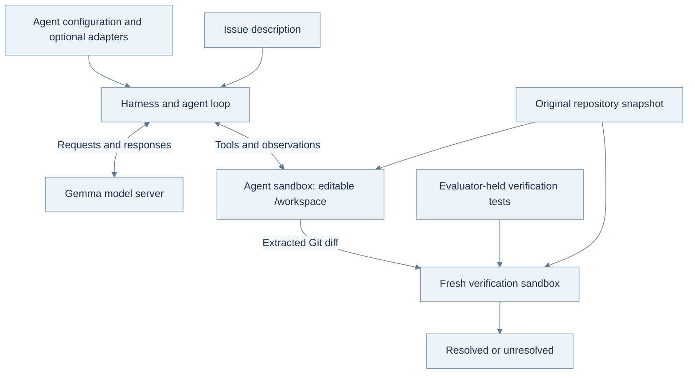

<style>
article .content table:not(.rouge-table) th,
article .content table:not(.rouge-table) td {
  white-space: normal;
  overflow-wrap: anywhere;
}
article .content .mermaid,
article .content .mermaid * {
  font-family: Arial, sans-serif !important;
}
@media (max-width: 600px) {
  article .content .table-wrapper { overflow-x: auto; }
  article .content table:not(.rouge-table) { min-width: 600px; }
  article .content table:not(.rouge-table) th,
  article .content table:not(.rouge-table) td { min-width: 110px; }
}
</style>

[한국어판 읽기]({{ site.baseurl }}/posts/Gemma-4-Developer-Agent-From-Issue-to-Verified-Patch-KR/)

## Start here: what this project is trying to build

The [Google — Gemma 4 Developer Agent Competition][competition] asks a practical question:
**can we turn a specified open language model into a system that fixes unfamiliar software
issues, reliably and within a time limit?** We build the agent's way of working. Kaggle
runs it on issues we have not seen, then checks the code changes it produces. The score
is the fraction of issues resolved under that evaluation.

This is an introduction to that project, from the software basics to a first experiment.
You can start with an ability to read simple Python; knowledge of agent frameworks or
model training is not assumed. By the end, the aim is to understand what we submit, what
happens during an attempt, why an attempt earns a point, and which experiment to run next.
The settings below are an unmeasured teaching example, separate from the project's actual
candidates. Competition details were checked on **September 25, 2026**.

**A few useful places to start.** These sources have different jobs; you do not need to
read them all before continuing.

- **What the competition asks:** [Kaggle overview and evaluation][competition], followed by the [data and harness guide][data] and [rules][rules]. These define the actual task and permitted submission.
- **Why an open model is relevant:** Google's [Gemma 4 announcement][gemma-launch]. Read it for the wider motivation; the competition selects one particular model and runtime.
- **Where repository-level evaluation comes from:** the [SWE-bench paper][swebench-paper] and [GitHub repository][swebench-code]. They explain the move from writing a function to repairing an existing project.
- **What a small coding agent looks like:** [mini-SWE-agent's documentation][mini-docs] and [GitHub][mini-code]. Follow one model–tool interaction before studying a large framework.
- **What we will actually configure:** the competition's [official evaluation packages][wheelhouse] and [ADK Agent Config documentation][adk]. The competition's restricted format takes precedence over general ADK examples.

### The three objects to keep separate

A **repository** is a software project's files and recorded versions: implementation,
tests, configuration and documentation. An **issue** describes behavior to change, such
as an error to fix or a missing feature. A **patch** records which lines or files changed
so that someone can apply the repair to another copy of the repository. In this article,
Git's textual representation of those changes is called a **diff**.

The participant, the agent and the evaluator each produce a different object.
We submit an **agent package**, containing configuration, instructions and any optional
learned adapters. When that agent receives an issue and a repository, it produces a
**patch**. The evaluator applies the patch to a fresh copy, runs its checks and produces
an **outcome**. A package can load correctly while every patch it generates fails. A
plausible patch can still fail verification. These are different steps toward the goal.


*Figure 1. The project has two loops. Inside one attempt, the agent reads, edits and checks
a repository. Between public development runs, we inspect failures and revise the agent.
Kaggle evaluates the submitted design on hidden issues; their reference answers do not
enter the agent's input. The numbered columns show responsibilities, not measured results.*

### If the model is fixed, what can we improve?

A language model generates a next response from the material currently provided to it.
That material does not automatically contain every file in a repository. An **agent**
adds instructions, tools and an execution loop: the model can request a file, inspect the
returned text, choose another action and eventually edit code. A **tool** carries out a
concrete operation such as reading a file or running a command. The organizer's
**harness** connects these pieces, prepares the working environment and enforces limits.

This leaves substantial design work even before training. We choose instructions that
help the model form a useful hypothesis, available tools that make relevant code easier
to find, a workflow that reacts to errors, and limits that leave time for verification.
Later, an optional learned adapter can change the model's behavior. Adding components is
useful only when they help complete more repairs under the same evaluation conditions.

Our route through the project follows from that objective. First, make one complete
attempt observable: input, actions, changed files, verdict and elapsed time. Then find
which failure repeatedly prevents a correct patch. Change one part of the agent and compare
it against the previous version on the same issues. Finally, check whether the gain survives
on issues kept out of development and whether the whole run fits the competition's budget.
Without that sequence, a better score may be difficult to explain or reproduce.

We will build this picture in order: one small bug, the reason for the competition,
the evaluator and score, then the research ideas that help design the agent. The later
sections turn that picture into files, commands and controlled experiments. The longer
code recipes are expandable, so they can be read when you reach the implementation.

## 1. A one-line bug can require a repository-sized investigation

Imagine opening a two-sentence bug report on a Monday morning: a user set a limit to
zero, but the application returned ten items. The repair may be one line, yet nobody has
identified which line to change. The agent receives the report and a repository, then
has to discover the cause. Here is the invented issue we will follow through the article:

> Setting a limit to zero unexpectedly restores the default limit. An omitted limit should
> use the default, but an explicit zero should remain zero.

The relevant implementation might contain:

```python
def normalize_limit(value, default=10):
    return value or default
```

Python treats both `None` and `0` as false in this expression. A plausible fix is:

```diff
 def normalize_limit(value, default=10):
-    return value or default
+    return default if value is None else value
```

In this diff, a line marked `-` is removed and a line marked `+` is added. The unchanged
function signature shows where the edit belongs. An executable test supplies an input
and checks the observed result against the required one.

If both snippets were already in the prompt, this would be a small Python question. In
repository work, the agent starts several steps earlier. Suppose the visible project is:

```text
example_service/
├── api/routes.py          # Receives the request
├── settings.py            # Supplies configured defaults
├── query/options.py       # Converts request options
├── query/limits.py        # Normalizes the limit
└── tests/test_options.py  # Exercises the public behavior
```

An agent could search for `limit`, obtain dozens of matches, and edit the first promising
one. It might insert a special case in `routes.py`. That could fix the web endpoint while
leaving the command-line entry point broken, because both eventually call `limits.py`.
Alternatively, it could change the shared helper too broadly and alter how empty strings
are handled, even though the report says nothing about strings.

The useful investigation follows the value. Where does the explicit zero enter? Where is
it converted? At what point does it become ten? Which layer owns the distinction between
an omitted value and a supplied value? The code search is serving a hypothesis about the
program, rather than producing a pile of text for the model to read.

A small behavioral table clarifies what the issue actually promises:

| Input to the helper | Current result | Required result under this invented issue |
|---|---:|---:|
| `None` | 10 | 10: the default applies. |
| `0` | 10 | 0: the explicit value must survive. |
| `5` | 5 | 5: ordinary values must keep working. |

The three rows have different jobs. Zero reproduces the defect. `None` checks that the
repair preserves the fallback. Five checks that an ordinary request has not changed.
If the repository allows other input types, their contract needs separate investigation;
the agent should not invent it from these three examples.

This also explains what makes a test useful. A check of `normalize_limit(5)` passes before
and after the repair. It provides a little regression evidence, but it cannot demonstrate
that the reported bug was fixed. The zero case should fail on the old implementation and
pass on the new one. A **regression test** records the behavior that must remain correct
after future changes.

The agent then needs to inspect the final diff. Did it change the helper it intended to
change? Did an unsuccessful edit leave the file untouched? Did it accidentally include a
temporary script? A final natural-language message saying "fixed" cannot answer those
questions. The patch is what another environment will receive.

Five terms help keep the rest of the system straight:

| Term | Its role in this competition |
|---|---|
| **Model** | Gemma generates the next reasoning step, tool call, or response. |
| **Agent** | The model together with instructions, tools, state, and a procedure for continuing the work. |
| **Tool** | An operation such as reading a file, running a command, or submitting the current changes. |
| **Harness** | The organizer's software that loads the agent, prepares tasks, enforces limits, and evaluates patches. |
| **Patch** | A Git diff describing changes relative to the prepared repository baseline. |

These terms describe a division of labor. The model proposes what to do. The agent loop
arranges for an allowed tool to do it and returns the observation to the model. The harness
decides which environment exists, how long the process can continue, and whether the patch
passes verification. Improving any one of these interfaces can change the final result.

A **trajectory** is the recorded sequence of messages, actions, and observations during
that process. It might show a search, two file reads, a failed reproduction, an edit, and a
successful test. When an agent fails, the trajectory lets us ask where its understanding
stopped matching the actual state of the repository.

That is why this competition is an interesting meeting point between machine learning and
software engineering. It rewards a system that repeatedly turns uncertain information
into a working change.

To see how the model uses a file tool, here is a shortened, **invented interaction**, not
a measured trajectory or the exact wire format:

```text
Input to the agent: the zero-limit issue and the current repository context.
Model requests: read_file(filepath="query/options.py", start_line=1, end_line=40).
Harness: reads that file in the sandbox and returns its text.
Tool observation includes: return normalize_limit(raw_limit)
Model requests: read_file(filepath="query/limits.py", start_line=1, end_line=40).
Tool observation includes: return value or default
Next useful action: check that this expression reproduces the zero case.
Agent runs a permitted focused check: normalize_limit(0) returns 10.
Agent requests a precise edit replacing the faulty return expression.
Tool reports success; a subsequent file read confirms the saved replacement.
Agent checks the zero, omitted-value and ordinary-value cases.
Agent requests submit_patch(); the harness extracts the code changes.
Separate verifier: applies that patch to a fresh copy and checks the task.
Illustrative outcome: resolved, if those independent verification checks pass.
```

The model does not directly inspect the disk. It emits a structured request that the
harness interprets. The resulting observation becomes part of the input for its next
decision. A tool error is also an observation; silently ignoring it breaks this feedback loop.

## 2. Why Google is asking for an open-model developer agent

A language model stores learned numerical parameters, often called **weights**.
**Inference** uses these weights and the current input to generate a response or choose an
action. The output is generated in tokens: units of text processing that can be word
fragments, punctuation or pieces of a code identifier.

Reading a new file changes the **context**, the working material available for the next
decision. It does not itself update the weights. **Training** changes learned parameters
using examples or a learning signal. An agent can investigate an issue over many tool calls
without retraining each time it reads another file.

This distinction gives us two paths to improvement. A prompt or tool change can help the
same weights use better evidence. Training can teach different behavior across many such
situations. We need to see which limitation is present before deciding between them.
The optional **LoRA adapter** introduced later is a compact set of learned weight changes,
not a replacement repository or a collection of answer patches.

An open-weight model makes those learned parameters available for running and adaptation.
This gives developers a different set of deployment choices from an application that can
only send requests to a hosted service. Google's April 2, 2026 [Gemma 4 announcement][gemma-launch]
presents an Apache 2.0 model family with reasoning and agent-oriented capabilities,
including function calling and structured output. The family includes several sizes;
the competition chooses one specific 31B variation from that broader release.

Here, **31B** describes the approximate parameter scale, not a number of files the model
can understand or steps it can take. **Instruction tuning** prepares a model to respond
to instructions. **Post-training** is further adaptation after the base model's initial
training; it can target a behavior such as producing valid tool calls or following a
useful debugging procedure. Instruction tuning is one form of post-training. These terms
describe aspects of model preparation, and none alone guarantees successful repository repair.

### 2.1 Local execution changes the possibilities, not the definition of success

Why care about running the model near the code? A developer may need control over where
source files are processed, want a reproducible model version, need to operate without a
reliable connection, or want to specialize the system for a particular workflow. Those
are practical motivations for a local agent. They are not automatic guarantees of privacy,
low cost, or speed: the tools and logs still determine where data goes, while hardware
and workload determine runtime.

Google's [AI Edge article][gemma-edge] illustrates the broader ambition with small Gemma
models and on-device actions. Its E2B/E4B examples should not be read as measurements of
this competition's 31B system. Likewise, the [general model card][gemma-card] describes
a 256K context for the 31B model, while Kaggle's serving contract uses 32,768 tokens. The
article about the family tells us why the technology is interesting; the competition
contract tells us what will actually be evaluated.

The organizers' stated purpose is to advance open agents that navigate code and draft
repairs, with human developers retaining roles such as architecture and review. The
competition promotes fine-tuning and reinforcement learning, but **an adapter is optional
in the submission format**. A no-training agent is therefore a useful starting point:
it tells us what the fixed model can already do before we attribute a later gain to
learning. [Competition overview and model rule][competition]

Holding the base model fixed also makes a research question unusually clear. We can change
what information the model sees, which procedure it follows, and what allowed adaptation
it uses. We can then ask whether those changes recover issues within a shared deployment
budget. Training resources can still differ across teams, so the contest is not a guarantee
of equal experimental resources. The restriction makes the deployed system more specific.

### 2.2 A patch score is one useful measurement of a larger ambition

It is easy to slide from "this agent passed more tests" to "this agent makes every developer
faster." Those are different measurements. A benchmark supplies a defined task and
automated criterion. A developer also spends time interpreting requirements, reviewing
changes, coordinating with others, and maintaining the software later.

METR's [July 2025 study][metr-2025] makes the measurement problem concrete. In its particular
randomized study of 16 experienced open-source developers and 246 tasks, access to the
early-2025 tools studied increased completion time by 19%. That was a result for a defined
population, tool generation, and workflow, not a permanent verdict on AI assistance.

The same research group's [February 2026 update][metr-2026] is important context. It says
its newer experiment was affected by selection problems, including developers and tasks
being withheld from conditions that disallowed AI. The authors considered their newer
estimate an unreliable measure of the current productivity effect. Taking either headline
as a universal answer would erase what the studies actually measured.

For this competition, I would keep the claim narrow and useful: a resolved issue shows
that the submitted system produced a patch accepted by that evaluator. Raising that rate
is meaningful progress toward a dependable coding assistant. Establishing its effect on
human engineering work would require additional evidence.

## 3. Follow one issue through the evaluator

A public development task identifies a repository and a `base_commit`: the historical
version of that repository immediately before the reference fix. Its `problem_statement`
describes the work to do. Optional `hints_text` can supply additional issue context.

The agent works in a prepared repository at `/workspace`. The snapshot retains enough Git
state for ordinary inspection and diff generation, while future commits containing the fix
have been removed. The public development records also contain a reference `patch` and
`test_patch`; these support training and local verification. **They are not answers to pass
into the agent during a held-out evaluation.** The hidden scoring tasks do not expose their
reference fix or verification tests to the agent. [Dataset specification][data]

The documented evaluation uses separate environments for producing and checking a patch:



*Figure 2. The execution boundaries around one repair. The harness connects Gemma's
requests to tools in the editable repository sandbox. The resulting Git diff is checked
on a fresh baseline with evaluator-held tests. The model server and the repository sandbox
have separate resource limits. This is a schematic, not a measurement of performance.*

The agent repeats a practical loop: inspect the code, form a hypothesis, edit, run a
focused check, and use the observation to decide what to do next. That loop belongs to the
patch-generation attempt. The fresh verifier later asks whether the extracted patch works
without the agent's running process or temporary environment.

In the first environment, the agent explores and edits. The released `submit_patch()`
tool makes untracked files visible to Git and first tries to capture a binary-capable diff
against the prepared baseline:

```bash
git add -N .
git diff --binary _swegemma_baseline
```

If that named baseline is unavailable, the tool falls back to `git diff --binary HEAD`.
The first command does not create a commit; it lets new files appear in the diff. This is
why a temporary reproduction script left in the repository can accidentally become part
of the submitted patch. [Released patch-extraction source][wheelhouse]

In the second environment, the harness applies that patch to a fresh baseline, restores
protected test and runner-configuration files that the agent might have changed, applies the evaluator's
`test_patch`, and runs the selected tests. The released verification code derives its
pytest targets from the test patch. The dataset's account of how reference solutions were
curated also discusses whole-suite checks; that curation step and the per-task grading
procedure are distinct. The released verifier also checks that the test run produced a valid,
nonempty test result; a successful process exit alone is insufficient.
[Harness guide][data] and [released verification source][wheelhouse]

It helps to distinguish the checks the agent can use from the checks that assign the
score. **Existing repository tests** describe behavior already covered by the project.
The agent may inspect them and, where the task's execution rules allow, run them. It can
also make a **focused check** for its current hypothesis: in our zero-limit example, an
assertion that an explicit zero remains zero. These checks help the agent choose a repair.

The **evaluator's verification tests** answer a different question: does the final patch
satisfy the held-out grading criterion? The harness supplies them to the fresh verification
environment. They are not a test oracle the hidden-task agent can repeatedly query while
choosing its patch. In public development, we can study the supplied reference material
for tasks assigned to development; we keep it out of the agent's inputs when measuring
performance on tasks reserved for evaluation. Passing an agent's own check is encouraging,
but the later evaluator outcome is what counts toward the score.

Two practical consequences follow. First, altering test expectations cannot substitute for
fixing the implementation: the targeted verification files are restored before grading.
Second, success should be reproducible from the extracted patch alone. An in-memory change,
a package installed interactively, or an unrecorded environment adjustment is not a reliable
solution artifact.

## 4. What earns a point

For an evaluation split with $N$ tasks, define $r_i=1$ when the submitted patch resolves task
$i$ under the verifier, and $r_i=0$ otherwise. The score is the resolution rate:

$$
\mathrm{Score}=\frac{1}{N}\sum_{i=1}^{N}r_i.
$$

A task is resolved when its verification run succeeds. There is no separate leaderboard
reward for a convincing explanation, a useful intermediate observation, or passing most of
the selected tests. Multiplying the fraction above by 100 expresses it as a percentage.
[Evaluation definition][competition]

For example, on an **illustrative** split of 60 tasks, 9 resolved tasks give
$9/60=0.15$. Resolving one additional task changes that score by about 0.0167. The organizers
describe approximately 120 hidden tasks split evenly between Public and Private; the
60-task example is arithmetic, not a claim that the final split size has been fixed at 60.

This metric makes reliability a direct source of performance. Suppose an agent locates a
bug correctly but a malformed edit request prevents the change from reaching disk. Improving
the edit procedure can recover that task without changing the model's understanding.
Likewise, excessive investigation on one task can reduce the time available for later tasks.

It helps to distinguish three observations in a local run:

| Observation | What it establishes |
|---|---|
| The agent session ended | The control loop stopped. |
| A nonempty patch was extracted | There are changes that can be sent to verification. |
| Verification passed | This task earned a resolved result under this evaluation. |

Only the last observation is the competition objective. The other two explain where work
was lost. An agent timeout may still leave a patch that the local harness recovers and
verifies, so runtime status and resolved status should both be retained.

The Public leaderboard uses roughly half the hidden test data. Final placement uses the
other half. A change selected repeatedly because it improves the Public score can therefore
be a poor choice for the final set. The public development tasks are where I want to explain
an improvement before using a scarce leaderboard submission to test whether it transfers.

### 4.1 Reliability accumulates across the whole attempt

A repair can fail during search, editing or checking even when the other steps look
good. The final score depends on making the whole sequence work. The calculation below
puts that familiar idea into probabilities; it is optional for following the first run.

<details markdown="1">
<summary>Optional: why several fairly reliable steps can still produce a low success rate</summary>

Consider an illustrative four-stage agent: it finds the relevant location, makes an
appropriate change, carries out the edit correctly, and produces a patch accepted by
fresh verification. Let $A_j$ mean that stage $j$ succeeds and $S$ mean that all four succeed.
The probability of completing this workflow can be written as:

$$
\begin{aligned}
\Pr(S)={}&\Pr(A_1)\,\Pr(A_2\mid A_1)\\
&\times\Pr(A_3\mid A_1\cap A_2)\\
&\times\Pr(A_4\mid A_1\cap A_2\cap A_3).
\end{aligned}
$$

The vertical bar means "given that": each factor measures success **among attempts that
completed the preceding stages**. This is the probability chain rule, so it does not
assume that failures at different stages are independent. The stages are a diagnostic
model of this illustrated workflow; Kaggle does not award separate points for them.

Suppose each conditional success rate is an illustrative 0.8. Then $0.8^4=0.4096$,
or about 41%. Out of 100 starting attempts, about 80 complete the first stage, 64 the
second, 51 the third, and 41 all four. These are invented numbers, not measurements of Gemma.

The example shows why a model that often seems to understand the issue can still have a
disappointing final score. Several opportunities to fail sit between understanding and
verification. It also explains why traces matter: without them, a lower score does not
tell us whether to improve localization, edit syntax, testing, or stopping.

</details>

This is a **behavioral** test, not a requirement to reproduce the reference patch byte for
byte. A different implementation can pass if it satisfies the verifier. The converse
boundary matters too: an automated test suite checks the behaviors it exercises, not
every property a human maintainer might care about. We should aim for a faithful repair
of the issue rather than treating the tests as permission to damage untested behavior.

Repeated attempts also need careful interpretation. If a local experiment generates ten
patches and uses the reference tests to select the passing one, it has given the selector
information that the competition agent does not have. Trying alternatives inside a task
can be useful, but it must fit the real time budget and choose using information available
to the agent. This is why a paper's multi-sample result cannot simply be adopted as this
agent's expected resolution rate.

## 5. How code generation became repository work

We now have a concrete task and a definition of success. The research is useful because
each project studies one part of that picture: whether generated code works, how actions
produce new evidence, how repository context is found, or how the agent uses a computer.
Read the following as a map of design questions. The studies use different models, datasets
and budgets, so their headline scores are not a ranking for this competition.

### 5.1 First, judge code by running it

In *Evaluating Large Language Models Trained on Code* (2021), Chen and colleagues introduced
the code-trained Codex model and HumanEval. HumanEval gives a model a Python function
specification and checks its generated implementation with tests. The important idea for
our purposes is **functional correctness**: two pieces of code can look different and
still compute the right result. Conversely, code that looks convincing can fail when run.
[Paper][humaneval-paper] · [HumanEval GitHub][humaneval-code]

The paper also considers multiple sampled answers. Finding a correct answer somewhere
among several candidates is a different achievement from producing a correct first
answer. That distinction also explains the retry and candidate-selection choices discussed earlier.
But a function-completion problem still tells the system roughly where its answer belongs.
Our opening bug report did not. Someone first had to discover the helper.

### 5.2 Then, let an action change the next decision

*ReAct: Synergizing Reasoning and Acting in Language Models* appeared as a 2022 preprint
and an ICLR 2023 paper. Its central pattern alternates reasoning, actions, and observations:
the model acts, learns something from the result, and decides what to do next. Its original
experiments were not this repository-repair task, but the mechanism gives us a useful way
to understand a coding agent. [Paper][react-paper] · [Authors' examples][react-project]

In our limit example, reading the request handler could reveal that zero survives parsing.
The next search should then move downstream. If the agent continues rewriting the parser,
it is ignoring the observation that should have changed its diagnosis. The value of the
loop comes from updating the plan with evidence. A long explanation between every pair of
commands is not the essential ingredient.

### 5.3 Move the problem into an existing repository

*SWE-bench: Can Language Models Resolve Real-World GitHub Issues?* began as a 2023 preprint
and was presented at ICLR 2024. It constructs tasks from issues, historical repository
states, and human changes, then uses execution to evaluate generated repairs. The system
must understand and modify software that already exists. The challenge now includes
finding the relevant code and respecting its surrounding behavior.
[Paper][swebench-paper] · [Benchmark GitHub][swebench-code]

That structure explains the Gemma data bundle: an issue alone is insufficient without the
right repository version, and a patch alone is insufficient without a way to verify it.
The competition explicitly invokes a SWE-bench-like pass/fail approach. Its particular
tasks and verification procedure still come from Kaggle's own specification; importing a
score or test rule from another SWE-bench variant would answer a different question.

### 5.4 Make the computer interface easier for the model to use

*SWE-agent: Agent-Computer Interfaces Enable Automated Software Engineering* (2024) studies
the interface between model and computer. Search summaries, bounded file views, editing
feedback, and history management affect whether an agent can carry out a repair. An
excellent diagnosis is of little help if the next edit is malformed or the useful search
match disappears in a huge observation. [Paper][sweagent-paper] · [Project GitHub][sweagent-code]

This is directly relevant to the questions we can test here. Should a tool return a whole
file or a focused range? Should the agent edit a short matching string or rewrite a large
module? What does it see after a command fails? The historical paper does not choose the
best settings for Gemma; it shows why interface choices belong in the experiment.

### 5.5 Separate decisions from the environment that executes them

The OpenHands paper, first released in 2024 and accepted at ICLR 2025, describes a broader
platform with an agent, runtime, actions, observations, skills, and delegation. Its
architecture makes a useful distinction: deciding to run a command and actually executing
that command are separate responsibilities. [Paper][openhands-paper] · [Project GitHub][openhands-code]

Gemma's competition harness is its own system, not OpenHands. Nevertheless, this separation
helps diagnose failures. A model can request an appropriate test while the runtime cannot
import a dependency. It can also run every tool successfully and repair the wrong behavior.
Those failures need different interventions. OpenHands' broader browser and development
capabilities do not automatically exist in this competition's offline sandbox.

### 5.6 Ask how much machinery is really helping

The mini-SWE-agent project, publicly released in 2025, makes a small, inspectable control
loop a deliberate design goal. Its documentation emphasizes a simple interaction pattern
and readable trajectories. It provides a useful implementation to study when a complex
agent framework makes it difficult to see what the model actually received and did.
[Documentation][mini-docs] · [GitHub][mini-code]

There is a related lesson in *Agentless: Demystifying LLM-based Software Engineering
Agents* (2024). It explores a prescribed sequence of localization, repair, and validation
rather than letting the model freely choose every next action. The two projects are not
the same design. Together, they give us a productive question: which decisions need model
judgment, and which can be made reliably by a simpler procedure?
[Agentless paper][agentless-paper] · [GitHub][agentless-code]

None of these projects is a drop-in Kaggle submission. Their value is to make the design
space visible. A baseline can be simple while still being a serious research control.
Additional agents, memory, retrieval, or training should earn their place through the
tasks they help resolve.

## 6. What the development data gives us

The word **public** is used in two different ways here. Downloadable development data
is public material we can inspect. The **Public leaderboard** displays a score, but that
does not make its underlying issues or answers available as development examples.

| Name | What the participant can see | What it is for |
|---|---|---|
| Public development data | Released issues, repository snapshots and reference material. | Build and debug the agent; reserve local evaluation tasks before tuning. |
| Public leaderboard split | A score from part of the hidden evaluation; not its task answers. | Limited feedback during the competition. |
| Private leaderboard split | Hidden evaluation used for final ranking. | Judge the submitted design on the final scoring split. |

Within the development data, we also need a local separation of roles. We may use a
training portion to learn weights, a development portion to choose prompts or settings,
and a **holdout** kept aside for a later check. Even if we train no weights, repeated prompt
selection is still development: we are learning which design works on the examples we see.
A holdout is useful because it asks whether that choice works on examples we did not use
to make it. It becomes less informative when we keep consulting it and adjusting to it.

The goal is not to memorize the 129 released repairs. They give us inspectable examples
of a much larger procedure: understanding a project, locating a fault, editing safely and
checking the result. The hidden evaluation asks that procedure to work on other issues.
This is why the distribution of the practice problems matters.

The data page lists **129 public development tasks**, 782 files, and approximately 22.42 GB.
The repositories are FastAPI, Rich, Requests, and HTTPX. Each task has a frozen repository
snapshot, with code graphs and node embeddings supplied to assist navigation. [Data page][data]

Reading the downloaded `tasks.jsonl` gives the following distribution:

| Repository | What the project does | Tasks | Share |
|---|---|---:|---:|
| `fastapi/fastapi` | [A framework for building web APIs][fastapi-docs]. | 67 | 51.9% |
| `Textualize/rich` | [Formats text, tables, and other output in a terminal][rich-code]. | 48 | 37.2% |
| `psf/requests` | [An HTTP client for making web requests from Python][requests-docs]. | 13 | 10.1% |
| `encode/httpx` | [An HTTP client supporting synchronous and asynchronous use][httpx-docs]. | 1 | 0.8% |
| **Total** | | **129** | **100.0%** |

FastAPI and Rich account for 115 of the 129 tasks, about 89%. The four repository names
therefore do not describe four equally represented validation populations. Even a reader
who has never used these projects can see the consequence: a method that happens to suit
the two largest groups can dominate the average while adding little evidence about the
smaller groups.


*Figure 3. Public development task composition. FastAPI and Rich account for 115 of 129
tasks (89.1%). This distribution does not describe the hidden repositories. Source: the
released task inventory checked on September 25, 2026. [Dataset][data]*

For someone coming from a conventional Kaggle competition, the data format is another
important change. A row is an executable work assignment. It does not just contain input
features and a target value. To evaluate the row, we need its historical program, the
dependencies needed to run it, and the tests that distinguish a repair from a failure.
That is why a dataset with only 129 tasks can contain many gigabytes of files.

### 6.1 A real development issue: the order of two parameters

The public record `fastapi_11194`, also used in the later command example, concerns an
endpoint accepting both a file and a form field. A web **endpoint** is a function that
handles a particular kind of request. A form field might contain a name; a file field
might contain an uploaded document.

The supplied description reports that putting the `Form` parameter before the `File`
parameter causes a validation error with response code 422, whereas declaring the file
first avoids it. It also calls for coverage of multiple files and parameter-order
independence. The [public pull request][fastapi-example] corroborates that description.
This is an actual task description; the investigation below is my proposed approach,
not a reproduction of a model run.

The desired behavior is easy to explain to a user: rearranging the declaration of these
inputs should not change whether an otherwise valid upload works. The implementation
question is more subtle. Does the ordering affect the description of the request body,
the extraction of individual fields, or validation after extraction? Which assumption
about the first parameter could incorrectly affect later parameters?

My first two observations would be the existing file/form tests and the code that turns
endpoint parameters into request-processing behavior. A compact reproduction would compare
the two parameter orders with equivalent input. I would inspect the returned validation
details before deciding which layer to edit. That approach derives a search strategy
from the symptom instead of using the reference patch to reveal the repair location.

The task is now explicitly part of this article's development examples, so its later
success should not be counted as untouched holdout evidence. The repository snapshot in
the dataset remains the evaluation starting point; today's upstream source may already
contain changes made long after that snapshot.

### 6.2 What is inside the task bundle

| Resource | What to use it for |
|---|---|
| `tasks.jsonl` | Issue descriptions, repository identities, base commits, reference fixes, and verification patches. |
| `snapshots/<instance_id>.tgz` | Recreate the exact code the agent is supposed to repair. |
| `graphs/` | Look up relationships among indexed code symbols. |
| `embeddings/` | Retrieve symbols similar to an existing indexed symbol. |
| `wheels/` | Install historical repository dependencies without network access inside the sandbox. |
| `docker/` and `sandbox/` | Prepare the repository execution environment. |
| `sample_submission/` | Inspect the organizer's configuration conventions. |
| `HARNESS_README.md` | Understand the intended execution and submission contract. |

The `.jsonl` suffix means one JSON object per line. A development record contains several
different kinds of information, and separating them early prevents evaluation mistakes:

| Information | Examples | Role |
|---|---|---|
| Task input and identity | `instance_id`, `repo`, `base_commit`, `problem_statement`, `hints_text` | Identify and present the issue. |
| Reference solution | `patch` | Study or train on solutions within the chosen training partition. |
| Verification material | `test_patch` | Check whether a generated solution resolves the task. |
| Contextual metadata | `created_at` | Analyze chronology and construct development splits. |

Reference fixes can support training and error analysis. For held-out evaluation, choose
the partition before using its patches or trajectories to tune the agent, and keep that
solution material on the evaluator side. In the downloaded public records, every
`hints_text` is empty, even though the schema permits hints; the baseline should work from
the issue and repository without depending on extra comments.

The target population also matters. The hidden tasks were curated from **private
repositories**, whereas the development tasks come from four public projects. Learning
general repository navigation and debugging behavior is more likely to transfer than
encoding assumptions about one familiar project's directory layout.

Here, **generalization** means that a useful behavior survives that change of setting.
"Trace the input through its callers before editing a shared helper" is a procedure that
could apply to another project. "The answer to this type of issue is always in this named
file" may only exploit familiarity with a public repository. A benchmark improvement is
more persuasive when the evidence suggests the first kind of learning.

### 6.3 Graphs provide a view of the code

An abstract syntax tree, or AST, represents the syntactic structure of a program. A code
graph adds relationships among entities such as functions and classes. These can help an
agent move from a suspicious helper to its callers without reading every source file.

The three graph tools are `get_code_neighbors`, `get_code_subgraph`, and
`search_similar_code`. The last name deserves attention: in the supplied implementation,
the query is resolved against **existing symbol keys or suffixes** in the embedding archive.
It does not run a fresh neural embedding model on an arbitrary English issue description.
Start with a symbol such as `HTTPConnection`, then retrieve similar indexed code.

In the invented limit example, a graph might connect `parse_options` to `normalize_limit`
and show several other callers of the same helper. That would make the risk of a shared
change visible. An **embedding** represents an indexed code item as a vector of numbers;
similarity search compares such representations to find nearby items. Similarity does
not establish that an item causes the bug. It suggests where to inspect next.

There is also a difference between a static map and a running program. Python can choose
functions dynamically, generate attributes, or dispatch through wrappers. A graph can
therefore guide navigation without containing every relationship that matters at runtime.
The source and an appropriate execution check remain part of the investigation.

The development data currently has a known area to audit. The competition file listing
checked for this article reports 129 zero-byte entries in `graphs/` and another 129 in
`embeddings/`. A [participant investigation][graph-discussion] attributes the empty copies
to the handling of task-name and commit-name hard links, and also reports missing async
functions. The empty-file sizes were checked against the live listing for this article; the
async coverage measurements remain attributed to that participant. The host has acknowledged
the report and is investigating.

That makes a useful first design requirement: **the agent must still navigate when graph
lookup fails or an expected symbol is absent.** Ordinary file inspection, text search, and
Python's own AST parser remain useful. Preserve the original downloaded data when diagnosing
an issue, and keep any local repair separate so the comparison records which data it used.

## 7. The constraints become part of the algorithm

The current [competition model rule][competition] permits one specific model:

```text
gemma-4-31b-it-qat-w4a16-ct
```

Every model-backed agent and subagent must use that model. The harness registry contains
other model aliases, but the existence of an alias in a library does not make it eligible
for this competition. The stated variant uses four-bit weights and sixteen-bit activations;
the organizer supplies the base model during hosted evaluation.

The long checkpoint name is worth decoding once. `it` denotes instruction tuning; `qat`
denotes quantization-aware training; `w4a16` describes the four-bit weight and sixteen-bit
activation format; `ct` refers to compressed-tensors packaging. **Quantization** stores
some numerical values at lower precision to reduce resource requirements. It is a
representation choice, not permission to swap in a different small model. The exact
checkpoint still matters when loading an adapter or reproducing an experiment.
[Permitted model files][model]

| Constraint | Consequence for the first implementation |
|---|---|
| Four L4 GPUs, 96 GB aggregate VRAM | The hosted runtime is a specific GPU environment; local timing on other hardware needs separate interpretation. |
| 32,768-token context | Instructions, observations, reasoning, and output must share the available context. Read selectively. |
| Total unpacked submission below 3 GiB | Package configurations and optional adapters; do not include a full base-model download. |
| Offline task sandbox | Depend on the supplied environment and wheels, not a network install during a task. |
| Docker sandbox: 4 GiB RAM and 2 vCPUs | Broad test runs and large analysis processes can exhaust resources independently of model inference. |
| Restricted declarative agent configuration | Use registered tools and sandboxed skills instead of an arbitrary host-side Python entrypoint. |
| Twelve hours for all patch generation | Budget across tasks, including sandbox setup; verification time is excluded from this stated limit. |

These specifications come from the [harness guide][data]. Some defaults in that guide describe
the reusable local library; the hosted scorer has its own integration. Where they differ,
the distinction needs to remain visible.

GPU memory and the repository sandbox's RAM are separate limits. The model server performs
inference on the GPUs. The agent's command that imports a package or runs pytest executes
inside the repository environment. Giving the model server more memory does not make a
memory-hungry test process fit in its four-GiB sandbox.

The model also needs memory beyond its stored weights. While generating a response, it
keeps attention state for the current sequence, commonly called the **KV cache**. The
PagedAttention paper explains how managing that growing state in blocks can reduce memory
waste; vLLM provides a serving system around this class of problem. This is why "the
weights fit" does not imply "any history length or number of simultaneous requests fits."
[PagedAttention paper][pagedattention-paper]

For our agent, context is its current working material: instructions, issue text, relevant
code, observations, and room for the next output. An old file dump occupies space even
after it stops helping the investigation. Good context management means preserving the
facts that change the next decision, such as the current call path or a disproved hypothesis.

### 7.1 There are two clocks

The local agent-session timer begins after preparation of the task environment. The hosted
12-hour limit includes that preparation. Reducing the per-task agent timeout therefore
controls only part of the total duration.

In a [host reply checked on September 25][runtime-discussion], Kaggle states that hidden
tasks run sequentially. At that time, exhausting the global limit produces a submission
error. The host plans to change the behavior so unfinished tasks receive zero, but the reply
does not establish that the change is already deployed.

A useful accounting equation for sequential patch generation is:

$$
\begin{aligned}
T_{\mathrm{gen}}&=h+\sum_{i=1}^{N}(s_i+a_i)\\
&\leq720\ \text{minutes}.
\end{aligned}
$$

The right side is the twelve-hour generation budget. The left side separates the time
we need to measure:

| Symbol | Meaning | What to record |
|---|---|---|
| $N$ | Number of tasks in the run. | The fixed task manifest, including failures. |
| $a_i$ | Actual agent-session time for task $i$. | Session start and end; also retain the configured timeout. |
| $s_i$ | Preparation and other counted overhead belonging to task $i$. | Setup and cleanup intervals, with retries where applicable. |
| $h$ | Shared overhead counted by the global timer. | Count it once, outside the task intervals. |
| $T_{\mathrm{gen}}$ | Total counted patch-generation time. | The complete run's timer, checked against the component records. |

Intervals should not overlap in the accounting. Verification time is outside this stated
generation budget; adding it to the left side would answer a different timing question.

For a planning calculation with 120 tasks, $720/120=6$ minutes per task **including setup**.
This is an average allocation, not an official per-task allowance. A three-minute agent
limit would account for up to 360 minutes of agent-session time across those 120 tasks,
leaving a nominal 360 minutes for setup and other counted overhead. Actual startup, retries,
cleanup, task count, and timeout enforcement must still be measured. A per-task setting
alone cannot certify that the complete submission fits.


*Figure 4. Agent work and setup share the generation budget. Each bar assumes 120
sequential tasks using their full agent allowance. At three minutes per task, 360 minutes
remain for setup and other counted overhead. At six minutes, none remain. Verification is
excluded. This is planning arithmetic, not a runtime measurement.*

<details markdown="1">
<summary>Optional: express the time-allocation problem mathematically</summary>

The general optimization problem is to spend effort where it increases expected resolved
tasks. If $p_i(t_i)$ is the probability of resolving task $i$ after spending $t_i$ time and
$s_i$ is its counted per-task overhead, a useful planning model is:

$$
\begin{gathered}
\max_{t_1,\ldots,t_N}\quad \sum_i p_i(t_i)\\
\text{subject to}\\
h+\sum_i(s_i+t_i)\leq720\ \text{minutes}.
\end{gathered}
$$

Here $t_i$ is a planned agent-time allocation, while $a_i$ above is time actually observed.
The probability curve belongs to a particular agent and runtime; it is not a property of
the issue alone. We do not know these curves at the start. Fixed, moderate limits are a
measurable baseline. More elaborate decisions about continuing or stopping should come from observed
trajectories and their marginal value.

</details>

In ordinary language, the question is whether the next minute is likely to buy a useful
observation or repair. An agent one targeted test away from confirming a plausible change
is in a different position from one repeating a search that has already failed. The
challenge is recognizing the difference from information available during the run.
We should not label a task "easy" using a reference answer that the deployed agent cannot see.

### 7.2 Tool outputs are also a budget

The guide documents default command output truncation at 5,000 characters and `read_file`
limits of 150 lines and 10,000 characters. Printing an entire repository does not put that
repository into context. It produces a truncated observation and consumes time.

An agent should narrow the search, inspect the relevant slice, and ask for the next slice
when necessary. Its internal summary should preserve file locations, the current hypothesis,
changes made, and checks already run. Automatic context compaction can help a long session
continue, but it cannot choose which debugging facts the agent should have made explicit.

## 8. Before the first model run: learn what one task asks of you

It is tempting to start by downloading weights and launching a training job. That makes
the first interesting output a GPU log, even though several cheaper questions remain
unanswered. I would begin by learning the task as a developer, then make sure the evaluator
can distinguish a broken repository from a repaired one.

### 8.1 Choose the practice issue before looking at solutions

First reserve a small set of tasks for hands-on exploration. These become development
examples: once we inspect their answers or repeatedly adjust a prompt around them, their
later success is no longer an independent test of the agent. Keep a separate holdout for
later evaluation. A **holdout** is simply a group of issues whose solutions and results
are kept out of the design loop until a candidate is ready to assess.

Select practice issues using their identities and available descriptions, not a baseline's
eventual successes. Check that their snapshots and dependencies exist. With only one HTTPX
task in this release, a supposedly balanced plan of three tasks from each repository is
impossible. Let the actual inventory determine the plan, and record which repositories
the practice set represents.

Read one practice issue without opening its reference patch. Write down three things in
plain English: what currently happens, what should happen, and what observation would
distinguish the two. If those are unclear, the model will face the same ambiguity. Some
issues request a new behavior instead of reporting a simple exception; an agent needs to
infer the intended API change from the task, not assume every issue is a crashing test.

Then inspect the repository's top-level layout, dependency metadata, and nearby test style.
A stack trace gives a route into code. An API name gives a search term. A prose description
of formatting may require finding the rendering path. Record how you located the relevant
implementation. This short manual exercise reveals what useful model observations should
look like before any prompt is tuned.

### 8.2 Establish a negative and a positive control

An experiment needs a check that should fail and a check that should pass. On a selected
development issue, the unchanged repository and the supplied reference repair provide
useful starting controls. Use the official task-verification path to examine both, with
the reference material kept on the grader side.

| Control | Intended observation | What an unexpected result would make me inspect |
|---|---|---|
| Unchanged repository, with the issue's verification tests | The issue is not resolved. | Whether the tests exercise the reported behavior and whether the correct snapshot was loaded. |
| Reference patch on a fresh copy, with the same verification tests | The issue is resolved. | Dependency versions, patch application, test selection, and environment reconstruction. |
| Agent patch on another fresh copy | An independently determined pass or fail. | The actual changed code and the verifier output. |

These are diagnostic expectations, not a guarantee that every public record will behave
perfectly in every local setup. If the reference repair cannot pass, preserve the failure
and investigate it before treating that task as evidence against the model. If an unchanged
repository passes unexpectedly, a later agent pass might not mean what we think it means.
Controls do not repair evaluation defects automatically; they reveal where to look.

Only after your unaided exploration should you open the practice issue's reference patch.
Compare its location and scope with your hypothesis. The valuable lesson may be that the
change lives in a shared abstraction rather than the visible caller. Keep that lesson
general when designing the agent. A prompt that embeds the answer's exact filename has
turned this practice task into an answer lookup.

### 8.3 Separate three kinds of preparation

There are useful tasks at three different resource levels:

1. **On a normal CPU machine:** understand the rules, inspect task metadata, choose the
   evaluation partitions, write the agent configuration, and check the archive layout.
2. **With Docker and the prepared data:** inspect whether a repository snapshot and its
   tests can be reconstructed. The repository's test process is separate from model inference.
3. **On a compatible GPU host:** serve the fixed model and exercise the complete agent loop.

The order prevents an expensive model run from becoming the first time we discover that
a snapshot is missing or a dependency cannot be installed. It also gives a beginner useful
work to do before access to four GPUs has been arranged.

The first GPU session should answer operational questions: can the model call the tools,
can the harness extract the patch, and how much time does each stage take? Start with one
issue, then two or three preselected development issues whose traces can all be read.
Once the path works, a panel of roughly 8–12 issues can expose timing and failure patterns
before a broader quality comparison. These are planning sizes, conditional on the frozen
split and available compute, not statistically reliable evaluations.

By the end of this preparation, we should be able to explain one task without reciting
its answer, identify the experiment's task set, and tell what a valid evaluation result
looks like. Those are more useful prerequisites for training than a folder full of
unexamined model outputs.

## 9. Build a baseline whose behavior is easy to inspect

We will ask the first agent to follow this loop. Its trace will tell us whether it actually does:

1. Translate the issue into a concrete expected behavior.
2. Locate the implementation and relevant existing tests.
3. Reproduce the failure with a focused check when feasible.
4. Make the smallest change supported by the evidence.
5. Test the changed behavior and nearby behavior likely to regress.
6. Review the diff, remove scratch files, and submit the patch.

Google's Agent Development Kit, or **ADK**, supplies the agent abstractions used by the
competition's restricted configuration compiler. An `LlmAgent` is its model-backed agent
type. One `LlmAgent` is sufficient to express this loop. Starting with one model-backed worker
also makes it possible to identify whether failures originate in navigation, reasoning,
editing, testing, or stopping. A team of agents can be introduced after there is a baseline
against which to measure its additional work.

The initial package below has no adapter declaration. This matters because the supplied
sample demonstrates multi-LoRA routing and names example adapters. Copying those declarations
without providing the corresponding weights would not produce a clean no-adapter baseline.

Before creating files, connect each file to a decision in the diagram. **YAML** is a
text format for naming settings and nested objects. In this competition, those settings
tell the harness which supported agent and tools to construct. A prompt file supplies
instructions to the model; it is not Python that runs independently on the host.

| Design choice | Where the example expresses it | What to look for in the run |
|---|---|---|
| Ask for evidence before editing. | `agent/prompts/system.md` | Does the trace connect the proposed change to a reproduced or inspected behavior? |
| Give the agent ways to inspect and change files. | The registered tools in `agent/agent.yaml` | Do tool calls succeed, and does the agent use their returned observations? |
| Bound the work spent on each issue. | `agent/eval_config.yaml` for hosted evaluation; explicit flags for the local CLI. | Actual tool counts and elapsed time, not just the written settings. |
| Adapt behavior through learning, if later justified. | An optional adapter declaration and its weight files. | A held-out comparison with and without that adapter under the same runtime. |

A **baseline** is the reference version against which we judge later changes. Its first
job is to be understandable and repeatable. If we add a second agent, a graph tool and an
adapter all at once, a changed result will not tell us which addition helped. The small
package below gives us a starting point from which those questions can be tested separately.

### 9.1 Create the files on a CPU machine

This part needs a text editor and Python 3. It does not load model weights. Create a new
project directory:

```bash
mkdir -p gemma4-start/agent/prompts gemma4-start/data gemma4-start/results
cd gemma4-start
```

All later relative paths are measured from this project directory. Its layout will be:

```text
gemma4-start/
├── agent/
│   ├── agent.yaml
│   ├── eval_config.yaml
│   └── prompts/
│       └── system.md
├── build_submission.py
├── data/                 # Development data; keep outside the agent archive
└── results/              # Local evaluation results; keep outside the archive
```

Save the following as `agent/agent.yaml`:

```yaml
name: repository_fixer
model: gemma-4-31b-it-qat-w4a16-ct
instruction: !include prompts/system.md
tools:
  - run_command
  - read_file
  - edit_file
  - write_file
  - get_status
  - submit_patch
generate_content_config:
  temperature: 0.2
  max_output_tokens: 8192
  thinking_config:
    include_thoughts: false
```

YAML uses indentation to express structure. `instruction` loads a text file relative to the
configuration file containing `!include`. The six tools here are the basic workspace and
lifecycle tools. Graph tools can be added as a controlled variation after the basic run works.

| Tool | What the baseline uses it for |
|---|---|
| `run_command` | Run shell commands, searches, and focused tests in the sandbox. |
| `read_file` | Read a selected line range from a workspace file. |
| `edit_file` | Replace a matching string in an existing, nonempty file. |
| `write_file` | Create or overwrite a file inside the workspace. |
| `get_status` | Inspect consumed and remaining task budgets and patch status. |
| `submit_patch` | Capture the diff and mark the task ready for verification. |

The sampling settings are **illustrative baseline choices**. `temperature` controls sampling
randomness; lower values generally concentrate selection on more likely continuations.
The output limit is per model response, not the total token allowance for a task.

One version-specific detail changes how we configure reasoning. In the inspected
`adk-submission 0.2.11` bridge, `include_thoughts: false` sends
`enable_thinking: false` to the model's chat template. It disables the separate thinking
mode in that request; it is not merely a request to hide displayed thoughts. This names a
generation mode, not a claim that the model can no longer make reasoned decisions. A numeric
`thinking_budget` is accepted by the schema but is not forwarded by this bridge or the
inspected `google-adk 1.36.1` completion-parameter path. We therefore do not treat it as an
enforced reasoning-token cap. [Released generation bridge and ADK source][wheelhouse]

The teaching baseline starts with thinking disabled. A later comparison can explicitly
enable it with `include_thoughts: true`, inspect the actual server request, and measure
resolved issues, output truncation, and runtime. This is a starting control, not evidence
that reasoning mode helps or hurts. YAML validation alone cannot show which settings the
server received.

Save `agent/prompts/system.md`:

```text
You are repairing a Python repository for the issue in the user message.

Work from the repository at /workspace and the supplied issue description.
Inspect the relevant implementation and nearby tests before editing.
State a short, concrete hypothesis about the cause, then check it with code
inspection or a focused reproduction.

Make a small implementation change that addresses the requested behavior.
Preserve unrelated behavior and follow the repository's existing conventions.
Use short, incremental edit requests. Read the result of each tool call and
respond to errors before building further changes on it.

Dependencies are prepared by the harness. Work offline. Follow the task's
execution rules. Run focused checks and relevant existing tests when permitted
and time allows. If pytest or unittest is disabled, use targeted inline Python
assertions instead. Use run_command to create and run scratch scripts in /tmp;
workspace file tools operate inside /workspace.
Do not change test expectations to make the issue appear resolved, and do not
alter harness-generated pytest.ini or conftest.py.

Check get_status during the task. Reserve time to review git diff, remove any
temporary files from the repository, and verify the final change. Do not commit
your edits. Call submit_patch when the patch is ready; treat it as the final
tool action. Keep your final message brief and factual.
```

The prompt specifies actions the agent can take and observations it should use. It does not
assert that every issue is simple, prescribe an arbitrary line-count limit, or require a
test run that cannot fit in the remaining time. The task's execution rules take precedence over a generic testing habit. The released
local configuration enables sandbox testing by default, but the generated task prompt
also supports environments that disable pytest and unittest and request inline assertions.
Read that prompt before choosing a check. The instruction to avoid committing edits keeps
manual diff review simple; final extraction uses the harness's prepared baseline.

### 9.2 Set the hosted task limits explicitly

Save `agent/eval_config.yaml`:

```yaml
evaluation:
  timeout_seconds: 300
  max_tool_calls: 40
  max_time_minutes: 3
  max_turns: 80
```

The **`evaluation:` wrapper is taken from the official sample file**. These four fields
control the command timeout, tool-call count, agent-session minutes, and model turns,
respectively. The numerical choices here are proposed starting limits; the public sample
uses a smaller smoke-test budget.

The command timeout also applies to the final pytest invocation in the released local
verifier. We use 300 seconds so the example does not quietly give that check a shorter
60-second cap. This is separate from the three-minute agent session: an agent command is
also bounded by the remaining session time, while fresh verification occurs afterward.
Checking that the unchanged and reference controls produce their expected outcomes helps
establish whether the chosen timeout is adequate for a selected task. A verifier timeout should not be diagnosed as a reasoning failure.
[Released evaluator and verification source][wheelhouse]

The [host clarification][runtime-discussion] says those four fields are the ones the hosted
scorer reads, and describes omitted hosted limits as unlimited. In contrast, the released
local CLI explicitly defaults its time limit to 60 minutes. Moreover, its `eval` command
does not read this YAML file. **For a local run, pass the corresponding CLI flags.**

### 9.3 Build a ZIP with the correct root

The archive is a delivery format. It should contain the configuration and its resources
at the expected paths, so the evaluator can reconstruct the same agent. The recipe below
also prints a hash, which acts as a fingerprint of the exact file sent to Kaggle.

<details markdown="1">
<summary>Copyable recipe: build and inspect the three-file submission archive</summary>

Save this small standard-library script as `build_submission.py` in the project directory:

```python
from pathlib import Path
import hashlib
import stat
import zipfile

root = Path("agent")
expected = {
    "agent.yaml",
    "eval_config.yaml",
    "prompts/system.md",
}
paths = list(root.rglob("*"))
if any(p.is_symlink() for p in paths):
    raise SystemExit("Remove symlinks from the agent package.")
files = {p.relative_to(root).as_posix(): p for p in paths if p.is_file()}
if set(files) != expected:
    raise SystemExit(f"Unexpected package contents: {sorted(files)}")
if sum(p.stat().st_size for p in files.values()) >= 3 * 1024**3:
    raise SystemExit("The unpacked package must be below 3 GiB.")

archive = Path("submission.zip")
with zipfile.ZipFile(archive, "w", compression=zipfile.ZIP_DEFLATED) as z:
    for name in sorted(files):
        info = zipfile.ZipInfo(name, date_time=(2026, 9, 25, 0, 0, 0))
        info.create_system = 3
        info.external_attr = (stat.S_IFREG | 0o644) << 16
        info.compress_type = zipfile.ZIP_DEFLATED
        z.writestr(info, files[name].read_bytes())

with zipfile.ZipFile(archive) as z:
    if z.testzip() is not None or set(z.namelist()) != expected:
        raise SystemExit("Archive verification failed.")

print("Archive:", archive)
print("Files:", ", ".join(sorted(expected)))
print("SHA256:", hashlib.sha256(archive.read_bytes()).hexdigest())
```

Run it from `gemma4-start/`:

```bash
python3 build_submission.py
python3 -m zipfile -l submission.zip
```

The listing must show `agent.yaml` at the archive root, not `agent/agent.yaml`. The fixed
timestamps make repeated packaging of unchanged files stable within the same build
environment. Record the printed SHA-256 hash with each experiment so the scored archive can
be identified later.

This script deliberately accepts only the three files of this minimal example. Extend it
when adding a real skill or adapter. The harness still needs to compile and execute this
configuration; archive checks alone do not establish that behavior.

</details>

## 10. Prepare local evaluation in the right environment

There are three separate things to prepare: the development data, a model-serving process,
and the harness that talks to that process. Installing a package named `swegemma` does not
by itself prepare the other two.

The small package-building exercise works on a CPU laptop. If moving to another machine,
copy the project directory there before continuing. The local inference path below
targets a **Linux NVIDIA GPU machine** with a working CUDA software stack and Docker. The
documented hosted setup uses four GPUs and tensor parallelism of four, which divides the
model across them. A different local hardware arrangement requires its own serving and
memory checks. The version-specific commands below were checked against the released
source, but have not been run through GPU evaluation for this article.

Before running the commands, locate the work. "Local evaluation" means that we run the
evaluation machinery ourselves; the machine may be a Linux GPU server rather than a laptop.
Writing the package on a CPU machine does not load the 31B model. The following components
have separate jobs, even when several run on the same host.

| Running component | What it does | What should become observable |
|---|---|---|
| Model server on the GPU host | Loads Gemma and answers model requests. | The expected model name and a successful request/response. |
| Local evaluator process | Loads the agent package, prepares tasks and coordinates tool calls. | A recorded issue attempt with its full trace and patch. |
| Repository sandbox | Holds the task's code and executes permitted commands. | File changes, command output and resource/time errors. |
| Fresh verification sandbox | Reconstructs the task and checks the extracted patch. | Verification logs and a resolved/unresolved outcome. |

The steps below produce checkpoints in that order of responsibility: an identifiable
package; task data and an environment whose unchanged/reference controls behave as expected;
a ready model endpoint; then one recorded agent attempt. The reference-control script
checks the measuring environment without asking the model to solve an issue. The GPU run
then tests whether the agent can use that environment. Model weights, downloaded tasks,
reference-control scripts and result logs are development resources outside the submitted
agent directory.

### 10.1 Get the data and keep a record of its version

Join the competition and accept its rules through Kaggle before downloading restricted
competition files. Configure the [official Kaggle CLI][kaggle-cli] using its current
authentication instructions; credentials should remain outside the project and submission.

You can begin with the task records and guide:

```bash
mkdir -p data
kaggle competitions download gemma-4-developer-agent \
  -f tasks.jsonl -p data
kaggle competitions download gemma-4-developer-agent \
  -f HARNESS_README.md -p data
```

If a download is wrapped in a ZIP, extract that file into `data/` before continuing. Full
local evaluation also needs repository snapshots, wheels, and the sandbox files. The
complete download is about 22.42 GB, and unpacking and building containers require additional
disk space. When preparing that full local environment, use:

```bash
mkdir -p downloads
kaggle competitions download gemma-4-developer-agent -p downloads
python3 -m zipfile -e downloads/gemma-4-developer-agent.zip data
```

Keep the downloaded archive as the raw copy, and use a separate working copy if
investigating the graph-file issue.

After extraction, the working layout used in this note is:

```text
data/
├── tasks.jsonl
├── snapshots/
├── graphs/
├── embeddings/
├── wheels/
├── docker/
└── sandbox/
```

The README sometimes shows a `published/` prefix. Use the directory that actually contains
your `tasks.jsonl`; the examples here call that directory `data/`.

Read the task inventory without printing the reference solutions:

```python
import json
from collections import Counter
from pathlib import Path

tasks = [json.loads(line) for line in Path("data/tasks.jsonl").read_text().splitlines()
         if line.strip()]
print("Tasks:", len(tasks))
print("Repositories:", dict(Counter(t["repo"] for t in tasks)))
first = tasks[0]
print("Example identity:", first["instance_id"], first["repo"], first["base_commit"])
```

Also save the package versions and download date. A change to the harness or dependency
bundle can change results even when the agent prompt is identical.

### 10.2 Install the released evaluation packages

The [official wheelhouse][wheelhouse] inspected for this note contains these core versions:

| Package | Version |
|---|---:|
| `swegemma` | 0.2.7 |
| `adk-submission` | 0.2.11 |
| `adk-eval-core` | 0.1.0 |
| `google-adk` | 1.36.1 |
| `vllm` | 0.19.1 |

The released harness requires Python 3.12 or newer. Its host Python environment and the
Python 3.13 repository sandbox are separate environments.

Download and extract the host package wheelhouse, about 880.83 MB in the inspected version:

```bash
mkdir -p wheelhouse
kaggle datasets download metric/gemma-4-developer-agent-wheelhouse \
  -p wheelhouse --unzip
```

Use a fresh environment on the GPU host. Install the organizer's packages with dependencies resolved for that host;
do not install every wheel indiscriminately, since several are tied to a Python ABI and
Linux architecture. A host-side installation outline is:

```bash
python3.12 -m venv .venv
source .venv/bin/activate
python -m pip install --upgrade pip
python -m pip install --find-links wheelhouse \
  swegemma==0.2.7 adk-submission==0.2.11 adk-eval-core==0.1.0 \
  google-adk==1.36.1 vllm==0.19.1
swegemma eval --help
```

Here `--find-links` adds the downloaded wheels as package candidates; it does not disable
the package index. Initial host setup may require internet access. This is separate from
the offline repository environment used during an evaluated task. Inspect the resolved
versions with `python -m pip freeze` and retain them with the run.

Before loading the model, check the directory and root configuration with the released
package APIs. Save this as `check_agent.py` and run `python check_agent.py`:

```python
from pathlib import Path
from adk_submission import validate_directory
from adk_submission.schema import SandboxedAgentConfig
from adk_submission.yaml_loader import load_yaml
from swegemma.config import build_submission_limits
from swegemma.models import validate_single_declared_model

root = Path("agent").resolve()
limits, _ = build_submission_limits()
layout = validate_directory(root, limits)
SandboxedAgentConfig.model_validate(
    load_yaml(layout.config_path, layout.root_dir, limits=limits)
)
assert validate_single_declared_model(root) == "gemma-4-31b-it-qat-w4a16-ct"
print("Directory and root schema checks passed.")
```

This source-checked API example needs the installed host dependencies but does not call the
model. A schema error here should be fixed before inference. Registry compilation and actual
tool execution are exercised by the subsequent evaluator run.

### 10.3 Prepare the repository sandbox and check the controls

The repository sandbox is prepared separately. `Dockerfile.public` expects `imp.py`,
`telnetlib.py`, and `wheels/` in its build context. With the data layout above, construct
that context explicitly:

```bash
mkdir -p sandbox-build/wheels
cp data/docker/Dockerfile.public sandbox-build/Dockerfile
cp data/docker/imp.py data/docker/telnetlib.py sandbox-build/
cp -R data/wheels/. sandbox-build/wheels/
docker build -t swebench-sandbox:latest sandbox-build
```

Building the image uses the network to prepare packages. Evaluated Docker tasks then run
with networking disabled. Do not confuse an online image build with permission for the
agent to install arbitrary packages during an issue.

With the host dependencies, data, and Docker image prepared, the verifier can be exercised
without starting a model server. The two recipes below use the same practice task and
command timeout. They were checked against the `swegemma 0.2.7` source, but have not been
executed for this article. They provide the concrete environment-control step introduced
earlier; neither is an agent performance result.

<details markdown="1">
<summary>Copyable controls: verify the unchanged repository and the reference patch without inference</summary>

For the unchanged repository, `--skip-agent-patch` bypasses model execution and proceeds
to verification with an empty agent patch:

```bash
swegemma eval \
  --tasks data/tasks.jsonl \
  --snapshots-dir data/snapshots \
  --submission-dir agent \
  --results-dir results/control-unchanged-001 \
  --sandbox docker \
  --image swebench-sandbox:latest \
  --task-id fastapi_11194 \
  --skip-agent-patch \
  --timeout-seconds 300 \
  --concurrency 1 \
  --display quiet
```

The CLI still requires the submission-directory argument and constructs its model registry,
but this route makes no inference request. The expected diagnostic result is an unresolved
task because the reported defect remains.

For the reference repair, save this as `check_reference.py` **beside** `agent/`, not inside
it. The script calls the released verifier directly and keeps reference data on the
evaluation side:

```python
import asyncio
import json
import time
from pathlib import Path

from adk_submission import ModelRegistry
from swegemma.config import EvalConfig
from swegemma.deduplication import resolve_task_snapshot_paths
from swegemma.harness.verification import verify_task
from swegemma.models import load_tasks
from swegemma.results import append_task_result
from swegemma.sandbox import ContainerConfig, ContainerManager

task_id = "fastapi_11194"
cfg = EvalConfig(
    tasks_path=Path("data/tasks.jsonl"),
    snapshots_dir=Path("data/snapshots"),
    submission_dir=Path("agent"),  # Required field; no agent is run.
    results_dir=Path("results/control-reference-001"),
    models=ModelRegistry(),       # Empty: no inference is needed.
    timeout_seconds=300,
)
task = next(t for t in load_tasks(cfg.tasks_path)
            if t.instance_id == task_id)
assert task.patch.strip() and task.test_patch.strip()

snapshot, base_snapshot, snapshot_patch = resolve_task_snapshot_paths(
    cfg.snapshots_dir, task.instance_id, task.repo
)
assert snapshot.is_file()

sandbox = ContainerManager(ContainerConfig(
    image=cfg.image,
    timeout_seconds=cfg.harness.command_timeout_seconds,
))
try:
    result = asyncio.run(verify_task(
        sandbox, cfg, task, snapshot,
        base_snapshot_path=base_snapshot,
        patch_path=snapshot_patch,
        agent_patch=task.patch,
        start_time=time.perf_counter(),
    ))
    append_task_result(result, cfg.results_dir, running_results=[result])
    print(json.dumps({
        "control": "reference",
        "instance_id": result.instance_id,
        "resolved": result.resolved,
        "test_exit_code": result.test_exit_code,
        "error": result.error,
    }, indent=2))
finally:
    sandbox.close()
```

```bash
python check_reference.py
```

The expected positive-control result is `resolved: true`. Inspect the test log if either
control behaves unexpectedly. A 300-second command timeout is a starting setting and may
itself cause a failure; if it changes, repeat both controls under the same new conditions.
The agent's `max_time_minutes` setting does not limit the entire verifier process.

This uses an internal verifier API from the pinned version, so recheck its signature when
updating the harness. It tests the local reconstruction and verification path, not the
entire hosted scorer. Reference patches and this script never belong in the submitted
agent or in an evaluation prompt.

</details>

### 10.4 Start the model server

The model server exposes an API: the agent sends messages and receives generated text or
tool-call requests. The [vLLM project][vllm-code] supports an OpenAI-compatible interface;
that describes the request format, not the company or location performing the inference.
In the local setup below, the endpoint serves Gemma on the GPU host. A tool call returned
by that server is then executed by the harness in the repository sandbox, and its output
becomes a later model observation.

The released CLI connects to a model endpoint. It does not start that endpoint or download
the base model. On the [official model page][model], select the permitted variation, fulfill
any access requirements, and use its **Download** control to obtain that variation's files.
Extract the download under a directory such as `models/` and locate the directory containing
`config.json` and the model weights. That directory is the model path below. At the time of
this review, the page shows Version 2 and 23.3 GB of files, including `model.safetensors`.
Record the downloaded model version; do not substitute a similarly named variation.

On a compatible four-GPU host, the following is a serving template matching the documented
model name, parsers, tensor parallelism, and context length:

```bash
# Replace this with the directory containing the permitted model's config and weights.
GEMMA_MODEL_DIR=/absolute/path/to/gemma-4-31b-it-qat-w4a16-ct

vllm serve "$GEMMA_MODEL_DIR" \
  --host 127.0.0.1 --port 8000 \
  --served-model-name gemma-4-31b-it-qat-w4a16-ct \
  --tensor-parallel-size 4 \
  --max-model-len 32768 \
  --gpu-memory-utilization 0.90 \
  --enable-auto-tool-choice \
  --tool-call-parser gemma4 \
  --reasoning-parser gemma4
```

Run this in its own terminal and wait for startup to complete. Open a second terminal,
return to the same project directory on the GPU host, and activate the environment:

```bash
cd /absolute/path/to/gemma4-start
source .venv/bin/activate
curl --fail http://127.0.0.1:8000/v1/models
```

Replace the `cd` path with the project directory created earlier. The response should contain
`gemma-4-31b-it-qat-w4a16-ct`, matching `agent.yaml`.
A process that is still loading weights is not ready for an agent run. LoRA serving needs
additional adapter registration when adapters are introduced; this template is for the
no-adapter baseline only.

### 10.5 Run one task with explicit limits

Use the second terminal in the project directory with its host environment active. Pin the
local endpoint explicitly: the registry gives `MODEL_PROXY_URL` precedence and also loads
`.env` files. Exporting the intended values prevents a saved setting from silently selecting
another model server:

```bash
export MODEL_PROXY_URL=http://127.0.0.1:8000/v1
export MODEL_PROXY_API_KEY=EMPTY

swegemma eval \
  --tasks data/tasks.jsonl \
  --snapshots-dir data/snapshots \
  --submission-dir agent \
  --results-dir results/baseline-smoke-001 \
  --sandbox docker \
  --task-id fastapi_11194 \
  --timeout-seconds 300 \
  --max-tool-calls 40 \
  --max-time-minutes 3 \
  --max-turns 80 \
  --concurrency 1 \
  --display single
```

`fastapi_11194` is an example task named in the public data documentation. Confirm it is
present in your downloaded task file, or replace it with an `instance_id` from your
inventory. The local CLI flags intentionally repeat the hosted YAML limits so that the two
configurations do not diverge unnoticed.

Keep the first run small. It should establish that the agent loads, the intended model
responds with usable tool calls, the repository environment initializes, a patch can be
extracted, and verification produces a result. A failed task can still be an informative
smoke test if all those stages execute and the failure is visible.

<details markdown="1">
<summary>Version note: the local evaluator and hosted scorer</summary>

The guide and the public wheel do not expose exactly the same surface. In particular, the
`swegemma 0.2.7` wheel inspected here does not contain the hosted `swegemma.metric` module
described in the README. The local CLI is a development evaluator; it is not a complete
copy of Kaggle's scoring integration. Record this version boundary when diagnosing a
difference between local and hosted behavior.

</details>

## 11. Read the result before changing the agent

The harness writes results, patches, verification output, and traces beneath the chosen
results directory. The guide describes `summary.json`, `task_results.jsonl`, `patches/`,
`test_outputs/`, and `traces/`. Start with the actual files created by your installed
version, then follow one task from its recorded outcome back through its patch and trace.

I would read a first run in this order:

1. **Initialization:** Did the intended model and repository environment start?
2. **Localization:** Which implementation did the agent inspect, and why?
3. **Change:** Does the extracted patch address the issue that was supplied?
4. **Verification:** Did the patch apply, and which check passed or failed?
5. **Resources:** How much setup time, agent time, and tool work did that attempt consume?

That order keeps environment problems from being misdiagnosed as model weakness. It also
avoids the opposite mistake: a clean program exit does not establish that the patch was right.

| Failure seen in the run | First thing to inspect |
|---|---|
| Connection refused or unknown model | Whether the server is ready, the endpoint is correct, and the served model name matches. |
| Repository setup failed | Snapshot path, offline wheels, image build context, and dependency logs. |
| Repeated tool errors | Tool arguments and whether the agent adapts after an error. |
| No patch | Whether edits reached disk, patch extraction succeeded, or the session ended prematurely. |
| Patch does not apply | The actual diff and the baseline used for generation. |
| Tests fail after a valid patch | The implementation hypothesis, missed cases, and regressions. |
| Task consumes its entire budget | Search scope, repeated reasoning, oversized outputs, and test duration. |

For a local panel, save the task identifier, repository, resolved status, error category,
setup and agent times where available, token and tool usage, patch path, and verification
log path. Preserve the trace even when a run fails: the failed attempt is usually where
the next experiment comes from.

The smoke test is ready to give way to an agent comparison when the intended model served
the request, the task environment was prepared, patch extraction and verification both
completed, and the outcome and timings were retained. The resolved count can still be zero.
If one of those stages did not run, repair that stage before interpreting a prompt change.

### 11.1 Read a failed attempt as a chain of decisions

Return to the invented zero-limit issue. Suppose an agent searches for `limit`, reads
`routes.py`, adds a zero special case there, runs a test that only uses five, and submits.
The verifier later fails. The trace would support a specific diagnosis: it did not trace
the value into the shared helper, and its test did not distinguish the bug from ordinary
behavior. "The model is bad at Python" would be a much less useful account.

The next candidate might require the agent to identify the failing input and inspect the
shared implementation before editing a caller. Its evaluation should check whether those
instructions actually change behavior on other issues, and whether the extra reading
costs more tasks elsewhere than it recovers here.

Now imagine a different trace. The agent finds `normalize_limit`, proposes the correct
change, and sends an edit request whose matching text does not exist. The tool reports
failure. The agent then runs the old code and submits an empty diff. More domain training
may be irrelevant to this failure. The immediate question is whether clearer feedback
handling and shorter edit requests prevent the agent from reasoning about an edit that
never happened.

Finally, an otherwise sensible trace might spend its entire allowance running a broad
test suite. That raises a test-selection and time-allocation question. The same unresolved
outcome can therefore arise from three different mechanisms. A useful first report contains
examples of those mechanisms, alongside the total number of resolved tasks.

## 12. Turn the baseline into an experiment

Once one task travels through the full pipeline, the next step is a fixed development panel.
Run the baseline and a candidate on the same issues, under the same limits and environment.
For a panel of $M$ tasks, a paired difference is:

$$
\Delta=\frac{1}{M}\sum_{i=1}^{M}
\left(r_i^{\mathrm{candidate}}-r_i^{\mathrm{baseline}}\right).
$$

Retain the task-level outcomes behind that mean. A candidate might gain two tasks and lose
two different tasks, leaving the same overall score but revealing a meaningful change in
behavior. Timing matters as well: a larger local resolution rate does not help if its full
hosted run exceeds the deadline.

For example, imagine the following **invented** comparison on 12 issues:

| Outcome on the same issue | Issues | Effect on the comparison |
|---|---:|---|
| Both agents resolve it | 2 | No change. |
| Only the baseline resolves it | 2 | Two regressions, $L=2$. |
| Only the candidate resolves it | 3 | Three gains, $G=3$. |
| Neither resolves it | 5 | No change. |

Let $G$ count issues resolved only by the candidate and $L$ issues resolved only by the
baseline. The tasks where both succeed or both fail cancel in the paired difference:

$$
\Delta=\frac{G-L}{M}=\frac{3-2}{12}
\approx0.0833.
$$

The baseline resolves four and the candidate five: 33.3% versus 41.7%, a difference of
**8.33 percentage points** before rounding. Calling this simply "one more solve" hides
five changed outcomes: three gains and two regressions. Read those five traces.
Perhaps a stronger testing instruction recovers the gains but causes timeouts on the
regressions. That suggests a more selective testing policy, not a conclusion that the
new prompt is uniformly better. Twelve invented outcomes establish no statistical claim
about a future run or the hidden set. In a real comparison, keep the manifest fixed and
account for every task; silently dropping failed attempts changes the denominator.


*Figure 5. One net gain can hide five changed outcomes. Read each cell as the two agents'
results on the same issues: the blue cell contains the candidate's three gains; the warm
cell contains its two regressions. All numbers are invented to explain a paired comparison.*

Begin with questions that the panel can actually answer:

| Comparison | The question it tests |
|---|---|
| Base prompt vs. a more explicit reproduction step | Does reproducing the issue improve the final fix enough to justify its time? |
| Workspace tools vs. workspace plus graph tools | Does indexed navigation find useful code sooner, including on incomplete graphs? |
| Thinking disabled vs. enabled, with the request verified | Does explicit reasoning recover tasks after accounting for output truncation and runtime? |
| One agent vs. a read-only analyzer | Does delegated investigation improve localization after accounting for extra inference? |
| No adapter vs. a trained LoRA | Does the learned behavior improve held-out resolution under the same runtime budget? |

Use a small smoke panel to find configuration and runtime failures, then a broader fixed
panel to compare behavior. Keep a final local holdout outside prompt selection and training.
Run repeats when sampling variability could change the decision; a single stochastic
success should not become a general claim.

An **ablation** is a comparison that removes or changes one component to find out what it
contributes. Turn graph tools on while keeping the prompt, base model, task set, and budget
fixed, and the result can say something about graph access. Change all four at once, and
even a better score gives little guidance about which change helped. If the budget itself
is the experimental variable, report the quality and time tradeoff explicitly rather
than describing the conditions as identical.

### 12.1 Follow one failure all the way to a decision

Return to the invented failed edit from the previous section. The model identified
`normalize_limit`, but its replacement text did not match the file. The tool reported the
failure; the agent then behaved as though the edit had happened. That is the observation.
Our hypothesis is narrower than "the model needs more coding knowledge": making recovery
from an unsuccessful edit explicit may prevent decisions based on code that was never saved.

For a candidate experiment, add the following instruction to `agent/prompts/system.md`:

> After an edit tool reports failure, read the affected lines again. Use the current file
> contents to make a smaller valid edit, then confirm the saved change before testing it.

Keep the base model, tools, issue list, runtime, sampling settings and time limits unchanged.
The prompt addition is the intervention. It is a request to the model, so the trace must
show whether it follows it; the sentence itself does not guarantee recovery. This candidate
is a proposal for an experiment, not a change already evaluated in this article.

The first measurement is behavioral: when an edit fails, does the next action re-read the
file, and is the intended change eventually saved? The second is the actual objective:
does the patch resolve the issue, and how much time was spent? A model can become better at
handling an edit error while still misunderstanding the bug. We therefore keep both kinds
of observation instead of substituting the easier intermediate measure for the score.

Now imagine that this change produced the **same invented twelve-task result above**:
three gains and two regressions. If the gains show recovered edits but the losses show
repeated re-reading until timeout, we have a useful direction rather than a universal
winner. A next candidate could test a bounded recovery step. If the supposed gains do not
show the predicted recovery behavior, we should revisit the mechanism before crediting the
instruction. If setup differed between versions, first repair the comparison. These are
three different decisions supported by three different kinds of evidence.

A promising development comparison earns a test on issues kept out of that design process.
It does not yet establish hidden-set performance. The research question has now become
concrete: **can this recovery policy turn a particular class of failure into more verified
repairs without spending away the gains?** The same pattern applies later to a graph tool,
an extra agent or a trained adapter.

### 12.2 Split by the dependency that could leak

Two tasks can share a repository snapshot. The downloaded task file has 127 distinct
`(repo, base_commit)` groups: `rich_3882` and `rich_3894` share one group, and
`requests_6589` and `requests_6629` share another. Randomly dividing rows can therefore place
related code states on both sides of a split. Keep these groups together, and inspect closely
related issues before treating them as independent evidence.

Repository holdout asks a stronger question: can an approach developed on some projects
work on another project? That is relevant because the hidden repositories differ from the
public ones. However, HTTPX has only one task in this release. Its result is useful as an
individual case, but cannot support a stable repository-level estimate. Report counts
alongside rates rather than averaging four repository percentages as if they were equally
informative.

Use both task-weighted resolution rate and repository-level breakdowns. The first reflects
the panel as sampled; the second reveals whether a result comes almost entirely from one
codebase. Neither makes the public data identical to the hidden population.

## 13. Where improvements could come from

The baseline creates several places to intervene. The useful question is which intervention
changes a task outcome or the time needed to obtain it.

**Localization.** Start from concrete issue terms, relevant tests, stack traces when supplied,
and recognizable API names. Add graph traversal when an indexed symbol exists. When it
does not, continue through source search. A retrieval method should be judged by the code it
helps the agent reach and the fixes that follow.

**Tool discipline.** Short edits are less likely to be truncated than a rewrite of a whole
module. A failed command should change the next action. After editing, read or inspect the
diff so subsequent reasoning uses the code that is actually on disk.

**Testing and stopping.** Run the checks that discriminate between the current hypothesis
and its alternatives. Repeating an unchanged passing test contributes little. Once the
implementation and relevant behavior are checked, reserve enough time to clean up and call
`submit_patch()` explicitly. The harness's fallback recovery is useful, but deliberate
completion makes the trajectory easier to understand.

### 13.1 Skills make a procedure reusable

A tool exposes an operation. A **skill** packages reusable instructions for when and how to
perform a task, optionally with resources and helper scripts. A repository-navigation skill,
for example, might explain how to inspect package metadata, locate public entry points, and
summarize a call path. A helper script could extract a compact symbol inventory.

In the competition format, each skill is a directory with a `SKILL.md` manifest containing
YAML front matter such as `name: repo_navigation`. The agent configuration names the skill
directory. Resources are read through the skill interface, and permitted scripts execute
inside the task sandbox through `run_skill_script`, using the same task budget and workspace
as command execution. They do not add unrestricted Python execution in the host process.
[Skill contract][data]

The released submission limits allow `.py` helper scripts; they do not list `.sh` as an
accepted archive extension, even though the overview discusses shell execution. For a first
skill, use the supported Python-script path and validate its package. Add a skill because
its procedure improves an observed task, then test whether the model actually invokes it.

### 13.2 A second agent needs a specific job

The configuration language supports sequential, parallel, and looping workflows, as well
as a model-backed tool called an `AgentTool`. A useful first role for a second agent is
read-only investigation: identify likely files, explain a call path, and return a concise
finding to the agent that edits.

An `AgentTool` with `skip_summarization: true` is illustrated in the organizer's `sample_submission`. It can keep
intermediate exploration out of the main agent's conversation history. It also introduces
another model invocation and another chance to misunderstand the task. Restrict its tools
to its intended role, use the same permitted base model, and compare it against the one-agent
control before increasing the hierarchy.

The availability of `ParallelAgent` does not change the host's statement that hidden tasks
are evaluated sequentially. Workflow concurrency within one task and concurrency across
benchmark tasks are separate concepts.

### 13.3 LoRA changes the model's behavior

Low-rank adaptation, or LoRA, trains a compact update to selected model weight matrices.
Consider one frozen matrix $W$ with $d_{\mathrm{out}}$ rows and $d_{\mathrm{in}}$ columns.
Instead of learning a separate adjustment for every entry, LoRA learns two thinner matrices:

$$
\begin{aligned}
W'&=W+\gamma BA,\\
B&\in\mathbb{R}^{d_{\mathrm{out}}\times r},\qquad
A\in\mathbb{R}^{r\times d_{\mathrm{in}}}.
\end{aligned}
$$

The shared inner dimension $r$ is the **rank setting**. Multiplying the two thin matrices
reconstructs an update with the same shape as $W$, but with rank at most $r$. The scalar
$\gamma$ sets its strength; standard LoRA commonly uses $\gamma=\alpha/r$. During this
form of adapter training, the original $W$ stays frozen while $A$ and $B$ are learned.
[Original LoRA paper][lora-paper]

Counting entries shows why this can be compact:

$$
\begin{aligned}
N_{\mathrm{full}}&=d_{\mathrm{out}}d_{\mathrm{in}},\\
N_{\mathrm{LoRA}}&=r(d_{\mathrm{out}}+d_{\mathrm{in}}),\\
\frac{N_{\mathrm{LoRA}}}{N_{\mathrm{full}}}
&=r\left(\frac{1}{d_{\mathrm{out}}}+\frac{1}{d_{\mathrm{in}}}\right).
\end{aligned}
$$

For an **illustrative** $4096\times4096$ matrix and $r=16$, the arithmetic is:

| What is learned | Shape or calculation | Trainable parameters |
|---|---|---:|
| A full update to the matrix | $4096\times4096$ | 16,777,216 |
| LoRA matrix $A$ | $16\times4096$ | 65,536 |
| LoRA matrix $B$ | $4096\times16$ | 65,536 |
| Both LoRA matrices | $16(4096+4096)$ | **131,072**, about **0.78%** of a full update. |

This example counts parameters for one hypothetical matrix. It is not a Gemma adapter-size
or GPU-memory estimate. Targeted layers, storage precision, metadata, activations, and
optimizer state affect actual resource requirements. The adapter stores the learned update
rather than a full copy of the base model. In this competition, adapters are optional, and
different agents may use different adapters while sharing the permitted base model.

The documented server limits include at most eight loaded LoRAs and rank at most 128. The
entire unpacked submission, including every adapter, must still fit below 3 GiB. An adapter
directory contains `adapter_config.json` and `adapter_model.safetensors`, and an agent names
it using the `adapter` field. [Adapter contract][data]

The training objective should address an observed failure. Supervised fine-tuning can teach
successful sequences of investigation, tool calls, edits, and verification. Reinforcement
learning can use executable outcomes as a reward, but it adds the cost of producing and
checking trajectories. Rewarding shorter episodes indiscriminately could teach an agent to
quit before fixing the bug; rewarding only final success without examining the environment
could hide a broken verification process.

It helps to separate **how parameters are updated** from **what teaches the update**.
LoRA is a way to represent and train a compact parameter change. Supervised fine-tuning
and reinforcement learning describe forms of training signal. They are not three mutually
exclusive algorithms to choose from on a menu; a LoRA adapter can be trained using a
supervised objective, for example. [Original LoRA paper][lora-paper]

In supervised fine-tuning, an example can pair a situation with a desirable next action.
For a coding agent, that situation includes the issue and previous observations. A useful
episode may demonstrate that after a command reports "file not found," the next action
inspects the directory instead of pretending the command succeeded. The training teaches
the model to make particular decisions in particular contexts, not merely to produce the
sentence "always verify your work."

This makes the choice of training examples important. If every episode begins with the
correct file already identified, it cannot demonstrate how to find that file. If every
episode succeeds without tool errors, it offers little evidence about recovering from
them. If long, repetitive episodes dominate, the model may learn an expensive procedure.
Before collecting thousands of examples, decide which recurring failure the data should
teach the model to overcome.

*Training Software Engineering Agents and Verifiers with SWE-Gym* (2024 preprint, ICML
2025) is a relevant research example. It provides executable repository tasks and uses
agent-environment trajectories to train software engineering agents and verifiers. Its
contribution makes a key requirement tangible: training an agent needs environments where
actions have observable consequences and resulting repairs can be checked. The released
[paper][swegym-paper] and [GitHub repository][swegym-code] are useful reading before planning
trajectory collection. Their models, task distributions, and reported gains do not predict
a Gemma competition result, and their data should not be admitted into a training plan
without checking overlap and the applicable terms.

Reinforcement learning adds another difficulty. The final pass/fail reward may arrive
after many searches, reads, and edits. Which decisions deserve credit for the success,
and which merely consumed time? This is the **credit-assignment problem**. A reward based
on a weak intermediate signal can train the wrong behavior: a model rewarded for finishing
quickly could stop early, while one rewarded for a test process exiting cleanly could
benefit from a run that executed no useful tests.

A sensible training pilot therefore needs a trustworthy evaluator and a specific failure
pattern. For example: does a small set of verified recovery episodes reduce repeated
invalid edit calls on held-out issues? Measure the resulting repair rate and runtime, not
only the training loss. **Training loss** describes how well the model fits its training
objective; it does not directly measure whether new repository issues are resolved.

Reference patches tell us what changed. They do not directly contain the reasoning and tool
trajectory that discovered the change. Creating useful training episodes requires a method
for producing those steps and verifying the resulting patch. Keep failed attempts as well
as successful ones when diagnosing what the training signal teaches.

At this stage, I would choose adapter rank, training data, and optimization method after
seeing the baseline's failure distribution. A syntactically valid adapter and a successful
training run are intermediate artifacts; held-out patch resolution remains the test.

### 13.4 External teachers are an unresolved rule question

The [rules][rules] permit external data subject to accessibility and other conditions. A
separate [discussion][distillation-discussion] asks whether proprietary API models may
generate patches and trajectories for distillation, and how their terms interact with the
winner's release obligations. The host reply checked for this note says an answer is still
being prepared.

That leaves a concrete dependency for a teacher-based training plan. Obtain the host's
clarification, check the chosen data and provider terms, and establish what can be released
before investing in that dataset. This does not prevent building and evaluating the
no-adapter agent now.

## 14. How I expect the competition to develop

The competition is only at its opening stage as I write this. Rather than predict a
winning architecture, I see three plausible paths. These are forecasts based on the
fixed model, executable tasks, small development set, and total time budget. They are
not reports of what other teams are building.

### 14.1 The model knows more than its current procedure lets it use

In this scenario, many failures come from losing relevant information, carrying out an
edit incorrectly, or spending too long on an unhelpful action. Better interfaces and
procedures continue to recover issues without changing the model weights. A comparatively
small agent could remain competitive because it gives the model useful observations
and keeps the path to verification short.

The evidence would be visible in paired traces: the same model reaches the right code
more often or completes a repair it previously abandoned. The strongest support would be
recoveries across several kinds of issues, not merely shorter episodes. If two candidates
finish faster but still misunderstand the same requirements, this scenario is becoming a
less useful explanation of the remaining failures.

The practical implication is to keep the no-adapter control alive. Training should have
to outperform the best measured procedure, not just an initial prompt that was never
improved. Research on interfaces and simple agents makes this path plausible; it does
not establish where Gemma's ceiling will be.

### 14.2 The procedure becomes reliable, but a recurring skill is still missing

Here, traces show that the model consistently gets the necessary evidence and uses the
tools properly, yet repeatedly makes the wrong decision. It might misunderstand a pattern
of asynchronous control flow, fail to preserve an API contract, or struggle to recover
from a particular class of failed repair. Rephrasing the same instruction may eventually
stop helping.

This would make targeted training more interesting. The test is whether examples teach
that missing behavior on fresh issues, under the deployment format and runtime that will
actually be used. A lower training loss, more polished explanations, or a successful
adapter load would not establish that result. A useful gain would persist when the answer
location and reference patch are unavailable to the agent.

A specialized analysis worker is another hypothesis in this scenario. It could give a
hard subproblem a cleaner context, but it could also repeat the same misunderstanding
and consume additional inference. Its value needs to appear after accounting for that
extra work. More workers do not create more time in the global budget.

### 14.3 Local progress is real, but it does not transfer cleanly

In this scenario, both prompt work and training improve development results, yet the
improvement is concentrated in familiar repositories or issue patterns. A hidden task
uses different conventions, and the policy's shortcuts fail. A small Public score may
also move enough to encourage choices that do not survive the final Private evaluation.

The warning signs would include gains clustered in the dominant development repositories,
regressions on repository holdouts, and a large gap between directly rehearsed tasks and
issues reserved before tuning. No single diagnostic recreates the hidden population,
but these observations would argue for broadening the evidence before increasing model
or workflow complexity.

Final selection would then favor a balance between observed repair rate, transfer evidence,
and the ability to finish the whole workload. A candidate that solves more isolated issues
but exceeds twelve hours is not a usable submission. A fast candidate that repeatedly
stops before a promising repair is complete may be leaving quality on the table.

### 14.4 What could change the plan early

The host's runtime clarification, investigation of graph issues, and pending answer on
external-model distillation are concrete events to watch. A timeout change could alter
how unfinished work is scored. A data update could change which graph comparisons are
meaningful. A teacher-model ruling could admit or rule out a proposed source of training
trajectories. [Runtime discussion][runtime-discussion] · [Graph discussion][graph-discussion]
· [Distillation discussion][distillation-discussion]

A sensible project should be able to respond to those changes without losing its control
experiment. Keep the agent version, task set, and runtime identifiable, then test the
specific implication of the update. My initial bet is that reliable evidence about these
three paths will be more valuable than choosing an elaborate architecture on the first day.

## 15. Submit an artifact you can identify

After local validation, rebuild `submission.zip` from the exact agent directory used in the
chosen experiment. Save its hash, configuration, model and adapter identities, package
versions, task panel, and measured results together. A notebook that constructs the archive
is useful, but the archive is the artifact whose contents must be known.

The submission dialog inspected on September 25 offers **File Upload**, **Notebook**, and
**MCP** tabs. The direct-file route is:

1. Open the competition page and choose **Submit Prediction**.
2. Select **File Upload**, then **Browse Files**.
3. Choose the archive named **`submission.zip`**.
4. Enter a description that identifies the agent version and complete the submission flow.

The ZIP must contain the agent package. The hosted system runs it on hidden tasks and
produces its own patch predictions; a table of development-task fixes is not a replacement
for that package. The standalone example in this article has not been uploaded or scored;
the dialog inspection is separate from the project's other submission activity.

Submission starts the hosted evaluation and consumes an available submission opportunity.
Wait for the recorded outcome, inspect any error message, and retain the resulting score
alongside the submitted artifact's identity. In the current rules, teams can submit at most
**once per day** and select up to **two final submissions**. [Submission limits][rules]

A hosted run can reveal compatibility or population differences that a local panel missed.
Use that result to form a specific question, then investigate it locally. Repeatedly changing
several components to chase a small Public movement makes it difficult to learn what actually
improved.

## 16. Dates, research track, and the first milestone

The main competition opened on September 23, 2026. Its published deadlines are at 23:59 UTC
on the dates below; Korea is nine hours ahead:

| Milestone | UTC | Korea Standard Time |
|---|---|---|
| Optional paper submission | November 12, 2026, 23:59 | November 13, 2026, 08:59 |
| Main entry and team merger | November 25, 2026, 23:59 | November 26, 2026, 08:59 |
| Main final submission | December 2, 2026, 23:59 | December 3, 2026, 08:59 |

The [main competition][competition] awards USD 65,000 across the top three places: USD 37,000,
USD 18,000, and USD 10,000. Teams may have up to five members. The [separate Paper Track][paper]
has USD 35,000 in awards and accepts a research writeup of up to 3,000 words. Its criteria
include novelty, quality, relevance, verifiability, and clarity; participation in the main
prediction competition is not required. The organizers may update the schedule.

The winner rules also require reproducible code and documentation, with the stated
open-source licensing obligations. Recording training data provenance, dependencies,
environment details, and evaluation decisions from the beginning makes a later research
report and release substantially easier. [Official rules][rules]

The Paper Track gives the project a second possible contribution. A useful research
result could explain when an existing-symbol graph helps navigation, which observation
summaries preserve useful debugging information, or how a testing policy trades additional
checks against repair time. The organizers also invite work on tuning, code comprehension,
tasks and benchmarks, and graph reasoning. A focused, reproducible finding can be worth
reporting even when it is not a claim to the highest leaderboard score.

Notice that the paper deadline arrives before the main competition deadline. A research
writeup therefore needs a bounded question and evidence collected early enough to analyze.
It is better to explain one comparison carefully—including failures and limitations—than
to promise a general solution while the evaluation pipeline is still uncertain.

### 16.1 A realistic first week is a sequence of answers

The following is a proposed progression, not a schedule that assumes uninterrupted GPU
access. Advance when the current question has an answer; do not launch the next stage
simply because a day has passed.

| Work session | Question to answer | Concrete result to keep |
|---|---|---|
| Understand the contract and inventory | What does the agent receive, what must it produce, and which files are usable? | A task inventory, recorded source versions, and explicit information boundaries. |
| Explore selected development issues | What observations locate the behavior that needs changing? | Short manual investigation notes, with the tasks marked as used for development. |
| Check the environment and controls | Does the verifier distinguish an unchanged repository from its reference repair? | Patch-application and test logs for the selected controls. |
| Run the minimal agent | Can the fixed model complete the tool/edit/patch/verification path? | Full traces, patches, resolved outcomes, and setup-inclusive times. |
| Read every failure in the small panel | Is the bottleneck localization, understanding, editing, testing, or time? | A failure classification supported by specific trace events. |
| Change one thing | Does a targeted intervention recover more issues than it loses? | A paired comparison with gains, regressions, and measured runtime. |

Before requesting a substantial compute run, estimate its duration from the small pilot
on the intended hardware. Decide the spending limit, what failure would stop the run,
and how completed task results will be preserved if it is interrupted. A configuration
that repeatedly fails before the first useful action should be repaired in a small run;
repeating that failure across the full panel does not measure reasoning quality.

For a reader following this walkthrough, the first milestone is a baseline with a traceable outcome: a working
agent package and a small fixed panel evaluated end to end, with per-task patches, test
logs, and timings. The next milestone is one controlled
change that improves the result on tasks held out from its design.

The first empirical question is therefore specific: **where does the permitted model lose
tasks in this environment, and which change recovers those tasks within the same time
budget?** That question gives the next experiment a purpose.

## Reading guide and source notes

**About the illustrations.** The cover adapts the official competition header supplied
for this article, using built-in image generation to simplify the background and layout.
Figure 1 maps the project's responsibilities and two loops; Figure 2 shows execution
boundaries. Figure 3 summarizes the released task inventory. Figures 4 and 5 are explicitly
labeled planning and teaching examples. The charts were
drawn from explicit counts and calculations, not generated as illustrative artwork.

You do not need to read every paper before trying the baseline. Choose the next source
according to the question you are trying to answer. For a first pass through a paper,
read its task definition, system diagram, and evaluation conditions before concentrating
on the headline result. On GitHub, start with the control loop and one recorded example
of an action and observation; that often explains more than the feature list.

| Your next question | Suggested primary reading | What to look for |
|---|---|---|
| How did code evaluation become repository evaluation? | [HumanEval/Codex paper][humaneval-paper] (2021), then [SWE-bench][swebench-paper] (2023/ICLR 2024). | What the system receives, what it must generate, and what execution actually checks. |
| What makes a model into an agent? | [ReAct][react-paper] (2022/ICLR 2023), then [mini-SWE-agent's code][mini-code] (project released 2025). | The next-action loop and how an observation changes subsequent input. |
| Does a more complicated agent necessarily work better? | [SWE-agent][sweagent-paper] and [Agentless][agentless-paper] (2024). | Which interface or workflow components were changed in a comparison. |
| How are model decisions connected to a runtime? | [OpenHands][openhands-paper] (2024/ICLR 2025) and its [repository][openhands-code]. | Boundaries among actions, observations, state, and execution. |
| What would adapter training require? | [LoRA][lora-paper] (2021), followed by [SWE-Gym][swegym-paper] (2024/ICML 2025) and its [code][swegym-code]. | Parameter updates versus training signals, and why executable training episodes matter. |
| What does "local Gemma" mean in practice? | Google's [launch article][gemma-launch], [model card][gemma-card], and [AI Edge article][gemma-edge] (2026). | The particular model size, format, hardware, and demonstrated workload. |
| Why does serving need more memory than the weights? | [PagedAttention][pagedattention-paper] (2023) and [vLLM][vllm-code]. | Persistent model weights versus sequence-dependent attention state. |
| How does benchmark success relate to developer productivity? | METR's [2025 study][metr-2025] together with its [2026 update][metr-2026]. | Who was studied, how time was measured, and which conclusions the design supports. |

These sources explain the background. For implementation and eligibility, the following
competition sources govern the submission:

- [Competition overview, evaluation, model rule, and timeline][competition].
- [Development data, starter files, and `HARNESS_README.md`][data].
- [Competition rules: submissions, teams, external resources, and winner obligations][rules].
- [Official Gemma 4 model variant][model].
- [Official evaluation wheelhouse][wheelhouse]. Source inspection for this article used
  `swegemma 0.2.7`, `adk-submission 0.2.11`, and `adk-eval-core 0.1.0`.
- [Host clarification on sequential tasks, evaluation fields, and the global timeout][runtime-discussion].
- [Graph and embedding issue report, with host acknowledgment][graph-discussion].
- [External-model distillation question and pending host response][distillation-discussion].
- [Host announcement of the local evaluation wheelhouse][harness-discussion].
- [Google ADK Agent Config documentation][adk]. The competition uses a restricted compiler;
  generic ADK examples are not automatically valid competition submissions.
- [Official Kaggle CLI documentation][kaggle-cli].
- [Gemma 4 Developer Agent Paper Track][paper].

[competition]: https://www.kaggle.com/competitions/gemma-4-developer-agent
[data]: https://www.kaggle.com/competitions/gemma-4-developer-agent/data
[rules]: https://www.kaggle.com/competitions/gemma-4-developer-agent/rules
[model]: https://www.kaggle.com/models/google/gemma-4/other/gemma-4-31b-it-qat-w4a16-ct
[wheelhouse]: https://www.kaggle.com/datasets/metric/gemma-4-developer-agent-wheelhouse/data
[runtime-discussion]: https://www.kaggle.com/competitions/gemma-4-developer-agent/discussion/743063
[graph-discussion]: https://www.kaggle.com/competitions/gemma-4-developer-agent/discussion/742911
[distillation-discussion]: https://www.kaggle.com/competitions/gemma-4-developer-agent/discussion/742807
[harness-discussion]: https://www.kaggle.com/competitions/gemma-4-developer-agent/discussion/742882
[adk]: https://adk.dev/agents/config/
[kaggle-cli]: https://github.com/Kaggle/kaggle-cli
[paper]: https://www.kaggle.com/competitions/gemma-4-developer-agent-paper
[humaneval-paper]: https://arxiv.org/abs/2107.03374
[humaneval-code]: https://github.com/openai/human-eval
[react-paper]: https://arxiv.org/abs/2210.03629
[react-project]: https://react-lm.github.io/
[swebench-paper]: https://arxiv.org/abs/2310.06770
[swebench-code]: https://github.com/SWE-bench/SWE-bench
[sweagent-paper]: https://arxiv.org/abs/2405.15793
[sweagent-code]: https://github.com/SWE-agent/SWE-agent
[openhands-paper]: https://arxiv.org/abs/2407.16741
[openhands-code]: https://github.com/All-Hands-AI/OpenHands
[mini-docs]: https://mini-swe-agent.com/latest/
[mini-code]: https://github.com/SWE-agent/mini-swe-agent
[agentless-paper]: https://arxiv.org/abs/2407.01489
[agentless-code]: https://github.com/OpenAutoCoder/Agentless
[gemma-launch]: https://blog.google/innovation-and-ai/technology/developers-tools/gemma-4/
[gemma-card]: https://ai.google.dev/gemma/docs/core/model_card_4
[gemma-edge]: https://developers.googleblog.com/bring-state-of-the-art-agentic-skills-to-the-edge-with-gemma-4/
[lora-paper]: https://arxiv.org/abs/2106.09685
[pagedattention-paper]: https://arxiv.org/abs/2309.06180
[vllm-code]: https://github.com/vllm-project/vllm
[swegym-paper]: https://arxiv.org/abs/2412.21139
[swegym-code]: https://github.com/SWE-Gym/SWE-Gym
[metr-2025]: https://metr.org/blog/2025-07-10-early-2025-ai-experienced-os-dev-study/
[metr-2026]: https://metr.org/blog/2026-02-24-uplift-update/
[fastapi-docs]: https://fastapi.tiangolo.com/
[rich-code]: https://github.com/Textualize/rich
[requests-docs]: https://requests.readthedocs.io/en/latest/
[httpx-docs]: https://www.python-httpx.org/
[fastapi-example]: https://github.com/fastapi/fastapi/pull/11194
